# **第一节 深入了解 Aurora 数据库**

## **1、什么是 Amazon Aurora  专门为云打造的关系数据库**

* 高端商用数据库的**性能**和**可用性**
* 开源数据库的**简单性**和**成本效益**
* **完全兼容 MySQL 和 PostgreSQL 开源数据库** 
* **按使用量付费**，Pay as you go

**全托管的数据库**： 用户不用考虑物理的设备的管理

## **2、Aurora是AWS史上增长最快的服务**

在前百大AWS客户中，有四分之三选择使用Amazon Aurora

## **3、Amazon Aurora 的优势**

**兼容 MySQL 和 PostgreSQL 的关系数据库。 性能和可用性与商用数据库相当，成本只有 1/10。**

### **3-1 高性能和高可扩展性**

* 5 倍于标准 MySQL 的吞吐量
* 3 倍于PostgreSQL 的吞吐量 
* 性能相当而成本仅为商用DB的1/10 
* **可以跨3个AZ,最多 15 个可读副本** 
* **存储自增长，单实例可达 64TB**

### **3-2 高可用性和高耐用性**

* 可用性高于 99.99% 
* 具有容错及自我修复能力 
* **跨3个AZ复制6个数据副本** 
* 数据持续备份到 S3 
* **实例故障转移小于30秒**

### **3-3 高度安全**

* 部署在客户的VPC, 通过VPC进行网络级隔离，
* 支持静态存储及传输时加密，
* **集群中的备份、快照和副本自动加密**

### **3-4 完全托管**

* 无需担心硬件、软件补丁、 设置、配置或备份等数据库管理任务。
* **会自动持续监控并将其备份到 S3，可以实现精细的时间点恢复。**

### **3-5 Aurora适用场景** 

**主要场景** 

* 关系型数据库的场景 
* 读写读写负载极高——社交应用，大型网站，游戏，币圈交易等 
* 数据库容且很大，并且增长较快 
* 数据库并并发量员高，包含了OLTP和部分数据分析场景 
* 需要sharding数据或者使用分库分表中间件 
* 对数据库可用性要求很高的场景、

**受益** 

* 高可用及持久性 
* 高并发及吞吐量

## **4、Amazon Aurora 架构之： 性能**

### **4-1 传统分布式数据库的堆栈**

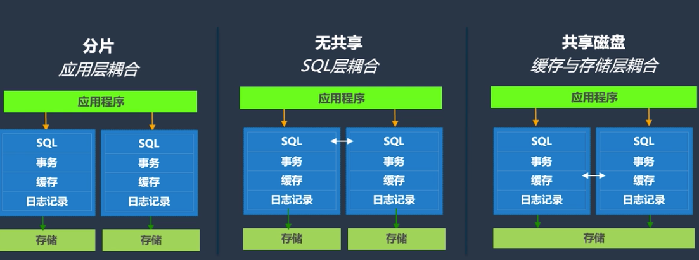

#### **4-1-1 分片**

* 应用程序连接到**中间件**的平台上
* **中间件**把读写数据的请求路由到不同的数据库上面
* **不同的数据库各自维护一部分的数据存在本地的存储里**

#### **4-1-2 无共享**

* 我们有不同的，各自独立的数据库服务器
* 这些服务器加入一个组里面来
* 应用程序往本地数据库写事务
* **事务写入后，通过数据库引擎层进行数据的分发和同步** => replication group

#### **4-1-3 共享磁盘**

* 共享磁盘 + 共享缓存
*  Oracle rac 通过共享存储的方式让每一个数据库节点或者共享实例都能读到相同的数据
*  应用程序往任何一个实例进行读写操作，每个数据库节点都可以看到整个集群里的数据，包括内存和硬盘上的

### **4-2 Amazon Aurora: 横向扩展，分布式架构**

**应用于数据库的面向服务的体系结构**

 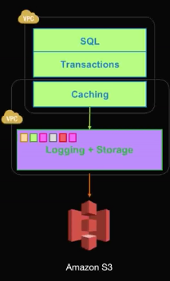

* 将日志和存储层移动到可扩展、数据库优化的存储服务中 
	* Aurora数据库包含上层实例和底层存储.计算存储分离，易于横向扩展
	* **分离了缓存和计算**，就算数据库进程挂掉，重启数据库进程，它的缓存还在。**极大的提高数据库的性能以及备份和恢复方面起到帮助**
* 与S3, VPC以及Route 53等其他AWS服 务紧密结合完成控制和监视任务
* 托管数据库服务Amazon RDS. 完成运维和管理任务． 
* 持续备份与S3集成，并具有11个9的持久性 

利用AWS 现有服务

* DynamoDB(Key-Value): 存储原数据metadata, exp, 存储节点的数据分部，软件的情况
* Route53: DNS的变化
* EC2
* S3 备份

 
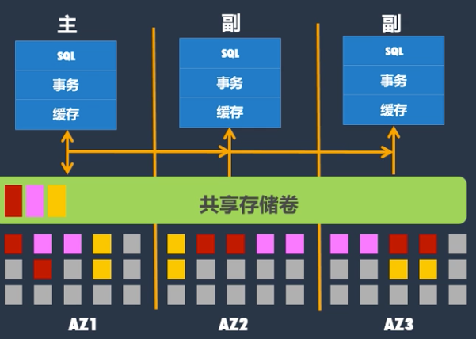

* **分布式体现在存储层，数据分部在共享的存储卷中**
* **存储卷横跨三个AZ**
* **每份数据有6份拷贝**
* 主节点： **当数据库服务器发出一个修改操作（dml) ,只有响应的日志流会写入共享存储卷**
* **修改的数据块（或者脏数据块）不会被刷新到磁盘上**

#### **4-2-1 横向扩展且基于日志结构的分布式存储 **

* 将Log机制推送至存储层 
* 4/6写入仲裁与本地跟踪 
	* 写入性能: **只保留Log写入盘，提高了并发的写入性能**
	* 读取横向扩展：
		*  **读副本和主节点共享存储卷**
		*  读副本不需要像传统的关系数据库通过应用日志去追主库的，读副本不需要自己维护一个数据文件，它和主节点共享数据文件
		*  很方便的添加读副本节点，提高读的效率
	* 可用区`+1` 容错机制： 6份副本可以无视AZ的崩溃以及一个存储节点的崩溃
	* 即时数据库重做恢复： 10Gb/segment 为单位去恢复，并发操作，效率非常的高

## **5、Amazon Aurora存储引擎概述** 

* 数据在3 Availability Zones中复制6份(每一份存在一份存储节点) 
* 持续备份到Amazon S3 (11个9的持久性）
* 持续监视节点和磁盘并自动修复
* 10GB的区段作为修复和存储自动增长的基础，存储最大扩展到64TB 
* 4/6 写入仲裁 
	
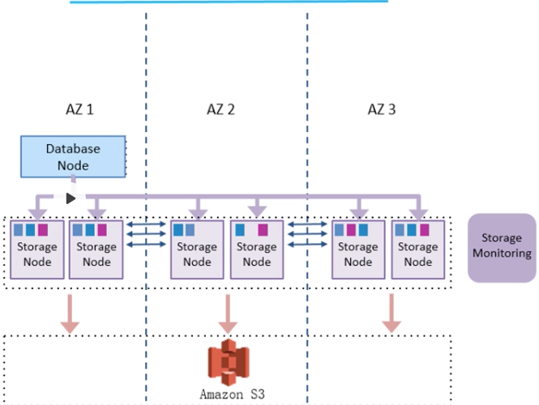	 
	 
## **6、MySQL 与 Amzaon Aurora的 I/O 配置差异**

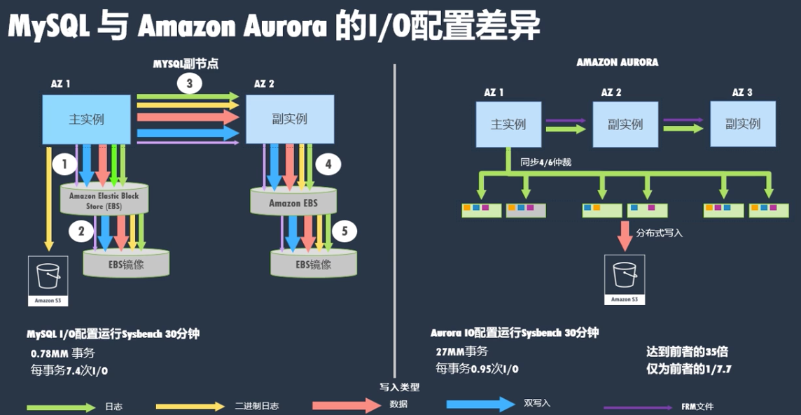

### **6-1 主从配置mysql**

1. 每次主实例发生事务，每次事务产生的日志和事务修改的脏数据，都会刷新到磁盘上
2. **同时主实例上产生的日志会通过复制的技术传递到从节点**
3. 从节点接收到日志后，会把主节点发生的事情全部replay一次，把从节点上的数据更新到与主节点一致
4. 整个过程有很多的IO操作包括1，3，4
5. 尤其是随机io(2,5), 脏数据块落盘会产生大量的IO

### **6-2 Amazon Aurora**

1. 只有日志流会落盘，数据本身不落盘
2. 日志流落盘以后，在存储层面通过很多的存储节点并行的生成脏数据
3. Aurora 日志流也会从主实例发送到副实例： **同步以及更新从节点内存里的数据**
	* 主节点和从节点的内存里都有一个数据块叫做A，主节点上对它进行了更新变成了B，产生了日志，那么日志会传到从节点，把内存中的数据块从A变成B 

#### **传统数据库的IO**

* 日志数据的I/O落盘 
* 脏数据通过检查点的方式落盘
* **日志数据的I/O落盘 : 流式的顺序写操作，对磁盘I/O性能影响不大**
* **脏数据落盘： 随机IO，比较消耗磁盘I/O性能**

**IO流**

* Issue write to EBS一EBS issues to mirror, ack when both done Stage write to standby Instance 
* Issue write to EBS on standby instance 

**观察**

* Stept 1,3,4 are sequentlat and synchronous 
* This amptifies both latency and jitter 
* Many Tpes of writes for each user operation 
* Have to write data blocks twice to avoid torn writes

#### **Aurora IO**

* **只保留了日志I/O落盘**
* 利用底层大量的存储节点，**对修改的数据进行重现**，利用写在数据存储层的日志复现被修改的数据块， 
* **数据块保存6份，分部在3个AZ的节点**
* **采用仲裁机制，6份中4份写入，视为写入成功**

**观察**

* Only write redo records; 
* all seeps asynchronous 
* No data block writes (checkpoint, cache replacenrent) **6X more** log writes, but **9X less** network traffic Tolerant of network and storage outlier latency 

### **6-3 写入与读取吞吐量Aurora MySQL速度可达MySQL5倍** 

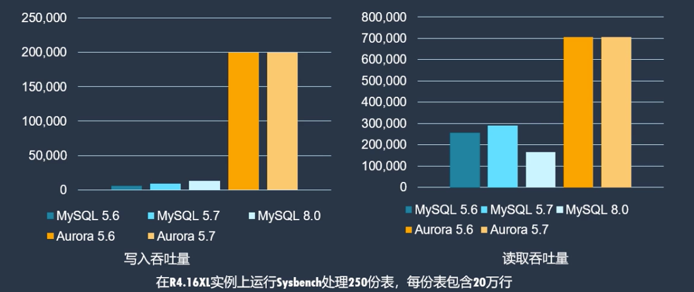

### **6-4 Aurora MySQL 据加载速度相当于MySQL 2.5倍** 

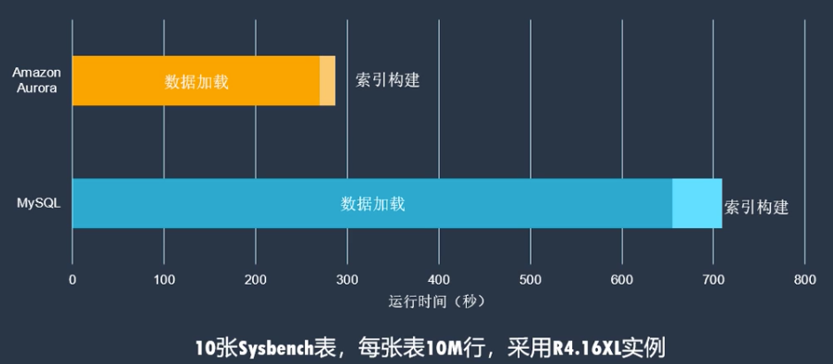

## **7、Amazon Aurora只读副本** 

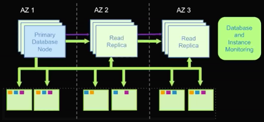

**可用性**

* 支持最多15个只读副本 
	* **只读副本延迟落后与于主节点的时间特别的小，因为它不需要应用日志去追主节点**  
* 自动添加或删除只读副本 
	* 读副本不需要维护本地的存储，添加删除特别的快，不需要像传统Mysql建立从节点是从主节点备份再恢复的。 **Aurora只需要部署从节点的CPU和内存即可**
* **Monitor检测程序自动检测并替换失败的数据库节点** ： **自动替换坏掉的只读副本** 
* 只读副本在主节点故障时自动提升为新的主库(failover) ： **用户可以指定某个read replicat提升到主库**
* 容户可以指定故障切换的顺序

**性能**

* 容户程序可以将读流量指向只读副本 ：**当有多个readreplica 可以让用户指向一个endpoint,readony endpoint 可以把用户的请求路由的有readreplica的节点**
* 读负载在多个只读副本间均衡

### **7-1 Aurora 集群访问**

* 可以包含一个主节点和15个只读副本，16个计算节点

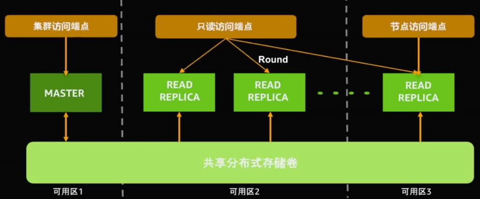

* **共暴露了三种节点**
* 集群访问端点，类似于JDBC这种URL，也就是一个master访问节点 （读写操作）
* 只读访问端点， 访问所有的只读的副本 （只读操作）
* 结点访问端点，访问某特定实例，或者说只读副本

### **7-2 通过只读副本对读取进行横向扩展**

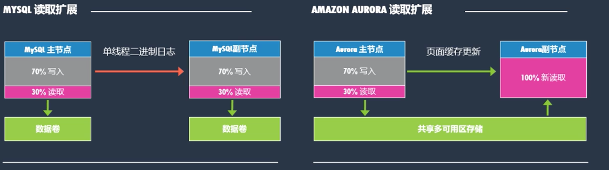

* 传统Mysql 主节点上的事务通过log在从节点上再跑一遍
* **Aurora 从节点只是刷新内存里的数据块，如果内存中没有的数据块，不用刷新，直接读取主节点共享存储中的文件**

### **7-3 Aurora只读副本自动伸缩技术** 

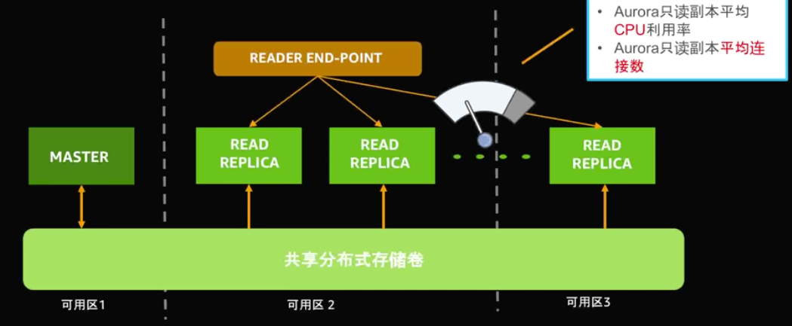

* 跨多个可用区最多可提升15个只读副本 
* 基于重做日志复制的副本低延时一通常<10毫秒 
* 读取器端点具有负载平衡和自动缩放（CPU及连接数/read replica平均连接数）

### **7-4 Amazon Aurora MySQL逻辑与物理复制延迟** 

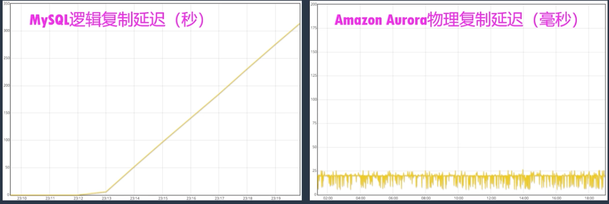

* 在MySQL当中12分钟，我们看到复制延迟达到近12分钟。从实际应用的角度来看，这显然是种近乎荒谬的情况
* **利用Aurora,4个副本的最大读取延迟从未超过20毫秒**

## **8、运行过程中的仲裁与本地跟踪 （事务机制）**

**主节点里对数据块（page1）进行修改，四个事务T1,T2,T3,T4按照时间顺序对它进行修改**

 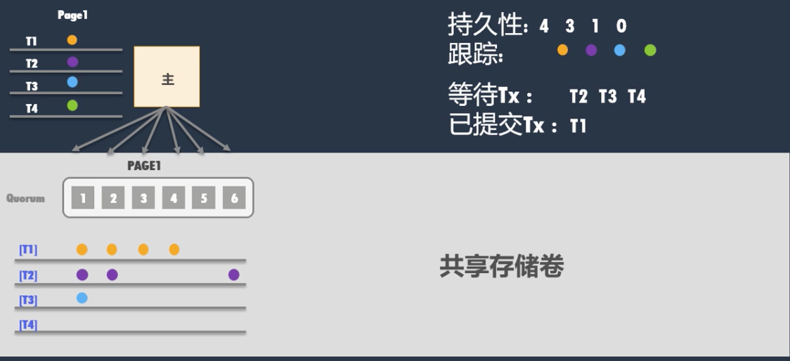

1. T1,T2,T3,T4四个事务产生的日志会刷新到磁盘上
2. **存储层利用日志产生数据块，并且会复制6份**
3. T1复制了4份标记为已提交
4. T2,T3小于6份，处于等待状态

 
 **并行刷新： T3复制了更多的数据块，达到5份副本**
 
  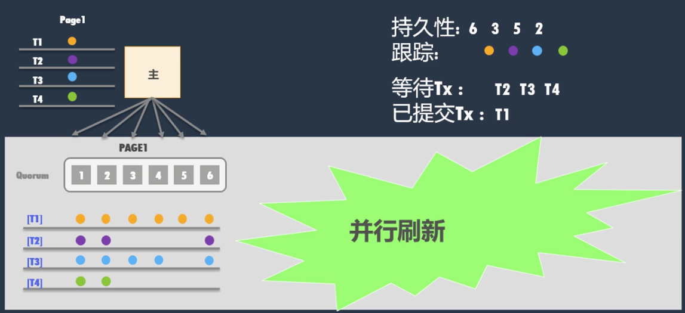

* T3不会被标记为已提交，因为T2没有完成4份副本的生成
* 虽然并行刷新,但是要在日志层面保证一个先后顺序的，保证按照T1,T2,T3,T4的顺序去记录
* 所以	T3  仍然出于等待提交的状态

  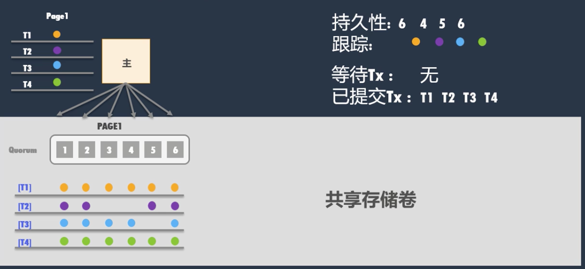
  
 * T1 完成6份副本， T2 完成4份副本， T3 完成5份副本， T4 完成6份副本， 都完成了4份副本的复制。 全部标记成已提交，并按照T1,T2,T3,T4的顺序记录到日志里

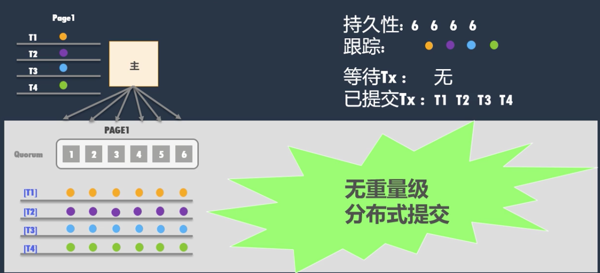
   
* 全部完成六份副本的复制

**Aurora 并没有一个分布式提交的算法**

## **9、主从同步的记录机制**
 
### **9-1  T1->T4 4个事务分别对数据块进行操作**

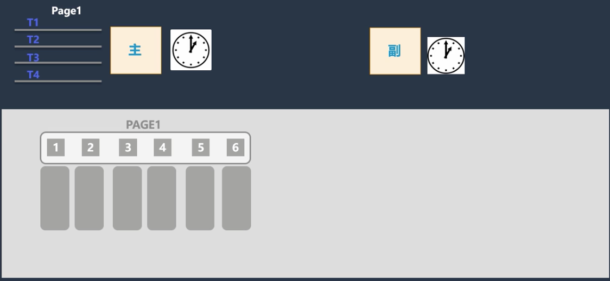

### **9-2 T1**

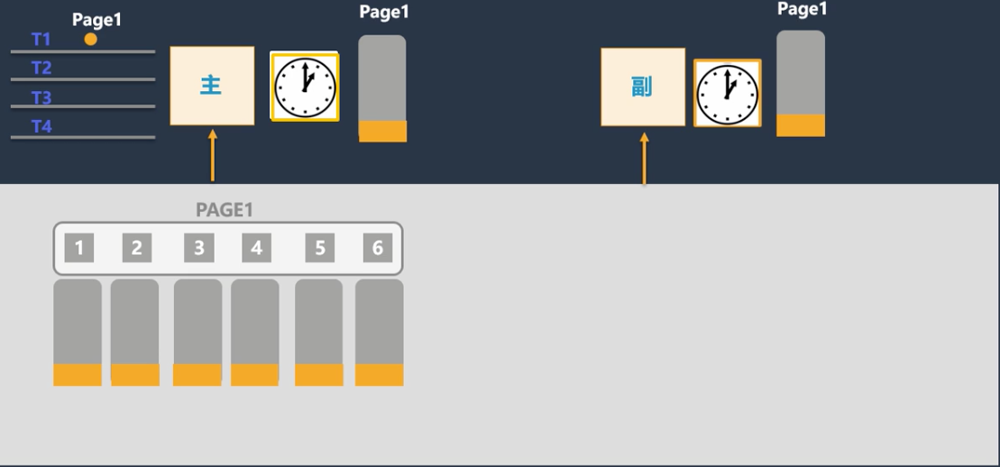

* T1 已经完成了主节点六块副本的复制
* T1的 log 已经从主节点异步的复制到了从节点
* 从节点在内存中把数据块修改成了T1事务完成之后的状态，主从节点的内存体现的都是T1事务完成之后的状态

### **9-3 T1,T2,T3,T4 按顺序对主节点进行变更**

**主节点内存现在体现了最新的状态： T4**

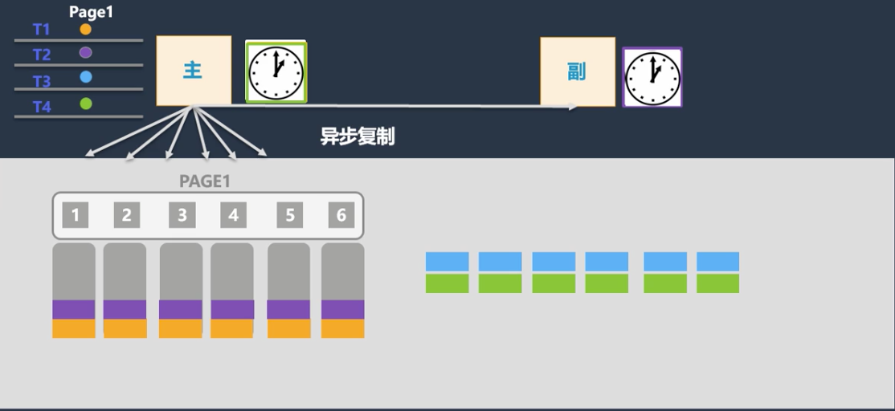

* 存储层停留在T2的状态，T2完成了6份副本的复制的拷贝
* T3,T4相应的日志还没有完成数据块的应用
* 主从日志的异步传输，现在T2的日志刚刚复制到从节点，并完成应用，所以从节点的page1的状态是应用完事务T2的状态（紫色的状态）

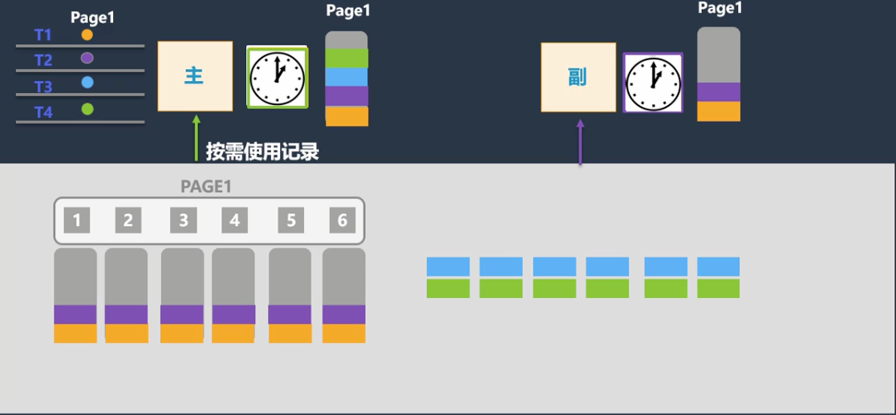

* 如果应用程序从主库和从库分别去读这个数据块，主节点一定从内存中读取最新的数据
* 从节点读取的是应用完T2事务的数据

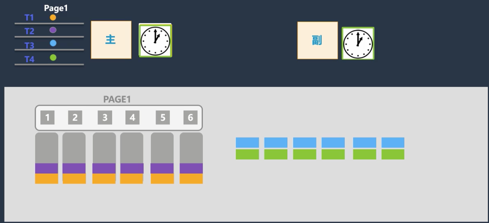

* 最终T3,T4会在从节点的内存中完成应用，把数据块page1更新成最新的状态（T4)
* 这时候再去读，就可以从主从分别读取到最新的状态了
* 最终T3,T4的在存储层面被应用到数据块6块拷贝中去，存储层面和内存层面达成一致

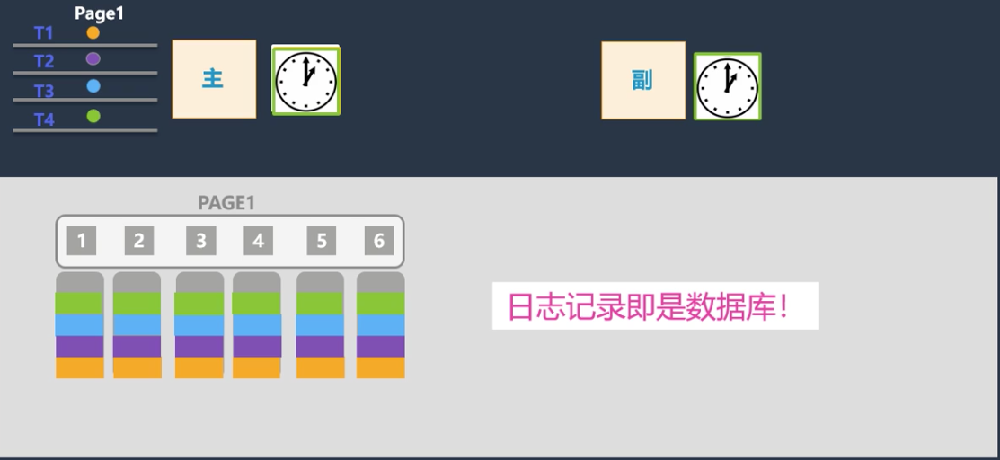

### **9-4 负载条件下的性能变化 Amozon Aurora＞一致性提升200倍** 

Aurora的写入延迟非常的稳定

R4.16XL的实例

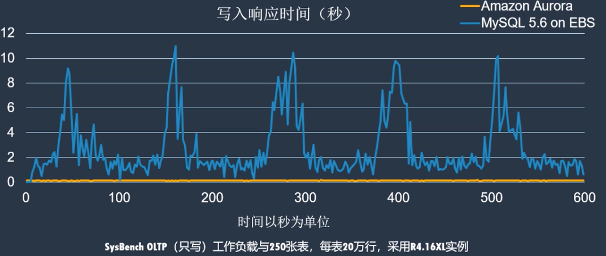

**Mysql的抖动中的波峰是因为当mysql的内存进行checkpoint,刷新内存中的脏数据到磁盘上的时候，带来内存的涨幅到达波峰 => 写延迟就会提高**

## **10、Amazon Aurora架构之：可用性与持久性** 

### **10-1 “可用区+1”的容错机制**

* 在大规模集群体系中，故障总会出现
* 可用区故障是一种“命中注定“ 

* 6份副本，每可用区2份
* **2/3仲裁无法满足需求** 

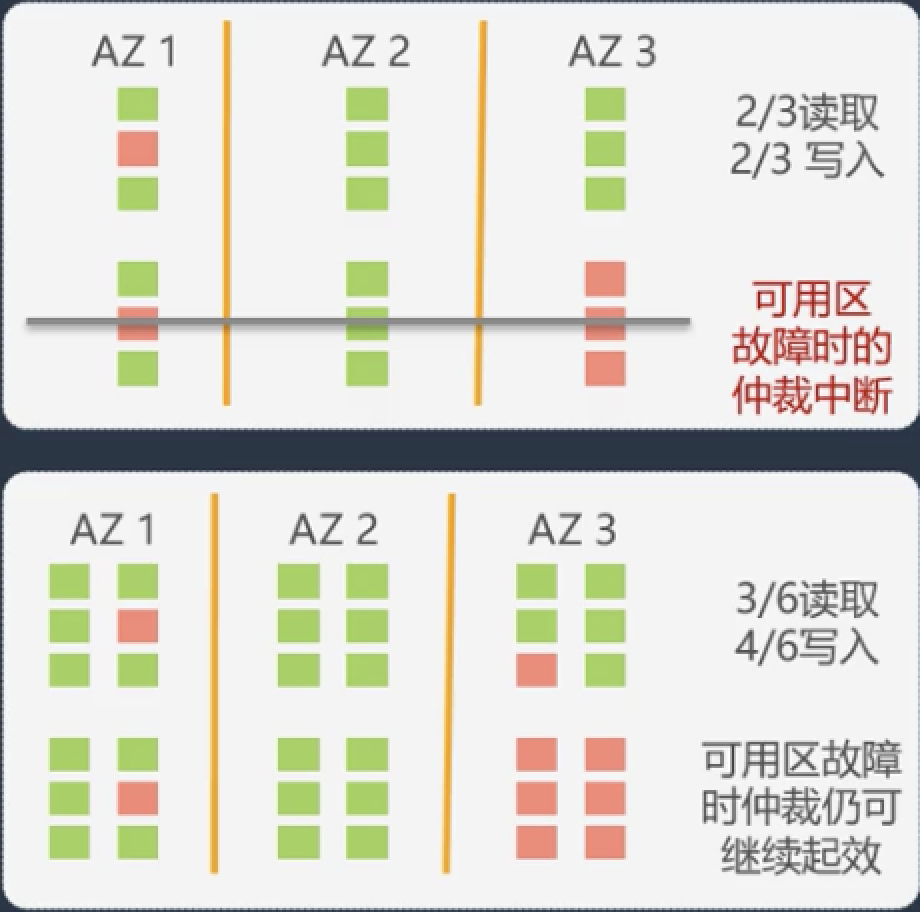

* 一个AZ的崩溃，4/6仍可以保证**写入成功**
* **3/6保证读取成功，一个AZ崩溃+一个存储节点崩溃，读取操作仍然可以发生**，三分副本不能满足需求

###  **10-2 Aurora数据库备份与恢复技术(持续备份)**

1. Aurora 不需要配置备份窗口，而传统RDS mysql 是需要配置备份窗口的
2. Aurora不断的做快照保存在S3上，快照以分区为单位（segment:10GB)
3. 每个segment不断的做快照保存在S3，同时日志也会保存在S3上
4. 备份利用的是存储的技术来实现，对数据库服务器本身的CPU/MEMORY资源不消耗，对数据库服务器本身不影响性能

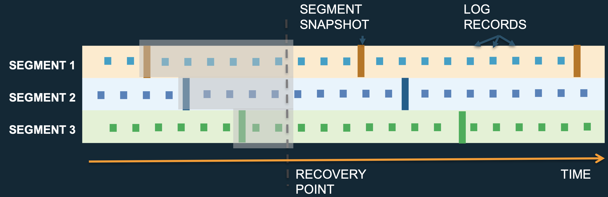

* **并行为每个段定期拍快照，将重做日志流传输到S3存储桶**
* 持续进行备份，并不影响性能或可用性水平
* 时间点恢复
* 在还原时，从S3返回相应的段快照与重做日志流到存储节点
* 以并行和异步方式应用重做日志流到段快照

### **10-3 数据库回溯**

**PITR  Point-in-time recovery**

通过情况下，所谓的从删除库到跑路，**传统的方式从备份中，恢复数据库**，恢复到一个时间点。把误操作的对象导出来放到新库里，时间会很长
 
 
Aurora的配置不是简单的块设备，它的数据存储其实是按照version存储数据，误操作的时候块数据并没有被磨掉，它只是被设置成对实例不可见了，数据库回溯更多的是更改的原数据metadata的状态,所以数据块还存在，只是可见和不可见的转变，时间很快，通常10s以内

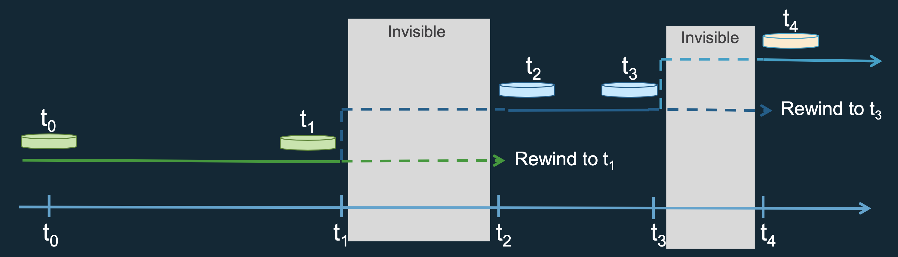

* **回溯机制代表将数据库恢复至某一时间点，无需使用备份资源**
	*  在有DML或者DDL误操作的情况下，回溯可以回到过去时间点。
	*  回溯不是破坏性的，可以多次回溯到正确的时间点。

* 不需要像传统数据库利用备份还原和日志恢复到某一时间点

* When you enable Aurora Backtrack in the RDS management console, **you specify how long to retain data records, and you pay for the space these records use. For example, you could set up Backtrack to allow you to move your database up to 72 hours back.**

* 存储会增加，页面为了保证回溯的速度，不能那么快被回收，放在上面，可见性有变化

###  **10-4 存活 caches** 

* 数据库缓存和后台进程是独立出来的
* 数据库重启进程时，缓存是不会重启的，这样可以保证访问效率
* 缓存可以在重启时，任然保存热数据，不需要第二次缓存的加热了

* **将cache从数据库进程中分离出来** 
* **数据库重启时Cache可以依旧保持热度**
* 更快地恢复全量加载载操作 
* 实例崩溃恢复＋可存活 cache = 更快速容易地从DB失败中恢复 

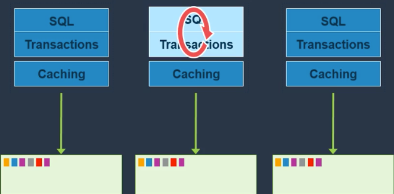

**Caching process和 DB process 分离开来并在数据库重启时保持warm**

###  **10-5 即时崩溃重做恢复** 

**传统数据库**

* 重放自上次检查点之后的日志 (undo log)
* 在单线程中慢速重放 

**Amazon Aurora**

* 无需检查点 （没有检查点）
* 无需重放启动准备 

**异步的方式判断segment是否需要恢复，如过需要恢复多个存储点，多个segment异步的方式进行恢复**

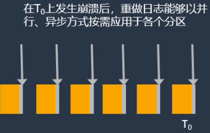

###  **10-6 读取副节点与快速故障转移** 

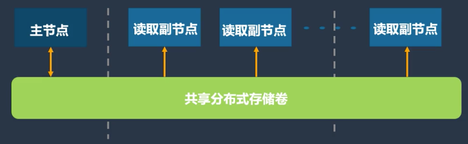

* **在多可用区内最多可提供15份可升级的只读副本**
* 副节点与主节点共享存储——不丢失数据
* 可配置故障转移顺序

###  **10-7 多达15个可提升的只读副本**

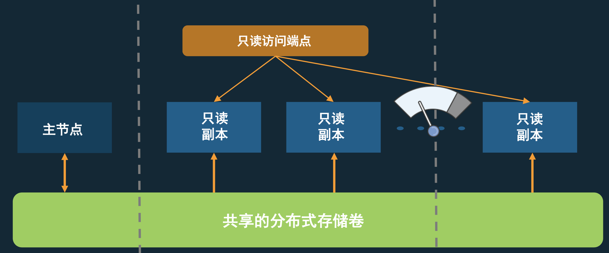

* 多达15个跨多个可用区的只读副本，**自动故障转移**，通常小于 30秒
* 基于重做日志的复制，低延时 – 通常小于 10 毫秒
* **只读访问端点**具备**负载均衡**和**自动伸缩的能力**

###  **10-8 Aurora数据库克隆技术**

克隆数据库而不复制数据 => 可以很快创建一个clone

* 瞬间创建一个数据库克隆
	* **快的原因是并不会拷贝原数据库中的数据吗，而只是很快速的生成指针** 
	* 克隆数据库并不包含数据，而是包含一堆指针。当用户访问原数据库是是通过指针去访问原数据库中的数据
	* 当源数据库发生改变时，源数据里的数据保留不变，**被修改的数据块拷贝一份出来，在拷贝出来的数据快做修改**
	* **对于克隆数据来说，始终可以看到创建克隆数据库时源数据快中的内容** 比如9点创建的克隆，可以看到静态的九点钟创建的克隆的内容
	* 源库的变化不会影响源数据文件，是会拷贝一个新的数据块
	* 对克隆库修改时，也是对源数据进行拷贝，进行修改
* 仅在发生写入时复制数据(COW) – 当原始数据和克隆卷数据不同时

**应用场景**

* 克隆生产数据库以运行测试
* 数据库重组
* 为分析提供一个时间点快照，不影响生产环境，可以产生一个用于分析的静态内容

###  **10-9 全球数据库更快的灾难恢复速度与数据位置强化**

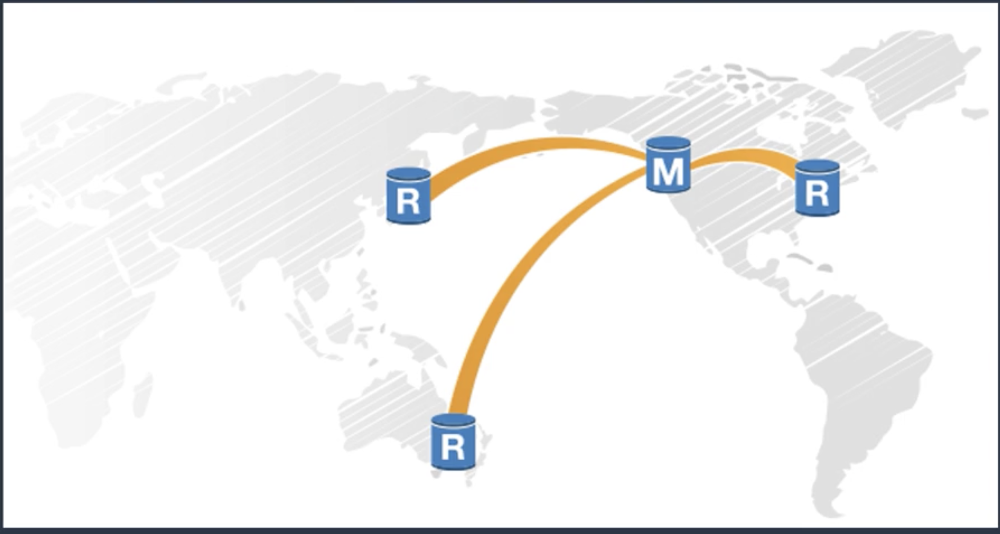

Aurora 支持一个叫做Gloal DB的功能，依托于AWS的全球骨干网络，可以快速的，让我们不同的region里的从节点去和主节点进行数据的同步

数据的同步并不是通过binlog的方式，而是通过redolog的方式进行数据同步,**从节点和主节点的延迟是个位数秒级为单位**

## **11、 Aurora 新特性**

### **11-1 Aurora Multi-Master** 

通过使用Amazon Aurora Multi-Master，可以在多个可用区中创建多个读取/写入主实例。应用程序就可以在集群的多个数据库实例中读取和写入数据，就像目前可以在只读副本中读取一样。

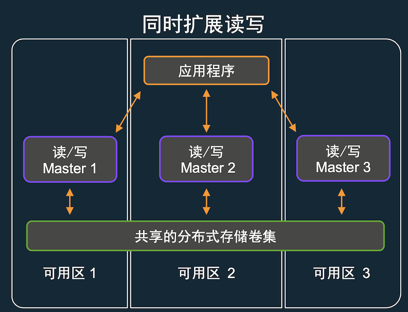

* 来自任何实例失败的应用程序零停机时间
* 可用区A故障不会导致应用程序停机
* 更快的写入性能和更高的规模
* 更强大的扩展能力

[https://docs.aws.amazon.com/AmazonRDS/latest/AuroraUserGuide/aurora-multi-master.html#aurora-multi-master-overview](https://docs.aws.amazon.com/AmazonRDS/latest/AuroraUserGuide/aurora-multi-master.html#aurora-multi-master-overview)

* In a multi-master cluster, all DB instances can perform write operations. 、
* The notions of a single read/write primary instance and multiple read-only Aurora Replicas don't apply. 
* There isn't any failover when a writer DB instance becomes unavailable, because another writer DB instance is immediately available to take over the work of the failed instance

**Currently, multi-master clusters require Aurora MySQL version 1, which is compatible with MySQL 5.6. When specifying the DB engine version in the AWS Management Console, AWS CLI, or RDS API, choose 5.6.10a.**

Multi-master clusters have no dedicated read-only nodes. 

* Multi-master clusters keep track of all changes to data within all database instances. The unit of measurement is the data page, which has a fixed size of 16 KB
* If two DB instances attempt to modify the same data page at almost the same instant, a write conflict occurs. The earliest change request is approved using a quorum voting mechanism。 That change is saved to permanent storage.
* The DB instance whose change isn't approved rolls back the entire transaction containing the attempted change. Rolling back the transaction ensures that data is kept in a consistent state, and applications always see a predictable view of the data
 
#### 11-1 Recommended workloads for multi-master clusters

**Active-passive workloads**

With an active-passive workload, you perform all read and write operations on one DB instance at a time. You hold any other DB instances in the Aurora cluster in reserve. If the original active DB instance becomes unavailable, you immediately switch all read and write operations to the other DB instance. With this configuration, you minimize any downtime for write operations.

**Active-active workloads**

With an active-active workload, you perform read and write operations to all the DB instances at the same time. 

In this configuration, **you typically segment the workload so that the different DB instances don't modify the same underlying data at the same time**. Doing so minimizes the chance for write conflicts.

Multi-master clusters work well with application logic that's designed for a segmented workload. 

In this type of workload, you divide write operations by database instance, database, table, or table partition

For example, you can run multiple applications on the same cluster, each assigned to a specific DB instance. Alternatively, you can run an application that uses multiple small tables, such as one table for each user of an online service. Ideally, you design your schema so that write operations for different DB instances don't perform simultaneous updates to overlapping rows within the same tables.

### **11-2 Aurora无服务器架构(Serverless)**

Serverless 是一种面向 Aurora 的按需扩展配置，数据库将根据您的应用程序的需求来自动启动、 关闭以及纵向和横向扩展数据库容量。可在云中运行关系数据库，而无需管理数据库实例或集群

* 可以在2-3秒 将数据库拉起来
* 无缝的弹性扩展

*  按需自动启停
*  无服务器化、自动扩展
*  使用的资源按秒付费

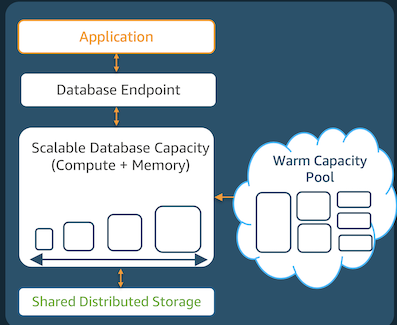

### **11-3 并行查询**

* 将查询处理下移至 Aurora 存储层
* 跨数百个甚至数千个存储节点并行运行查询
* 减少了对网络、CPU 和缓冲池资源的争夺
* 提高了大型分析查询的性能

While some databases can parallelize query processing across CPUs in one or a handful of servers, **Parallel Query takes advantage of Aurora’s unique architecture to push down and parallelize query processing across thousands of CPUs in the Aurora storage layer**. By offloading analytical query processing to the Aurora storage layer, Parallel Query reduces network, CPU, and buffer pool contention with the transactional workload.

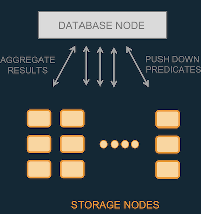

### **11-4 Aurora全球同库跨区域多主节点** 

* 应用跨全球分部，一个数据库跨全球的高效的访问
* 每个节点跨区域的写入

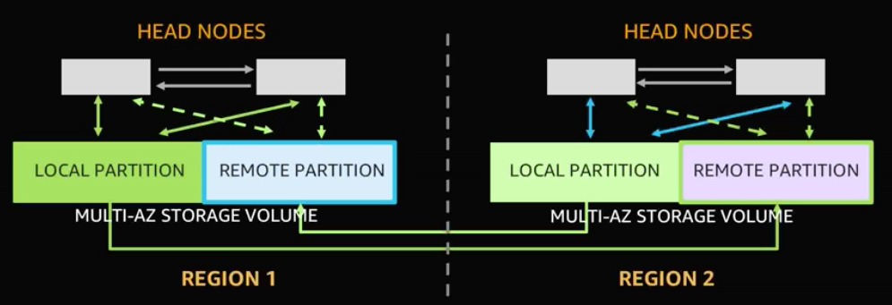

* 本地写 
* 乐观锁并发控制 —— 没有分布式锁管理器与全局锁管理协议 
* 分层冲突处理 —— 主节点、存储节点、可用区、区域级别仲裁，当无或低冲突级别时性能扩展
