# **第二节 揭秘 Aurora 底层存储**

## **1、快速回顾： 数据库内部结构**

### **1-1 数据库B+树**

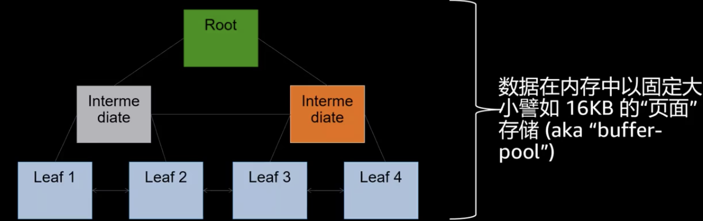

* 数据库B+树，根节点， 中间点， 叶子节点，数据放在叶子节点
* **数据在内存中以固定大小譬如16KB的“页面” 存储（aka "buffer-pool")** 
* 内存的数据从成本的考虑和高可用的考虑不会长久的存放，**数据会被定期写入持久的存储中去（checkpoint)**

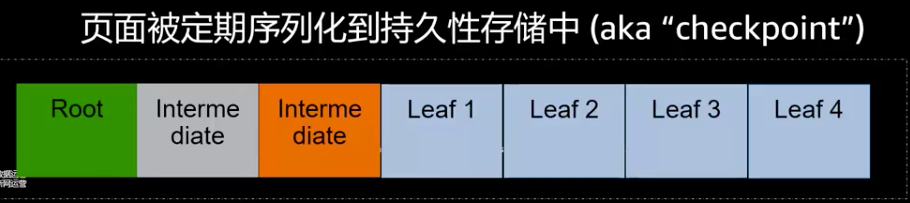

### **1-2 快速回顾：DO-REDO-UNDO协议** 

* 数据在buffer-pool中通过Do/REDO/UNDO操作在“原位‘’修改 
* 包含前像/后像的日志记录被存储到`write-ahead Log (WAL) `

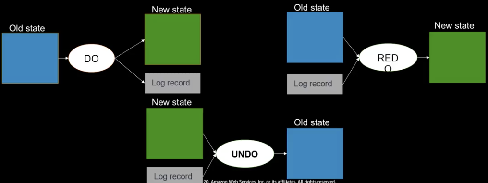

* REDO: 重放操作，包含前像/后像，变更的东西
* UNDO：反过来，变更错了，回滚操作

### **1-3 快速回顾：崩溃恢复**

* 事务1： 提交做了checkpoint, 日志有，数据脏块落盘
* 事务2，事务3写了REDO，没有做checkpoint
* 事务4没做完，系统崩溃了

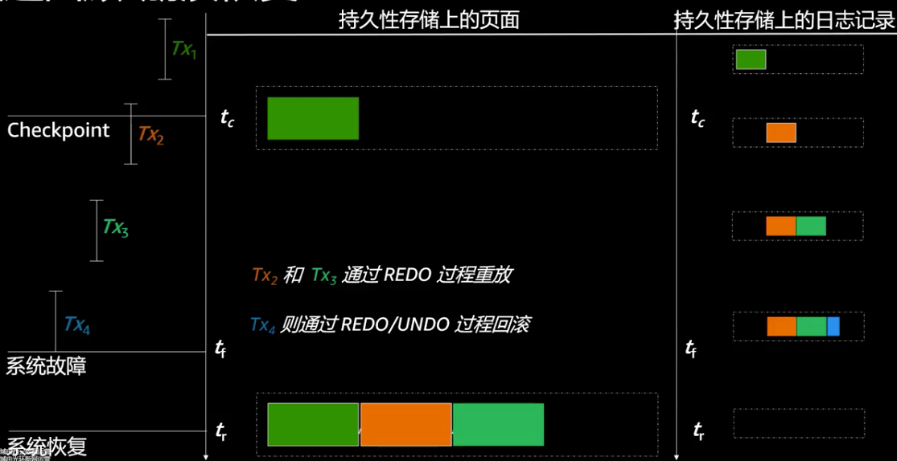

* REDO LOG重放，从checkpoint 重放, 事务1不用重放
* 事务2，事务3通过REDO重放
* 事务4没有提交，所以要通过UNDO回滚

### **1-4 快速回顾：持久化所需的IO**

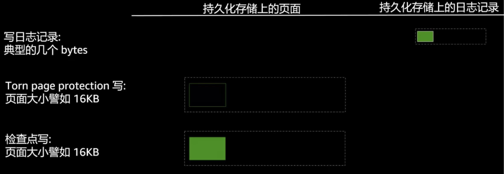

* 用户数据变化的大远远小于I/O大小（32KB+) 
* **数据库的一切都与I/O相关**

**传统的数据库不是每个checkpoint都去写，效率太低了，隔一段时间写一下，多个事务并发劲量合并的**

### **传统数据库的目的就是减少IO**

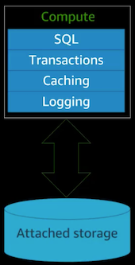

* 缓存/查询优化/ 硬件方面提高IO带宽

## **2、原生数据库的架构**

### **2-1 Amazon Aurora的方式日志即数据库** 

从数据库创建开始的日志流 

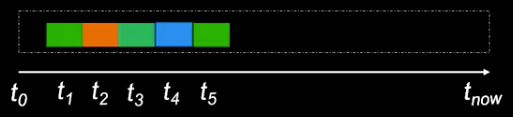

* 任何版本的数据库页面都可以通过日志流构造 
* 绿色页面 t5 可以通过 t1 到 t5 的日志来生成 

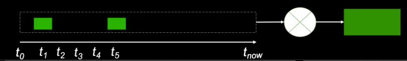

### **2-2 Amazon Aurora的方式：将险查点工作下放到存储层** 

**问题1:**

仅仅依靠日志流来应付读取页面不实际（太慢） ，

*建库刚开始可以，构建两年后的数据库的REDO log不现实*

**解决办法：**

使用定期检查点

**问题2:** 

检查点任务是数据库的重大负荷，感觉和传统没有区别

**解决办法：**

* 使用分布式存储做持续的检查点 
* 上千个节点在周期性，异步的做checkpoint

### **2-3 Amazon Aurora的方式：计算与存储分离** 

**计算与存储有不同的生命周期** 

计算实例 

* 损坏后被替换
* 停机节省费用
* 基于负载扩展、收缩 

**存储，从另一个角度来说，是长期的**

**为可伸缩性、可用性和持久性解藕计算和存储** 

### **2-4 Amazon Aurora使用面向服务的体系结构**

专门构建一个多租户，多附加的专门为数据库打造的日志结构分 布式存储系统 

**多租户**

*不是为每一个数据库用户就构建一个存储节点*

**多附加**

集群中的写节点读节点，其实是share disk,存储结构要同时挂到这些节点上

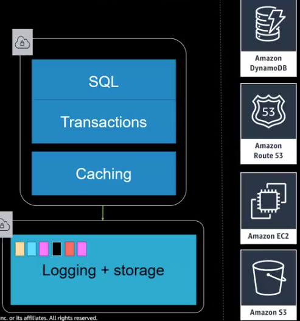

**利用AWS 现有服务**

* DynamoDB(Key-Value): 存储原数据metadata, exp, 存储节点的数据分部，软件的情况
* Route53: DNS的变化
* EC2
* S3 备份

### **2-5 Amazon Aurora 存储节点I/O流**

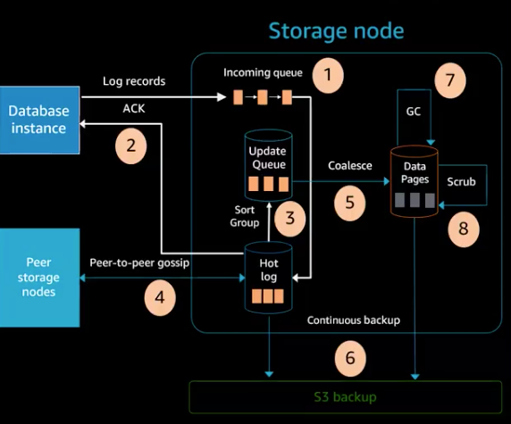

1. （写入日志发到存储节点）接收日志记录放入内存队列并持久化 
	* 同时写入6个，4个成功及表现为成功
2. 通知数据库
3. 组织日志并确认间隙 (写入的日志被组织，并查看是否有间隙) 
4. 通过Gossip到peers补足间隙 
	* 通过gossip 到其他peer节点把日志拉出来，补足间隙
5. 合并日志记录形成新的页面 
	* 补足间隙后，旧页面和日志合成新的页面定期
6. 定期将日志和合并后的page放到s3 （被以后的查询，恢复利用）
7. 定期垃圾回收，清理旧页面 （当主节点和只读节点都不在需要，被回收）
8. 定期检查页面一致性 （checksum) 如果缺失，去其他节点去要

**注意：** 

* 所有步骤都是异步的 （除了1，2步）
* 只有第一步和第二步会造成前端延迟 

## **3、大规模的持久性**

### **3-1 Aurora可以容忍AZ+1故障**

* 复制6份，每个AZ有2份 
	* 形成quorum，要求6写4成功 

* 如果面临AZ故障？ 
	* **依然可以保证4/6拷贝** 
	* 保持可写

* 如果面临AZ+1故障呢？ 
	* 依然有3份拷贝 
	* 不会有数据丢失
	* 通过幸存的3拷贝恢复损坏的拷贝 
	* 恢复写能的力 

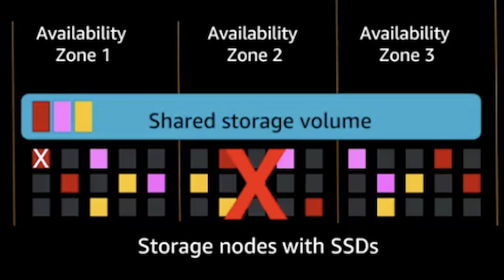

### **3-2 Amazon Aurora使用段存储**

* 将数据分成n个固定大小的段 
	* **在一个protection group (PG）中对每个段复制6份** 

* 在故障率以及修复时间之间平衡 
	* 如果段太小，故障率过高
	* 如果段太大，则修复时间过长 

* 选择在保证“足够快”修复的前提下的最大大小 ．
	* **我们现在段大小是是10GB，因为我们可以在1分钟以内修复一个10G的段**

### **3-3 快速和可逆的成语变化**

* 使用 quorum sets 与epochs 来 
	* **通过epoch实现快速更改** 
	* **在成员变化时创建额外的的quorums** 
	* **用多个quorum来快速逆转更改** 

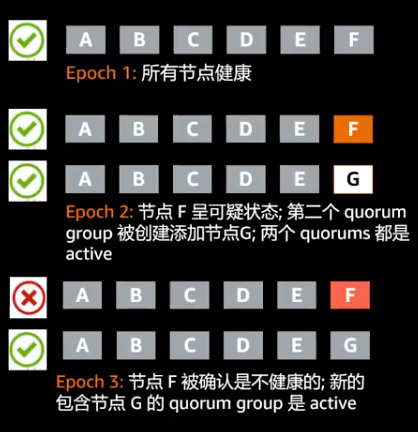

* F 可疑： 网络的堵塞
*  两个Epoch都可以满足4/6写入成功
*  新的quorum起来以后，从其他节点拷贝数据
*  确实有问题，更新epochs，保证只写入quorum  G就好了

一边修复一边观察

## **4、性能**

### **4-1 Amazon Aurora I/O概况** 

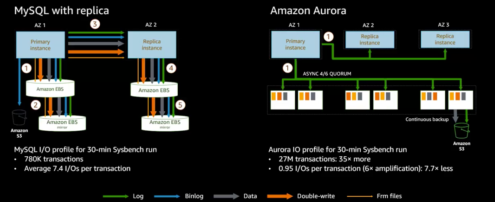

## **5、全局数据库**

### **5-1 全局物理复制**

**传统的数据库复制都是通过binlog,延迟比较长**

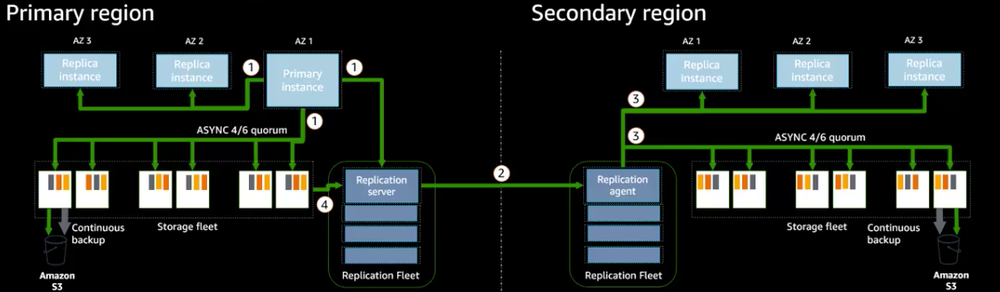

1. 主实例将日志记录用于发送倒存储节点，只读实例和**复制服务器**
2. 复制服务器将日志流发送到secondary region 的复制代理
3. 复制服务器将日志并行发送给存储节点和只读副本
4. **复制服务器可以从存储节点拉日志记录以弥补故障造成的间隙**

* **高吞吐**： 150K writes/second的负载，复制对性能的影响也是微乎其微
* **低复制延迟：高负载下依然保持次秒级跨区域复制延迟**
* **快速恢复：区域故障后1分钟以内即可承担全面读写**

### **5-2 全局复制性能**

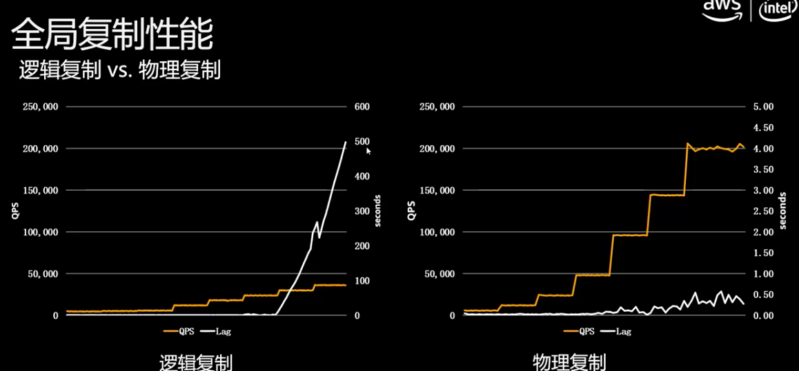

QPS对LAG的影响

## **6、快速数据库克隆**

### **6-1 Aurora数据库克隆技术**

克隆数据库而不复制数据 => 可以很快创建一个clone

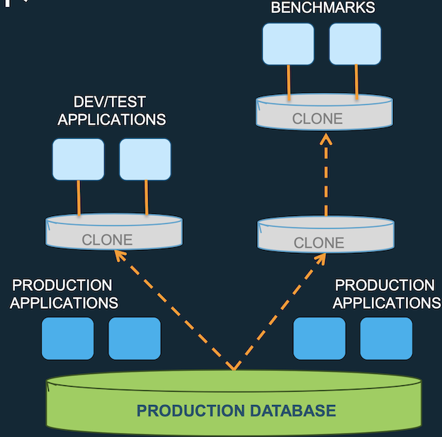

* 瞬间创建一个数据库克隆
	* **快的原因是并不会拷贝原数据库中的数据吗，而只是很快速的生成指针** 
	* 克隆数据库并不包含数据，而是包含一堆指针。当用户访问原数据库是是通过指针去访问原数据库中的数据
	* 当源数据库发生改变时，源数据里的数据保留不变，**被修改的数据块拷贝一份出来，在拷贝出来的数据快做修改**
	* **对于克隆数据来说，始终可以看到创建克隆数据库时源数据快中的内容** 比如9点创建的克隆，可以看到静态的九点钟创建的克隆的内容
	* 源库的变化不会影响源数据文件，是会拷贝一个新的数据块
	* 对克隆库修改时，也是对源数据进行拷贝，进行修改
* 仅在发生写入时复制数据(COW) – 当原始数据和克隆卷数据不同时

**应用场景**

* 克隆生产数据库以运行测试
* 数据库重组
* 为分析提供一个时间点快照，不影响生产环境，可以产生一个用于分析的静态内容

### **6-2 数据库克隆：怎么工作的？** 

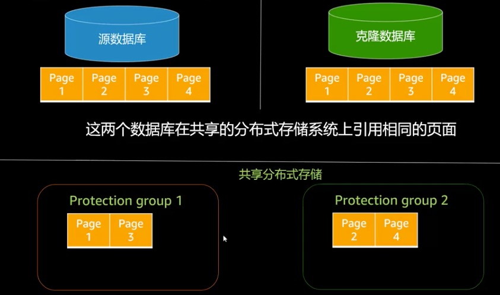

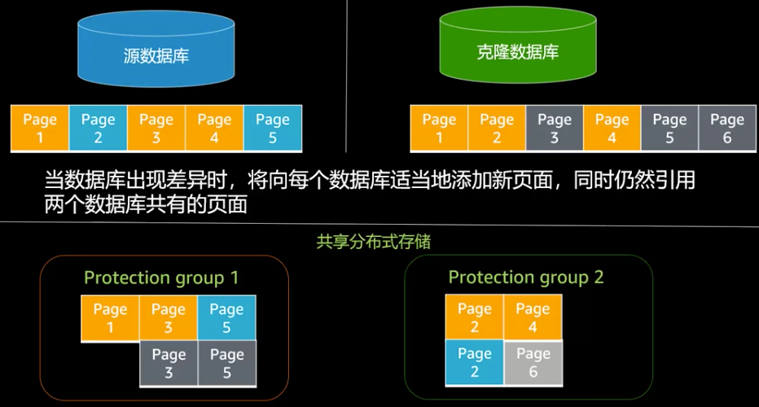

**完全不需要深度复制**

* 速度快
* 节省空间和成本

