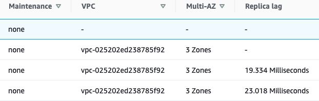
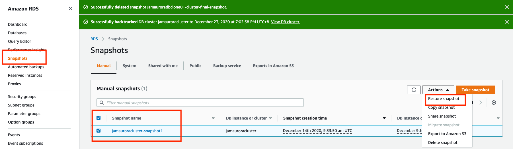

# **第三节 Aurora Basic Operation**

## **1、Create Database**

### **1-1 Introduction**

From this operartion guide, I will show simple and clear way to manage **AWS Aurora cluster for MySQL** from **AWS console**. Through this guide, you will learn:

* Create Amazon Aurora Cluster 
* Operation and management on Amazon Aurora Cluster
	* Scalability
	* Operation on Read replica 
	* Failover
	* Database backtrack
* Database backup and restoration
* Management and Monitoring on Database with Cloudwatch and Performance Insights


### **1-2 Create Amazon Aurora Database Cluster** 

This part will introduce how to create a MySQL based DataBase cluster, which includes one master db instance and cross three availability zones

**prerequisites:**

* Possess one IAM user with proper access right,your AWS account must have IAM policies that grant the permissions required to perform Amazon RDS operations. (With right which can assign IAM roles)

> Currently our JAM DevOps IAM user which login from SSO link don't have full IAM rights (can't assign IAM roles) which will failed in creation on Aurora Cluster in assigning IAM rols to Cloudwatch to monitor the Aurora Cluster

* Default VPC, subnet or create brand new VPC and subnet for RDS Aurora

**Creating Aurora Mysql Database cluster**

* .Sign in to the AWS Management Console and open the Amazon RDS console at https://console.aws.amazon.com/rds/
* In the upper-right corner of the AWS Management Console, choose the AWS Region in which you want to create the DB cluster. (Exp: **EU(Ireland)**) Aurora is not available in all AWS Regions. For a list of AWS Regions where Aurora is available, see [Region availability](https://docs.aws.amazon.com/AmazonRDS/latest/AuroraUserGuide/Concepts.RegionsAndAvailabilityZones.html#Aurora.Overview.Availability).
* In the navigation pane, choose **Databases**.
* Choose **Create database**.
* **In Choose a database creation method**, choose **Standard Create**.
* In **Engine options**, choose **Amazon Aurora.**


* In **Edition**, choose **Amazon Aurora with MySQL compatibility**
* If you chose Amazon Aurora with MySQL compatibility, choose **Capacity type: Provisioned(You provision and manage the server instance sizes.)**
* Choose **Single-master** as **Replication features**
* Choose Version: **Aurora MySQL5.7**


* **Settings**：
	* DB cluster identifier： **jamauroracluster**
	* Credentials Settings：
		* Master username: **admin**,	(A login ID for the master user of your DB instance)
		* Master password and Confirm password: (At least 8 printable ASCII characters. Can't contain any of the following: / (slash), '(single quote), "(double quote) and @ (at sign).)
* **DB instance size**
	* DB instance class: **Memory Optimized classes (includes r classes)**
		* **db.r5.large** (2vCPUs and 16GB RAM) (for JAM internal test only)
* Availability & durability: 
	* Multi-AZ deployment：**Create an Aurora Replica or Reader node in a different AZ (recommended for scaled availability)**
* **Connectivity:**
	* VPC: **create new one** or choose exist one **vpc-025202ed238785f92**
	* Subnet group: **default**
	* Public access: **YES** (Attention: This is only for test/demo purpose, set **No** for other circumstance)
	* VPC security group: 
		* Choose existing:
			* default
	* **Database port**: 3306 (TCP/IP port that the database will use for application connections.)
* Database authentication: **Password authentication**
* **Additional configuration**
	* Initial database name: **dbtest** (for test only and If you do not specify a database name, Amazon RDS does not create a database. You can create a DB with SQL: CREATE DATABASE) 
	* DB cluster parameter group: **default** (We will create an additional one for JAM database)
	* Failover priority: **No preference**
	* **Backup**:
		* Backup retention period:
			* 1 day (Number of days that RDS should retain automatic backups for this instance.)
			* The backup retention period determines the period for which you can perform a point-in-time recovery
			* Aurora offers 1-day backup retention for free!
	* **Encryption：**
		* **Enable encryption： checked**
		* Master key: default
	* **Backtrack**: **Backtrack lets you quickly recover from a user error**. 
		*  **Enabled: check**	
		*  **Target Backtrack window**: (The Backtrack window determines how far back in time you could go. Aurora will try to retain enough log information to support that window of time.): **1h**
			* Typical user cost:   **db.r5.large $ 1.20 USD / month 1h**
			*  **db.r5.large $ 86.28 USD / month 72h**
	* Performance Insights: **enable**
		* Retention period: **7days**  (Retention determines the size of the rolling window of data history that Performance Insights stores and makes available)
	* Monitoring: 
		* **Enable Enhanced monitoring**
		* Granularity: 60s
		* Monitoring Role: **default**
			* **Clicking "Create database" will authorize RDS to create the IAM role rds-monitoring-role**
	* **Log exports**: (publish to Amazon CloudWatch Logs)
		* Audit log
		* Error log
		* Slow query log
	* Maintenance:
		* **Maintenance window**: No preference (Select the period you want pending modifications or maintenance applied to the database by Amazon RDS.)
	* **Deletion protection**:
		* **Enable deletion protection**
 

Click Create database


### **1-3 Check AMAZON AURORA Cluster**

* Back to console, chose **Databases: jamauroracluster**, you will find two db instances is **creating**, after couple minutes, the master instance "**jamauroracluster-instance-1**"  will be changed to **"available"**,  then the replica instance will changed to **"available"**


Click **cluster identifier: jamauroracluster**, you will see the cluster configuration and settings

* Check **connectivity & security**, you will see the cluster endpoint, one for **writer endpoint** and another one for **reader endpoint**


* Check **monitoring**, you will see the **Cloudwatch** monitor the cluster and show stats of **metrics** for all instances


* check **Detail**, which include instance settings, Networking & secruity, Instance class, Availability, Auto scaling policies & Auto scaling activities, Maintenance, Backup, Backtrack, Snapshots, events, and Logs

* **Cluster configuration: jamauroracluster**


* **Instance(Writer) configuration: `jamauroracluster-instance-1`**


### **1-4 Use Mysql workbench connect amazon AURORA Cluster**

 Since we already get **cluster writer endpoint** and the **writer instance Public accessibility already set Yes** , we can connect aurora cluster with **Mysql workbench**
	


```
SHOW VARIABLES LIKE "%version%";
+-------------------------+------------------------------+
| Variable_name           | Value                        |
+-------------------------+------------------------------+
| innodb_version          | 5.7.30                       |
| protocol_version        | 10                           |
| slave_type_conversions  |                              |
| tls_version             | TLSv1,TLSv1.1,TLSv1.2        |
| version                 | 5.7.30-log                   |
| version_comment         | MySQL Community Server (GPL) |
| version_compile_machine | x86_64                       |
| version_compile_os      | Linux                        |
+-------------------------+------------------------------+
8 rows in set (0.00 sec)

show databases;
+--------------------+
| Database           |
+--------------------+
| information_schema |
| dbtest             |
| mysql              |
| performance_schema |
| sys                |
+--------------------+
5 rows in set (0.68 sec)

use dbtest;
Reading table information for completion of table and column names
You can turn off this feature to get a quicker startup with -A

Database changed


create table ct_test(name text,age int);
insert into ct_test values ('cubetree','10');
insert into ct_test values ('David','40');

mysql> select * from ct_test;
+----------+------+
| name     | age  |
+----------+------+
| cubetree |   10 |
| David    |   40 |
+----------+------+
2 rows in set (0.21 sec)
```

## **2 Scalability and High Availability** 

### **2-1 Vertical(Instance) Scaling**

You can scale your Aurora DB cluster as needed by modifying the DB instance class for each DB instance in the DB cluster. 

Aurora supports several DB instance classes optimized for Aurora, depending on database engine compatibility.

You can scale your Aurora MySQL DB cluster by modifying the DB instance class for each DB instance in the DB cluster. Aurora MySQL supports several DB instance classes optimized for Aurora. **Don't use db.t2 or db.t3 instance classes for larger Aurora clusters of size greater than 40 TB.**

In the following table, you can find details about supported Amazon Aurora DB instance classes for the Aurora DB engines compatible with MySQL.


The maximum number of connections allowed to an Aurora MySQL DB instance is determined by the `max_connections` parameter in the instance-level parameter group for the DB instance.


If you create a new parameter group to customize your own default for the connection limit, you'll see that the default connection limit is derived using a formula based on the **DBInstanceClassMemory** value


```
GREATEST({log(DBInstanceClassMemory/805306368)*45},{log(DBInstanceClassMemory/8187281408)*1000})
```

As shown in the preceding table, the formula produces connection limits that increase by 1000 as the memory doubles between progressively larger R3, R4, and R5 instances, and by 45 for different memory sizes of T2 and T3 instances.

<span style="color:red">You can increase the maximum number of connections to your Aurora MySQL DB instance by scaling the instance up to a DB instance class with more memory, or by setting a larger value for the `max_connections` parameter in the DB parameter group for your instance, up to 16,000</span>.

1.You can modify the aurora instance type direclty, **but the modification will restart db instance, which will cause the suspend for service**


2.Chose your correct and suitable instance type


3.Scheduling of modifications, **will cause the pending**

> Attentions: In productuon environment, recommend add a new read replica, then switch the new read plica, then do the modifcation and delete the old replica, which can help reduce the pending session


### **2-2 Horizontal scaling (Read scaling)**

You can achieve read scaling for your Aurora DB cluster by creating up to **15 Aurora Replicas in a DB cluster that uses single-master replication**. Each Aurora Replica returns the same data from the cluster volume with minimal replica lag—usually considerably less than 100 milliseconds after the primary instance has written an update. As your read traffic increases, you can create additional Aurora Replicas and connect to them directly to distribute the read load for your DB cluster. 

<span style="color:red">Aurora Replicas don't have to be of the same DB instance class as the primary instance.</span>.

**1.Add reader replica (add reader or add Create cross region read replica)**


**2.Chose DB instance class and different region for read replica**

<span style="color:red">We recommend that you distribute the primary instance and Aurora Replicas in your DB cluster over multiple Availability Zones to improve the availability of your DB cluster. </span>

* db.r5.large (**Can be different from primary db**)
* DB instance identifier:  (**Must be unique**) 
	* Exp: `jamauroracluster-instance-1-eu-west-1b`
	* **Not publicly accessible**
* Availability Zone: **eu-west-1b**


* Enable Enhanced monitoring: **enabled**

**3.Failover tier priority selection**

Choose a failover priority for the instance. If you don't select a value, the default is tier-1. This priority determines the order in which Aurora Replicas are promoted when recovering from a primary instance failure. 


**4.Create Read replciation(Need wait for like almost 5 minutes to be <span style="color:green">Available</span>)**


**Read Replica SQL Test**

```
mysql -h read-endpoint -u admin -p

mysql> use dbtest;
Reading table information for completion of table and column names
You can turn off this feature to get a quicker startup with -A

Database changed
mysql> insert into ct_test values ('kim','30');
ERROR 1290 (HY000): The MySQL server is running with the --read-only option so it cannot execute this statement
```


### **2-3 failover**

**1.check cluster status and instance status**




**2.Chose primary instance to failover (approximately 30s to finish the failover)**


**3.Check the failover status**


### **2-4 Cloning an Aurora DB cluster**

https://docs.aws.amazon.com/AmazonRDS/latest/AuroraUserGuide/Aurora.Managing.Clone.html

Aurora cloning uses a **copy-on-write** protocol. With this mechanism, a clone requires only minimal additional space when first created. 

In the beginning, Aurora maintains a single copy of the data, which is used by both the original and new DB clusters. Aurora allocates new storage only when data changes, either on the source cluster or the cloned cluster. You can make multiple clones from the same DB cluster.


**Limitations of Aurora cloning**
 
* You cannot create clones across AWS Regions. Each clone must be created in the same Region as the source cluster.
* Currently, you are limited to 15 clones based on a copy, including clones based on other clones. After that, only copies can be created. However, each copy can also have up to 15 clones.
* Currently, you cannot clone from a cluster without the parallel query feature, to a cluster where parallel query is enabled. To bring data into a cluster that uses parallel query, create a snapshot of the original cluster and restore it to a cluster where the parallel query option is enabled.
* You can't create clones from clusters that have no DB instances. Cloning works only for clusters that have at least one database instance.
* You can provide a different virtual private cloud (VPC) for your clone. However, the subnets in those VPCs must map to the same set of Availability Zones.

**1.Creating an Aurora clone**


**2.Chose DB instance size and DB instance identifier(unique)**

* jamauroracluster-clone1
* DB instance
* <span style="color:red">Can also enable backtrack for Clone DB</span>


**3.check aurora  clone cluster status(Ready after 5 minustes)**


### **2-5 Backtracking an Aurora DB cluster**

With Amazon Aurora with MySQL compatibility, you can backtrack a DB cluster to a specific time, without restoring data from a backup.

Backtracking "rewinds" the DB cluster to the time you specify. Backtracking is not a replacement for backing up your DB cluster so that you can restore it to a point in time. However, backtracking provides the following advantages over traditional backup and restore:

* **You can easily undo mistakes**. If you mistakenly perform a destructive action, such as a `DELETE` without a `WHERE` clause, you can backtrack the DB cluster to a time before the destructive action with minimal interruption of service.
* **You can backtrack a DB cluster quickly**. Restoring a DB cluster to a point in time launches a new DB cluster and restores it from backup data or a DB cluster snapshot, which can take hours. Backtracking a DB cluster doesn't require a new DB cluster and rewinds the DB cluster in minutes.
* **You can explore earlier data changes**. You can repeatedly backtrack a DB cluster back and forth in time to help determine when a particular data change occurred. For example, you can backtrack a DB cluster three hours and then backtrack forward in time one hour. In this case, the backtrack time is two hours before the original time.

**1. Configuring backtracking**

To use the Backtrack feature, you must enable backtracking and specify a target backtrack window. Otherwise, backtracking is disabled.


**2.  Specify a Target**


**3. Check backtrack status**


## **3 Backup and Restoration**

### **3-1 Backup**

Aurora backs up your cluster volume automatically and retains restore data for the length of the backup **retention period**. 

Aurora backups are continuous and incremental so you can quickly restore to any point within the backup retention period. No performance impact or interruption of database service occurs as backup data is being written. 

You can specify a backup retention period, from 1 to 35 days, when you create or modify a DB cluster. Aurora backups are stored in Amazon S3.

**If you want to retain a backup beyond the backup retention period, you can also take a snapshot of the data in your cluster volume**. 

Because Aurora retains incremental restore data for the entire backup retention period, **you only need to create a snapshot for data that you want to retain beyond the backup retention period. You can create a new DB cluster from the snapshot.**


You can recover your data by creating a new Aurora DB cluster from the backup data that Aurora retains, or from a DB cluster snapshot that you have saved. You can quickly restore a new copy of a DB cluster created from backup data to any point in time during your backup retention period. The continuous and incremental nature of Aurora backups during the backup retention period means you don't need to take frequent snapshots of your data to improve restore times.

### **3-2 Restoring data**

To determine the latest or earliest restorable time for a DB instance, look for the `Latest Restorable Time` or `Earliest Restorable Time` values on the RDS console.

* The **latest restorable time** for a DB cluster is the most recent point at which you can restore your DB cluster, typically within **5 minutes of the current time**.
* The **earliest restorable time** specifies how far back within the backup retention period that you can restore your cluster volume.

You can determine when the restore of a DB cluster is complete by checking the `Latest Restorable Time `and` Earliest Restorable Time` values. 

The `Latest Restorable Time` and `Earliest Restorable Time` values return NULL until the restore operation is complete. You can't request a backup or restore operation if `Latest Restorable Time` or `Earliest Restorable Time` returns `NULL`.

**1.Restoring a DB cluster to a specified time**


* `jamauroracluster-restoredb`
* Latest restorable time
* Availability Zone: `eu-west-1a`


**2.Launch DB instance**

**A new cluster will be created in with `DB cluster identifier-cluster`**, exp, **`jamauroracluster-restoredb-cluster`**


### **3-3 Creating a DB cluster snapshot**

Amazon RDS creates a storage volume snapshot of your DB cluster, backing up the entire DB cluster and not just individual databases. When you create a DB cluster snapshot, you need to identify which DB cluster you are going to back up, and then give your DB cluster snapshot a name so you can restore from it later. 

**The amount of time it takes to create a DB cluster snapshot varies with the size your databases**. Since the snapshot includes the entire storage volume, the size of files, such as temporary files, also affects the amount of time it takes to create the snapshot.

**<span style="color:red">Unlike automated backups, manual snapshots aren't subject to the backup retention period. Snapshots don't expire.</span>**

**For very long-term backups, we recommend exporting snapshot data to Amazon S3. If the major version of your DB engine is no longer supported, you can't restore to that version from a snapshot**

**1. Create snapshot**

* In the list of DB instances, **<span style="color:red">choose a writer instance for the DB cluster</span>**.
* Choose Actions, and then choose Take snapshot.


### **3-4 Restoring from a DB cluster snapshot**

Amazon RDS creates a storage volume snapshot of your DB cluster, backing up the entire DB instance and not just individual databases. You can create a DB cluster by restoring from this DB cluster snapshot. 

When you restore the DB cluster, you provide the name of the DB cluster snapshot to restore from, and **then provide a name for the new DB cluster that is created from the restore**. 

**You can't restore from a DB cluster snapshot to an existing DB cluster; a new DB cluster is created when you restore.**



**Parameter group considerations**

We recommend that you retain the parameter group for any DB cluster snapshots you create, so that you can associate your restored DB cluster with the correct parameter group. You can specify the parameter group when you restore the DB cluster.

**Security group considerations**

When you restore a DB cluster, the default security group is associated with the restored cluster by default.

## **4、Monitoring on Aurora DB Cluster**

[Handbook for Database monitoring, alarm and log collection on AWS RDS](https://jam4.sapjam.com/wiki/show/UpFy5ZLJGG1Jr9FgUXxCJo)

###  **4-1 Amazon CloudWatch Metrics**

To monitor the health and performance of your Aurora DB cluster, you can view some, but not all, of the metrics provided by Amazon Aurora in the Amazon RDS console.

Cloudwatch – Shows a summary of CloudWatch metrics. Each metric includes a graph showing the metric monitored over a specific time span

[https://docs.aws.amazon.com/AmazonRDS/latest/AuroraUserGuide/Aurora.Monitoring.html](https://docs.aws.amazon.com/AmazonRDS/latest/AuroraUserGuide/Aurora.Monitoring.html)

* **Cluster-level metrics for Amazon Aurora**
* **Instance-level metrics for Amazon Aurora**


###  **4-2 Enhanced Monitoring**

Amazon RDS provides metrics in real time for the operating system (OS) that your DB instance runs on. You can view the metrics for your DB instance using the console. 

Also, you can consume the Enhanced Monitoring JSON output from Amazon CloudWatch Logs in a monitoring system of your choice.


By default, Enhanced Monitoring metrics are stored for 30 days in the CloudWatch Logs, which are different from typical CloudWatch metrics. To modify the amount of time the metrics are stored in the CloudWatch Logs, change the retention for the `RDSOSMetrics` log group in the CloudWatch console. 

1. Enable or disable Enhanced Monitoring 
2. Set the Monitoring Role property to the IAM role that you created to permit Amazon RDS to communicate with Amazon CloudWatch Logs for you, or choose **Default** to have RDS create a role for you named **`rds-monitoring-role`**
3. Set the **Granularity** property to the interval, in seconds, between points when metrics are collected for your DB instance or read replica. The **Granularity** property can be set to one of the following values: **1, 5, 10, 15, 30, or 60**.


**Viewing Enhanced Monitoring**

You can view OS metrics reported by Enhanced Monitoring in the RDS console by choosing **Enhanced monitoring for Monitoring**.


**View OS process Monitoring**


* **RDS child processes** – Shows a summary of the RDS processes that support the DB instance, for example aurora for Amazon Aurora DB clusters.
* **RDS processes** – Shows a summary of the resources used by the RDS management agent, diagnostics monitoring processes, and other AWS processes that are required to support RDS DB instances.
* **OS processes** – Shows a summary of the kernel and system processes, which generally have minimal impact on performance.

###  **4-3 Enhanced Monitoring**

Performance Insights expands on existing Amazon RDS monitoring features to illustrate your database's performance and help you analyze any issues that affect it. With the Performance Insights dashboard, you can visualize the database load and filter the load by waits, SQL statements, hosts, or users.

[https://docs.aws.amazon.com/AmazonRDS/latest/AuroraUserGuide/USER_PerfInsights.Overview.html](https://docs.aws.amazon.com/AmazonRDS/latest/AuroraUserGuide/USER_PerfInsights.Overview.html)

**DB load**

The central metric for Performance Insights is `DB Load`. The `DB Load` metric is collected every second.

* Active Sessions
* Dimensions
* Wait events
* Top SQL


Performance Insights is an advanced database performance monitoring feature that makes it easy to diagnose and solve performance challenges on Amazon RDS databases. It offers a free tier with 7 days of rolling data retention, and a paid long-term data retention option.

**1. Enabling and disabling Performance Insights**


**2. Enabling and disabling Performance Insights**


## **5、Managing an Amazon Aurora DB cluster**

### **5-1 Working with DB parameter groups and DB cluster parameter groups**

* [https://docs.aws.amazon.com/AmazonRDS/latest/AuroraUserGuide/USER_WorkingWithParamGroups.html](https://docs.aws.amazon.com/AmazonRDS/latest/AuroraUserGuide/USER_WorkingWithParamGroups.html)
* [**The RDS MySql DB Parameters need to be optimized for JAM702**](https://jam4.sapjam.com/wiki/show/K4B9HSSSpncevTHN9rNtku)

**A DB parameter group**

A DB parameter group acts as a container for engine configuration values that are applied to one or more DB instances. DB parameter groups apply to DB instances in both Amazon RDS and Aurora. These configuration settings apply to properties that can vary among the DB instances within an Aurora cluster, such as the sizes for memory buffers.

**A DB cluster parameter group**

A DB cluster parameter group acts as a container for engine configuration values that are applied to every DB instance in an Aurora DB cluster. For example, the Aurora shared storage model requires that every DB instance in an Aurora cluster use the same setting for parameters such as `innodb_file_per_table`. 

Thus, parameters that affect the physical storage layout are part of the cluster parameter group. The DB cluster parameter group also includes default values for all the instance-level parameters


**Create A DB parameter group**

* `jamaurora-db-pg`
* Description: Test parameter group for jamaurora db


**Create A DB cluster parameter group**

* `jamaurora-cluster-pg`
* Description: Test parameter group for jamaurora cluster


### **5-2 Using Aurora Auto Scaling with Aurora replicas**


To meet your connectivity and workload requirements, Aurora Auto Scaling dynamically adjusts the number of Aurora Replicas provisioned for an Aurora DB cluster using single-master replication. Aurora Auto Scaling is available for both Aurora MySQL and Aurora PostgreSQL. 

Aurora Auto Scaling enables your Aurora DB cluster to handle sudden increases in connectivity or workload. When the connectivity or workload decreases, **Aurora Auto Scaling removes unnecessary Aurora Replicas so that you don't pay for unused provisioned DB instances.**


You define and apply a scaling policy to an Aurora DB cluster. The *scaling policy* defines the minimum and maximum number of Aurora Replicas that Aurora Auto Scaling can manage. 

Based on the policy, Aurora Auto Scaling adjusts the number of Aurora Replicas up or down in response to actual workloads, determined by using Amazon CloudWatch metrics and target values.


**Aurora Auto Scaling policies**

Aurora Auto Scaling uses a scaling policy to adjust the number of Aurora Replicas in an Aurora DB cluster. Aurora Auto Scaling has the following components:

* A service-linked role
* A target metric
* Minimum and maximum capacity
* A cooldown period

**Adding a scaling policy**

* **Average CPU utilization of Aurora Replicas** to create a policy based on the average CPU utilization.
* **Average connections of Aurora Replicas** to create a policy based on the average number of connections to Aurora Replicas.


**Policy details**


**Add Cluster capacity details**


### **5-3 Rebooting a DB instance in a DB cluster**

<span style="color:red">The time required to reboot your DB instance depends on the crash recovery process, database activity at the time of reboot, and the behavior of your specific DB engine. </span>

To improve the reboot time, we recommend that you reduce database activity as much as possible during the reboot process. Reducing database activity reduces rollback activity for in-transit transactions.

**Chose instance to reboot** 


**reboot the instance**


### **5-4 Stopping DB cluster**

**<span style="color:red">While your DB cluster is stopped, you are charged only for cluster storage, manual snapshots, and automated backup storage within your specified retention window. You aren't charged for any DB instance hours. Aurora automatically starts your DB cluster after `seven days` so that it doesn't fall behind any required maintenance updates.</span>**


**To minimize charges for a lightly loaded Aurora cluster, you can stop the cluster instead of deleting all of its Aurora Replicas.**

### **5-5 Starting DB cluster**

You always start an Aurora DB cluster beginning with an Aurora cluster that is already in the stopped state. 

When you start the cluster, all its DB instances become available again. The cluster keeps its configuration settings such as endpoints, parameter groups, and VPC security groups.


