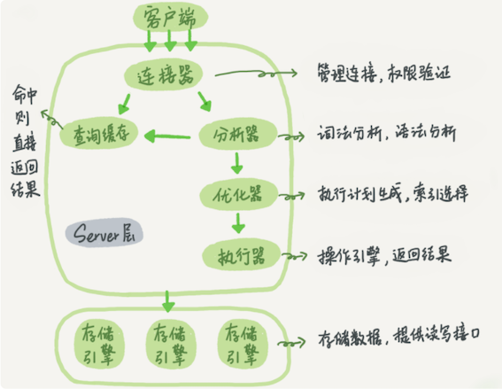
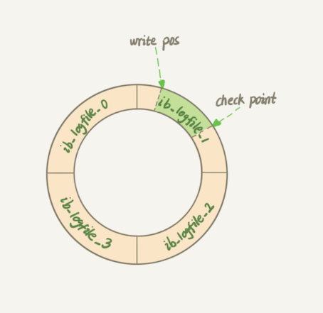
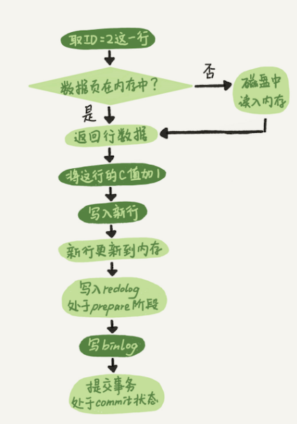

# **第二节 日志系统：执行一条SQL更新语句**

一条查询语句的执行过程一般是经过**连接器、分析器、优化器、执行器等功能模块，最后到达存储引擎**

那么，一条更新语句的执行流程又是怎样的呢？

下面是这个表的创建语句，这个表有一个主键 ID 和一个整型字段 c：

```
mysql> create table T(ID int primary key, c int);
```

如果要将 `ID=2` 这一行的值加 1，`SQL` 语句就会这么写：

```
mysql> update T set c=c+1 where ID=2;
```



**在一个表上有更新的时候，跟这个表有关的查询缓存会失效，所以这条语句就会把表 T 上所有缓存结果都清空。这也就是我们一般不建议使用查询缓存的原因。**

> 需要注意的是，MySQL 8.0 版本直接将查询缓存的整块功能删掉了，也就是说 8.0 开始彻底没有这个功能了。


* 接下来，**分析器会通过词法和语法解析知道这是一条更新语句**。
* 优化器决定要使用 ID 这个索引。
* 然后，执行器负责具体执行，找到这一行，然后更新。


与查询流程不一样的是，更新流程还涉及两个重要的日志模块，它们正是我们今天要讨论的主角：**redo log（重做日志）和 binlog（归档日志）**。

## **1、重要的日志模块：redo log**

在 MySQL 里也有这个问题，如果每一次的更新操作都需要写进磁盘，然后磁盘也要找到对应的那条记录，然后再更新，整个过程 IO 成本、查找成本都很高。

> IO成本就是寻址时间和上线文切换所需要的时间，最主要是用户态和内核态的上下文切换

MySQL 里经常说到的 WAL 技术，WAL 的全称是 `Write-Ahead Logging`，**它的关键点就是先写日志，再写磁盘。**

具体来说，**当有一条记录需要更新的时候，InnoDB 引擎就会先把记录写到 redo log里面，并更新内存，这个时候更新就算完成了**。

同时，**InnoDB 引擎会在适当的时候，将这个操作记录更新到磁盘里面，而这个更新往往是在系统比较空闲的时候做。**

> InnoDB引擎先把记录写到redo log 中，redo log 在哪，他也是在磁盘上，这也是一个写磁盘的过程，但是与更新过程不一样的是，更新过程是在磁盘上随机IO，费时。 而写redo log 是在磁盘上顺序IO。效率要高。

**`InnoDB` 的 `redo log` 是固定大小的，比如可以配置为一组 `4 `个文件，每个文件的大小是 `1GB`，那么总共就可以记录 4GB 的操作。**

> redo log 是循环写的，空间固定会用完；
> 
> binlog 是可以追加写入的。“追加写”是指 binlog 文件写到一定大小后会切换到下一个，并不会覆盖以前的日志。

从头开始写，写到末尾就又回到开头循环写，如下面这个图所示。



* **`write pos` 是当前记录的位置，一边写一边后移，写到第 3 号文件末尾后就回到 0 号文件开头**
* checkpoint 是当前要擦除的位置，也是往后推移并且循环的，擦除记录前要把记录更新到数据文件。

> 擦除记录之前要把记录更新到数据文件，也就是把记录更新到磁盘文件上，这个事情是在系统比较空闲的时候去做的。
> 
> 也有可能： 擦除记录是因为写满了，就算系统繁忙也要把记录更新到磁盘上吧


`write pos` 和 `checkpoint` 之间的是记录上还空着的部分，可以用来记录新的操作。如果 `write pos` 追上 `checkpoint`，表示记录满了，这时候不能再执行新的更新，得停下来先擦掉一些记录，把 `checkpoint` 推进一下。

**有了 `redo log`，InnoDB 就可以保证即使数据库发生异常重启，之前提交的记录都不会丢失，这个能力称为 `crash-safe`。**

## **2、重要的日志模块：binlog**

### **2-1 Binlog 两种模式**

* **Binlog有两种模式**：
	* statement 格式的话是记sql语句， 
	* row格式会记录行的内容，记两条，更新前和更新后都有。 

* **如何查看 binlog**： 
	* 搜索 log 名称：`show variables like '%log_bin%';` 
	* **查看 log 内容**：
		* `show binlog events in 'binlog.000009'` 
		* 使用命令行工具：`mysqlbinlog binlog.000009`

### **2-2 什么是binlog**

MySQL 整体来看，其实就有两块：

* 一块是 Server 层，它主要做的是 MySQL 功能层面的事情；
* 还有一块是引擎层，负责存储相关的具体事宜。

<span style="color:red">`redo log` 是 InnoDB 引擎特有的日志，**而 Server 层也有自己的日志，称为 binlog（归档日志）**。</span>


### **2-3 为什么会有两份日志呢？**

因为最开始 MySQL 里并没有 InnoDB 引擎。

* MySQL 自带的引擎是 MyISAM，但是 MyISAM 没有 `crash-safe` 的能力，**binlog 日志只能用于归档**。
* 而 InnoDB 是另一个公司以插件形式引入 MySQL 的，既然只依靠 binlog 是没有 crash-safe 能力的，**所以 InnoDB 使用另外一套日志系统——也就是 redo log 来实现 crash-safe 能力**。

### **2-4 这两种日志有以下三点不同。**

1. <span style="color:red">redo log 是 InnoDB 引擎特有的；binlog 是 MySQL 的 Server 层实现的，所有引擎都可以使用。</span>
2. `redo log` 是物理日志，**记录的是“在某个数据页上做了什么修改”**；`binlog` 是逻辑日志，**记录的是这个语句的原始逻辑，比如“给 ID=2 这一行的 c 字段加 1 ”**。
3. redo log 是循环写的，空间固定会用完；binlog 是可以追加写入的。**<span style="color:red">“追加写”是指 binlog 文件写到一定大小后会切换到下一个，并不会覆盖以前的日志。</span>**

有了对这两个日志的概念性理解，**我们再来看执行器和 InnoDB 引擎在执行这个简单的 update 语句时的内部流程**。

1. 执行器先找引擎取 `ID=2` 这一行。
	*  ID 是主键，引擎直接用树搜索找到这一行。
	*  如果 ID=2 这一行所在的数据页本来就在内存中，就直接返回给执行器；
	*  否则，需要先从磁盘读入内存，然后再返回。
	*  ` show variables like 'innodb_page_size';`
2. 执行器拿到引擎给的行数据，把这个值加上 1，比如原来是 N，现在就是 N+1，得到新的一行数据，**再调用引擎接口写入这行新数据**。
3. 引擎将这行新数据更新到内存中，**同时将这个更新操作记录到 `redo log` 里面，此时 `redo log `处于 prepare 状态**。然后告知执行器执行完成了，随时可以提交事务。
4. **执行器生成这个操作的 binlog，并把 binlog 写入磁盘**。
5. 执行器调用引擎的提交事务接口，**引擎把刚刚写入的 `redo log` 改成提交（`commit`）状态，更新完成。**

* binlog只有在事务commit的时候才会写入； 
* 当`prepare log` 写入成功且`binglog`写入成功后发送`crash`，在mysql启动时候，会自动`commit`这个事物； 
* 当`prepare log`写入成功，`binlog`写入失败，此时发生`crash`，`mysql`启动会自动回滚掉这个事物。



最后三步看将 `redo log` 的写入拆成了两个步骤：`prepare` 和 `commit`，这就是 <span style="color:red">**"两阶段提交"**</span>。

### **2-5 崩溃回滚分析**

1. prepare阶段 
2. 写binlog 
3. commit 

* 当在2之前崩溃时 重启恢复：后发现没有commit，回滚。备份恢复：没有binlog 。
* 当在3之前崩溃 重启恢复：虽没有commit，但满足prepare和binlog完整，所以重启后会自动commit。

## **3、两阶段提交**

**<span style="color:red">为什么必须有“两阶段提交”呢？这是为了让两份日志之间的逻辑一致</span>**


### **3-1 怎样让数据库恢复到半个月内任意一秒的状态？**

binlog 会记录所有的逻辑操作，并且是采用“追加写”的形式。如果你的 DBA 承诺说半个月内可以恢复，**那么备份系统中一定会保存最近半个月的所有 binlog，同时系统会定期做整库备份**


> 通过定期的整库备份加上binlog的操作回放可以保证数据的安全性。

> 因为binlog记录的是数据的逻辑操作（原始sql语句），而redolog是数据的物理操作日志，并且非innodb的引擎没有redolog。因此回放的时候回使用binlog进行回放


当需要恢复到指定的某一秒时

* 首先，找到最近的一次全量备份，如果你运气好，可能就是昨天晚上的一个备份，从这个备份恢复到临时库；
* 然后，从备份的时间点开始，将备份的 binlog 依次取出来，重放到中午误删表之前的那个时刻。
* 这样你的临时库就跟误删之前的线上库一样了，然后你可以把表数据从临时库取出来，按需要恢复到线上库去。

### **3-2 为什么日志需要“两阶段提交”**

> 如果不使用“两阶段提交”，那么数据库的状态就有可能和用它的日志恢复出来的库的状态不一致。

由于 redo log 和 binlog 是两个独立的逻辑，**如果不用两阶段提交，要么就是先写完 redo log 再写 binlog，或者采用反过来的顺序。**

仍然用前面的 update 语句来做例子。**假设当前 ID=2 的行，字段 c 的值是 0，再假设执行 update 语句过程中在写完第一个日志后，第二个日志还没有写完期间发生了 crash，会出现什么情况呢？**

#### **3-2-1 先写 redo log 后写 binlog**

* 假设在 redo log 写完，binlog 还没有写完的时候，MySQL 进程异常重启。由于我们前面说过的，redo log 写完之后，系统即使崩溃，仍然能够把数据恢复回来，所以恢复后这一行 c 的值是 1。
* 但是由于 binlog 没写完就 crash 了，这时候 binlog 里面就没有记录这个语句。
* 因此，之后备份日志的时候，存起来的 binlog 里面就没有这条语句。
* 然后你会发现，如果需要用这个 binlog 来恢复临时库的话，由于这个语句的 binlog 丢失，这个临时库就会少了这一次更新，**恢复出来的这一行 c 的值就是 0，与原库的值不同**。

#### **3-2-2 先写 binlog 后写 redo log**

* 如果在 binlog 写完之后 crash，由于 redo log 还没写，崩溃恢复以后这个事务无效，所以这一行 c 的值是 0。
* 但是 binlog 里面已经记录了“把 c 从 0 改成 1”这个日志。所以，在之后用 binlog 来恢复的时候就多了一个事务出来，恢复出来的这一行 c 的值就是 1，与原库的值不同。

**<span style="color:red">可以看到，如果不使用“两阶段提交”，那么数据库的状态就有可能和用它的日志恢复出来的库的状态不一致。</span>**

> 本质上是因为 redo log 负责事务； binlog负责归档恢复； 各司其职，相互配合，才提供(保证)了现有功能的完整性；

### **3-3 redolog和binlog具有关联行**

redolog和binlog具有关联行，在恢复数据时，redolog用于恢复主机故障时的未更新的物理数据，binlog用于备份操作。

每个阶段的log操作都是记录在磁盘的，在恢复数据时，redolog 状态为commit则说明binlog也成功，直接恢复数据；

**如果redolog是prepare，则需要查询对应的binlog事务是否成功，决定是回滚还是执行。**


## **4、小节总结**

### **4-1 redo log 用于保证 `crash-safe` 能力。**

* **`innodb_flush_log_at_trx_commit` 这个参数设置成 `1` 的时候，表示每次事务的 `redo log `都直接持久化到磁盘。这个参数我建议你设置成 `1`，这样可以保证 MySQL 异常重启之后数据不丢失。**
* `sync_binlog` 这个参数设置成 1 的时候，表示每次事务的 `binlog` 都持久化到磁盘。这个参数我也建议你设置成 `1`，这样可以保证 `MySQL` 异常重启之后 `binlog` 不丢失。

两阶段提交是跨系统维持数据逻辑一致性时常用的一个方案

### **4-2 提问**

定期全量备份的周期“取决于系统重要性，有的是一天一备，有的是一周一备”。那么在什么场景下，一天一备会比一周一备更有优势呢？或者说，它影响了这个数据库系统的哪个指标？

**主要影响数据库的硬盘存储。 需要对数据备份有强需求的情况下，1天1备肯定更加满足需要**


### **4-3 binlog vs redolog**

* Redo log 记录这个页 “做了什么改动”。
	* redo log记录的是当时的数据是怎么变化的，比如备份的时候记录table表中字段a的值是1→3（由1变成3）
* Binlog有两种模式，
	* **statement 格式的话是记sql语句**
	* **row格式会记录行的内容，记两条，更新前和更新后都有。**
	* binlog里面记录可能就是多条SQL执行之后a的值才等于3，比如`update table set a =1 where ID=1；`,`update table set a=3 where ID=1；`或者执行过更多SQL才变成3。


