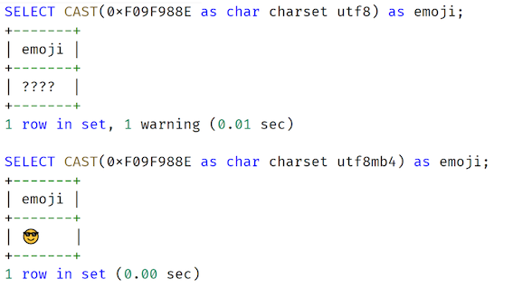

# **L1 表结构设计篇 - 数据类型**

## **1 数字类型**

**整型类型**

MySQL 数据库支持 SQL 标准支持的整型类型：INT、SMALLINT。此外，MySQL 数据库也支持诸如 TINYINT、MEDIUMINT 和 BIGINT 整型类型

在整型类型中，有 signed 和 unsigned 属性，其表示的是整型的取值范围，默认为 signed。在设计时，**我不建议你刻意去用 unsigned 属性，因为在做一些数据分析时，SQL 可能返回的结果并不是想要得到的结果**。

**浮点类型和高精度型**

MySQL 之前的版本中存在浮点类型 Float 和 Double，但这些类型因为不是高精度，也不是 SQL 标准的类型，所以在真实的生产环境中不推荐使用，否则在计算时，由于精度类型问题，会导致最终的计算结果出错。

更重要的是，从 MySQL 8.0.17 版本开始，**当创建表用到类型 Float 或 Double 时，会抛出下面的警告：MySQL 提醒用户不该用上述浮点类型，甚至提醒将在之后版本中废弃浮点类型**

```
Specifying number of digits for floating point data types is deprecated and will be removed in a future release
```

而数字类型中的高精度 DECIMAL 类型可以使用，当声明该类型列时，可以（并且通常必须要）指定精度和标度，例如：

```
salary DECIMAL(8,2)
```

**其中，8 是精度（精度表示保存值的主要位数），2 是标度（标度表示小数点后面保存的位数）**。通常在表结构设计中，类型 DECIMAL 可以用来表示用户的工资、账户的余额等精确到小数点后 2 位的业务。

然而，在海量并发的互联网业务中使用，金额字段的设计并不推荐使用 DECIMAL 类型，而更推荐使用 INT 整型类型


### **1-2 业务表结构设计实战**

**整型类型与自增设计**

整型类型: 在业务中，整型类型的另一个常见且重要的使用用法是作为表的主键，即用来唯一标识一行数据。

整型结合属性 `auto_increment`，可以实现**自增功能**，但在表结构设计时用自增做主键，希望你特别要注意以下两点，若不注意，可能会对业务造成灾难性的打击：

* 用 BIGINT 做主键，而不是 INT；
* 自增值并不持久化，可能会有回溯现象（MySQL 8.0 版本前）

**<mark>用自增整型做主键，一律使用 BIGINT**，**而不是 INT。不要为了节省 4 个字节使用 INT，当达到上限时，再进行表结构的变更，将是巨大的负担与痛苦</mark>**。

> 当达到 INT 上限后，再次进行自增插入时，会报重复错误，MySQL 数据库并不会自动将其重置为 1。
> 
> 第二个特别要注意的问题是，**（敲黑板 2）MySQL 8.0 版本前，自增不持久化，自增值可能会存在回溯问题！**


* 升级 MySQL 版本到 8.0 版本，每张表的自增值会持久化；
* 若无法升级数据库版本，则强烈不推荐在核心业务表中使用自增数据类型做主键。

**资金字段设计**

在用户余额、基金账户余额、数字钱包、零钱等的业务设计中，由于字段都是资金字段，通常程序员习惯使用 DECIMAL 类型作为字段的选型，因为这样可以精确到分，如：DECIMAL(8,2)。

```
CREATE TABLE User (

  userId BIGINT AUTO_INCREMENT,

  money DECIMAL(8,2) NOT NULL,

  ......
)
```

**<mark>在海量互联网业务的设计标准中，并不推荐用 DECIMAL 类型，而是更推荐将 DECIMAL 转化为 整型类型。</mark>**也就是说，资金类型更推荐使用用分单位存储，而不是用元单位存储。如1元在数据库中用整型类型 100 存储。

**类型 DECIMAL 是通过二进制实现的一种编码方式，计算效率远不如整型来的高效。因此，推荐使用 BIG INT 来存储金额相关的字段。**

### **1-3 总结**


* 不推荐使用整型类型的属性 Unsigned，若非要使用，参数 `sql_mode` 务必额外添加上选项 `NO_UNSIGNED_SUBTRACTION`；
* 自增整型类型做主键，务必使用类型 BIGINT，而非 INT，后期表结构调整代价巨大；
* MySQL 8.0 版本前，自增整型会有回溯问题，做业务开发的你一定要了解这个问题；
* 当达到自增整型类型的上限值时，再次自增插入，MySQL 数据库会报重复错误；
* **不要再使用浮点类型 Float、Double，MySQL 后续版本将不再支持上述两种类型**；
* 账户余额字段，设计是用整型类型，而不是 DECIMAL 类型，这样性能更好，存储更紧凑。

## **2 字符串类型：不能忽略的 COLLATION**

MySQL 数据库的字符串类型有 CHAR、VARCHAR、BINARY、BLOB、TEXT、ENUM、SET。不同的类型在业务设计、数据库性能方面的表现完全不同，**其中最常使用的是 CHAR、VARCHAR**。

### **2-1 CHAR 和 VARCHAR 的定义**

CHAR(N) 用来保存固定长度的字符，N 的范围是 0 ~ 255，**请牢记，N 表示的是字符，而不是字节**。VARCHAR(N) 用来保存变长字符，N 的范围为 0 ~ 65536， N 表示字符。

**在超出 65536 个字符的情况下，可以考虑使用更大的字符类型 TEXT 或 BLOB**，两者最大存储长度为 4G，其区别是 BLOB 没有字符集属性，纯属二进制存储。

和 Oracle、Microsoft SQL Server 等传统关系型数据库不同的是，MySQL 数据库的 VARCHAR 字符类型，最大能够存储 65536 个字符，**所以在 MySQL 数据库下，绝大部分场景使用类型 VARCHAR 就足够了**。

* **字符集**

在表结构设计中，除了将列定义为 CHAR 和 VARCHAR 用以存储字符以外，还需要额外定义字符对应的**字符集**，因为每种字符在不同字符集编码下，对应着不同的二进制值。

**常见的字符集有 GBK、UTF8，通常推荐把默认字符集设置为 UTF8。**


而且随着移动互联网的飞速发展，**推荐把 MySQL 的默认字符集设置为 UTF8MB4**，否则，某些 emoji 表情字符无法在 UTF8 字符集下存储，比如 emoji 笑脸表情，对应的字符编码为 `0xF09F988E`：



若强行在字符集为 UTF8 的列上插入 emoji 表情字符， MySQL 会抛出如下错误信息：

```
mysql> INSERT INTO emoji_test VALUES (0xF09F988E);

ERROR 1366 (HY000): Incorrect string value: '\xF0\x9F\x98\x8E' for column 'a' at row 1
```

另外，不同的字符集，CHAR(N)、VARCHAR(N) 对应最长的字节也不相同。比如 GBK 字符集，1 个字符最大存储 2 个字节，UTF8MB4 字符集 1 个字符最大存储 4 个字节。所以从底层存储内核看，**在多字节字符集下，CHAR 和 VARCHAR 底层的实现完全相同，都是变长存储！**

**鉴于目前默认字符集推荐设置为 UTF8MB4，所以在表结构设计时，可以把 CHAR 全部用 VARCHAR 替换，底层存储的本质实现一模一样。**

* **排序规则**

**排序规则（Collation）是比较和排序字符串的一种规则**，每个字符集都会有默认的排序规则，你可以用命令 SHOW CHARSET 来查看：

**牢记，绝大部分业务的表结构设计无须设置排序规则为大小写敏感！除非你能明白你的业务真正需要。**


### **2-2 正确修改字符集**

**如下操作后，依然无法插入 emoji 这类 UTF8MB4 字符：**

```
ALTER TABLE emoji_test CHARSET utf8mb4;
```
其实，上述修改只是将表的字符集修改为 UTF8MB4，下次新增列时，若不显式地指定字符集，新列的字符集会变更为 UTF8MB4，**<mark>但对于已经存在的列，其默认字符集并不做修改</mark>**，你可以通过命令 SHOW CREATE TABLE 确认：

因此，正确修改列字符集的命令应该使用**`ALTER TABLE ... CONVERT TO...`这样才能将之前的列 a 字符集从 UTF8 修改为 UTF8MB4**：

```
ALTER TABLE emoji_test CONVERT TO CHARSET utf8mb4;
```


### **2-3 业务表结构设计实战**

**用户性别设计**

设计表结构时，你会遇到一些固定选项值的字段。例如

```
 `sex` tinyint DEFAULT NULL,
```

其中，tinyint 列 sex 表示用户性别，但这样设计问题比较明显。

* **表达不清**：在具体存储时，0 表示女，还是 1 表示女呢？每个业务可能有不同的潜规则；
* **脏数据**：因为是 tinyint，因此除了 0 和 1，用户完全可以插入 2、3、4 这样的数值，最终表中存在无效数据的可能，后期再进行清理，代价就非常大了。

在 MySQL 8.0 版本之前，可以使用 ENUM 字符串枚举类型，只允许有限的定义值插入。如果将参数 `SQL_MODE` 设置为严格模式，插入非定义数据就会报错：

```
...
 `sex` enum('M','F') COLLATE utf8mb4_general_ci DEFAULT NULL,
 ...
 
 SET sql_mode = 'STRICT_TRANS_TABLES';
 
 mysql> INSERT INTO User VALUES (NULL,'F');

Query OK, 1 row affected (0.08 sec)

mysql> INSERT INTO User VALUES (NULL,'A');

ERROR 1265 (01000): Data truncated for column 'sex' at row 1
```


### **2-4 账户密码存储设计**

相信不少开发开发同学会通过函数 MD5 加密存储隐私数据，这没有错，因为 MD5 算法并不可逆。然而，MD5 加密后的值是固定的，如密码 12345678，它对应的 MD5 固定值即为 25d55ad283aa400af464c76d713c07ad。

因此，可以对 MD5 进行暴力破解，计算出所有可能的字符串对应的 MD5 值。若无法枚举所有的字符串组合，那可以计算一些常见的密码，如111111、12345678 等。

所以，在设计密码存储使用，还需要加盐（salt），**每个公司的盐值都是不同的，因此计算出的值也是不同的。若盐值为 psalt，则密码 12345678 在数据库中的值为**：


```
password = MD5（‘psalt12345678’）
```

* 若 salt 值被（离职）员工泄漏，则外部黑客依然存在暴利破解的可能性；
* 对于相同密码，其密码存储值相同，一旦一个用户密码泄漏，其他相同密码的用户的密码也将被泄漏；
* 固定使用 MD5 加密算法，一旦 MD5 算法被破解，则影响很大。

**<mark>动态盐 + 非固定加密算法。</mark>**

我比较推荐这么设计密码，列 password 存储的格式如下：

```
$salt$cryption_algorithm$value
```

其中：

* $salt：表示动态盐，每次用户注册时业务产生不同的盐值，并存储在数据库中。若做得再精细一点，可以动态盐值 + 用户注册日期合并为一个更为动态的盐值。
* `$cryption_algorithm`：表示加密的算法，**如 v1 表示 MD5 加密算法，v2 表示 AES256 加密算法，v3 表示 AES512 加密算法等**。
* $value：表示加密后的字符串。

```
password: $fgfaef$v1$2198687f6db06c9d1b31a030ba1ef074


password: $zpelf$v2$0x860E4E3B2AA4005D8EE9B7653409C4B133AF77AEF53B815D31426EC6EF78D882
```

在上面的例子中，用户 David 和 Amy 密码都是 12345678，然而由于使用了动态盐和动态加密算法，两者存储的内容完全不同。

### **2-5 总结**


* CHAR 和 VARCHAR 虽然分别用于存储定长和变长字符，但对于变长字符集（如 GBK、UTF8MB4），其本质是一样的，都是变长，**设计时完全可以用 VARCHAR 替代 CHAR**；
* **推荐 MySQL 字符集默认设置为 UTF8MB4，可以用于存储 emoji 等扩展字符**；
* 排序规则很重要，用于字符的比较和排序，但大部分场景不需要用区分大小写的排序规则；
* 修改表中已有列的字符集，使用命令 **ALTER TABLE ... CONVERT TO ....**；
* 用户性别，运行状态等有限值的列，MySQL 8.0.16 版本直接使用 CHECK 约束机制，之前的版本可使用 ENUM 枚举字符串类型，外加 `SQL_MODE `的严格模式；
* **业务隐私信息，如密码、手机、信用卡等信息，需要加密。切记简单的MD5算法是可以进行暴力破解，并不安全，推荐使用动态盐+动态加密算法进行隐私数据的存储**。

## **3 日期类型：TIMESTAMP 可能是巨坑**

### **3-1 日期类型**

MySQL 数据库中常见的日期类型有 YEAR、DATE、TIME、DATETIME、TIMESTAMEP。因为业务绝大部分场景都需要将日期精确到秒，所以在表结构设计中，**常见使用的日期类型为DATETIME 和 TIMESTAMP**

**DATETIME**

类型 DATETIME 最终展现的形式为：YYYY-MM-DD HH：MM：SS，固定占用 8 个字节。

从 MySQL 5.6 版本开始，DATETIME 类型支持毫秒，DATETIME(N) 中的 N 表示毫秒的精度。例如，**DATETIME(6) 表示可以存储 6 位的毫秒值。同时，一些日期函数也支持精确到毫秒，例如常见的函数 NOW、SYSDATE**：

```
mysql> SELECT NOW(6);

| 2020-09-14 17:50:28.707971 |

```

用户可以将 DATETIME 初始化值设置为当前时间，并设置自动更新当前时间的属性。

```
...
register_date DATETIME(6) NOT NULL DEFAULT CURRENT_TIMESTAMP(6),

last_modify_date DATETIME(6) NOT NULL DEFAULT CURRENT_TIMESTAMP(6) ON UPDATE CURRENT_TIMESTAMP(6),

CHECK (sex = 'M' OR sex = 'F'),
```

在上面的表 User 中，列` register_date` 表示注册时间，**`DEFAULT CURRENT_TIMESTAMP` 表示记录插入时，若没有指定时间，默认就是当前时间。**

列 last_modify_date 表示当前记录最后的修改时间，`DEFAULT CURRENT_TIMESTAMP(6) ON UPDATE CURRENT_TIMESTAMP(6) ` 表示每次修改都会修改为当前时间。

**TIMESTAMP**

除了 DATETIME，日期类型中还有一种 TIMESTAMP 的时间戳类型，其实际存储的内容为‘1970-01-01 00:00:00’到现在的毫秒数。在 MySQL 中，由于类型 TIMESTAMP 占用 4 个字节，因此其存储的时间上限只能到‘`2038-01-19 03:14:07’`。

**与 DATETIME 不同的是，若带有毫秒时，类型 TIMESTAMP 占用 7 个字节，而 DATETIME 无论是否存储毫秒信息，都占用 8 个字节。**

参数 time_zone 指定了当前使用的时区，默认为 SYSTEM 使用操作系统时区，用户可以通过该参数指定所需要的时区。

如果想使用 TIMESTAMP 的时区功能，你可以通过下面的语句将之前的用户表 User 的注册时间字段类型从 DATETIME(6) 修改为 TIMESTAMP(6)：

这时通过设定不同的 `time_zone`，可以观察到不同时区下的注册时间：

```
mysql> SET time_zone = '-08:00';
``` 

### **3-2 业务表结构设计实战**


* **DATETIME vs TIMESTAMP vs INT，怎么选？**

在做表结构设计时，对日期字段的存储，开发人员通常会有 3 种选择：DATETIME、TIMESTAMP、**INT。**

**INT 类型就是直接存储 `'1970-01-01 00:00:00'` 到现在的毫秒数，本质和 TIMESTAMP 一样，因此用 INT 不如直接使用 TIMESTAMP。**


**<mark>总的来说，我建议你使用类型 DATETIME。 对于时区问题，可以由前端或者服务这里做一次转化，不一定非要在数据库中解决</mark>。**


* **不要忽视 TIMESTAMP 的性能问题**
	* **性能不如 DATETIME**： DATETIME 不存在时区转化问题。
	* **性能抖动**： 海量并发时，存在性能抖动问题 

为了优化 TIMESTAMP 的使用，强烈建议你使用显式的时区，而不是操作系统时区。比如在配置文件中显示地设置时区，而不要使用系统时区：

```
[mysqld]

time_zone = "+08:00"
```

* 表结构设计规范：每条记录都要有一个时间字段

**强烈建议你每张业务核心表都增加一个 DATETIME 类型的 `last_modify_date` 字段，并设置修改自动更新机制， 即便标识每条记录最后修改的时间。**

```
 last_modify_date DATETIME(6) NOT NULL DEFAULT CURRENT_TIMESTAMP(6) ON UPDATE CURRENT_TIMESTAMP(6),
```

通过字段 `last_modify_date` 定义的 ON UPDATE CURRENT_TIMESTAMP(6)，那么每次这条记录，则都会自动更新 `last_modify_date` 为当前时间。

**这样设计的好处是**： 用户可以知道每个用户最近一次记录更新的时间，以便做后续的处理。比如在电商的订单表中，可以方便对支付超时的订单做处理；在金融业务中，可以根据用户资金最后的修改时间做相应的资金核对等。

### **3-3 总结**

日期类型通常就是使用 DATETIME 和 TIMESTAMP 两种类型，然而由于类型 TIMESTAMP 存在性能问题，建议你还是尽可能使用类型 DATETIME

* MySQL 5.6 版本开始 DATETIME 和 TIMESTAMP 精度支持到毫秒；
* **DATETIME 占用 8 个字节，TIMESTAMP 占用 4 个字节，DATETIME(6) 依然占用 8 个字节，TIMESTAMP(6) 占用 7 个字节**；
* TIMESTAMP 日期存储的上限为 `2038-01-19 03:14:07`，业务用 TIMESTAMP 存在风险；
* **使用 TIMESTAMP 必须显式地设置时区，不要使用默认系统时区，否则存在性能问题，推荐在配置文件中设置参数 `time_zone = '+08:00'`**；
* **推荐日期类型使用 DATETIME，而不是 TIMESTAMP 和 INT 类型**；
* 表结构设计时，每个核心业务表，推荐设计一个 `last_modify_date` 的字段，用以记录每条记录的最后修改时间。

## **4 非结构存储：用好 JSON**

### **4-1 JSON 数据类型**

**主要有JSON 对象和JSON 数组两种类型**

JSON对象除了支持字符串、整型、日期类型，JSON 内嵌的字段也支持数组类型，如上代码中的 IDs 字段。

### **4-2 业务表结构设计实战**

* **用户登录设计**

在数据库中，JSON 类型比较适合存储一些修改较少、相对静态的数据，比如用户登录信息的存储如下：

```
DROP TABLE IF EXISTS UserLogin;

CREATE TABLE UserLogin (

    userId BIGINT NOT NULL,

    loginInfo JSON,

    PRIMARY KEY(userId)

);
```

接着，插入下面的数据：


```
SET @b = '

{

	"cellphone" : "15026888888"

}

';

INSERT INTO UserLogin VALUES (2,@b);
```


因为支持了新的JSON类型，MySQL 配套提供了丰富的 JSON 字段处理函数，用于方便地操作 JSON 数据，具体可以见 MySQL 官方文档。

**其中，最常见的就是函数 `JSON_EXTRACT`，它用来从 JSON 数据中提取所需要的字段内容，**如下面的这条 SQL 语句就查询用户的手机和微信信息。

```
SELECT

    userId,

    JSON_UNQUOTE(JSON_EXTRACT(loginInfo,"$.cellphone")) cellphone,

    JSON_UNQUOTE(JSON_EXTRACT(loginInfo,"$.wxchat")) wxchat

FROM UserLogin;
```

当 JSON 数据量非常大，用户希望对 JSON 数据进行有效检索时，**可以利用 MySQL 的函数索引功能对 JSON 中的某个字段进行索引。**

```
ALTER TABLE UserLogin ADD COLUMN cellphone VARCHAR(255) AS (loginInfo->>"$.cellphone");
```


上述 SQL 首先创建了一个虚拟列 cellphone，这个列是由函数 `loginInfo->>"$.cellphone" ` 计算得到的。

**然后在这个虚拟列上创建一个唯一索引 `idx_cellphone`**。 这时再通过虚拟列 cellphone 进行查询，就可以看到优化器会使用到新创建的 `idx_cellphone` 索引：

当然，我们可以在一开始创建表的时候，就完成虚拟列及函数索引的创建。如下表创建的列 cellphone 对应的就是 JSON 中的内容，是个虚拟列；`uk_idx_cellphone` 就是在虚拟列 cellphone 上所创建的索引。

```
CREATE TABLE UserLogin (

    userId BIGINT,

    loginInfo JSON,

    cellphone VARCHAR(255) AS (loginInfo->>"$.cellphone"),

    PRIMARY KEY(userId),

    UNIQUE KEY uk_idx_cellphone(cellphone)

);
```

### **4-2 总结**

JSON 类型是 MySQL 5.7 版本新增的数据类型，用好 JSON 数据类型可以有效解决很多业务中实际问题


* 使用 JSON 数据类型，推荐用 MySQL 8.0.17 以上的版本，性能更好，同时也支持 `Multi-Valued Indexes`；
* JSON 数据类型的好处是无须预先定义列，数据本身就具有很好的描述性；
* 不要将有明显关系型的数据用 JSON 存储，如用户余额、用户姓名、用户身份证等，这些都是每个用户必须包含的数据；
* JSON 数据类型推荐使用在不经常更新的静态数据存储。

