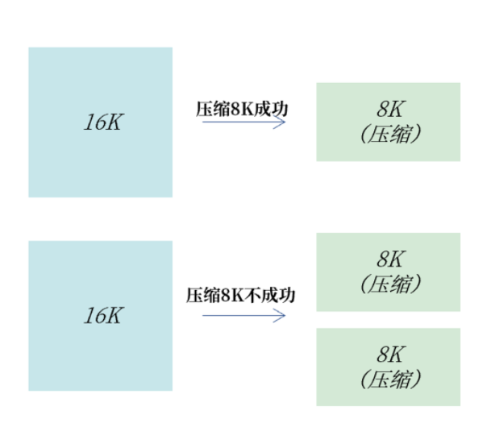
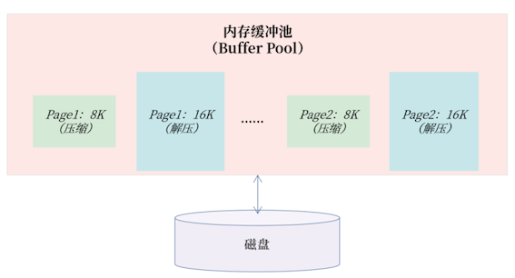
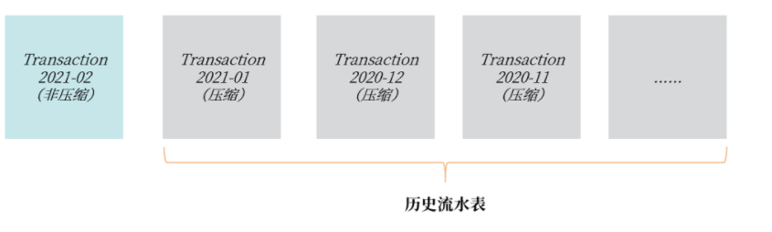
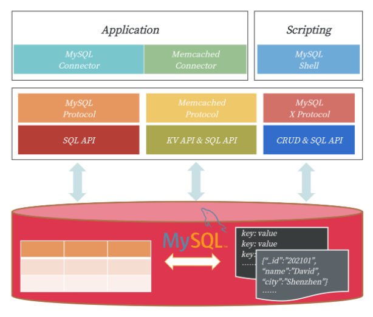
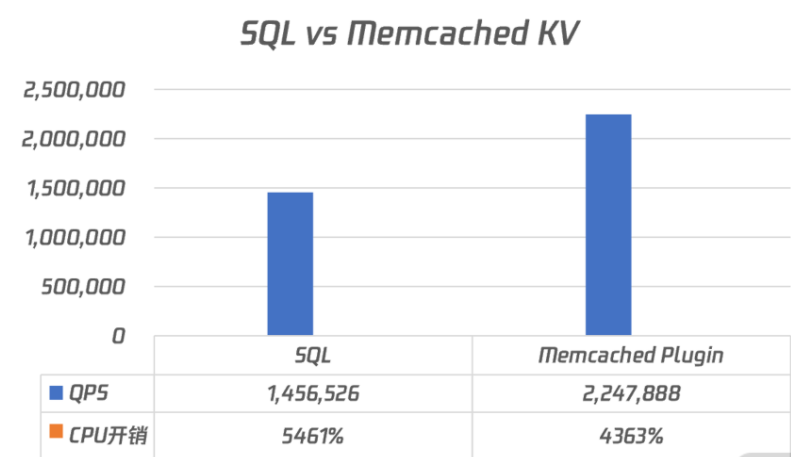
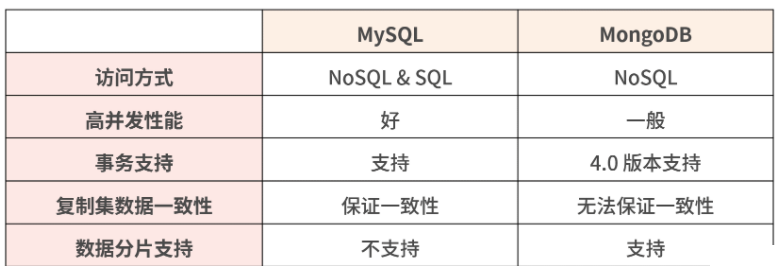
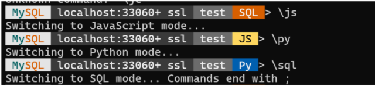

# **L2 表结构设计篇 - 表设计**

## **1 忘记范式准则**

范式设计是非常重要的理论，是通过数学集合概念来推导范式的过程，在理论上，要求表结构设计必须至少满足三范式的要求。

由于完全是数据推导过程，范式理论非常枯燥，**但你只要记住几个要点就能抓住其中的精髓**：

* **一范式要求所有属性都是不可分的基本数据项**；
* **二范式解决部分依赖**；
* **三范式解决传递依赖**。

从业务角度出发，设计出符合范式准则要求的表结构。

### **1-1 工程上的表结构设计实战**

真实的业务场景是工程实现，表结构设计做好以下几点就已经足够：

* 每张表一定要有一个主键（方法有自增主键设计、UUID 主键设计、业务自定义生成主键）；
* 消除冗余数据存在的可能

* **自增主键设计**

主键用于唯一标识一行数据，所以一张表有主键，就已经直接满足一范式的要求了

> 使用 BIGINT 的自增类型作为主键，同时由于整型的自增性，数据库插入也是顺序的，性能较好。

使用 BIGINT 的自增类型作为主键的设计仅仅适合**非核心业务表**，比如告警表、日志表等。**真正的核心业务表，一定不要用自增键做主键**，

* 自增存在回溯问题；
* 自增值在服务器端产生，存在并发性能问题；
* **自增值做主键，只能在当前实例中保证唯一，不能保证全局唯一**；
* 公开数据值，容易引发安全问题，例如知道地址`http://www.example.com/User/10/`，很容猜出 User 有 11、12 依次类推的值，容易引发数据泄露；
* MGR（MySQL Group Replication） 可能引起的性能问题；
* 分布式架构设计问题。

又因为自增值是在 MySQL 服务端产生的值，需要有一把自增的 AI 锁保护，若这时有大量的插入请求，就可能存在自增引起的性能瓶颈。

比如在 MySQL 数据库中，参数 `innodb_autoinc_lock_mode` 用于控制自增锁持有的时间。假设有一 SQL 语句，同时插入 3 条带有自增值的记录：

```
INSERT INTO ... VALUES (NULL,...),(NULL,...),(NULL,...);
```
从表格中你可以看到，一条 SQL 语句插入 3 条记录，参数 innodb_autoinc_lock_mode 设置为 1，自增锁在这一条 SQL 执行完成后才释放。

如果参数 `innodb_autoinc_lock_mode` 设置为2，自增锁需要持有 3 次，每插入一条记录获取一次自增锁。

* **这样设计好处是**： 当前插入不影响其他自增主键的插入，可以获得最大的自增并发插入性能。
* **缺点是**： 一条 SQL 插入的多条记录并不是连续的，如结果可能是 1、3、5 这样单调递增但非连续的情况。

**所以，如果你想获得自增值的最大并发性能，把参数 `innodb_autoinc_lock_mode` 设置为2。**

**<mark>在互联网海量并发架构实战中，我更推荐 UUID 做主键或业务自定义生成主键</mark>**

* **UUID主键设计**

UUID（Universally Unique Identifier）代表全局唯一标识 ID。显然，由于全局唯一性，你可以把它用来作为数据库的主键。

```
mysql> SELECT UUID();

+--------------------------------------+

| UUID()                               |

+--------------------------------------+

| e0ea12d4-6473-11eb-943c-00155dbaa39d |

+--------------------------------------+
```

根据 Version 1的规范，MySQL中的 UUID 由以下几个部分组成：

```
UUID = 时间低（4字节）- 时间中高+版本（4字节）- 时钟序列 - MAC地址
```

需要特别注意的是，**在存储时间时，UUID 是根据时间位逆序存储， 也就是低时间低位存放在最前面，高时间位在最后，即 UUID 的前 4 个字节会随着时间的变化而不断“随机”变化，并非单调递增。**

当然了，MySQL 8.0版本之前没有函数 `UUID_TO_BIN/BIN_TO_UUI`D，但是你还是可以通过用户义函数（UDF）的方式解决，如创建下面的函数：

现在，你可以在客户端通过以下 SQL 命令插入数据，如：

```
INSERT INTO User VALUES (UUID_TO_BIN(UUID(),TRUE),......);
```

MySQL 8.0 提供的排序 UUID 性能最好，甚至比自增ID还要好。**此外，由于`UUID_TO_BIN`转换为的结果是16 字节，仅比自增 ID 增加 8 个字节，最后存储占用的空间也仅比自增大了 3G。**

而且由于 UUID 能保证全局唯一，因此使用 UUID 的收益远远大于自增ID。可能你已经习惯了用自增做主键，但在海量并发的互联网业务场景下，更推荐 UUID 这样的全局唯一值做主键。

* **业务自定义生成主键**

**现在你只需要牢记：分布式数据库架构，仅用 UUID 做主键依然是不够的。**

所以，对于分布式架构的核心业务表，我推荐类似如下的设计，比如：

```
PK = 时间字段 + 随机码（可选） + 业务信息1 + 业务信息2 ......
```

* 消除冗余

**消除冗余也是范式的要求，解决部分依赖和传递依赖，本质就是尽可能减少冗余数据。**

所以，在进行表结构设计时，数据只需存放在一个地方，其他表要使用，通过主键关联存储即可。比如订单表中需要存放订单对应的用户信息，则保存用户 ID 即可：

当然了，无论是自增主键设计、UUID主键设计、业务自定义生成主键、还是消除冗余，本质上都是遵循了范式准则。但是在一些其他业务场景下，也存在反范式设计的情况。

### **1-2 总结**

在 MySQL 海量并发的工程实践上，表结构设计应遵循这样几个规范：

* 每张表一定要有一个主键；
* 自增主键只推荐用在非核心业务表，甚至应避免使用；
* 核心业务表推荐使用 UUID 或业务自定义主键；
* 一份数据应尽可能保留一份，通过主键关联进行查询，避免冗余数据；
* 在一些场景下，可以通过 JSON 数据类型进行反范式设计，提升存储效率；

## **2 表压缩：不仅仅是空间压缩**

数据库中的表是由一行行记录（rows）所组成，每行记录被存储在一个页中，在 MySQL 中，一个页的大小默认为 16K，一个个页又组成了每张表的表空间。

### **2-1 表压缩**


通常我们认为，**如果一个页中存放的记录数越多，数据库的性能越高**。这是因为数据库表空间中的页是存放在磁盘上，MySQL 数据库先要将磁盘中的页读取到内存缓冲池，然后以页为单位来读取和管理记录。

一个页中存放的记录越多，内存中能存放的记录数也就越多，那么存取效率也就越高。若想将一个页中存放的记录数变多，可以启用压缩功能。此外，启用压缩后，存储空间占用也变小了，同样单位的存储能存放的数据也变多了。

若要启用压缩技术，数据库可以根据记录、页、表空间进行压缩，**不过在实际工程中，我们普遍使用页压缩技术**，

* **压缩每条记录**： 因为每次读写都要压缩和解压，过于依赖 CPU 的计算能力，性能会明显下降；
	* 另外，因为单条记录大小不会特别大，一般小于 1K，**压缩效率也并不会特别好**。
* **压缩表空间**： 压缩效率非常不错，但要求表空间文件静态不增长，**这对基于磁盘的关系型数据库来说，很难实现**。

**而基于页的压缩，既能提升压缩效率，又能在性能之间取得一种平衡。**

可能很多同学认为，启用表的页压缩功能后，性能有明显损失，因为压缩需要有额外的开销。

**的确，压缩需要消耗额外的 CPU 指令，但是压缩并不意味着性能下降，或许能额外提升性能，因为大部分的数据库业务系统，CPU 的处理能力是剩余的，而 I/O 负载才是数据库主要瓶颈。**

借助页压缩技术，MySQL 可以把一个 16K 的页压缩为 8K，甚至 4K，这样在从磁盘写入或读取时，就能将 I/O 请求大小减半，甚至更小，从而提升数据库的整体性能。

### **2-2 MySQL 压缩表设计**

* **COMPRESS 页压缩**

COMPRESS 页压缩是 MySQL 5.7 版本之前提供的页压缩功能。只要在创建表时指定`ROW_FORMAT=COMPRESS`，并设置通过选项 `KEY_BLOCK_SIZE` 设置压缩的比例。

需要牢记的是， 虽然是通过选项 ROW_FORMAT 启用压缩功能，但这并不是记录级压缩，依然是根据页的维度进行压缩。

**下面这是一张日志表，`ROW_FROMAT` 设置为 COMPRESS，表示启用 COMPRESS 页压缩功能，`KEY_BLOCK_SIZE` 设置为 8，表示将一个 16K 的页压缩为 8K。**


```
CREATE TABLE Log (

  logId BINARY(16) PRIMARY KEY,

  ......

)

ROW_FORMAT=COMPRESSED

KEY_BLOCK_SIZE=8
```


COMPRESS 页压缩就是将一个页压缩到指定大小。如 16K 的页压缩到 8K，若一个 16K 的页无法压缩到 8K，则会产生 2 个压缩后的 8K 页，具体如下图所示：



* **COMPRESS 页压缩**

**总的来说，COMPRESS 页压缩，适合用于一些对性能不敏感的业务表，例如日志表、监控表、告警表等，压缩比例通常能达到 50% 左右。**

虽然 COMPRESS 压缩可以有效减小存储空间，但 COMPRESS 页压缩的实现对性能的开销是巨大的，性能会有明显退化。主要原因是一个压缩页在内存缓冲池中，存在压缩和解压两个页。




1 个 COMPRESS 压缩页在内存中存在 2 个页版本

如图所示，Page1 和 Page2 都是压缩页 8K，但是在内存中还有其解压后的 16K 页。这样设计的原因是 8K 的页用于后续页的更新，16K 的页用于读取，这样读取就不用每次做解压操作了。

为了 解决压缩性能下降的问题，从MySQL 5.7 版本开始推出了 TPC 压缩功能。


* **TPC 压缩**

**TPC（Transparent Page Compression）是 5.7 版本推出的一种新的页压缩功能**，其利用文件系统的空洞（Punch Hole）特性进行压缩。可以使用下面的命令创建 TPC 压缩表：

```
CREATE TABLE Transaction （

  transactionId BINARY(16) PRIMARY KEY,

  .....

)

COMPRESSION=ZLIB | LZ4 | NONE;
```

要使用 TPC 压缩，首先要确认当前的操作系统是否支持空洞特性。通常来说，当前常见的 Linux 操作系统都已支持空洞特性。

由于空洞是文件系统的一个特性，利用空洞压缩只能压缩到文件系统的最小单位 4K，且其页压缩是 4K 对齐的。比如一个 16K 的页，压缩后为 7K，则实际占用空间 8K；压缩后为 3K，则实际占用空间是 4K；若压缩后是 13K，则占用空间依然为 16K。

TPC 压缩的具体实现如下所示：

一个 16K 的页压缩后是 8K，接着数据库会对这 16K 的页剩余的 8K 填充0x00，这样当这个 16K 的页写入到磁盘时，利用文件系统空洞特性，则实际将仅占用 8K 的物理存储空间。

空洞压缩的另一个好处是，它对数据库性能的侵入几乎是无影响的（小于 20%），甚至可能还能有性能的提升。

这是因为不同于 COMPRESS 页压缩，TPC 压缩在内存中只有一个 16K 的解压缩后的页，对于缓冲池没有额外的存储开销。

另一方面，所有页的读写操作都和非压缩页一样，没有开销，只有当这个页需要刷新到磁盘时，才会触发页压缩功能一次。但由于一个 16K 的页被压缩为了 8K 或 4K，其实写入性能会得到一定的提升。

* **表压缩在业务上的使用**

**总的来说，对一些对性能不敏感的业务表，例如日志表、监控表、告警表等，它们只对存储空间有要求，因此可以使用 COMPRESS 页压缩功能。
**
在一些较为核心的流水业务表上，我更推荐使用 TPC压缩。因为流水信息是一种非常核心的数据存储业务，通常伴随核心业务。如一笔电商交易，用户扣钱、下单、记流水，这就是一个核心业务的微模型。


需要特别注意的是： 通过命令 `ALTER TABLE xxx COMPRESSION = ZLIB` 可以启用 TPC 页压缩功能，但是这只对后续新增的数据会进行压缩，对于原有的数据则不进行压缩。所以上述ALTER TABLE 操作只是修改元数据，瞬间就能完成。

```
ALTER TABLE Transaction202102 COMPRESSION=ZLIB；

OPTIMIZE TABLE Transaction202102;
```



### **2-2 总结**


* MySQL 中的压缩都是基于页的压缩；
* COMPRESS 页压缩适合用于性能要求不高的业务表，如日志、监控、告警表等；
* COMPRESS 页压缩内存缓冲池存在压缩和解压的两个页，会严重影响性能；
* 对存储有压缩需求，又希望性能不要有明显退化，推荐使用 TPC 压缩；
* **通过 ALTER TABLE 启用 TPC 压缩后，还需要执行命令 OPTIMIZE TABLE 才能立即完成空间的压缩。**


## **3 表的访问设计 SQL 还是 NoSQL**

### **3-1 MySQL 中表的访问方式**

SQL 是访问数据库的一个通用接口，虽然数据库有很多种，但数据库中的 SQL 却是类似的，因为 SQL 有标准存在，如 SQL92、SQL2003 等。

**接下来我重点带你了解 MySQL 怎么通过 NoSQL 的方式访问表中的数据。**



**MySQL 三种表的访问方式**

可以看到，除了标准的 SQL 访问，MySQL 5.6 版本开始还支持通过 Memcached 通信协议访问表中的数据，这时 MySQL 可以作为一个 KV 数据库使用。**此外，MySQL 5.7 版本开始还支持通过新的 MySQL X 通信协议访问表中的数据，这时 MySQL 可以作为一个文档数据库使用。**


* 对比传统的 NoSQL 数据库（比如 Memcached、MongoDB），MySQL 这样的访问更具有灵活性，在通过简单的 NoSQL 接口保障性能的前提下，又可以通过 SQL 的方式丰富对于数据的查询
* 另外，MySQL 提供的成熟事务特性、高可用解决方案，又能弥补 NoSQL 数据库在这方面的不足。


### **3-2 通过 Memcached 协议访问表**

**MySQL 5.6 版本开始支持通过插件 Memcached Plugin，以 KV 方式访问表，这时可以将 MySQL视作一个 Memcached KV 数据库。**

对于数据的访问不再是通过 SQL 接口，而是通过 KV 数据库中常见的 get、set、incr 等请求。

但为什么要通过 KV 的方式访问数据呢？因为有些业务对于数据库的访问本质上都是一个 KV 操作。比如用户登录系统，**大多是用于信息确认，这时其 SQL 大多都是通过主键或唯一索引进行数据的查询**，如：

```
SELECT * FROM User WHERE PK = ?
```

若在海量并发访问的系统中，通过 SQL 访问这些表，由于通过主键索引进行访问，速度很快。但 SQL 解析（哪怕是软解析）却要耗费不少时间，这时单数据库实例性能会受到一定的限制。

基于 Memcached 的 KV 访问，可以绕过 SQL 解析，通过映射关系，直接访问存储在 InnoDB 引擎中的数据，这样数据库的整体性能会在不花费额外成本的前提下得到极大的提升。

那么要启用 Memcached 协议访问 MySQL 需要做两件事情：

* 开启 Memcached 插件；
* 配置表与 KV 的映射关系。

具体操作如下所示：

```
-- 安装映射表

mysql> source MYSQL_HOME/share/innodb_memcached_config.sql

-- 安装插件，默认会启动11211端口

mysql> INSTALL PLUGIN daemon_memcached soname "libmemcached.so";
```

执行完上述操作后，会新增一个库 `innodb_memcache`，里面的表 containers 就是需要配置的KV映射表。如果业务常见的主键查询 SQL 如下，其中列 `user_id` 是主键：

```
SELECT user_id,cellphone,last_login 

FROM test.User 

WHERE user_id = ？
```

执行完上述操作后，会新增一个库 `innodb_memcache`，里面的表 containers 就是需要配置的KV映射表。如果业务常见的主键查询 SQL 如下，其中列 `user_id` 是主键：

```
SELECT user_id,cellphone,last_login 

FROM test.User 

WHERE user_id = ？
```

那么我们可以在表 Containers 中插入一条记录：

```
INSERT INTO containers

VALUES ('User','test','user_id','user_id|cellphone|last_login','0','0','0','PRIAMRY')
```

上面的映射关系表示通过 Memcached 的 KV 方式访问，其本质是通过 PRIAMRY 索引访问 key 值，key 就是 `user_id`，value 值返回的是由列 `user_id`、cellphone、`last_login` 组合而成，分隔符为`"|"`的字符串。

最后，通过 SQL 和 KV 的对比性能测试，可以发现通过 KV 的方式访问，性能要好非常多，在我的测试服务器上结果如下所示：



从测试结果可以看到，**基于 Memcached 的 KV 访问方式比传统的 SQL 方式要快54.33%，而且CPU 的开销反而还要低20%**。

当然了，上述操作只是将表 User 作为 KV 访问，如果想将其他表通过 KV 的方式访问，可以继续在表 Containers 中进行配置。但是在使用时，务必先通过 GET 命令指定要访问的表：

```
# Python伪代码

mc = Client('127.0.0.1:11211')

mc.get('@@User') # 读取映射表User

mc.get('key1')

mc.get('@@sbtest1') # 读取映射表sbtest1

mc.set('sb1_key1','aa|bbb|ccc')

......
```


**另一种使用 Memcached Plugin 的场景是原先使用原生 Memcached KV 数据库的用户。这些用户可以考虑将 Memcached 数据库迁移到 MySQL 。这样的好处是**：

* 通过 MySQL 进行访问的性能比原生 Memcached 好，数据库并发优化做得更好；
* 存储可以持久化，支持事务，数据一致性和安全性更好；
* 利用 MySQL 复制技术，可以弥补原生 Memcached 不支持数据复制的短板；

### **3-3 通过 X Protocol 访问表**

MySQL 5.7 版本开始原生支持 JSON 二进制数据类型，同时也提供将表格映射为一个 JSON 文档。

**<mark>同时，MySQL 也提供了 X Protocol 这样的 NoSQL 访问方式，所以，现在我们 MySQL 打造成一个SQL & NoSQL的文档数据库</mark>**。

对比 MongoDB 文档数据库，将 MySQL 打造为文档数据库与 MongoDB 的对比在于：



可以看到，除了 MySQL 目前还无法支持数据分片功能外，其他方面 MySQL 的优势会更大一些，特别是 MySQL 是通过二维表格存储 JSON 数据，从而实现文档数据库功能。

这样可以通过 SQL 进行很多复杂维度的查询，特别是结合 MySQL 8.0 的 CTE（Common Table Expression）、窗口函数（Window Function）等功能，而这在 MongoDB 中是无法原生实现的。

另外，和 Memcached Plugin 不同的是，MySQL 默认会自动启用 X Plugin 插件，接着就可以通过新的 X Protocol 协议访问 MySQL 中的数据，默认端口 33060，你可以通过下面命令查看有关 X Plugin 的配置：

```
mysql> SHOW VARIABLES LIEK '%mysqlx%';

+-----------------------------------+--------------------+

| Variable_name                     | Value              |

+-----------------------------------+--------------------+

| mysqlx_bind_address               | *                  |

| mysqlx_compression_algorithms     | 

DEFLATE_STREAM,LZ4_MESSAGE,ZSTD_STREAM                   |

| mysqlx_connect_timeout            | 30                 |

| mysqlx_document_id_unique_prefix  | 0                  |

| mysqlx_enable_hello_notice        | ON                 |

| mysqlx_idle_worker_thread_timeout | 60                 |

| mysqlx_interactive_timeout        | 28800              |

| mysqlx_max_allowed_packet         | 67108864           |

| mysqlx_max_connections            | 100                |

| mysqlx_min_worker_threads         | 2                  |

| mysqlx_port                       | 33060              |

| mysqlx_port_open_timeout          | 0                  |

| mysqlx_read_timeout               | 30                 |

| mysqlx_socket                     | /tmp/mysqlx.sock   |

......
```

要通过 X Protocol 管理 MySQL 需要通过新的 MySQL Shell 命令，默认并不安装，需要单独安装。下载地址：https://dev.mysql.com/downloads/shell/。安装后就可以通过命令 mysqlsh 通过新的 X Protocol 访问 MySQL 数据库：

```
root@MBP-Windows:# mysqlsh root@localhost/test
```

X Protocol 协议支持通过 JS、Python、SQL 的方式管理和访问 MySQL，具体操作你可以参见官方文档。



通过 X Protocol 协议管理文档数据，也需要下载新的 MySQL Connector，并引入新的 X 驱动库，如 Python 驱动：

```
import mysqlx

# Connect to server on localhost

session = mysqlx.get_session({

    'host': 'localhost',

    'port': 33060

})

schema = session.get_schema('test')

# Use the collection 'my_collection'

collection = schema.get_collection('my_collection')

# Specify which document to find with Collection.find()

result = collection.find('name like :param').bind('param', 'S%').limit(1).execute()

# Print document

docs = result.fetch_all()

print('Name: {0}'.format(docs[0]['name']))

session.close()
```

### **3-4 总结**

通过 SQL、Memcache 协议、X Protocol 访问 MySQL 中的表，即我们可以将 MySQL 打造成一个关系型数据库、KV 数据库、文档数据库，但底层都是通过表格的方式进行数据的存储，并且数据都存储在 InnoDB 引擎中。

还在使用 Memcached、MongoDB 数据库的同学可以考虑将数据迁移到 MySQL，这样能在兼容原有业务的前提下，使用到 InnoDB 存储引擎的高并发、事务安全、数据复制等高级功能。


