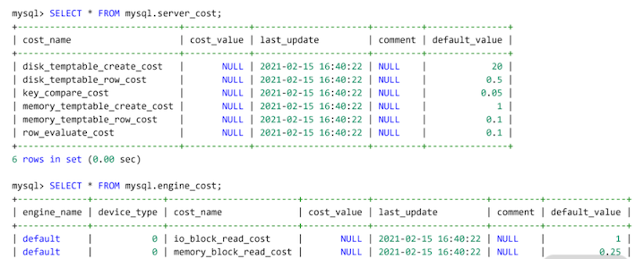

# **L3 索引优化**

## **1 索引：排序的艺术**

### **1-1 索引是什么？**

**索引是提升查询速度的一种数据结构。**

MySQL 8.0 版本中，InnoDB 存储引擎支持的**索引有 B+ 树索引、全文索引、R 树索引**。

### **1-2 B+树索引结构**

**那为什么关系型数据库都热衷支持 B+树索引呢**？**因为它是目前为止排序最有效率的数据结构**。像二叉树，哈希索引、红黑树、SkipList，在海量数据基于磁盘存储效率方面远不如 B+ 树索引高效。

**B+树索引的特点是**： 基于磁盘的平衡树，但树非常矮，通常为 3~4 层，能存放千万到上亿的排序数据。树矮意味着访问效率高，从千万或上亿数据里查询一条数据，只用 3、4 次 I/O。

**B+ 树索引由根节点（root node）、中间节点（non leaf node）、叶子节点（leaf node）组成，其中叶子节点存放所有排序后的数据。**当然也存在一种比较特殊的情况，比如高度为 1 的B+ 树索引：

```
CREATE TABLE User (

  id BIGINT AUTO_INCREMENT PRIMARY KEY,

  name VARCHAR(128) NOT NULL,

  sex CHAR(6) NOT NULL,

  registerDate DATETIME NOT NULL,

  ...

)
```

所有 B+ 树都是从高度为 1 的树开始，然后根据数据的插入，慢慢增加树的高度。**你要牢记：索引是对记录进行排序， 高度为 1 的 B+ 树索引中，存放的记录都已经排序好了**，若要在一个叶子节点内再进行查询，只进行二叉查找，就能快速定位数据。

可随着插入 B+ 树索引的记录变多，1个页（16K）无法存放这么多数据，所以会发生 B+ 树的分裂，B+ 树的高度变为 2，当 B+ 树的高度大于等于 2 时，根节点和中间节点存放的是索引键对，由（索引键、指针）组成。

高度为 3 的 B+ 树索引本质上与高度 2 的索引一致，如下图所示


用户可以通过命令 EXPLAIN 查看是否使用索引：

```
mysql> EXPLAIN SELECT * FROM  User WHERE id = 1\G

********************** 1. row **********************

           id: 1

  select_type: SIMPLE

        table: User

   partitions: NULL

         type: const

possible_keys: PRIMARY

          key: PRIMARY

      key_len: 8

          ref: const

         rows: 1

     filtered: 100.00

        Extra: NULL
```

在输出的 EXPLIAN 结果中，可以看到列 key 显示 PRIMARY，这表示根据主键索引进行查询。若没有根据索引进行查询，如根据性别进行查询，则会显示类似如下内容：

```
mysql> EXPLAIN SELECT * FROM User WHERE sex = 'male'\G

********************** 1. row **********************

           id: 1

  select_type: SIMPLE

        table: User

   partitions: NULL

         type: ALL

possible_keys: NULL

          key: NULL

      key_len: NULL

          ref: NULL

         rows: 986400

     filtered: 50.00

        Extra: Using where
```
 
### **1-3 优化 B+ 树索引的插入性能**

 B+ 树在插入时就对要对数据进行排序，但排序的开销其实并没有你想象得那么大，因为排序是 CPU 操作（当前一个时钟周期 CPU 能处理上亿指令）。

**MySQL 中 B+ 树索引的设计与管理**

在 MySQL 数据库中，可以通过查询表 mysql.innodb_index_stats 查看每个索引的大致情况：

```
SELECT 

table_name,index_name,stat_name,

stat_value,stat_description 

FROM innodb_index_stats 

WHERE table_name = 'orders' and index_name = 'PRIMARY';

+----------+------------+-----------+------------+------------------+

|table_name| index_name | stat_name | stat_value |stat_description  |

+----------+-------------------+------------+------------+----------+

| orders | PRIMARY|n_diff_pfx01|5778522     | O_ORDERKEY            |

| orders | PRIMARY|n_leaf_pages|48867 | Number of leaf pages        |

| orders | PRIMARY|size        |49024 | Number of pages in the index|

+--------+--------+------------+------+-----------------------------+

3 rows in set (0.00 sec)
```

从上面的结果中可以看到，表 orders 中的主键索引，大约有 5778522 条记录，其中叶子节点一共有 48867 个页，索引所有页的数量为 49024。根据上面的介绍，你可以推理出非叶节点的数量为 49024 ~ 48867，等于 157 个页。

**<mark>那你怎么知道哪些 B+树索引未被使用过呢？在 MySQL 数据库中，可以通过查询表`sys.schema_unused_indexes`，查看有哪些索引一直未被使用过，可以被废弃</mark>**：

```
SELECT * FROM schema_unused_indexes

WHERE object_schema != 'performance_schema';

+---------------+-------------+--------------+

| object_schema | object_name | index_name   |

+---------------+-------------+--------------+

| sbtest        | sbtest1     | k_1          |

| sbtest        | sbtest2     | k_2          |

| sbtest        | sbtest3     | k_3          |

| sbtest        | sbtest4     | k_4          |

| tpch          | customer    | CUSTOMER_FK1 |

| tpch          | lineitem    | LINEITEM_FK2 |

| tpch          | nation      | NATION_FK1   |

| tpch          | orders      | ORDERS_FK1   |

| tpch          | partsupp    | PARTSUPP_FK1 |

| tpch          | supplier    | SUPPLIER_FK1 |

+---------------+-------------+--------------+
```

如果数据库运行时间比较长，而且索引的创建时间也比较久，索引还出现在上述结果中，DBA 就可以考虑删除这些没有用的索引。

而 MySQL 8.0 版本推出了索引不可见（Invisible）功能。在删除废弃索引前，用户可以将索引设置为对优化器不可见，然后观察业务是否有影响。若无，DBA 可以更安心地删除这些索引：

```
ALTER TABLE t1 

ALTER INDEX idx_name INVISIBLE/VISIBLE;
```

* 索引是加快查询的一种数据结构，其原理是插入时对数据排序，缺点是会影响插入的性能；
* MySQL 当前支持 B+树索引、全文索引、R 树索引；
* B+ 树索引的高度通常为 3~4 层，高度为 4 的 B+ 树能存放 50 亿左右的数据；
* 由于 B+ 树的高度不高，查询效率极高，50 亿的数据也只需要插叙 4 次 I/O；
* MySQL 单表的索引没有个数限制，业务查询有具体需要，创建即可，不要迷信个数限制；
* 可以通过表 `sys.schema_unused_indexes` 和索引不可见特性，删除无用的索引。

## **2 索引组织表**

InnoDB 存储引擎是 MySQL 数据库中使用最为广泛的引擎，在海量大并发的 OLTP 业务中，InnoDB 必选。

**它在数据存储方面有一个非常大的特点：索引组织表（Index Organized Table）**。

### **2-1 索引组织表**

数据存储有**堆表和索引组织表**两种方式。

**堆表中的数据无序存放**， 数据的排序完全依赖于索引（Oracle、Microsoft SQL Server、PostgreSQL 早期默认支持的数据存储都是堆表结构）。


从图中看到，**堆表的组织结构中，数据和索引分开存储**

索引是排序后的数据，而堆表中的数据是无序的，索引的叶子节点存放了数据在堆表中的地址，当堆表的数据发生改变，且位置发生了变更，所有索引中的地址都要更新，这非常影响性能，特别是对于 OLTP 业务。

* **而索引组织表，数据根据主键排序存放在索引中**，主键索引也叫聚集索引（Clustered Index）。
* 在索引组织表中，数据即索引，索引即数据。

MySQL InnoDB 存储引擎就是这样的数据组织方式；


但是，PostgreSQL 数据库因为只支持堆表存储，不适合 OLTP 的访问特性，虽然它后期对堆表有一定的优化，但本质是通过空间换时间，对海量并发的 OLTP 业务支持依然存在局限性。

### **2-2 二级索引**

InnoDB 存储引擎的数据是根据主键索引排序存储的，除了主键索引外，**其他的索引都称之为二级索引（Secondeary Index）， 或非聚集索引（None Clustered Index）**。

**二级索引也是一颗 B+ 树索引，但它和主键索引不同的是叶子节点存放的是索引键值、主键值。**

创建的表 User，假设在列 name 上还创建了索引 idx_name，该索引就是二级索引：

```
CREATE TABLE User (

    id BIGINT AUTO_INCREMENT,

    name VARCHAR(128) NOT NULL,

    sex CHAR(6) NOT NULL,

    registerDate DATETIME NOT NULL,

    ...

    PRIMARY KEY(id), -- 主键索引

    KEY idx_name(name) -- 二级索引

)
```

如果用户通过列 name 进行查询，比如下面的 SQL：

```
SELECT * FROM User WHERE name = 'David'，
```

**<mark>通过二级索引 idx_name 只能定位主键值，需要额外再通过主键索引进行查询，才能得到最终的结果。</mark>**

**<span style="color:red">这种“二级索引通过主键索引进行再一次查询”的操作叫作“回表”</span>**，你可以通过下图理解二级索引的查询：


索引组织表这样的二级索引设计有一个非常大的好处：若记录发生了修改，则其他索引无须进行维护，除非记录的主键发生了修改。

**“索引组织表，数据即索引，索引即数据”。那么为了便于理解二级索引，你可以将二级索引按照一张表来进行理解，比如索引 idx_name 可以理解成一张表**

```
CREATE TABLE idx_name (

    name VARCHAR(128) NOT NULL,

    id BIGINT NOT NULL,

    PRIAMRY KEY(name,id)

)
```

根据 name 进行查询的 SQL 可以理解为拆分成了两个步骤：

```
SELECT id FROM idx_name WHERE name = ?

SELECT * FROM User WHERE id = _id; -- 回表
```
当然，对于索引，还可以加入唯一的约束，具有唯一约束的索引称之为唯一索引，也是二级索引。

对于表 User，列 name 应该具有唯一约束，因为通常用户注册通常要求昵称唯一，所以表User 定义更新为：

```

    PRIMARY KEY(id), -- 主键索引

    UNIQUE KEY idx_name(name) -- 二级索引

```

那么对于唯一索引又该如何理解为表呢？ 其实我们可以将约束理解成一张表或一个索引，故唯一索引 idx_name 应该理解为：

```
CREATE TABLE idx_name (

    name VARCHAR(128) NOT NULL,

    id BIGINT NOT NULL,

    PRIAMRY KEY(name,id)

) -- 二级索引


CREATE TABLE check_idx_name (

    name VARCHAR(128),

    PRIMARY KEY(name)，

) -- 唯一约束
```

**<mark>在索引组织表中，万物皆索引，索引就是数据，数据就是索引。</Mark>**

**堆表中的索引都是二级索引，哪怕是主键索引也是二级索引，也就是说它没有聚集索引，每次索引查询都要回表。**

同时，堆表中的记录全部存放在数据文件中，并且无序存放，这对互联网海量并发的 OLTP 业务来说，堆表的实现的确“过时”了。

### **2-3 函数索引**

从 MySQL 5.7 版本开始，MySQL 就开始支持创建函数索引 （即索引键是一个函数表达式）。 函数索引有两大用处：

* 优化业务 SQL 性能；
* 配合虚拟列（Generated Column）。

你应该了解到MySQL InnoDB 存储引擎是索引组织表，以及索引组织表和堆表之间的区别。


* 索引组织表主键是聚集索引，索引的叶子节点存放表中一整行完整记录；
* 除主键索引外的索引都是二级索引，索引的叶子节点存放的是（索引键值，主键值）；
* 由于二级索引不存放完整记录，因此需要通过主键值再进行一次回表才能定位到完整数据；
* 索引组织表对比堆表，在海量并发的OLTP业务中能有更好的性能表现；
* 每种不同数据，对二级索引的性能开销影响是不一样的；
* 有时通过函数索引可以快速解决线上SQL的性能问题；
* 虚拟列不占用实际存储空间，在虚拟列上创建索引本质就是函数索引。

## **3 组合索引**

### **3-1 组合索引**

组合索引（Compound Index）是指由多个列所组合而成的 B+树索引，这和我们之前介绍的B+ 树索引的原理完全一样，只是之前是对一个列排序，现在是对多个列排序。

组合索引既可以是主键索引，也可以是二级索引，下图显示的是一个二级组合索引：

 

组合索引的 B+ 树结构

### **3-2 归纳组合索引的三大优势**

* 覆盖多个查询条件，如（a，b）索引可以覆盖查询 `a = ? `或者 `a = ?` and `b = ?`；
* 避免 SQL 的额外排序，提升 SQL 性能，如 `WHERE a = ? ORDER BY b `这样的查询条件；
* 利用组合索引包含多个列的特性，可以实现索引覆盖技术，提升 SQL 的查询性能，用好索引覆盖技术，性能提升 10 倍不是难事。

## **4 索引出错**

MySQL 并没有按照自己的预想来选择索引，比如创建了索引但是选择了全表扫描，这肯定是 MySQL 数据库的 Bug，或者是索引出错了。

**当然不是！ 这主要因为索引中的数据犯了错。**

表 orders 中，对于字段 o_custkey 已经创建了相关的 3 个索引，所以现在表 orders 的情况如下所示：

```
...
CREATE TABLE `orders` (
...
  PRIMARY KEY (`O_ORDERKEY`),

  KEY `idx_custkey_orderdate` (`O_CUSTKEY`,`O_ORDERDATE`),

  KEY `ORDERS_FK1` (`O_CUSTKEY`),

  KEY `idx_custkey_orderdate_totalprice` (`O_CUSTKEY`,`O_ORDERDATE`,`O_TOTALPRICE`),

  CONSTRAINT `orders_ibfk_1` FOREIGN KEY (`O_CUSTKEY`) REFERENCES `customer` (`C_CUSTKEY`)

) ENGINE=InnoDB
```

在查询字段 o_custkey 时，理论上可以使用三个相关的索引：`ORDERS_FK1`、`idx_custkey_orderdate`、`idx_custkey_orderdate_totalprice`。**那 MySQL 优化器是怎么从这三个索引中进行选择的呢？**

在关系型数据库中，B+ 树索引只是存储的一种数据结构，具体怎么使用，还要依赖数据库的优化器，优化器决定了具体某一索引的选择，也就是常说的执行计划。

**而优化器的选择是基于成本（cost），哪个索引的成本越低，优先使用哪个索引。**

 

MySQL 执行过程

如上图所示，MySQL 数据库由 Server 层和 Engine 层组成：

* Server 层有 SQL 分析器、SQL优化器、SQL 执行器，用于负责 SQL 语句的具体执行过程；
* Engine 层负责存储具体的数据，如最常使用的 InnoDB 存储引擎，还有用于在内存中存储临时结果集的 TempTable 引擎

SQL 优化器会分析所有可能的执行计划，选择成本最低的执行，**这种优化器称之为：CBO（Cost-based Optimizer，基于成本的优化器）**。

而在 MySQL中，一条 SQL 的计算成本计算如下所示：

```
Cost  = Server Cost + Engine Cost

      = CPU Cost + IO Cost
```

其中，CPU Cost 表示计算的开销，比如索引键值的比较、记录值的比较、结果集的排序……这些操作都在 Server 层完成；

IO Cost 表示引擎层 IO 的开销，MySQL 8.0 可以通过区分一张表的数据是否在内存中，分别计算读取内存 IO 开销以及读取磁盘 IO 的开销。

数据库 mysql 下的表 `server_cost`、`engine_cost` 则记录了对于各种成本的计算，如：

 

表 `server_cost` 记录了 Server 层优化器各种操作的成本，这里面包括了所有 CPU Cost，其具体含义如下。

* `disk_temptable_create_cost`：创建磁盘临时表的成本，默认为20。
* `disk_temptable_row_cost`：磁盘临时表中每条记录的成本，默认为0.5。
* `key_compare_cost`：索引键值比较的成本，默认为0.05，成本最小。
* `memory_temptable_create_cost`：创建内存临时表的成本：默认为1。
* `memory_temptable_row_cost`：内存临时表中每条记录的成本，默认为0.1。
* `row_evaluate_cost`：记录间的比较成本，默认为0.1。

可以看到， MySQL 优化器认为如果一条 SQL 需要创建基于磁盘的临时表，则这时的成本是最大的，其成本是基于内存临时表的 20 倍。


而表 `engine_cost` 记录了存储引擎层各种操作的成本，这里包含了所有的 IO Cost，具体含义如下。

而表 engine_cost 记录了存储引擎层各种操作的成本，这里包含了所有的 IO Cost，具体含义如下。

* `io_block_read_cost`：从磁盘读取一个页的成本，默认值为1。
* `memory_block_read_cost`：从内存读取一个页的成本，默认值为0.25。

**也就是说， MySQL 优化器认为从磁盘读取的开销是内存开销的 4 倍。**

### **MySQL索引出错案例分析**

**案例1：未能使用创建的索引**

经常听到有同学反馈 MySQL 优化器不准，不稳定，一直在变。

但是，我想告诉你的是，MySQL 优化器永远是根据成本，选择出最优的执行计划。哪怕是同一条 SQL 语句，只要范围不同，优化器的选择也可能不同。

```
EXPLAIN SELECT * FROM orders 

WHERE o_orderdate > '1994-01-01' 

AND o_orderdate < '1994-12-31'\G
```

```
EXPLAIN FORMAT=tree 

SELECT * FROM orders 

WHERE o_orderdate > '1994-01-01' 

AND o_orderdate < '1994-12-31'\G

*************************** 1. row ***************************

EXPLAIN: -> Filter: ((orders.O_ORDERDATE > DATE'1994-01-01') and (orders.O_ORDERDATE < DATE'1994-12-31'))  (cost=592267.11 rows=1876082)

    -> Table scan on orders  (cost=592267.11 rows=5799601)
```

```
EXPLAIN FORMAT=tree 

SELECT * FROM orders FORCE INDEX(idx_orderdate)

WHERE o_orderdate > '1994-01-01' 

AND o_orderdate < '1994-12-31'\G

*************************** 1. row ***************************

EXPLAIN: -> Index range scan on orders using idx_orderdate, with index condition: ((orders.O_ORDERDATE > DATE'1994-01-01') and (orders.O_ORDERDATE < DATE'1994-12-31'))  (cost=844351.87 rows=1876082)
```

### 总结

我们知道了 MySQL 优化器是 CBO，即一种基于成本的优化器。

* MySQL 优化器是 CBO 的；
* MySQL 会选择成本最低的执行计划，你可以通过 EXPLAIN 命令查看每个 SQL 的成本；
* 一般只对高选择度的字段和字段组合创建索引，低选择度的字段如性别，不创建索引；
* 低选择性，但是数据存在倾斜，通过索引找出少部分数据，可以考虑创建索引；
* 若数据存在倾斜，可以创建直方图，让优化器知道索引中数据的分布，进一步校准执行计划