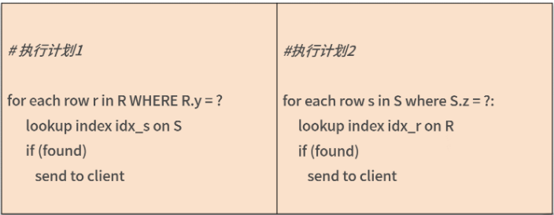

# **L4 查询优化**

# **1 JOIN 连接**


除了单表的 SQL 语句，还有两大类相对复杂的 SQL，多表 JOIN 和子查询语句，这就要在多张表上创建索引，难度相对提升不少。

而很多开发人员下意识地认为 JOIN 会降低 SQL 的性能效率，所以就将一条多表 SQL 拆成单表的一条条查询，但这样反而会影响 SQL 执行的效率。**究其原因，在于开发人员不了解 JOIN 的实现过程。**

###  **1-1 JOIN连接算法**

MySQL 8.0 版本支持两种 JOIN 算法用于表之间的关联： **Nested Loop Join / Hash Join**。

**通常认为，在 OLTP 业务中，因为查询数据量较小、语句相对简单，大多使用索引连接表之间的数据。 这种情况下，优化器大多会用 Nested Loop Join 算法；**

**而 OLAP 业务中的查询数据量较大，关联表的数量非常多，所以用 Hash Join 算法，直接扫描全表效率会更高。**

#### **Nested Loop Join**

在上述算法中，**表 R 被称为驱动表，表 R 中通过 WHERE 条件过滤出的数据会在表 S 对应的索引上进行一一查询**。如果驱动表 R 的数据量不大，上述算法非常高效。

接着，我们看一下，以下三种 JOIN 类型，驱动表各是哪张表：

```
SELECT ... FROM R LEFT JOIN S ON R.x = S.x WEHRE ...

SELECT ... FROM R RIGHT JOIN S ON R.x = S.x WEHRE ...

SELECT ... FROM R INNER JOIN S ON R.x = S.x WEHRE ...
```

* 对于上述 Left Join 来说，**驱动表就是左表 R**；
* Right Join中，**驱动表就是右表 S**。这是 JOIN 类型决定左表或右表的数据一定要进行查询。
* 但对于 INNER JOIN，驱动表可能是表 R，也可能是表 S。


在这种场景下，谁需要查询的数据量越少，谁就是驱动表。 

```
SELECT ... FROM R INNER JOIN S 

ON R.x = S.x 

WHERE R.y = ? AND S.z = ?
```

上面这条 SQL 语句是对表 R 和表 S 进行 INNER JOIN，其中关联的列是 x，WHERE 过滤条件分别过滤表 R 中的列 y 和表 S 中的列 z。那么这种情况下可以有以下两种选择：




优化器一般认为，通过索引进行查询的效率都一样，所以 Nested Loop Join 算法主要要求驱动表的数量要尽可能少。

所以，**如果` WHERE R.y = ?` 过滤出的数据少**，**<mark>那么这条 SQL 语句会先使用表 R 上列 y 上的索引，筛选出数据，然后再使用表 `S` 上列 `x `的索引进行关联，最后再通过 `WHERE S.z = ?` 过滤出最后数据。</mark>**

### **1-2 Hash Join**

MySQL 中的第二种 JOIN 算法是 Hash Join，用于两张表之间连接条件没有索引的情况。

没有连接，那创建索引不就可以了吗？或许可以，但：

* 如果有些列是低选择度的索引，**那么创建索引在导入数据时要对数据排序，影响导入性能**；
* **二级索引会有回表问题，若筛选的数据量比较大，则直接全表扫描会更快**。

对于 OLAP 业务查询来说，Hash Join 是必不可少的功能，MySQL 8.0 版本开始支持 Hash Join 算法，加强了对于 OLAP 业务的支持。

所以，如果你的查询数据量不是特别大，对于查询的响应时间要求为分钟级别，完全可以使用单个实例 MySQL 8.0 来完成大数据的查询工作。

Hash Join会扫描关联的两张表：

* 首先会在扫描驱动表的过程中创建一张哈希表；
* 接着扫描第二张表时，会在哈希表中搜索每条关联的记录，如果找到就返回记录。

**Hash Join 选择驱动表和 Nested Loop Join 算法大致一样，都是较小的表作为驱动表**。如果驱动表比较大，创建的哈希表超过了内存的大小，MySQL 会自动把结果转储到磁盘。

### **1-3 OLTP 业务能不能写 JOIN？**

OLTP 业务是海量并发，要求响应非常及时，在毫秒级别返回结果

如果 OLTP 业务的 JOIN 带有 WHERE 过滤条件，并且是根据主键、索引进行过滤，那么驱动表只有一条或少量记录，这时进行 JOIN 的开销是非常小的。

所以，OLTP 业务完全可以大胆放心地写 JOIN，但是要确保 JOIN 的索引都已添加， DBA 们在业务上线之前一定要做 SQL Review，确保预期内的索引都已创建。

### **1-4 总结**

MySQL 数据库中支持 JOIN 连接的算法有 Nested Loop Join 和 Hash Join 两种，前者通常用于 OLTP 业务，后者用于 OLAP 业务。

在 OLTP 可以写 JOIN，优化器会自动选择最优的执行计划。但若使用 JOIN，要确保 SQL 的执行计划使用了正确的索引以及索引覆盖，因此索引设计显得尤为重要，这也是DBA在架构设计方面的重要工作之一。

## **2 分区表**


* 当前 MySQL 的分区表支持 RANGE、LIST、HASH、KEY、COLUMNS 的分区算法；
* 分区表的创建需要主键包含分区列；
* 在分区表中唯一索引仅在当前分区文件唯一，而不是全局唯一；
* 分区表唯一索引推荐使用类似 UUID 的全局唯一实现；
* 分区表不解决性能问题，如果使用非分区列查询，性能反而会更差；
* 推荐分区表用于数据管理、速度快、日志小。

**分区表并不是用于提升性能的一种手段，它是方便管理数据的一种方式。**