# **L5 高可用架构 - MySQL 复制**

## **1 MySQL 复制架构**

数据库复制本质上就是数据同步。**MySQL 数据库是基于二进制日志（binary log）进行数据增量同步，而二进制日志记录了所有对于 MySQL 数据库的修改操作。**

在默认 ROW 格式二进制日志中，一条 SQL 操作影响的记录会被全部记录下来，**比如一条 SQL语句更新了三行记录，在二进制日志中会记录被修改的这三条记录的前项（before image）和后项（after image）**。

对于 INSERT 或 DELETE 操作，则会记录这条被插入或删除记录所有列的信息，我们来看一个例子：

```
DELETE FROM orders_test 

WHERE o_orderdate = '1997-12-31';

Query OK, 2482 rows affected (0.07 sec)
```

上面这条 SQL 执行的是删除操作，一共删除了有 2482 行记录。可以在 mysql 命令行下使用命令 `SHOW BINLOG EVENTS` 查看某个二进制日志文件的内容，比如上述删除操作发生在二进制日志文件 `binlog.000004` 中，你可以看到

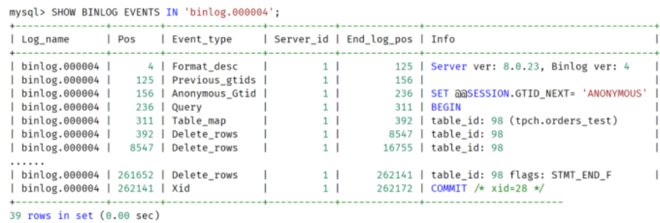

通过 MySQL 数据库自带的命令 mysqlbinlog，可以解析二进制日志，观察到更为详细的每条记录的信息，比如：

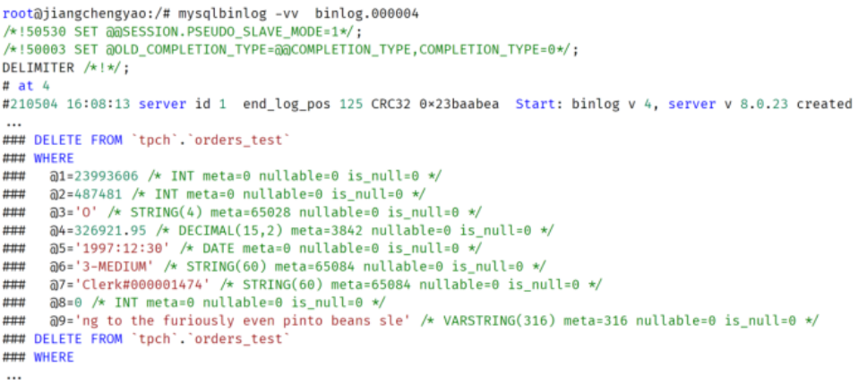

**你可以通过二进制日志记录看到被删除记录的完整信息，还有每个列的属性，比如列的类型，是否允许为 NULL 值等。**

**如果是 UPDATE 操作，二进制日志中还记录了被修改记录完整的前项和后项**，比如：

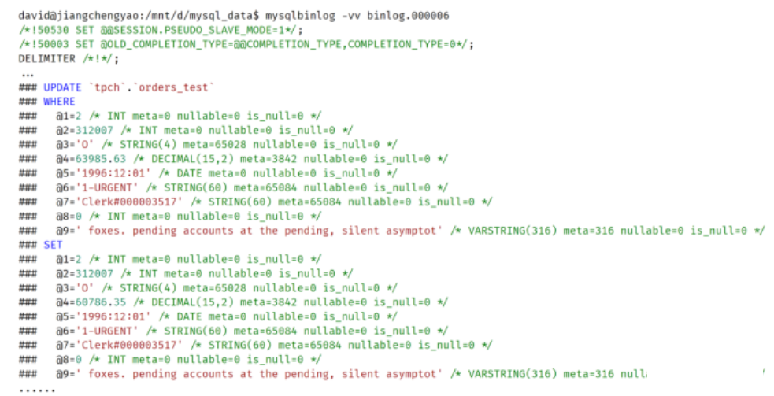

在有二进制日志的基础上，MySQL 数据库就可以通过数据复制技术实现数据同步了。而数据复制的本质就是把一台 MySQL 数据库上的变更同步到另一台 MySQL 数据库上。下面这张图显示了当前 MySQL 数据库的复制架构：

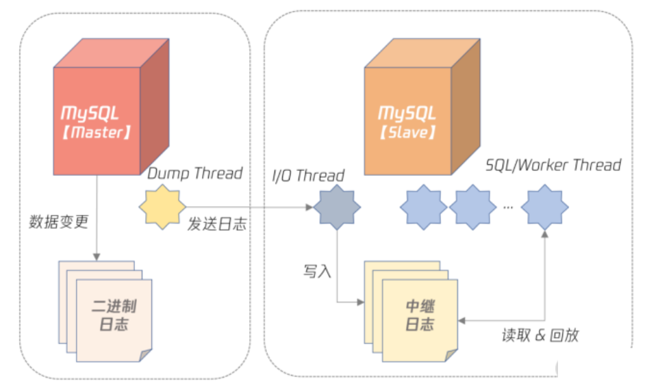

可以看到，在 MySQL 复制中，一台是数据库的角色是 Master（也叫 Primary），剩下的服务器角色是 Slave（也叫 Standby）：

* Master 服务器会把数据变更产生的二进制日志通过 Dump 线程发送给 Slave 服务器；
* Slave 服务器中的 I/O 线程负责接受二进制日志，并保存为中继日志；
* SQL/Worker 线程负责并行执行中继日志，即在 Slave 服务器上回放 Master 产生的日志。


MySQL 的复制相比其他数据库，如 Oracle、PostgreSQL 等，非常灵活，用户可以根据自己的需要构建所需要的复制拓扑结构，比如：

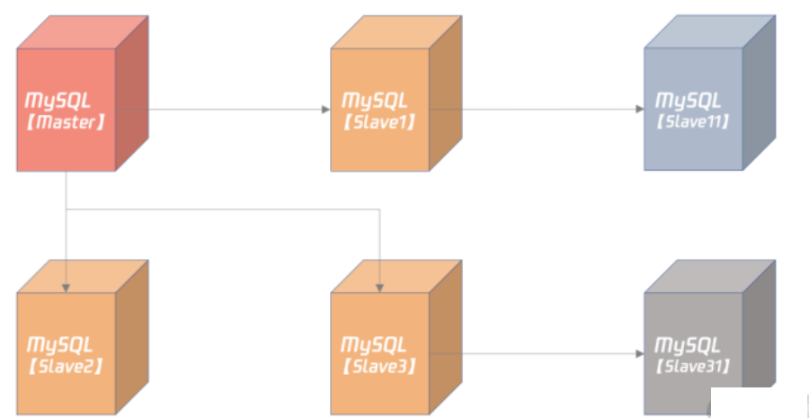

在上图中，Slave1、Slave2、Slave3 都是 Master 的从服务器，而 Slave11 是 Slave1 的从服务器，Slave1 服务器既是 Master 的从机，又是 Slave11 的主机，所以 Slave1 是个级联的从机。同理，Slave3 也是台级联的从机。

### **MySQL 复制配置**

搭建 MySQL 复制实现非常简单，基本步骤如下：

* 创建复制所需的账号和权限；
* 从 Master 服务器拷贝一份数据，可以使用逻辑备份工具 mysqldump、mysqlpump，或物理备份工具 Clone Plugin；
* 通过命令 CHANGE MASTER TO 搭建复制关系；
* 通过命令 SHOW SLAVE STATUS 观察复制状态。

```
gtid_mode = on

enforce_gtid_consistency = 1

binlog_gtid_simple_recovery = 1

relay_log_recovery = ON

master_info_repository = TABLE 

relay_log_info_repository = TABLE
```

上述设置都是用于保证 crash safe，即无论 Master 还是 Slave 宕机，当它们恢复后，连上主机后，主从数据依然一致，不会产生任何不一致的问题


### **MySQL复制类型及应用选项**

**异步复制**

在异步复制（async replication）中，Master 不用关心 Slave 是否接收到二进制日志，所以 Master 与 Slave 没有任何的依赖关系。你可以认为 Master 和 Slave 是分别独自工作的两台服务器，数据最终会通过二进制日志达到一致。

异步复制的性能最好，因为它对数据库本身几乎没有任何开销，除非主从延迟非常大，Dump Thread 需要读取大量二进制日志文件。


**半同步复制**

半同步复制要求 Master 事务提交过程中，至少有 N 个 Slave 接收到二进制日志，这样就能保证当 Master 发生宕机，至少有 N 台 Slave 服务器中的数据是完整的。

半同步复制并不是 MySQL 内置的功能，而是要安装半同步插件，并启用半同步复制功能，设置 N 个 Slave 接受二进制日志成功，比如：

```
plugin-load="rpl_semi_sync_master=semisync_master.so;rpl_semi_sync_slave=semisync_slave.so"

rpl-semi-sync-master-enabled = 1

rpl-semi-sync-slave-enabled = 1

rpl_semi_sync_master_wait_no_slave = 1
```

上面的配置中：

* 第 1 行要求数据库启动时安装半同步插件；
* 第 2、3 行表示分别启用半同步 Master 和半同步 Slave 插件；
* 第 4 行表示半同步复制过程中，提交的事务必须至少有一个 Slave 接收到二进制日志。


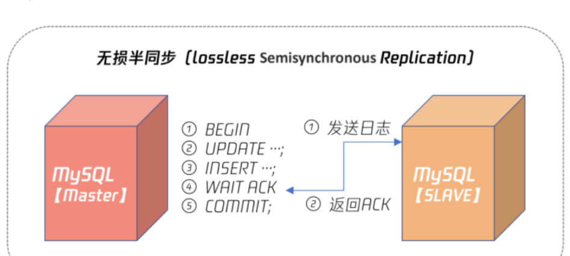


**所以，对于任何有数据一致性要求的业务，如电商的核心订单业务、银行、保险、证券等与资金密切相关的业务，务必使用无损半同步复制。这样数据才是安全的、有保障的、即使发生宕机，从机也有一份完整的数据。**

**多源复制**

无论是异步复制还是半同步复制，都是 1 个 Master 对应 N 个 Slave。其实 MySQL 也支持 N 个 Master 对应 1 个 Slave，这种架构就称之为多源复制。

多源复制允许在不同 MySQL 实例上的数据同步到 1 台 MySQL 实例上，方便在 1 台 Slave 服务器上进行一些统计查询，如常见的 OLAP 业务查询。

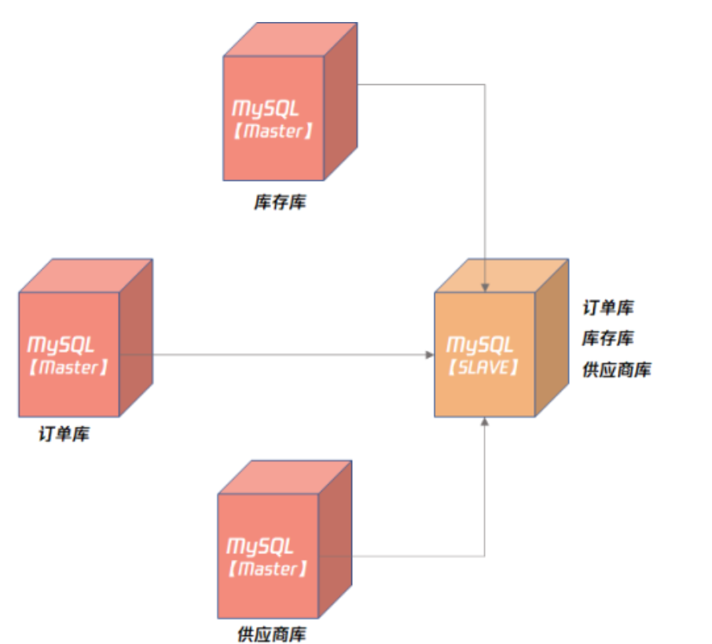

**延迟复制**

复制架构，Slave 在接收二进制日志后会尽可能快地回放日志，这样是为了避免主从之间出现延迟。而延迟复制却允许Slave 延迟回放接收到的二进制日志，为了避免主服务器上的误操作，马上又同步到了从服务器，导致数据完全丢失。

我们可以通过以下命令设置延迟复制：

```
CHANGE MASTER TO master_delay = 3600
```

这样就人为设置了 Slave 落后 Master 服务器1个小时。

那么当线上发生误操作，如 DROP TABLE、DROP DATABASE 这样灾难性的命令时，用户有一个 24 小时前的快照，数据可以快速恢复。

### **总结**


* 二进制日志记录了所有对于 MySQL 变更的操作；
* 可以通过命令 `SHOW BINLOG EVENTS IN ... FROM ... `查看二进制日志的基本信息；
* 可以通过工具 mysqlbinlog 查看二进制日志的详细内容；
* **复制搭建虽然简单，但别忘记配置 crash safe 相关参数，否则可能导致主从数据不一致**；
* 异步复制用于非核心业务场景，不要求数据一致性；
* 无损半同步复制用于核心业务场景，如银行、保险、证券等核心业务，需要严格保障数据一致性；
* 多源复制可将多个 Master 数据汇总到一个数据库示例进行分析；
* 延迟复制主要用于误操作防范，金融行业要特别考虑这样的场景。

## **2 高可用设计**

### **2-1 高可用概念**

> High availability (HA) is a characteristic of a system which aims to ensure an agreed level of operational performance, usually uptime, for a higher than normal period.


高可用（High Availability）**是系统所能提供无故障服务的一种能力**。 简单地说就是避免因服务器宕机而造成的服务不可用。

通常来说，系统至少要达到 4 个 9（99.99%），也就是每年宕机时间不超过 52.56 分钟，否则用户体验会非常差，感觉系统不稳定。

`99.99% = 1 - 52.56 / (365*24*60)`

不过 4 个 9 宕机 52 分钟对于生产环境的影响还是比较大，但是 5 个 9 对大部分系统来说要求又太高。所以一些云服务商会提出一个 99.995% 的可用性概念，那么系统一年的不可用时长为：

`不可用时长 = (1 - 99.995%)*365*24*60 = 26.28 (分钟)`

即一年最多的影响服务的时间为 26.28 分钟。

### **2-2 高可用架构设计**

系统要达到高可用，一定要做好软硬件的冗余，消除单点故障（SPOF single point of failure）。


冗余是高可用的基础，通常认为，系统投入硬件资源越多，冗余也就越多，系统可用性也就越高。

除了做好冗余，系统还要做好故障转移（Failover）的处理。也就是在最短的时间内发现故障，然后把业务切换到冗余的资源上。

**无状态服务高可用设计、数据库高可用架构设计。**

### **2-2 无状态服务高可用设计**

无状态的服务（如 Nginx ）高可用设计非常简单，发现问题直接转移就行，甚至可以通过负载均衡服务，当发现有问题，直接剔除：

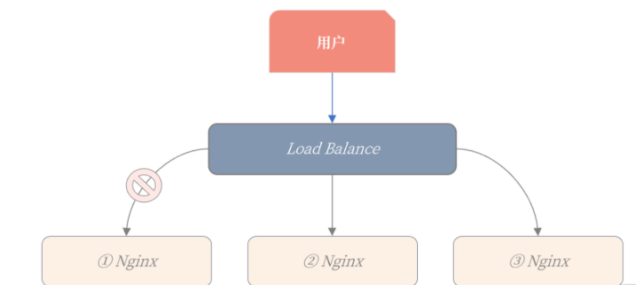


第一台 Ningx 服务器出现问题，导致服务不可用，Load Balance 负载均衡服务发现后，就可以直接把它剔除。

### **2-3 数据库高可用架构设计**

* 数据持久化在数据库中，是有状态的服务；
* 数据库的容量比较大，Failover 的时间相对无状态服务会更多；
* 一些系统，如金融场景的数据库，会要求数据完全不能丢失，这又增加了高可用实现的难度。

其实从架构角度看，数据库高可用本身也是业务高可用，所以我们要从业务全流程的角度出发，思考数据库的高可用设计。


**基于数据层的数据库高可用架构**

基于数据层的数据库高可用架构，就是基于数据同步技术。当主服务器 Master 发生宕机，则故障转移到从服务器 Slave。

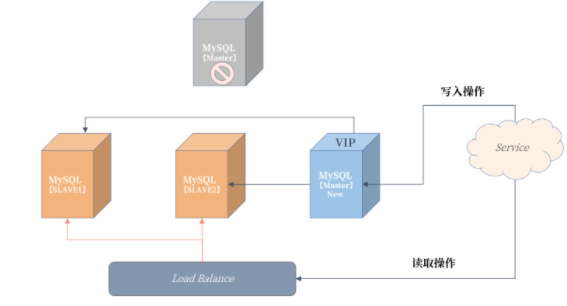

可以发现，我们原先的 Slave3 从服务器提升为了新主机，然后建立了新的复制拓扑架构，Slave2、Slave3 都连到新 Master 进行数据同步。

为了在故障转移后对 Service 服务无感知，所以需要引入 VIP（Virtual IP）虚拟 IP 技术，当发生宕机时，VIP 也需要漂移到新的主服务器。

那么这个架构的真正难点在于：

* 如何保障数据一致性；
* 如何发现主服务器宕机；
* 故障转移逻辑的处理；

**基于业务层的数据库高可用架构**

当一台数据库主服务器不可用，业务直接写另一台数据库主服务器就可以了。我们来看一下这个架构：

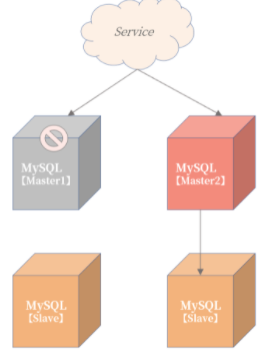

从上图可以看到，Service 服务写入 Master1 主服务器失败后，不用等待故障转移程序启用主从切换，而是直接把数据写入 Master2 主服务器。

这看似是一种非常简单、粗暴的高可用架构实现方式，但能符合这样设计的业务却并不多，**因为该设计前提是状态可修改。**

但这样设计的前提是整个服务的写入主键是可以进行跳单设计，且查询全部依赖主键进行搜索。

**融合的高可用架构设计**

一种业务和数据层相结合的高可用设计。这个架构可以解决宕机后，查询服务受限的问题。

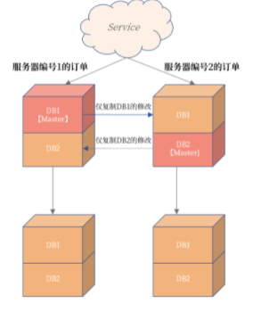

将不同编号的订单根据不同的数据库进行存放，比如服务器编号为 1 的订单存放在数据库 DB1 中，服务器编号为 2 的订单存放在数据库 DB2 中。

此外，这里也用到了 MySQL 复制中的部分复制技术，即左上角的主服务器仅将 DB1 中的数据同步到右上角的服务器。同理，右上角的主服务器仅将 DB2 中的数据同步到左上角的服务器。下面的两台从服务器不变，依然从原来的 MySQL 实例中同步数据。

这样做得好处是：

* 在常态情况下，上面两台 MySQL 数据库是双活的，都可以有数据的写入，业务的性能得到极大提升。
* 订单数据是完整的，服务器编号为 1 和 2 的数据都在一个 MySQL 实例上。
* 更重要的是，这样当发生宕机时，Service 服务的写入不受到影响，写入服务器编号为 1 的订单通过跳单设计写入 DB2。
* 同时，对于订单读取也不会受到影响，因为数据都是一个实例上，如：

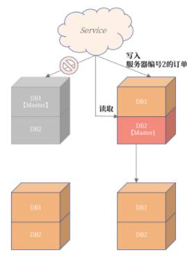

### **2-4 总结**

* 高可用是系统所能提供无故障服务的一种能力，度量单位是几个 9；
* 线上系统高可用目标应不低于 99.995%，否则系统频繁宕机，用户体验不好；
* 高可用实现基础是：冗余 + 故障转移；
* 无状态服务的高可用设计较为简单，直接故障转移或剔除就行；
* 数据库作为有状态的服务，设计比较复杂（冗余通过复制技术实现，故障转移需要对应的高可用套件）；
* 数据库高可用有三大架构设计，请务必牢记这几种设计。

## **3 读写分离设计**

逻辑日志的优缺点

 MySQL 复制基于的二进制日志是一种逻辑日志，其写入的是每个事务中已变更的每条记录的前项、后项。

**事务不能太大，否则会导致二进制日志非常大，一个大事务的提交会非常慢。**

假设有个 DELETE 删除操作，删除当月数据，由于数据量可能有 1 亿条记录，可能会产生 100G 的二进制日志，则这条 SQL 在提交时需要等待 100G 的二进制日志写入磁盘，如果二进制日志磁盘每秒写入速度为 100M/秒，至少要等待 1000 秒才能完成这个事务的提交。

所以在 MySQL 中，你一定要对大事务特别对待

* 设计时，把 DELETE 删除操作转化为 DROP TABLE/PARTITION 操作；
* 业务设计时，把大事务拆成小事务。

对于第一点（把 DELETE 删除操作转化为 DROP TABLE/PARTITION 操作），主要是在设计时把流水或日志类的表按时间分表或者分区，这样在删除时，二进制日志内容就是一条 DROP TABLE/PARITION 的 SQL，写入速度就非常快了。

而第二点（把大事务拆分成小事务）也能控制二进制日志的大小。比如对于前面的 DELETE 操作，如果设计时没有分表或分区，那么你可以进行如下面的小事务拆分：

```
DELETE FROM ...

WHEREE time between ... and ...

LIMIT 1000;
```

上面的 SQL 就是把一个大的 DELETE 操作拆分成了每次删除 1000 条记录的小操作。而小事务的另一个优势是：可以进行多线程的并发操作，进一步提升删除效率。

**<mark>MySQL 数据库中，大事务除了会导致提交速度变慢，还会导致主从复制延迟。</mark>**

### **3-1 主从复制延迟优化**

要彻底避免 MySQL 主从复制延迟，数据库版本至少要升级到 5.7

MySQL 的从机并行复制有两种模式。

* **COMMIT ORDER**： 主机怎么并行，从机就怎么并行。
* **WRITESET**： 基于每个事务，只要事务更新的记录不冲突，就可以并行。

而 WRITESET 模式是基于每个事务并行，如果事务间更新的记录不冲突，就可以并行。还是以“单线程每次插入 1000 条记录”为例，**如果插入的记录没有冲突，比如唯一索引冲突，那么虽然主机是单线程，但从机可以是多线程并行回放**

所以在 WRITESET 模式下，主从复制几乎没有延迟。那么要启用 WRITESET 复制模式，你需要做这样的配置：

```
binlog_transaction_dependency_tracking = WRITESET

transaction_write_set_extraction = XXHASH64

slave-parallel-type = LOGICAL_CLOCK

slave-parallel-workers = 16
```

因为主从复制延迟会影响到后续高可用的切换，以及读写分离的架构设计，所以在真实的业务中，你要对主从复制延迟进行监控。

### **3-2 主从复制延迟监控**

**`Seconds_Behind_Master`**

SHOW SLAVE STATUS，其中的 `Seconds_Behind_Master` 可以查看复制延迟，如：


**`Seconds_Behind_Master` 不准确！用于严格判断主从延迟的问题并不合适**


* 它计算规则是（当前回放二进制时间 - 二进制日志中的时间），如果 I/O 线程有延迟，那么 `Second_Behind_Master ` 为 0，这时可能已经落后非常多了，例如存在有大事务的情况下；
* 对于级联复制，最下游的从服务器延迟是不准确的，因为它只表示和上一级主服务器之间的延迟；
* 若主从时区不一样，那么 second_behind_master 也不准确；

### **3-3 心跳表**

想要实时准确地监控主从复制延迟，可以在主服务器上引入一张心跳表 heartbeat，用于定期更新时间（比如每 3 秒一次）。于主从复制机制，主机上写入的时间会被复制到从机，这时对于主从复制延迟的判断可以根据如下规则：

```
主从延迟 = 从机当前时间 - 表 heartbeat 中的时间
```

表 heartbeat 和定期更新时间可以根据类似的设计：

```
USE DBA;

CREATE TABLE heartbeat (

  server-uuid VARCHAR(36) PRIMARY KEY,

  ts TIMESTAMP(6) NOT NULL

);

REPLACE INTO heartbeat(@@server_uuid, NOW())
```

我们创建了DBA库，以及库下的一张表 heartbeat，用于记录当前时间。

REPLACE 语句用于定期更新当前时间，并存入到表 heartbeat，表 heartbeat 在正常运行情况下只有一条记录。定期执行 REPLACE 语句可以使用定期的脚本调度程序，也可以使用 MySQL自带的事件调度器（event scheduler），如：

```
CREATE EVENT e_heartbeat

ON SCHEDULE

    EVERY 3 SECOND

DO

BEGIN

    REPLACE INTO DBA.heartbeat VALUES (@@server_uuid,NOW())

END
```

### **3-4 读写分离设计**

读写分离设计是指：**把对数据库的读写请求分布到不同的数据库服务器上**。对于写入操作只能请求主服务器，而对读取操作则可以将读取请求分布到不同的从服务器上。

这样能有效降低主服务器的负载，提升从服务器资源利用率，从而进一步提升整体业务的性能。下面这张图显示了一种常见的业务读写分离的架构设计：


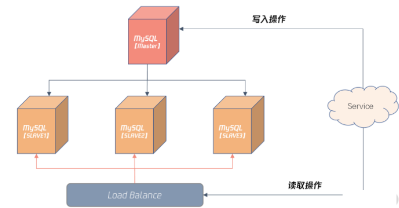

上图引入了 Load Balance 负载均衡的组件，这样 Server 对于数据库的请求不用关心后面有多少个从机，对于业务来说也就是透明的，只需访问 Load Balance 服务器的 IP 或域名就可以。

通过配置 Load Balance 服务，还能将读取请求平均或按照权重平均分布到不同的从服务器。这可以根据架构的需要做灵活的设计。

**<mark>读写分离设计的前提是从机不能落后主机很多，最好是能准实时数据同步，务必一定要开始并行复制，并确保线上已经将大事务拆成小事务。</mark>**

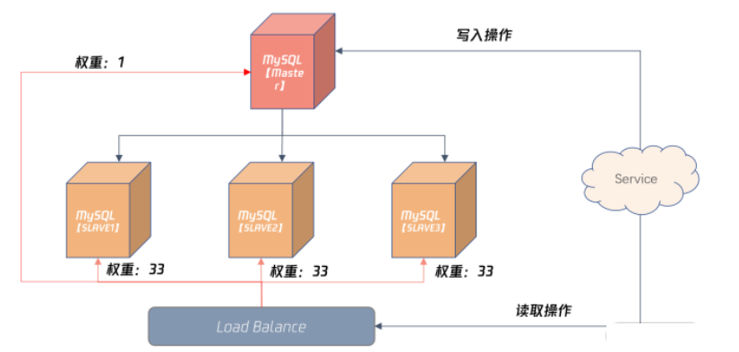

在 Load Balance 服务器，可以配置较小比例的读取请求访问主机，如上图所示的 1%，其余三台从服务器各自承担 33% 的读取请求。

### **3-5 总结**

基于主从复制机制搭建一个读写分离架构，总的来说：

* MySQL 二进制日志是一种逻辑日志，便于将数据同步到异构的数据平台；
* 逻辑日志在事务提交时才写入，若存在大事务，则提交速度很慢，也会影响主从数据之间的同步；
* **在 MySQL 中务必将大事务拆分成小事务处理，这样才能避免主从数据延迟的问题；**
* 通过配置 MTS 并行复制机制，可以进一步缩短主从数据延迟的问题，推荐使用 MySQL 5.7版本，并配置成基于 WRITESET 的复制；
* **主从复制延迟监控不能依赖 `Seconds_Behind_Master` 的值，最好的方法是额外配置一张心跳表；**
* **读写分离是一种架构上非常常见的方法，你一定要掌握，并做好读写分离架构失效情况下的兜底设计**。