# **L6 MySQL高可用架构**

## **1 金融级高可用架构 - 数据核对**

也就是当服务器因为各种原因，发生宕机，导致MySQL 数据库不可用之后，快速恢复业务。但对有状态的数据库服务来说，在一些核心业务系统中，比如电商、金融等，还要保证数据一致性。

任何灾难场景下，**一条数据都不允许丢失**（一般也把这种数据复制方式叫作“强同步”）。

### **1-1 复制类型的选择**

银行、保险、证券等核心业务，需要严格保障数据一致性。**那么要想实现数据的强同步，在进行复制的配置时，就要使用无损半同步复制模式。**

在 MySQL 内部就是要把参数 `rpl_semi_sync_master_wait_point` 设置成 `AFTER_SYNC` 。

但是在高可用设计时，当数据库 FAILOVER 完后，有时还要对原来的主机做额外的操作，这样才能保证主从数据的完全一致性。

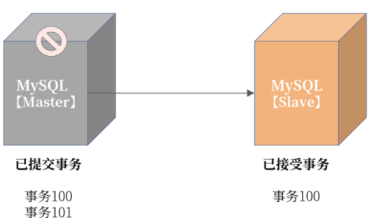

即使启用无损半同步复制，依然存在当发生主机宕机时，最后一组事务没有上传到从机的可能。图中宕机的主机已经提交事务到 101，但是从机只接收到事务 100。如果这个时候 Failover，从机提升为主机，那么这时：

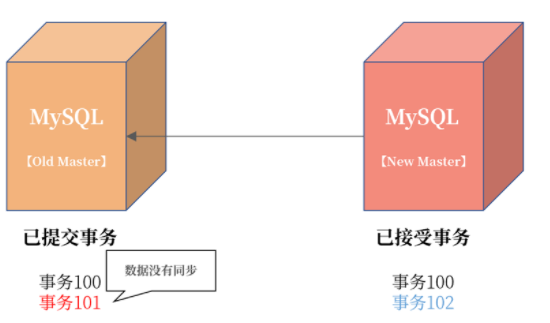

可以看到当主从切换完成后，新的 MySQL 开始写入新的事务102，如果这时老的主服务器从宕机中恢复，则这时事务 101 不会同步到新主服务器，导致主从数据不一致。

**但设置 `AFTER_SYNC` 无损半同步的好处是**，虽然事务 101 在原主机已经提交，但是在从机没有收到并返回 ACK 前，这个事务对用户是不可见的，所以，用户感受不到事务已经提交了。

### **1-2 容灾级别**

高可用用于处理各种宕机问题，而宕机可以分成服务器宕机、机房级宕机，甚至是一个城市发生宕机。


* 机房级宕机： 机房光纤不通/被挖断，机房整体掉电（双路备用电源也不可用）；
* 城市级宕机： 一般指整个城市的进出口网络，骨干交换机发生的故障（这种情况发生的概率很小）。

如果综合考虑的话，高可用就成了一种容灾处理机制，对应的高可用架构的评判标准就上升了。

* 机房内容灾： 机房内某台数据库服务器不可用，切换到同机房的数据库实例，保障业务连续性；
* 同城容灾： 机房不可用，切换到同城机房的数据库实例，保障业务连续性；
* 跨城容灾： 单个城市机房都不可用，切换到跨城机房的数据库实例，保障业务连续性。

### **1-3 兜底策略：数据核对**

除了高可用的容灾架构设计，我们还要做一层兜底服务，用于判断数据的一致性。这里要引入数据核对，用来解决以下两方面的问题。

* **数据在业务逻辑上一致**： 这个保障业务是对的；
* **主从服务器之间的数据一致**： 这个保障从服务器的数据是安全的、可切的。


业务逻辑核对由业务的同学负责编写

**主从服务器之间的核对，是由数据库团队负责的。**

要额外写一个主从核对服务，用于保障主从数据的一致性。这个核对不依赖复制本身，也是一种逻辑核对。思路是：将最近一段时间内主服务器上变更过的记录与从服务器核对，从逻辑上验证是否一致。其实现如图所示：

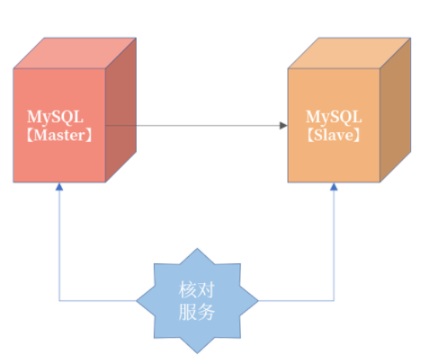


* 表结构设计规范中，有讲过每张表有一个 `last_modify_date`，用于记录每条记录的最后修改时间，按照这个条件过滤就能查出最近更新的记录，然后每条记录比较即可。
* 核对服务扫描最近的二进制日志，筛选出最近更新过记录的表和主键，然后核对数据。这种的实现难度会更大一些，但是不要求在数据库上进行查询

如果在核对过程中，记录又在主上发生了变化，但是还没有同步到从机，我们可以加入复核逻辑，按理来说多复核几次，主从数据应该就一致了。如果复核多次不一致，那么大概率，主从数据就已经是不一致的了。

### **1-4 总结**

* 核心业务复制务必设置为无损半同步复制；
* 同城容灾使用三园区架构，一地三中心，或者两地三中心，机房见网络延迟不超过 5ms；
* 跨城容灾使用“三地五中心”，跨城机房距离超过 200KM，延迟超过 25ms；
* 跨城容灾架构由于网络耗时高，因此一般仅用于读多写少的业务，例如用户中心；
* 除了复制进行数据同步外，还需要额外的核对程序进行逻辑核对；
* 数据库层的逻辑核对，可以使用 `last_modify_date` 字段，取出最近修改的记录。


## **2 高可用套件**

但是当数据库发生宕机时，MySQL 的主从复制并不会自动地切换，这需要高可用套件对数据库主从进行管理。

### **2-1 高可用套件**

MySQL 的高可用套件用于负责数据库的 Failover 操作，也就是当数据库发生宕机时，MySQL 可以剔除原有主机，选出新的主机，然后对外提供服务，保证业务的连续性。

可以看到，MySQL 复制是高可用的技术基础，用于将数据实时同步到从机。高可用套件是MySQL 高可用实现的解决方案，负责切换新主机。

为了不让业务感知到数据库的宕机切换，这里要用到 VIP（Virtual IP）技术。其中，VIP 不是真实的物理 IP，而是可以随意绑定在任何一台服务器上。

**业务访问数据库，不是服务器上与网卡绑定的物理 IP，而是这台服务器上的 VIP。**

当数据库服务器发生宕机时，高可用套件会把 VIP 插拔到新的服务器上。**数据库 Failover后，业务依旧访问的还是 VIP，所以使用 VIP 可以做到对业务透明**。

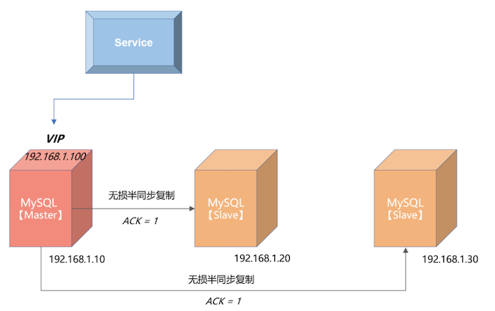

从上图可以看到，MySQL 的主服务器的 IP 地址是 192.168.1.10，两个从服务器的 IP 地址分别为 192.168.1.20、192.168.1.30。

**上层服务访问数据库并没有直接通过物理 IP 192.168.1.10，而是访问 VIP**，地址为192.168.1.100。这时，如果 MySQL 数据库主服务器发生宕机，会进行如下的处理：

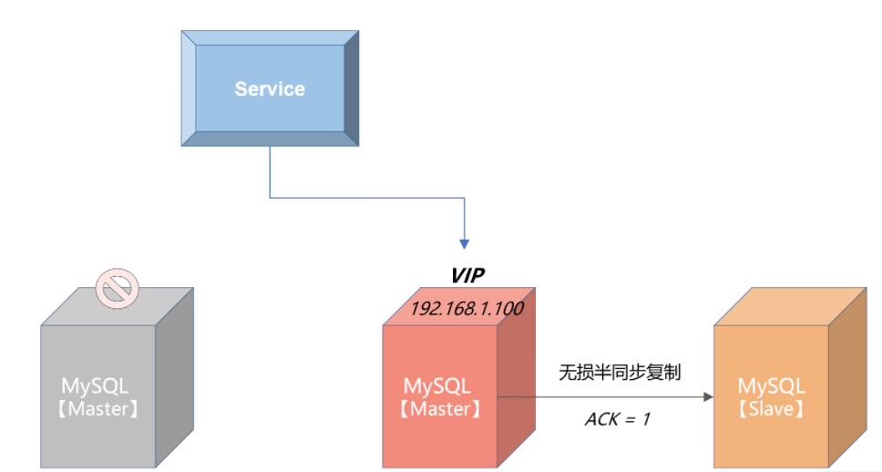

我们可以看到，当发生 Failover 后，由于上层服务访问的是 VIP 192.168.1.100，所以切换对服务来说是透明的，只是在切换过程中，服务会收到连接数据库失败的提示。但是通过重试机制，当下层数据库完成切换后，服务就可以继续使用了。

所以，上层服务一定要做好错误重试的逻辑，否则就算启用 VIP，也无法实现透明的切换。

业界 MySQL 常见的几款高可用套件。

### **2-2 MHA**

MHA(Master High Availability)是一款开源的 MySQL 高可用程序，它为 MySQL 数据库主从复制架构提供了 automating master failover 的功能。

MHA 是由业界大名鼎鼎的 Facebook 工程师 Yoshinorim 开发，开源地址为：[https://github.com/yoshinorim/mha4mysql-manager](https://github.com/yoshinorim/mha4mysql-manager)它由两大组件所组成，MHA Manger 和 MHA Node。


MHA Manager 通常部署在一台服务器上，用来判断多个 MySQL 高可用组是否可用。当发现有主服务器发生宕机，就发起 failover 操作。MHA Manger 可以看作是 failover 的总控服务器。

而 MHA Node 部署在每台 MySQL 服务器上，MHA Manager 通过执行 Node 节点的脚本完成failover 切换操作。

**MHA Manager 和 MHA Node 的通信是采用 ssh 的方式，也就是需要在生产环境中打通 MHA Manager 到所有 MySQL 节点的 ssh 策略，那么这里就存在潜在的安全风险。**

另外，ssh 通信，效率也不是特别高。所以，MHA 比较适合用于规模不是特别大的公司，所有MySQL 数据库的服务器数量不超过 20 台。

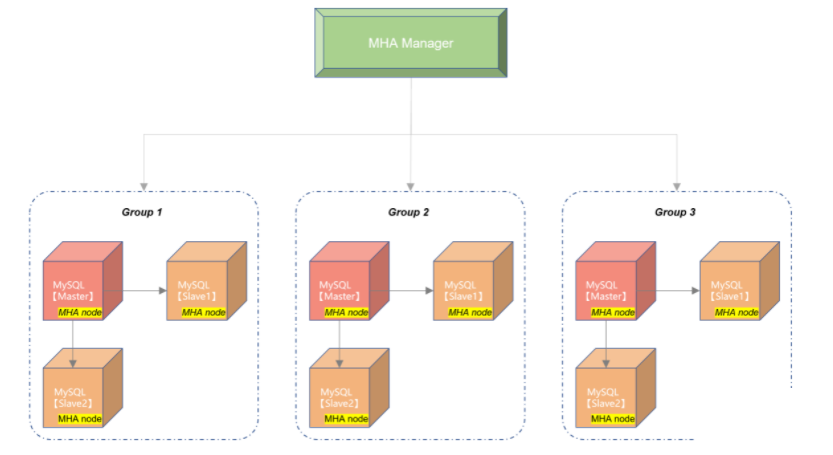

### **2-3 Orchestrator**

Orchestrator 是另一款开源的 MySQL 高可用套件，除了支持 failover 的切换，还可通过Orchestrator 完成 MySQL 数据库的一些简单的复制管理操作。Orchestrator 的开源地址为：[https://github.com/openark/orchestrator](https://github.com/openark/orchestrator)

你可以把 Orchestrator 当成 MHA 的升级版，而且提供了 HTTP 接口来进行相关数据库的操作，比起 MHA 需要每次登录 MHA Manager 服务器来说，方便很多。

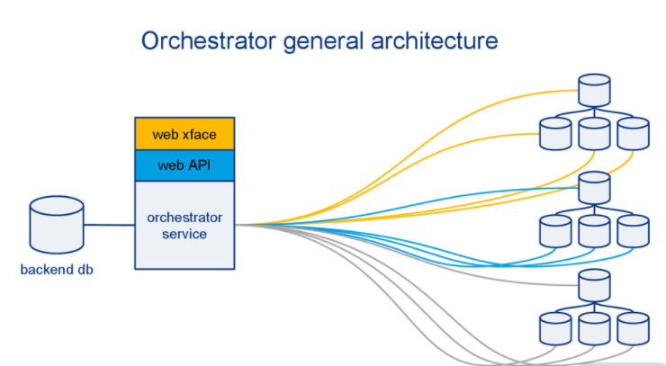

其基本实现原理与 MHA 是一样的，只是把元数据信息存储在了元数据库中，并且提供了HTTP 接口和命令的访问方式，使用上更为友好。

但是由于管控节点到下面的 MySQL 数据库的管理依然是 ssh 的方式，依然存在 MHA 一样的短板问题，总的来说，关于 Orchestrator 我想提醒你，依然只建议使用在较小规模的数据库集群。

## **3 InnoDB Cluster**

不过，MySQL 复制只是一种数据同步技术，如果要完成数据库的高可用解决方案，还要额外依赖外部的组件，比如 MHA、Orchestrator、数据库管理平台等。

数据库复制技术的瓶颈在于：只能在一个节点完成写入，然后再将日志同步各个节点，这样单点写入会导致数据库性能无法进行扩展。

### **3-1 MGR技术**

MGR 是官方在 MySQL 5.7 版本推出的一种基于状态机的数据同步机制。与半同步插件类似，MGR 是通过插件的方式启用或禁用此功能。

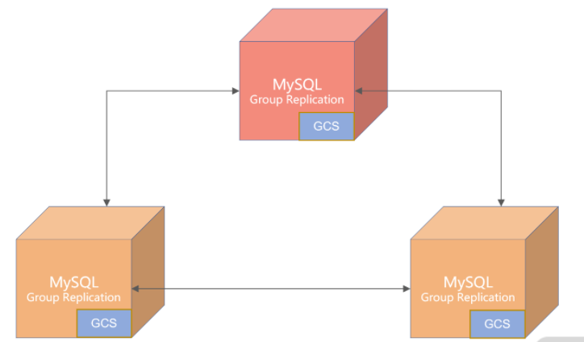

**MGR 复制结构图**

注意，我们谈及 MGR，不要简单认为它是一种新的数据同步技术，而是应该把它理解为高可用解决方案，而且特别适合应用于对于数据一致性要求极高的金融级业务场景。

首先，MGR 之间的数据同步并没有采用复制技术，而是采用 GCS（Group Communication System）协议的日志同步技术。

是的，虽然通过无损半同步复制也能保证主从数据的一致性，但通过 GCS 进行数据同步有着更好的性能：**当启用 MGR 插件时，MySQL 会新开启一个端口用于数据的同步，而不是如复制一样使用MySQL 服务端口，这样会大大提升复制的效率**。

其次，MGR 有两种模式：

* 单主（Single Primary）模式；
* 多主（Multi Primary）模式。

单主模式只有 1 个节点可以写入，多主模式能让每个节点都可以写入。而多个节点之间写入，如果存在变更同一行的冲突，MySQL 会自动回滚其中一个事务，自动保证数据在多个节点之间的完整性和一致性。

**最后，在单主模式下，MGR 可以自动进行 Failover 切换，不用依赖外部的各种高可用套件，所有的事情都由数据库自己完成，比如最复杂的选主（Primary Election）逻辑，都是由 MGR 自己完成，用户不用部署额外的 Agent 等组件。**

**说了这么多 MGR 的优势，那么它有没有缺点或限制呢**？ 当然有，主要是这样几点：

* **仅支持 InnoDB 表，并且每张表一定要有一个主键**；
* 目前一个 MGR 集群，最多只支持 9 个节点；
* 有一个节点网络出现抖动或不稳定，会影响集群的性能。


### **3-2 多主模式的注意事项**

**冲突检测**

多主模式要求每个事务在本节点提交时，还要去验证其他节点是否有同样的记录也正在被修改。如果有的话，其中一个事务要被回滚。

比如两个节点同时执行下面的 SQL 语句：

```
-- 节点1

UPDATE User set money = money - 100 WHERE id = 1;

-- 节点2

UPDATE User set money = money + 300 WHERE id = 1;
```

如果一开始用户的余额为 200，当节点 1 执行 SQL 后，用户余额变为 100，当节点 2 执行SQL，用户余额变味了 500，这样就导致了节点数据的不同。

**所以 MGR 多主模式会在事务提交时，进行行记录冲突检测，发现冲突，就会对事务进行回滚。**

在上面的例子中，若节点 2 上的事务先提交，则节点 1 提交时会失败，事务会进行回滚。

所以，如果要发挥多主模式的优势，就要避免写入时有冲突。**<mark>最好的做法是：每个节点写各自的数据库，比如节点 1 写 DB1，节点 2 写 DB2，节点 3 写 DB3，这样集群的写入性能就能线性提升了。</mark>**

**自增处理**

在多主模式下，自增的逻辑发生了很大的变化。简单来说，自增不再连续自增。

因为，如果连续自增，这要求每次写入时要等待自增值在多个节点中的分配，这样性能会大幅下降，所以 MGR 多主模式下，我们可以通过设置自增起始值和步长来解决自增的性能问题。看下面的参数：

`group_replication_auto_increment_increment = 7`

参数 `group_replication_auto_increment_increment` 默认为 7，自增起始值就是 server-id。


假设 MGR 有 3 个节点 Node1、Node2、Node3，对应的 server-id 分别是 1、2、3, 如果这时多主插入自增的顺序为 Node1、Node1、Node2、Node3、Node1，则自增值产生的结果为：

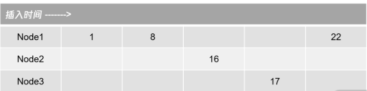

可以看到，由于是多主模式，允许多个节点并发的产生自增值。所以自增的产生结果为1、8、16、17、22，自增值不一定是严格连续的，而仅仅是单调递增的，这与单实例 MySQL 有着很大的不同。

**对于核心业务表，还是使用有序 UUID 的方式更为可靠，性能也会更好。**

### **3-3 InnoDB Cluster**

MGR 是基于 Paxos 算法的数据同步机制，将数据库状态和日志通过 Paxos 算法同步到各个节点，但如果要实现一个完整的数据库高可用解决方案，就需要更高一层级的 InnoDB Cluster 完成。

一个 InnoDB Cluster 由三个组件组成：MGR 集群、MySQL Shell、MySQL Router。具体如下图所示：

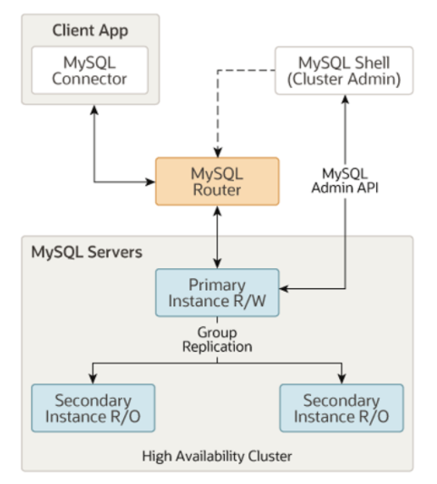

其中，MySQL Shell 用来管理 MGR 集群的创建、变更等操作。以后我们最好不要手动去管理 MGR 集群，而是通过 MySQL Shell 封装的各种接口完成 MGR 的各种操作。如：

```
mysql-js> cluster.status()

{

    "clusterName": "myCluster", 

    "defaultReplicaSet": {

        "name": "default", 

        "primary": "ic-2:3306", 

        "ssl": "REQUIRED", 

        "status": "OK", 

        "statusText": "Cluster is ONLINE and can tolerate up to ONE failure.", 

        "topology": {

            "ic-1:3306": {

                "address": "ic-1:3306", 

                "mode": "R/O", 

                "readReplicas": {}, 

                "role": "HA", 

                "status": "ONLINE"

            }, 

            "ic-2:3306": {

                "address": "ic-2:3306", 

                "mode": "R/W", 

                "readReplicas": {}, 

                "role": "HA", 

                "status": "ONLINE"

            }, 

            "ic-3:3306": {

                "address": "ic-3:3306", 

                "mode": "R/O", 

                "readReplicas": {}, 

                "role": "HA", 

                "status": "ONLINE"

            }

        }

    }, 

    "groupInformationSourceMember": "mysql://root@localhost:6446"

}
```

MySQL Router 是一个轻量级的代理，用于业务访问 MGR 集群中的数据，当 MGR 发生切换时（这里指 Single Primary 模式），自动路由到新的 MGR 主节点，这样业务就不用感知下层MGR 数据的切换。

为了减少引入 MySQL Router 带来的性能影响，官方建议 MySQL Router 与客户端程序部署在一起，以一种类似 sidecar 的方式进行物理部署。这样能减少额外一次额外的网络开销，基本消除引入 MySQL Router 带来的影响。

所以，这里 MySQL Router 的定位是一种轻量级的路由转发，而不是一个数据库中间件，主要解决数据库切换后，做到对业务无感知。

### **3-4 总结**

InnoDB Cluster。这种高可用解决方案大概率会成为下一代金融场景的标准数据库高可用解决方案，InnoDB Cluster 底层是 MGR，通过类 Paoxs 算法进行数据同步，性能更好，且能保证数据的完整性。

结合管理工具 MySQL Shell，路由工具 MySQL Router 能构建一个完整的 MySQL 高可用解决方案。

**对于金融用户来说，我非常推荐这种高可用解决方案。当然，我建议在最新的 MySQL 8.0 版本中使用 InnoDB Cluster。**

## **4 数据库备份**

### **4-1 数据库备份**

复制技术（Replication）或 InnoDB Cluster 只负责业务的可用性，保障数据安全除了线上的副本数据库，**我们还要构建一个完整的离线备份体系**。这样即使线上数据库被全部破坏，用户也可以从离线备份恢复出数据。


第一步要做好：**线上数据库与离线备份系统的权限隔离。**

而对于 MySQL 数据库来说，数据库备份分为全量备份、增量备份。

**全量备份**

指备份当前时间点数据库中的所有数据，根据备份内容的不同，**全量备份可以分为逻辑备份、物理备份两种方式。**

**逻辑备份**

指备份数据库的逻辑内容，就是每张表中的内容通过 INSERT 语句的形式进行备份。

**MySQL 官方提供的逻辑备份工具有 mysqldump 和 mysqlpump**。通过 mysqldump 进行备份，可以使用以下 SQL 语句：

```
mysqldump -A --single-transaction > backup.sql
```

上面的命令就是通过 mysqldump 进行全量的逻辑备份：

* 参数 `-A` 表示备份所有数据库；
* 参数 `--single-transaction` 表示进行一致性的备份。

参数 `--single-transaction` 是必须加的参数，否则备份文件的内容不一致，这样的备份几乎没有意义。

如果你总忘记参数 `--single-transaction`，可以在 MySQL 的配置文件中加上如下提示：

```
# my.cnf 

[mysqldump]

single-transaction
```

按上面配置，每当在服务器上运行命令时 mysqldump 就会自动加上参数 `--single-transaction`，你也就不会再忘记了。

在上面的命令中，最终的备份文件名为 `backup.sql`，打开这个文件，我们会看到类似的内容：

```
-- MySQL dump 10.13  Distrib 8.0.23, for Linux (x86_64)

--

-- Host: localhost    Database:

-- ------------------------------------------------------

-- Server version       8.0.23

/*!40101 SET @OLD_CHARACTER_SET_CLIENT=@@CHARACTER_SET_CLIENT */;

/*!40101 SET @OLD_CHARACTER_SET_RESULTS=@@CHARACTER_SET_RESULTS */;

/*!40101 SET @OLD_COLLATION_CONNECTION=@@COLLATION_CONNECTION */;

/*!50503 SET NAMES utf8mb4 */;

/*!40103 SET @OLD_TIME_ZONE=@@TIME_ZONE */;

/*!40103 SET TIME_ZONE='+00:00' */;

/*!50606 SET @OLD_INNODB_STATS_AUTO_RECALC=@@INNODB_STATS_AUTO_RECALC */;

/*!50606 SET GLOBAL INNODB_STATS_AUTO_RECALC=OFF */;

/*!40014 SET @OLD_UNIQUE_CHECKS=@@UNIQUE_CHECKS, UNIQUE_CHECKS=0 */;

/*!40014 SET @OLD_FOREIGN_KEY_CHECKS=@@FOREIGN_KEY_CHECKS, FOREIGN_KEY_CHECKS=0 */;

/*!40101 SET @OLD_SQL_MODE=@@SQL_MODE, SQL_MODE='NO_AUTO_VALUE_ON_ZERO' */;

/*!40111 SET @OLD_SQL_NOTES=@@SQL_NOTES, SQL_NOTES=0 */;

--

-- Current Database: `mysql`

--

CREATE DATABASE /*!32312 IF NOT EXISTS*/ `mysql` /*!40100 DEFAULT CHARACTER SET utf8mb4 COLLATE utf8mb4_0900_ai_ci */ /*!80016 DEFAULT ENCRYPTION='N' */;

USE `mysql`;

...
```

可以看到，文件 backup.sql 本质就是一个文本文件，里面记录的就是一条条 SQL 语句，而这就是我们说的逻辑备份。

要恢复逻辑备份非常简单，就是执行文件中的 SQL 语句，这时可以使用下面的 SQL：

```
mysql < backup.sql
```

虽然 mysqldump 简单易用，**但因为它备份是单线程进行的，所以速度会比较慢，于是 MySQL 推出了 mysqlpump 工具**。

命令 mysqlpump 的使用几乎与 mysqldump 一模一样，唯一不同的是它可以设置备份的线程数，如：

```
mysqlpump -A --single-transaction --default-parallelism=8 > backup.sql

Dump progress: 1/1 tables, 0/0 rows

Dump progress: 25/37 tables, 881632/42965650 rows

Dump progress: 25/37 tables, 1683132/42965650 rows

......
```

上面的命令显示了通过 mysqlpump 进行备份。参数 `--default-parallelism` 表示设置备份的并行线程数。此外，与 mysqldump 不同的是，mysqlpump 在备份过程中可以查看备份的进度。

不过在真正的线上生产环境中，**我并不推荐你使用 mysqlpump， 因为当备份并发线程数超过 1 时，它不能构建一个一致性的备份。见 mysqlpump 的提示**：


**另外，mysqlpump 的备份多线程是基于多个表的并行备份，如果数据库中存在一个超级大表，那么对于这个表的备份依然还是单线程的**。那么有没有一种基于记录级别的并行备份，且支持一致性的逻辑备份工具呢？

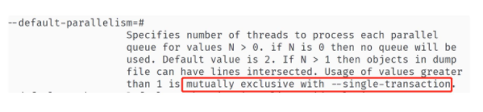

有的，那就是开源的 mydumper 工具，地址：[https://github.com/maxbube/mydumper](https://github.com/maxbube/mydumper)。mydumper 的强大之处在于：


* 支持一致性的备份；
* 可以根据表中的记录进行分片，从而进行多线程的备份；
* 对于恢复操作，也可以是多线程的备份；
* 可以指定单个表进行多线程的恢复。

**mydumper 几乎是一个完美的逻辑备份工具，是构建备份系统的首选工具**。我提供给你一个简单的 mydumper 的使用方法：

```
mydumper -o /bak -r 100000 --trx-consistency-only -t 8
```

上面的命令表示，将备份文件保存到目录 `/bak `下，其中：

* 参数 `-r `表示每张表导出 100000 条记录后保存到一张表；
* 参数 `--trx-consistency-only `表示一致性备份；
* 参数 `-t` 表示 8 个线程并行备份。

可以看到，即便对于一张大表，也可以以 8 个线程，按照每次 10000 条记录的方式进行备份，这样大大提升了备份的性能。

**物理备份**

当然，逻辑备份虽然好，但是它所需要的时间比较长，因为本质上逻辑备份就是进行 `INSERT ... SELECT ...` 的操作。

而物理备份直接备份数据库的物理表空间文件和重做日志，不用通过逻辑的 SELECT 取出数据。所以物理备份的速度，通常是比逻辑备份快的，恢复速度也比较快。

但它不如 mydumper 的是，物理备份只能恢复整个实例的数据，而不能按指定表进行恢复。MySQL 8.0 的物理备份工具可以选择官方的 Clone Plugin。

Clone Plugin 是 MySQL 8.0.17 版本推出的物理备份工具插件，在安装完插件后，就可以对MySQL 进行物理备份了。而我们要使用 Clone Plugin 就要先安装 Clone Plugin 插件，推荐在配置文件中进行如下设置：

```
[mysqld]

plugin-load-add=mysql_clone.so

clone=FORCE_PLUS_PERMANENT
```

这时进行物理备份可以通过如下命令：

```
mysql> CLONE LOCAL DATA DIRECTORY = '/path/to/clone_dir';
```

可以看到，在 mysql 命令行下输入 clone 命令，就可以进行本地实例的 MySQL 物理备份了。

Clone Plugin 插件强大之处还在于其可以进行远程的物理备份，命令如下所示：

```
CLONE INSTANCE FROM 'user'@'host':port

IDENTIFIED BY 'password'

[DATA DIRECTORY [=] 'clone_dir']

[REQUIRE [NO] SSL];
```
从上面的命令我们可以看到，Clone Plugin 支持指定的用户名密码，备份远程的物理备份到当前服务器上，根据 Clone Plugin 可以非常容易地构建备份系统。

对于 MySQL 8.0 之前的版本，我们可以使用第三方开源工具 Xtrabackup，官方网址：[https://github.com/percona/percona-xtrabackup](https://github.com/percona/percona-xtrabackup)。

不过，物理备份实现机制较逻辑备份复制很多，需要深入了解 MySQL 数据库内核的实现，我强烈建议使用 MySQL 官方的物理备份工具，开源第三方物理备份工具只作为一些场景的辅助手段。

**增量备份**

所以，我们需要通过“全量备份 + 增量备份”的方式，构建完整的备份策略。**增量备份就是对日志文件进行备份，在 MySQL 数据库中就是二进制日志文件。**

因为二进制日志保存了对数据库所有变更的修改，所以“全量备份 + 增量备份”，就可以实现基于时间点的恢复（point in time recovery），也就是“通过全量 + 增量备份”可以恢复到任意时间点。

全量备份时会记录这个备份对应的时间点位，一般是某个 GTID 位置，增量备份可以在这个点位后重放日志，这样就能实现基于时间点的恢复。

如果二进制日志存在一些删库的操作，可以跳过这些点，然后接着重放后续二进制日志，这样就能对极端删库场景进行灾难恢复了。

想要准实时地增量备份 MySQL 的二进制日志，我们可以使用下面的命令：


```
mysqlbinlog --read-from-remote-server --host=host_name --raw --stop-never binlog.000001
```

可以看到，增量备份就是使用之前了解的 mysqlbinlog，

* 但这次额外加上了参数 `--read-from-remote-server`，表示可以从远程某个 MySQL 上拉取二进制日志，这个远程 MySQL 就是由参数 `--host` 指定。
* 参数 `--raw` 表示根据二进制的方式进行拉取，参数 `--stop-never` 表示永远不要停止，即一直拉取一直保存，参数 `binlog.000001` 表示从这个文件开始拉取。
* MySQL 增量备份的本质是通过 `mysqlbinlog` 模拟一个 `slave` 从服务器，然后主服务器不断将二进制日志推送给从服务器，利用之前介绍的复制技术，实现数据库的增量备份。


增量备份的恢复，就是通过 mysqlbinlog 解析二进制日志，然后进行恢复，如：


```
mysqlbinlog binlog.000001 binlog.000002 | mysql -u root -p
```


### **3-5 备份文件的检查**


主从复制的高可用架构，还需要进行主从之间的数据核对，用来确保数据是真实一致的。

同样，对于备份文件，也需要进行校验，才能确保备份文件的正确的，当真的发生灾难时，可通过备份文件进行恢复。**因此，备份系统还需要一个备份文件的校验功能。**

**备份文件校验的大致逻辑是恢复全部文件，接着通过增量备份进行恢复，然后将恢复的 MySQL实例连上线上的 MySQL 服务器作为从服务器，然后再次进行数据核对**。


