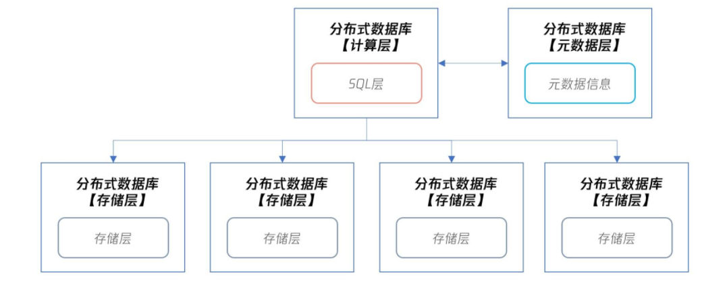
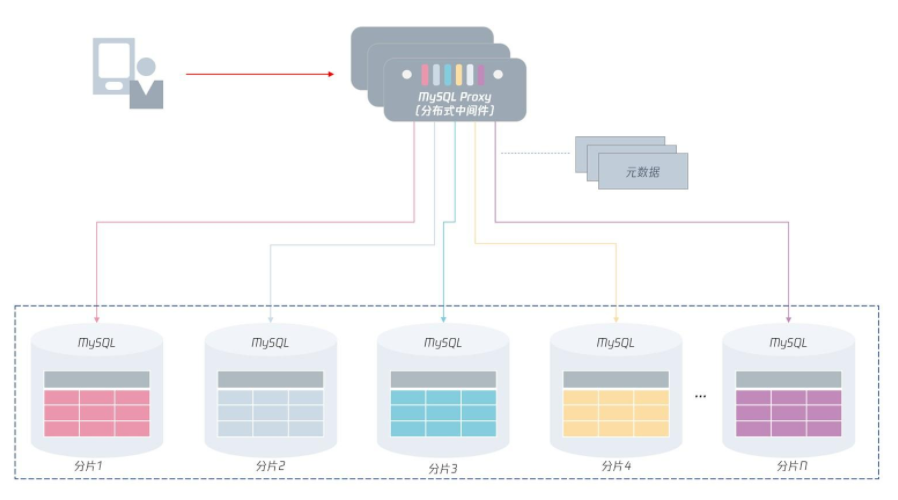

# **L7 分布式架构篇**

## **1 彻底理解什么叫分布式数据库**

A distributed database is a database in which data is stored across different physical locations. It may be stored in multiple computers located in the same physical location (e.g. a data centre); or maybe dispersed over a network of interconnected computers.

分布式数据库是一种把数据分散存储在不同物理位置的数据库。

之前学习的数据库，数据都是存放在一个实例对应的物理存储上，而在分布式数据库中，数据将存放在不同的数据库实例上。

在分布式数据库下，**分布式数据库本身分为计算层、元数据层和存储层**：

* **计算层就是之前单机数据库中的 SQL 层**，用来对数据访问进行权限检查、路由访问，以及对计算结果等操作。
* **元数据层记录了分布式数据库集群下有多少个存储节点，对应 IP、端口等元数据信息是多少**。当分布式数据库的计算层启动时，会先访问元数据层，获取所有集群信息，才能正确进行 SQL 的解析和路由等工作。另外，因为元数据信息存放在元数据层，那么分布式数据库的计算层可以有多个，用于实现性能的扩展。
* **存储层用来存放数据，但存储层要和计算层在同一台服务器上，甚至不求在同一个进程中。**

布式数据库的优势是把数据打散到不同的服务器上，这种横向扩展的 Scale Out 能力，能解决单机数据库的性能与存储瓶颈。

**优势**

从可用性的角度看，如果存储层发生宕机，那么只会影响 1/N 的数据，N 取决于数据被打散到多少台服务器上。所以，分布式数据库的可用性对比单机会有很大提升，单机数据库要实现99.999% 的可用性或许很难，但是分布式数据库就容易多了。

**缺点**

正因为数据被打散了，分布式数据库会引入很多新问题，比如自增实现、索引设计、分布式事务等

### **分布式MySQL架构**

那么对于分布式 MySQL 数据库架构，其整体架构如下图所示：

在分布式 MySQL 架构下，客户端不再是访问 MySQL 数据库本身，而是访问一个分布式中间件。

这个分布式中间件的通信协议依然采用 MySQL 通信协议（因为原先客户端是如何访问的MySQL 的，现在就如何访问分布式中间件）。分布式中间件会根据元数据信息，自动将用户请求路由到下面的 MySQL 分片中，从而将存储存取到指定的节点。

另外，分布式 MySQL 数据库架构的每一层都要由高可用，保证分布式数据库架构的高可用性。

对于上层的分布式中间件，是可以平行扩展的：即用户可以访问多个分布式中间件，如果其中一个中间件发生宕机，那么直接剔除即可。

因为分布式中间件是无状态的，数据保存在元数据服务中，它的高可用设计比较容易。

对于元数据来说，虽然它的数据量不大，但数据非常关键，一旦宕机则可能导致中间件无法工作，所以，元数据要通过副本技术保障高可用。

最后，每个分片存储本身都有副本，通过我们之前学习的高可用技术，保证分片的可用性。也就是说，如果分片 1 的 MySQL 发生宕机，分片 1 的从服务器会接替原先的 MySQL 主服务器，继续提供服务。

但由于使用了分布式架构，那么即使分片 1 发生宕机，需要 60 秒的时间恢复，这段时间对于业务的访问来说，只影响了 1/N 的数据请求。

可以看到，分布式 MySQL 数据库架构实现了计算层与存储层的分离，每一层都可以进行 Scale Out 平行扩展，每一层又通过高可用技术，保证了计算层与存储层的连续性，大大提升了MySQL 数据库的性能和可靠性，为海量互联网业务服务打下了坚实的基础。

### **总结**

MySQL 数据库的架构：分布式 MySQL 架构通过一个中间件路由层屏蔽了下层 MySQL 分片的信息。

由于分布式中间件通信采用 MySQL 通信协议，用户原先怎么使用 MySQL 数据库，那就怎么使用分布式中间件。对于开发来说，这些都是透明的，他们不用关心下层有多少个分片，所有的路由和计算工作，交友中间件层完成。