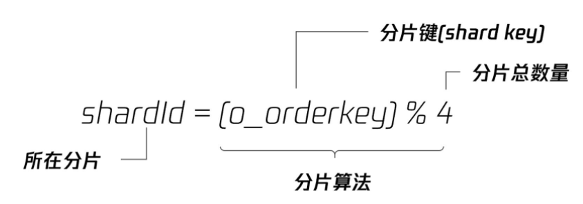
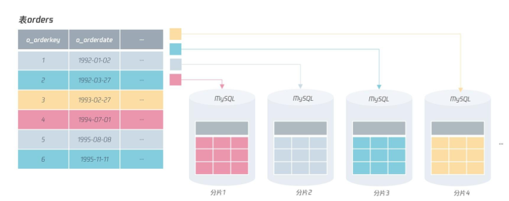
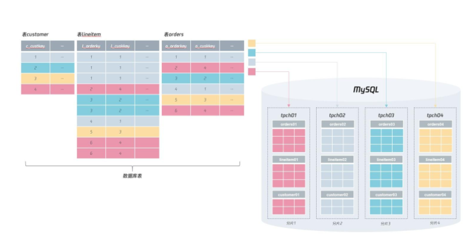
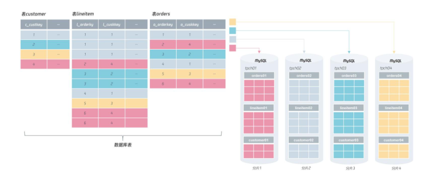
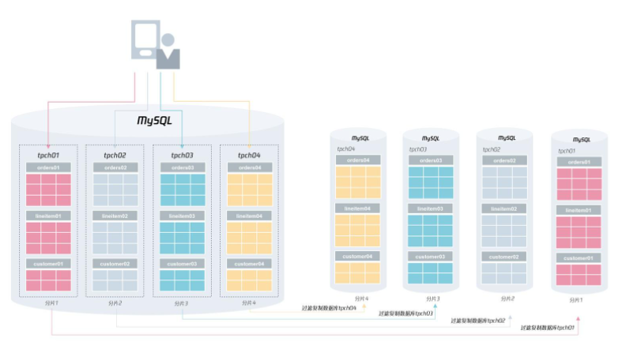
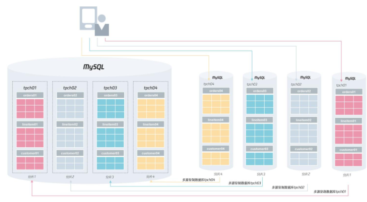
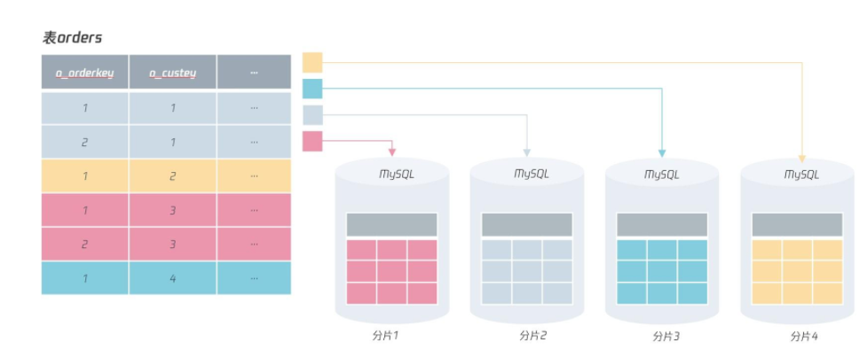
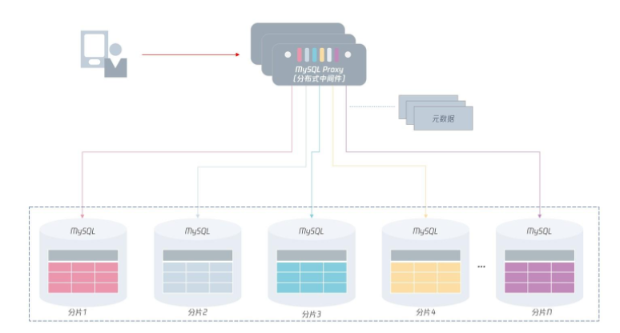

# **L7 分布式架构篇**

## **1 彻底理解什么叫分布式数据库**

A distributed database is a database in which data is stored across different physical locations. It may be stored in multiple computers located in the same physical location (e.g. a data centre); or maybe dispersed over a network of interconnected computers.


分布式数据库是一种把数据分散存储在不同物理位置的数据库。

之前学习的数据库，数据都是存放在一个实例对应的物理存储上，而在分布式数据库中，数据将存放在不同的数据库实例上。


在分布式数据库下，**分布式数据库本身分为计算层、元数据层和存储层**：

* **计算层就是之前单机数据库中的 SQL 层**，用来对数据访问进行权限检查、路由访问，以及对计算结果等操作。
* **元数据层记录了分布式数据库集群下有多少个存储节点，对应 IP、端口等元数据信息是多少**。当分布式数据库的计算层启动时，会先访问元数据层，获取所有集群信息，才能正确进行 SQL 的解析和路由等工作。另外，因为元数据信息存放在元数据层，那么分布式数据库的计算层可以有多个，用于实现性能的扩展。
* **存储层用来存放数据，但存储层要和计算层在同一台服务器上，甚至不求在同一个进程中。**


布式数据库的优势是把数据打散到不同的服务器上，这种横向扩展的 Scale Out 能力，能解决单机数据库的性能与存储瓶颈。

**优势**

从可用性的角度看，如果存储层发生宕机，那么只会影响 1/N 的数据，N 取决于数据被打散到多少台服务器上。所以，分布式数据库的可用性对比单机会有很大提升，单机数据库要实现99.999% 的可用性或许很难，但是分布式数据库就容易多了。

**缺点**

正因为数据被打散了，分布式数据库会引入很多新问题，比如自增实现、索引设计、分布式事务等

### **分布式MySQL架构**

那么对于分布式 MySQL 数据库架构，其整体架构如下图所示：


在分布式 MySQL 架构下，客户端不再是访问 MySQL 数据库本身，而是访问一个分布式中间件。

这个分布式中间件的通信协议依然采用 MySQL 通信协议（因为原先客户端是如何访问的MySQL 的，现在就如何访问分布式中间件）。分布式中间件会根据元数据信息，自动将用户请求路由到下面的 MySQL 分片中，从而将存储存取到指定的节点。


另外，分布式 MySQL 数据库架构的每一层都要由高可用，保证分布式数据库架构的高可用性。

对于上层的分布式中间件，是可以平行扩展的：即用户可以访问多个分布式中间件，如果其中一个中间件发生宕机，那么直接剔除即可。

因为分布式中间件是无状态的，数据保存在元数据服务中，它的高可用设计比较容易。

对于元数据来说，虽然它的数据量不大，但数据非常关键，一旦宕机则可能导致中间件无法工作，所以，元数据要通过副本技术保障高可用。

最后，每个分片存储本身都有副本，通过我们之前学习的高可用技术，保证分片的可用性。也就是说，如果分片 1 的 MySQL 发生宕机，分片 1 的从服务器会接替原先的 MySQL 主服务器，继续提供服务。

但由于使用了分布式架构，那么即使分片 1 发生宕机，需要 60 秒的时间恢复，这段时间对于业务的访问来说，只影响了 1/N 的数据请求。


可以看到，分布式 MySQL 数据库架构实现了计算层与存储层的分离，每一层都可以进行 Scale Out 平行扩展，每一层又通过高可用技术，保证了计算层与存储层的连续性，大大提升了MySQL 数据库的性能和可靠性，为海量互联网业务服务打下了坚实的基础。

### **总结**


MySQL 数据库的架构：分布式 MySQL 架构通过一个中间件路由层屏蔽了下层 MySQL 分片的信息。

由于分布式中间件通信采用 MySQL 通信协议，用户原先怎么使用 MySQL 数据库，那就怎么使用分布式中间件。对于开发来说，这些都是透明的，他们不用关心下层有多少个分片，所有的路由和计算工作，交友中间件层完成。

## **2 如何正确地将数据分片**

另外，很重要的一点是，知道分布式数据库是把数据打散存储在一个个分片中。在基于MySQL 的分布式数据库架构中，分片就存在于 MySQL 实例中。

### **2-1 选出分片键**

在对表中的数据进行分片时，首先要选出一个分片键（Shard Key），即用户可以通过这个字段进行数据的水平拆分。

```
CREATE TABLE `orders` (

  `O_ORDERKEY` int NOT NULL,

  `O_CUSTKEY` int NOT NULL,

  `O_ORDERSTATUS` char(1) NOT NULL,

  `O_TOTALPRICE` decimal(15,2) NOT NULL,

  `O_ORDERDATE` date NOT NULL,

  `O_ORDERPRIORITY` char(15) NOT NULL,

  `O_CLERK` char(15) NOT NULL,

  `O_SHIPPRIORITY` int NOT NULL,

  `O_COMMENT` varchar(79) NOT NULL,

  PRIMARY KEY (`O_ORDERKEY`),

  KEY `idx_custkey_orderdate` (`O_CUSTKEY`,`O_ORDERDATE`),

  KEY `ORDERS_FK1` (`O_CUSTKEY`),

  KEY `idx_custkey_orderdate_totalprice` (`O_CUSTKEY`,`O_ORDERDATE`,`O_TOTALPRICE`),

  KEY `idx_orderdate` (`O_ORDERDATE`),

  KEY `idx_orderstatus` (`O_ORDERSTATUS`),

  CONSTRAINT `orders_ibfk_1` FOREIGN KEY (`O_CUSTKEY`) REFERENCES `customer` (`C_CUSTKEY`)

) ENGINE=InnoDB
```

改造成分布式数据库架构

**而第一步就是要对表选出一个分片键，然后进行分布式架构的设计。**

对于上面的表orders，可以选择的分片键有：`o_orderkey`、`o_orderdate`、也可以是`o_custkey`。**在选出分片键后，就要选择分片的算法，比较常见的有 RANGE 和 HASH 算法**。

比如，表 orders，选择分片键 `o_orderdate`，根据函数 YEAR 求出订单年份，然后根据RANGE 算法进行分片，这样就能设计出基于 RANGE 分片算法的分布式数据库架构：

采用 RANGE 算法进行分片后，表 orders 中，1992 年的订单数据存放在分片 1 中、1993 年的订单数据存放在分片 2 中、1994 年的订单数据存放在分片 3中，依次类推，如果要存放新年份的订单数据，追加新的分片即可

**<mark>不过，RANGE 分片算法在分布式数据库架构中，是一种非常糟糕的算法</mark>**

因为对于分布式架构，通常希望能解决传统单实例数据库两个痛点：

* 性能可扩展，通过增加分片节点，性能可以线性提升；
* 存储容量可扩展，通过增加分片节点，解决单点存储容量的数据瓶颈。

所以在分布式架构中，RANGE 分区算法是一种比较糟糕的算法。**但它也有好处：可以方便数据在不同机器间进行迁移（migrate），比如要把分片 2 中 1992 年的数据迁移到分片 1，直接将表进行迁移就行。**


**而对海量并发的 OLTP 业务来说，一般推荐用 HASH 的分区算法。**

这样分片的每个节点都可以有实时的访问，每个节点负载都能相对平衡，从而实现性能和存储层的线性可扩展。

我们来看表 orders 根据 o_orderkey 进行 HASH 分片，分片算法如下：



在上述分片算法中，分片键是 `o_orderkey`，总的分片数量是 4（即把原来 1 份数据打散到 4 张表中），具体来讲，分片算法是将 `o_orderkey` 除以 4 进行取模操作。

对于订单号除以 4，余数为 0 的数据存放在分片 1 中，余数为 1 的数据存放在分片 2 中，余数为 2 的数据存放在分片 3 中，以此类推



**分布式数据库架构设计的原则是：选择一个适合的分片键和分片算法，把数据打散，并且业务的绝大部分查询都是根据分片键进行访问。**


### **分库分表**

说了这么久分片，分片到底是什么呢？其实，前面说的分片本质是一张张表，而不是数据库实例，只是每个分片是在 MySQL 数据库实例中，严格来说

```
分片 = 实例 + 库 + 表 = ip@port:db_name:table_name
```

对于前面的表orders，假设根据 HASH 算法进行分片，那么可以进行如下的分库分表设计：

* 每个分片的表名库名都一样，如库 tpch，表名 orders；
* 每个分片的库名不一样，表名一样，如库名 tpch01、tpch02、tpch03、tpch04，表名orders；
* 每个分片的表名不一样，库名一样，如库名 tpch，表名分别为 orders01、orders02、orders03、orders04；
* 每个分片的库名不一样，表名也不一样，如分片 1 的表在库名 tpch01下，表名为oders01；分片 2 的表名在库名 tpch02，表名为 orders02；分片 3 的表名在库名tpch03，表名为 orders03；分片 3 的表名在库名 tpch04，表名为 orders04。

在这 4 种分库分表规则中，最推荐的是第 4 种，也是我们通常意义说的分库分表，这样做的好处有以下几点：

* 不同分片的数据可以在同一 MySQL 数据库实例上，便于做容量的规划和后期的扩展；
* 同一分片键的表都在同一库下，方便做整体数据的迁移和扩容。

如果根据第 4 种标准的分库分表规范，那么分布式 MySQL 数据库的架构可以是这样：



有没有发现，按上面这样的分布式设计，数据分片完成后，所有的库表依然是在同一个 MySQL实例上！！！

**分布式数据库并不一定要求有很多个实例，最基本的要求是将数据进行打散分片。接着，用户可以根据自己的需要，进行扩缩容，以此实现数据库性能和容量的伸缩性。这才是分布式数据库真正的魅力所在。**

对于上述的分布式数据库架构，一开始我们将 4 个分片数据存储在一个 MySQL 实例上，但是如果遇到一些大促活动，可以对其进行扩容，比如把 4 个分片扩容到 4 个MySQL实例上：



**进行扩缩容**

**一开始一定要设计足够多的分片**

```
# 分片1从服务器配置

replicate_do_db ="tpch01"
```

所以在进行扩容时，首先根据下图的方式对扩容的分片进行过滤复制的配置：



然后再找一个业务低峰期，将业务的请求转向新的分片，完成最终的扩容操作：



### **总结**


* 分布式数据库数据分片要先选择一个或多个字段作为分片键；
* 分片键的要求是业务经常访问的字段，且业务之间的表大多能根据这个分片键进行单元化；
* 如果选不出分片键，业务就无法进行分布式数据库的改造；
* 选择完分片键后，就要选择分片算法，通常是 RANGE 或 HASH 算法；
* 海量 OLTP 业务推荐使用 HASH 算法，强烈不推荐使用 RANGE 算法；
* 分片键和分片算法选择完后，就要进行分库分表设计，推荐不同库名表名的设计，这样能方便后续对分片数据进行扩缩容；
* 实际进行扩容时，可以使用过滤复制，仅复制需要的分片数据。


## **3 二级索引、全局索引的最佳设计实践**

### **3-1 主键选择**

对主键来说，要保证在所有分片中都唯一，它本质上就是一个全局唯一的索引。

因为自增并不能在插入前就获得值，而是要通过填 NULL 值，然后再通过函数 `last_insert_id()` 获得自增的值。**<mark>所以，如果在每个分片上通过自增去实现主键，可能会出现同样的自增值存在于不同的分片上。</mark>**


如果把 `o_orderkey` 设计成上图所示的自增，那么很可能 o_orderkey 同为 1 的记录在不同的分片出现，如下图所示：




所以，在分布式数据库架构下，尽量不要用自增作为表的主键，**这也是我们在第一模块“表结构设计”中强调过的：自增性能很差、安全性不高、不适用于分布式架构。**

**<mark>总之，用有序的全局唯一替代自增，是这个时代数据库主键的主流设计标准</mark>**


### **3-2 索引设计**

还是以前面的表 orders 为例，如果业务还要根据 o_orderkey 字段进行查询，比如查询订单 ID 为 1 的订单详情：

```
SELECT * FROM orders WHERE o_orderkey = 1
```

我们可以看到，由于分片规则不是分片键，所以需要查询 4 个分片才能得到最终的结果，如果下面有 1000 个分片，那么就需要执行 1000 次这样的 SQL，这时性能就比较差了。

**但是，我们知道 `o_orderkey` 是主键，应该只有一条返回记录，也就是说，`o_orderkey` 只存在于一个分片中。这时，可以有以下两种设计：**

* 同一份数据，表 orders 根据 o_orderkey 为分片键，再做一个分库分表的实现；
* 在索引中额外添加分片键的信息。

**改进的做法之一是实现一个索引表，表中只包含` o_orderkey `和分片键` o_custkey`，如**

```
CREATE TABLE idx_orderkey_custkey （

  o_orderkey INT

  o_custkey INT,

  PRIMARY KEY (o_orderkey)

)
```

如果这张索引表很大，也可以将其分库分表，但是它的分片键是 `o_orderkey`，如果这时再根据字段 `o_orderkey` 进行查询，可以进行类似二级索引的回表实现：先通过查询索引表得到记录 `o_orderkey = 1` 对应的分片键 `o_custkey `的值，接着再根据 `o_custkey `进行查询，最终定位到想要的数据，如：

```
SELECT * FROM orders WHERE o_orderkey = 1

=>

# step 1

SELECT o_custkey FROM idx_orderkey_custkey 

WHERE o_orderkey = 1

# step 2

SELECT * FROM orders 

WHERE o_custkey = ? AND o_orderkey = 1
```

通过索引表的方式，虽然存储上较冗余全表容量小了很多，但是要根据另一个分片键进行数据的存储，依然显得不够优雅。

**因此，最优的设计，不是创建一个索引表，而是将分片键的信息保存在想要查询的列中，这样通过查询的列就能直接知道所在的分片信息。**


如果我们将订单表 orders 的主键设计为一个字符串，这个字符串中最后一部分包含分片键的信息，如：

```
o_orderkey = string（o_orderkey + o_custkey）
```

那么这时如果根据 o_orderkey 进行查询：

```
SELECT * FROM Orders

WHERE o_orderkey = '1000-1';
```

由于字段 `o_orderkey` 的设计中直接包含了分片键信息，所以我们可以直接知道这个订单在分片1 中，直接查询分片 1 就行。

同样地，在插入时，由于可以知道插入时 o_custkey 对应的值，所以只要在业务层做一次字符的拼接，然后再插入数据库就行了。

当然，这里我们谈的设计都是针对于唯一索引的设计，如果是非唯一的二级索引查询，那么非常可惜，依然需要扫描所有的分片才能得到最终的结果，如：

```
SELECT * FROM Orders

WHERE o_orderate >= ? o_orderdate < ?
```

**分布式数据库架构设计的要求是业务的绝大部分请求能够根据分片键定位到 1 个分片上。**

### **3-3 唯一索引**

最后我们来谈谈唯一索引的设计，与主键一样，如果只是通过数据库表本身唯一约束创建的索引，则无法保证在所有分片中都是唯一的。

所以，在分布式数据库中，唯一索引一样要通过类似主键的 UUID 的机制实现，用全局唯一去替代局部唯一，但实际上，即便是单机的 MySQL 数据库架构，我们也推荐使用全局唯一的设计。因为你不知道，什么时候，你的业务就会升级到全局唯一的要求了。


### **3-4 总结**

* 分布式数据库主键设计使用有序 UUID，全局唯一；
* 分布式数据库唯一索引设计使用 UUID 的全局唯一设计，避免局部索引导致的唯一问题；
* 分布式数据库唯一索引若不是分片键，则可以在设计时保存分片信息，这样查询直接路由到一个分片即可；
* 对于分布式数据库中的全局表，可以采用冗余机制，在每个分片上进行保存。这样能避免查询时跨分片的查询。

## **4 架构选型：分库分表 or 中间件**

访问分布式数据库有两种模式：

* 业务直接根据分库分表访问 MySQL 数据库节点；
* 根据中间件访问。


### **4-1 分库分表直接访问**

在设计分片时，我们已经明确了每张表的分片键信息，所以业务或服务可以直接根据分片键对应的数据库信息，直接访问底层的 MySQL 数据节点，比如在代码里可以做类似的处理：

```
void InsertOrders(String orderKey, int userKey...) {

  

  int shard_id = userKey % 4;

  if (shard_id == 0) {

    conn = MySQLConncetion('shard1',...);

    conn.query(...);

  } else if (shard_id == 1) {

    conn = MySQLConncetion('shard2',...);

    conn.query(...);   

  } else if (shard_id == 2) {

    conn = MySQLConncetion('shard3',...);

    conn.query(...);   

  } else if (shard_id == 3) {

    conn = MySQLConncetion('shard4',...);

    conn.query(...);   

  }

}
```

 在业务代码中会嵌入分库分表的路由逻辑，在业务层计算出对应分片的信息，然后访问数据库：

* 这种处理方式的好处是与单实例数据库没有太大的不同，只是多了一次计算分片的操作，没有额外的开销，性能非常好（我听说支付宝的分布式数据库为了最求极致的性能，用的就是直接访问分片的方式）。
* 这种处理逻辑的缺点是业务需要知道分片信息，感知分片的变化。对于上面的例子，如果分片 shard1 发生变化，又或者进行了扩容，业务就需要跟着修改。

为了解决这个缺点，比较好的处理方式是使用名字服务，而不要直接通过 IP 访问分片。这样当分片发生切换，又或者扩容缩容时，业务也不需要进行很大的改动。

又因为业务比较多，需要访问分布式数据库分片逻辑的地方也比较多。所以，可以把分片信息存储在缓存中，当业务启动时，自动加载分片信息。比如，在 Memcached 或 Redis 中保存如下的分片信息，key 可以是分库分表的表名，value通过 JSON 或字典的方式存放分片信息：

```
{

  'key': 'orders',

  'shard_info' : {

    'shard_key' : 'o_custkey',

    'shard_count' : 4，

    'shard_host' : ['shard1.xxx.com','shard2.xxx.com','...']，

    ‘shard_table' : ['tpch00/orders01','tpch01/orders02','...'],

  }

}
```

### **4-2 使用中间件技术**

另一种比较流行的分布式数据库访问方式是通过分布式数据库中间件。数据库中间件本身模拟成一个 MySQL 数据库，通信协议也都遵循 MySQL 协议：**业务之前怎么访问MySQL数据库的，就如何访问MySQL分布式数据库中间件。**

这样做的优点是：业务不用关注分布式数据库中的分片信息，把它默认为一个单机数据库使用就好了。




可以看到，通过分布式 MySQL 中间件，用户只需要访问中间件就行，下面的数据路由、分布式事务的实现等操作全部交由中间件完成。所以，分布式数据库中间件变成一个非常关键的核心组件。

**业界比较知名的 MySQL 分布式数据库中间件产品有：ShardingShpere、DBLE、TDSQL 等**。

ShardingSphere于 2020 年 4 月 16 日成为 Apache 软件基金会的顶级项目、社区熟度、功能支持较多，特别是对于分布式事务的支持，有多种选择（ShardingSphere 官网地址）。

DBLE 是由知名 MySQL 服务商爱可生公司开源的 MySQL 中间件产品，已用于四大行核心业务，完美支撑传统银行去 IOE，转型分布式架构的探索。除了中间件技术外，爱可生公司还有很多关于 MySQL 数据库、分布式数据库设计等方面的综合经验。

TDSQL MySQL 版（TDSQL for MySQL）是腾讯打造的一款分布式数据库产品，具备强一致高可用、全球部署架构、分布式水平扩展、高性能、企业级安全等特性，同时提供智能 DBA、自动化运营、监控告警等配套设施，为客户提供完整的分布式数据库解决方案。

目前 TDSQL 已经为超过500+的政企和金融机构提供数据库的公有云及私有云服务，客户覆盖银行、保险、证券、互联网金融、计费、第三方支付、物联网、互联网+、政务等领域。TDSQL MySQL 版亦凭借其高质量的产品及服务，获得了多项国际和国家认证，得到了客户及行业的一致认可。


