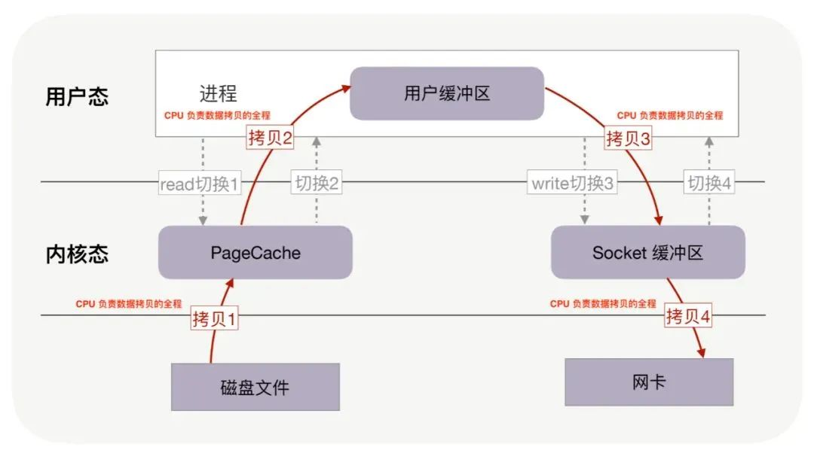
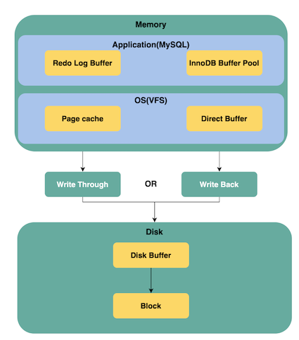

# **L8 MySQL的零拷贝技术**

## **先需要了解Buffer 与 cache 的区别**

Bbuffer 与 Cache 非常类似，因为它们都用于存储数据数据，被应用层读取字节数据。在很多场合它们有着相同的概念:

首先从翻译上，Buffer应该翻译为“缓冲”，Cache应该翻译为“缓存”，两个完全不是一个东西。

**在硬件这一层看，Buffer应该为内存，Cache为CPU集成的告诉缓存。**

**<mark>Buffer为了让不同速度的设备能够同步，建立的一个缓冲区域，写进Buffer的数据是为了从中拿出写入其他设备。</mark>**

**<mark>Cache是为了提高读取速度，将经常或马上需要的数据预读到缓存中，写进Cache的数据是为了其他设备从中去读取。</mark>**

从软件这一层来说，**Buffer是块设备的缓冲，Cache是文件系统的缓存**。以Linux为例，

> Buffer(Buffer Cache)以块形式缓冲了块设备的操作，定时或手动的同步到硬盘，它是为了缓冲写操作然后一次性将很多改动写入硬盘，避免频繁写硬盘，提高写入效率。
> 
> Cache(Page Cache)以页面形式缓存了文件系统的文件，给需要使用的程序读取，它是为了给读操作提供缓冲，避免频繁读硬盘，提高读取效率。

总而言之，**Buffer里面的东西是为了写到别处去，Cache里面的东西是为了给别处读。**

### **Buffer 与 Cache 的用途有所不一定：**

* Buffer 的主要目的是在不同应用、线程、进程之间共享字节数据，**例如为了让不同速度的设备能够进行数据同步，就会使用共享 Buffer**；

* **Cache 的主要目的是提高字节数据的读取/写入速度，例如根据时间局部性、地址局部性操作系统提供 page cache 机制**；

当然，在很多场合下 Buffer 与 Cache 有着相同的语义，因此我们可以认为缓冲区既用于提高读写速度，又用于数据共享与同步。

## **2. MySQL 缓冲区设计**

MySQL 的缓冲区设计如下图所示：

如上图所示，MySQL 在不同层次使用了与缓存机制不同的配套技术。其中有：

**应用层**：

* **Redo Log Buffer：对写操作进行缓存，用于实现 MySQL InnoDB 的事务性；**
* **InnoDB Buffer Pool：用于对 MySQL table 的数据进行缓存。读内存而不是磁盘，通过减少磁盘读操的方式提高读操作性能；写内存而不是磁盘，通过减少磁盘写操的方式提高写操作性能**；

**操作系统的 VFS（Virtual file system，虚拟文件系统）层**：

* Page Cache：**操作系统通过缓存以及预读机制对文件系统中的 block 基于 page 进行缓存管理**；
* Direct Buffer：**当使用 Direct I/O 提供的相关 API 时，操作系统不再提供基于 Page Cache 机制的缓存，而是直接使用 Direct Buffer**；

磁盘的 Disk Buffer：磁盘也可以提供磁盘缓存，通常在 MySQL 中会关闭磁盘缓存，我们仅仅需要了解有 Disk Buffer 这一概念即可。

**Write Through/Back 与 Direct I/O**

* Write Through：写操作"穿过"缓存区直接落盘，这种策略能够确保数据不会因为宕机而丢失内存缓冲区的数据；

* Write Back：一次写操作仅仅更新了内存缓存区中的数据，数据落盘通常通过间隔一个时间进行落盘一次；

MySQL 为此提供了一些参数来控制 Page Cache 数据落盘的具体行为，例如：

###  **`innodb_flush_log_at_trx_commit`**

* **`innodb_flush_log_at_trx_commit` 参数用于控制基于 Page Cache 的 Redo Log Buffer 的数据落盘机制。此参数用于控制以下两个特性之间的平衡：**
* `innodb_flush_log_at_trx_commit` 有三个可选配置值：
	* **1（默认值）：每次事务提交时都日志必须刷新到磁盘上**，提供了最可靠的事务性保证；
	* **0：日志每间隔 1 秒刷新到磁盘上，这意味着在缓存中还没有来得及刷新到磁盘上的数据在宕机时会丢失；**
	* **2：日志在事务提交后以及每间隔 1 秒刷新到磁盘上，这意味着在缓存中还没有来得及刷新到磁盘上的数据在宕机时会丢失**；

注意事项：配置 0 与 2 并不能保证 100% 每间隔一秒刷新到磁盘一次，这是因为 DDL 的修改以及 InnoDB 活动可能会导致日志刷新更频繁。另一方面，由于事务调度问题，刷新频率甚至会降低。

> 刷新频率默认为 1 s，由参数 `innodb_flush_log_at_timeout` 进行配置。

###  **`innodb_flush_method`**

* `innodb_flush_method` 参数同时控制 `redo log buffe`r 和 `innodb buffer pool` 缓冲区刷新策略，其中：
	* **log files：redo log buffer 是 log files 在内存中的缓存区， log files 是磁盘上的 Redo Log 文件；**
	* **data files：innodb buffer pool 是 data files 在内存中的缓存区，data files 是磁盘上的数据文件（B+tree）**；

* `innodb_flush_method` 参数目前有 6 种可选配置值：

	* fdatasync；
	* `O_DSYNC`
	* `O_DIRECT`
	* `O_DIRECT_NO_FSYNC`
	* littlesync
	* nosync

**这里只讨论 Unix-like 操作系统，而不讨论 Windows 系统。**

其中，littlesync 与 nosync 仅仅用于内部性能测试，并不建议使用。

* fdatasync，即取值 0，这是默认配置值。对 log files 以及 data files 都采用 fsync 的方式进行同步；
* `O_DSYNC`，即取值 1。对 log files 使用 O_SYNC 打开与刷新日志文件，使用 fsync 来刷新 data files 中的数据；
* `O_DIRECT`，即取值 4。利用 Direct I/O 的方式打开 data file，并且每次写操作都通过执行 fsync 系统调用的方式落盘；
* `O_DIRECT_NO_FSYNC`，即取值 5。利用 Direct I/O 的方式打开 data files，但是每次写操作并不会调用 fsync 系统调用进行落盘；

> 补充说明：以 O_SYNC 方式打开文件意味着文件的每一次写操作都直接导致将数据本身以及元数据刷新到磁盘上。

**为什么有 `O_DIRECT` 与 `O_DIRECT_NO_FSYNC` 配置的区别？**

首先，我们需要理解更新操作落盘分为两个具体的子步骤：①文件数据更新落盘②文件元数据更新落盘。O_DIRECT 的在部分操作系统中会导致文件元数据不落盘，除非主动调用 fsync，为此，MySQL 提供了 `O_DIRECT` 以及 `O_DIRECT_NO_FSYNC` 这两个配置。

如果你确定在自己的操作系统上，即使不进行 fsync 调用，也能够确保文件元数据落盘，那么请使用 `O_DIRECT_NO_FSYNC` 配置，这对 MySQL 性能略有帮助。否则，请使用 `O_DIRECT`，不然文件元数据的丢失可能会导致 MySQL 运行错误。

## **MySQL 日志的刷新策略**

MySQL 日志刷新策略通过 `sync_binlog` 参数进行配置，其有 3 个可选配置：

* `sync_binlog=0`：MySQL 应用将完全不负责日志同步到磁盘，将缓存中的日志数据刷新到磁盘全权交给操作系统来完成；
* `sync_binlog=1`：MySQL 应用在事务提交前将缓存区的日志刷新到磁盘；
* `sync_binlog=N`：当 N 不为 0 与 1 时，MySQL 在收集到 N 个日志提交后，才会将缓存区的日志同步到磁盘。

事实上，这个参数也用于控制日志是通过 Write Through 还是 Write Back 策略刷新到磁盘上。

注意事项：使用 Page Cache 机制的数据刷盘机制，即使基于同步策略，即每次写操作都要求数据直接落盘，但在数据落盘之前，数据总是先要写于 Page Cache 中，再将 Page Cache 中的具体 Page 刷新到磁盘上

## **MySQL 的典型配置**

* `innodb_flush_log_at_trx_commit` 参数配置为 1：Redo Log 走 Page Cache，并且每次写操作的日志在事务提交前都通过 fsync 刷新到磁盘；
* `innodb_flush_method`参数配置为 `O_DIRECT`：InnoDB Buffer Pool 走 Direct I/O，并且每次写操作导致的文件数据（包括文件元数据）都通过 fsync 系统调用刷新到磁盘；

写一条 redo log 涉及到的步骤有：

* 日志写入 Redo Log buffer；
* 日志写入 Page Cache；
* 通过系统调用 fsync 将 Page Cache 中的脏页刷新到磁盘；
* 日志提交；

修改表的一行记录涉及到的步骤有：

* 更新后的数据写于 InnoDB Buffer Pool；
* 定时进行如下逻辑（异步进行）：
	* InnoDB Buffer Pool 脏数据进行刷新，通过文件的 write 方法进行；
	* 文件的 write 方法直接导致数据写于磁盘上；
	* 定时进行文件的 fysnc 调用，确保文件元数据写于磁盘上；

