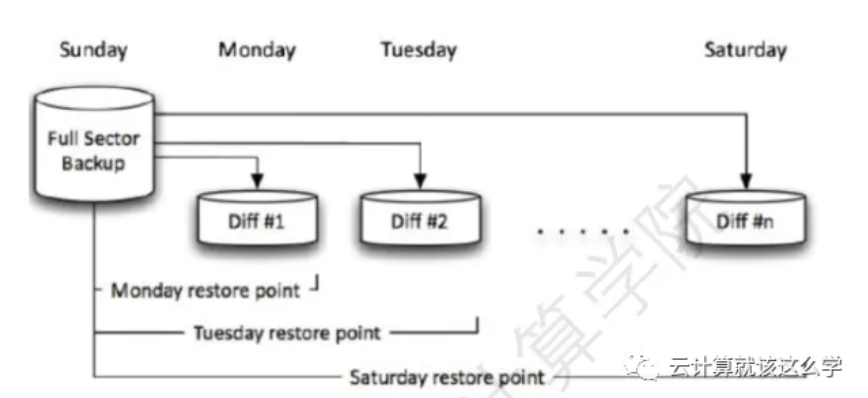

# **第十一节 MySQL备份概述**

### **1、为什么要备份**

能够防止由于机械故障以及人为误操作带来的数据丢失，例如将数据库文件保存在了其它地方。

冗余：数据有多份冗余，但不等备份，只能防止机械故障还来的数据丢失，例如主备模式、数据 库集群。

### **2、备份必须重视的内容**

**备份内容 `databases Binlog my.conf `**

所有备份数据都应放在非数据库本地，而且建议有多份副本。 

测试环境中做日常恢复演练，恢复较备份更为重要。

### **3、备份过程中必须考虑因素：** 

数据的一致性 

服务的可用性

### **4、MySQL 备份类型**

#### **4-1 物理备份**

对数据库操作系统的物理文件（如数据文件、日志文件等）的备份。

物理备份又可分为脱机备份（冷备 份）和联机备份（热备份）。这种类型的备份适用于出现问题时需要快速恢复的大型重要数据库。

**1. 热备(hot backup)**

在线备份，数据库处于运行状态，**这种备份方法依赖于数据库的日志文件**

对应用基本无影响(应用程序读写不会阻塞,但是性能还是会有下降,所以尽量不要在主上做备份,在 从库上做)

**2. 冷备(cold backup)**

备份数据文件,需要停机，是在关闭数据库的时候进行的 

**备份 datadir 目录下的所有文件**

**3. 温备(warm backup)**

针对myisam的备份(myisam不支持热备),备份时候实例只读不可写，数据库锁定表格（不可写入 但可读）的状态下进行的 

对应用影响很大 

#### **4-2 逻辑备份**

对数据库逻辑组件（如表等数据库对象）的备份，表示为逻辑数据库结构`create database`、 `createtable`等语句）和内容（insert 语句或分割文本文件）的信息。

这种类型的备份适用于可以编辑数 据值或表结构较小的数据量，或者在不同机器体系结构上重新创建数据。

#### **4-3 物理和逻辑备份的区别**

#### **4-4 备份方式的选择**

从以下几个维度考虑备份方式
 
备份速度     恢复速度    备份大小     对业务影响

### **5、MySQL 备份工具**

**5-1 ibbackup**

* 官方备份工具 
* 收费 
* 物理备份

**5-2 xtrabackup**

* 开源社区备份工具 
* 开源免费,上面那东西的免费版本(老版本有问题,备份出来的数据可能有问题) 
* 物理备份

**5-3 mysqldump** 

* 官方自带备份工具 开源免费 
* 逻辑备份(速度慢) 
* 不阻塞dml,阻塞ddl

**5-4 mysqlbackup**

* mysql 官方备份工具 
* **innodb 引擎的表mysqlbackup可以进行热备** 
* **非innodb表mysqlbackup就只能温备** 
* 物理备份，备份还原速度快 
* **适合大规模数据使用** 

### **6、MySQL 备份策略**

**6-1 完全备份** 

**每次对数据进行完整的备份，即对整个数据库的备份、数据库结构和文件结构的备份，保存的是备份完 成时刻的数据库，是差异备份与增量备份的基础**。
 
* 优点：备份与恢复操作简单方便. 
* 缺点：数据存在大量的重复；占用大量的空间；备份与恢复时间长。 

**6-2 差异备份**

**备份那些自从上次完全备份之后被修改过的所有文件**，备份的时间起点是从上次完整备份起，备份数据 量会越来越大。

**恢复数据时，只需恢复上次的完全备份与最近的一次差异备份**。
 

**6-3 增量备份**

只有那些在上次完全备份或者增量备份后被修改的文件才会被备份。

以上次完整备份或上次的增量备份 的时间为时间点，**仅备份这之间的数据变化，因而备份的数据量小，占用空间小，备份速度快**。

但恢复时，需要从上一次的完整备份起到最后一次增量备份依次恢复，如中间某次的备份数据损坏，将导致数据的丢失。

