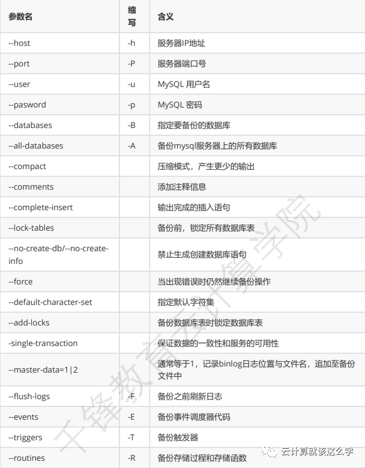

# **第十二节 MySQL逻辑备份mysqldump**


## **一、mysqldump 简介**

mysqldump 是 MySQL 自带的逻辑备份工具。可以保证数据的一致性和服务的可用性。

它的备份原理是通过协议连接到 MySQL 数据库，将需要备份的数据查询出来，将查询出的数据转 换成对应的 insert 语句，当我们需要还原这些数据时，只要执行这些 insert 语句，即可将对应的 数据还原。


## **二、备份命令**

### **1、命令格式**

```
mysqldump [选项] 数据库名 [表名] > 脚本名
```

或

```
mysqldump [选项] --数据库名 [选项 表名] > 脚本名
```
或

```
mysqldump [选项] --all-databases [选项] > 脚本名
```

### **2、选项说明**



### **3、备份实例**

备份所有数据库：

```
# mysqldump -uroot -p --all-databases > 
/backup/mysqldump/all.db
```

备份指定数据库：

```
# mysqldump -uroot -p test > /backup/mysqldump/test.db
```

备份指定数据库指定表(多个表以空格间隔)

```
# mysqldump -uroot -p mysql db event > 
/backup/mysqldump/2table.db
```

备份指定数据库排除某些表

```
# mysqldump -uroot -p test --ignore-table=test.t1 --ignoretable=test.t2 > /backup/mysqldump/test2.db
```

### **4、还原命令**

**1 系统行命令**

```
# mysqladmin -uroot -p create db_name 
# mysql -uroot -p db_name < /backup/mysqldump/db_name.db
```

**在导入备份数据库前，`db_name`如果没有，是需要创建的；而且与`db_name.db`中数据库名是一 样的才可以导入**。

**2 soure 方法**

```
mysql > use db_name
mysql > source /backup/mysqldump/db_name.db
```

## **三、MySQL 逻辑备份**

### **1、MySQL 环境**

***mysql: 5.7.28***

### **2、完整备份与恢复**

**1)修改配置文件开启二进制日志**

```
# vim /etc/my.cnf
[mysqld]
basedir=/soft/mysql
datadir=/soft/mysql/data
default_password_lifetime=0
server-id = 2                   # id是做标识，随便填写
log-bin=/var/log/mysql/bin-log  # 设置二进制日志存放的位置
```

**2)创建存放二进制日志文件的目录并赋权限**

```
# mkdir -p /var/log/mysql 
# chown -R mysql:mysql /var/log/mysql
```

**3)创建全量备份文件存放目录并赋权限**

```
# mkdir /backup/mysql -p
# chown -R mysql:mysql /backup/mysql/
```

**4)重启数据库**

```
# systemctl restart mysqld
```

**5)进入mysqld创建一个数据库 test1**

```]# mysql -uroot -hlocalhost -p'‘Qfedu.123com’'
mysql> create database test1;
mysql> show databases;
+--------------------+
| Database           |
+--------------------+
| information_schema |
| mysql             |
| performance_schema |
| sys               |
| test1             |
+--------------------+
```

**6)进行全量备份**

```
# mysqldump -uroot -hlocalhost -p'Qfedu.123com' -P3306 --alldatabases --triggers --routines --events --single-transaction --master-data=1 --
flush-logs --set-gtid-purged=OFF > /backup/mysql/$(date +%F%H)-mysql-all.sql
```

**7)删除数据库文件**

```
# systemctl stop mysqld
# rm -rf /var/lib/mysql/*
```

**8)向全量备份文件里面追加不记录二进制日志的命令**

```
# sed -i '23a SET sql_log_bin=0;' /backup/mysql/2019-11-2810-mysql-all.sql 
```

向全量备份文件里面追加不记录二进制日志的命令的原因是因为我们在恢复的时候要重新执行一次 SQL语句，这个语句没有记录的必要，如果记录的话还可能会导致恢复失败。


**9)重启初始化数据库、启动数据库、并修改密码**

```
# systemctl restart mysqld
# mysql -uroot -hlocalhost -p'‘Qfedu.123com’'
# grep 'temporary password' /var/log/mysqld.log
# mysql -u root -p'U0ln8LE!ue=#'
mysql> alter user 'root'@'localhost' identified by 'Qfedu.123com';
mysql> show databases;
+--------------------+
| Database           |
+--------------------+
| information_schema |
| mysql             |
| performance_schema |
| sys               |
+--------------------+
```

由于这是一个新的数据库，里面只有默认的库，并没有 test1 数据库。

**10)导入全备的数据**

```
# mysql -u root -p'Qfedu.123com' < /backup/mysql/2019-11-2810-mysql-all.sql 

# mysql -uroot -p'Qfedu.123com'
mysql>  set  sql_log_bin=1;
Query OK, 0 rows affected (0.00 se
mysql> show databases;
+--------------------+
| Database           |
+--------------------+
| information_schema |
| mysql             |
| performance_schema |
| sys               |
| test1             |
+--------------------+
```

在数据库内部也可以进行恢复

```
mysql> set sql_log_bin=0;
mysql> source /backup/mysql/2019-11-2810-mysql-all.sql
mysql>  set sql_log_bin=1;
Query OK, 0 rows affected (0.00 se
```

导入之后当前的密码会不变，当进入数据库 flush privileges 之后，密码又恢复到备份时的密码

```
mysql> flush privileges
```

### **3、增量备份与恢复**

备份与恢复环境 

数据库完整备份+数据库增量备份

新建数据表, 进行全量备份, 随着时间推移, 数据库突然奔溃

**1)备份之前**

```
mysql> create database test2;
mysql> create table test2.t1 (id int,name varchar(20));
mysql> insert into test2.t1 values (1,"test21");
mysql> insert into test2.t1 values (2,"test22");
mysql> select * from test2.t1;
+------+--------+
| id   | name   |
+------+--------+
|    1 | test21 |
|    2 | test22 |
+------+--------+
2 rows in set (0.00 sec)
```


**2)基于当前状态做一次全备**

```
[root@localhost ~]# mysqldump -uroot -hlocalhost -p'Qfedu.123com' -P3306 --alldatabases --triggers --routines --events --single-transaction --master-data=1 --
flush-logs --set-gtid-purged=OFF > /backup/mysql/$(date +%F%H)-mysql-all.sql
```

**3)进入数据库再插入数据**

```
mysql> insert into test2.t1 values (3,"test23");
mysql> insert into test2.t1 values (5,"tt");
mysql> select * from test2.t1;
+------+--------+
| id   | name   |
+------+--------+
|    1 | test21 |
|    2 | test22 |
|    3 | test23 |
|    5 | tt     |
+------+--------+
4 rows in set (0.00 sec)
```

**4)模拟数据库崩溃**

重启初始化，启动数据库,更改默认密码

```
# systemctl stop mysqld
# rm -rf /var/lib/mysql/*
# systemctl start mysqld
# grep 'temporary password' /var/log/mysqld.log
# mysql -u root -p'U0ln8LE!ue=#'
mysql> alter user 'root'@'localhost' identified by 'Qfedu.123com';
mysql> \q
]# mysql -uroot -p'Qfedu.123com'
mysql> show databases;
+--------------------+
| Database           |
+--------------------+
| information_schema |
| mysql             |
| performance_schema |
| sys               |
+--------------------+
4 rows in set (0.00 sec)
```

**5)恢复全量数据**

```
# sed -i "23aSET sql_log_bin=0;" /backup/mysql/2019-11-2810-mysql-all.sql 

# mysql -uroot -p'Qfedu.123com' < /backup/mysql/2019-11-2810-mysql-all.sql

# mysql -u root -p'Qfedu.123com' -e "select * from test2.t1"
+------+--------+
| id   | name   |
+------+--------+
|    1 | test21 |
|    2 | test22 |
+------+--------+
```

**6)恢复增量备份** 

获取全备截至点

查看一下全量备份，备份到哪个点了，如下所示是154这个点，000001这个日志文件**

```
# sed -n '22p' /backup/mysql/2019-11-2810-mysql-all.sql 
CHANGE MASTER TO MASTER_LOG_FILE='bin-log.000001', MASTER_LOG_POS=154;
```

全量仅备份到了154这个点，154后面的点全备文件里面就没有了，需要去`000002`以后的二进制文 件里面找


根据 `MASTER_LOG_POS `恢复增量的数据

```
# pwd
/log/mysql

# mysqlbinlog --start-position=154 bin-log.000001 binlog.000002 bin-log.000003 bin-log.000003 | mysql -uroot -pQfedu.123com;
[root@mysql02 ~]# mysql -u root -pQfedu.123com -e "select * from test2.t1"
+------+--------+
| id   | name   |
+------+--------+
|    1 | test21 |
|    2 | test22 |
|    3 | test23 |
|    5 | tt     |
+------+--------+
```

### **4、误操作删除了库（练习）**

新来的开发删了库，这件事不想再回忆了，以后打死也不会把数据库的 root 权限轻易给别人了。今天把当时的场景用虚拟机还原一下，然后复现一下数据恢复的过程，就当是个总结吧！说多了都 是泪啊~

**1)模拟环境准备**

```
# mysql -uroot -p'Qfedu.123com'
mysql> create database test2db;
mysql> use test2db;
mysql> create table t1 (id int,name varchar(20));
mysql> insert into t1 values (1,"ccr");
mysql> insert into t1 values (2,"tfr");
mysql> select * from t1;
+------+------+
| id   | name |
+------+------+
|    1 | ccr |
|    2 | tfr |
+------+------+
```

**2)全备**

```
# mysqldump -uroot -hlocalhost -p'Qfedu.123com' -P3306 --alldatabases --triggers --routines --events --single-transaction --master-data=1 --
flush-logs --set-gtid-purged=OFF > /backup/mysql/$(date +%F%H)-mysql-all.sql
```
**3)再次插入数据**

```
# mysql -uroot -p'Qfedu.123com'
mysql> insert into test2db.t1 values(3,'tr1'),(4,'zx'),(5,'wq'),(6,'tj'),
(7,'gwt');
mysql> select * from test2db.t1;
+------+------+
| id   | name |
+------+------+
|    1 | ccr |
|    2 | tfr |
|    3 | tr1 |
|    4 | zx   |
|    5 | wq   |
|    6 | tj   |
|    7 | gwt |
+------+------+
```

**4)开发误操作**

```
mysql> delete from test2db.t1 where id = '2';
mysql> drop database test2db;
```

**5)恢复全备**

```
[root@mysql02 ~]# sed -i '23aSET sql_log_bin=0;' /backup/mysql/2019-11-2812-mysql-all.sql 

[root@mysql02 ~]# mysql -u root -p'Qfedu.123com' < /backup/mysql/2019-11-2812-mysql-all.sql 

[root@mysql02 ~]# mysql -u root -p'Qfedu.123com' -e "select * from test2db.t1"
+------+------+
| id   | name |
+------+------+
|    1 | ccr |
|    2 | tfr |
+------+------+
```

**6)跳过 DELETE 和 DROP 语句**

下面的操作就要小心翼翼了，不能一下子把二进制日志里面全备以后的操作全部恢复，一旦全部恢 复了，那开发删除操作也会恢复，我们只能跳过误操作的地方。

```
# sed -n '22p' /backup/mysql/2019-11-2812-mysql-all.sql 
CHANGE MASTER TO MASTER_LOG_FILE='bin_log.000002', MASTER_LOG_POS=154;

# ls /log/mysql/ #全备之后只有一个` bin_log.000002`二进程日志文件

]# mysql -u root -p'Qfedu.123com'
mysql> show binlog events in 'bin-log.000002';
+----------------+-----+----------------+-----------+-------------+-------------
--------------------------+
| Log_name       | Pos | Event_type     | Server_id | End_log_pos | Info         
                        |
+----------------+-----+----------------+-----------+-------------+-------------
--------------------------+
| bin-log.000008 |   4 | Format_desc   |         2 |         123 | Server ver: 
5.7.29-log, Binlog ver: 4 |
| bin-log.000008 | 123 | Previous_gtids |         2 |         154 |             
                          |
| bin-log.000008 | 154 | Anonymous_Gtid |         2 |         219 | SET 
@@SESSION.GTID_NEXT= 'ANONYMOUS' |
| bin-log.000008 | 219 | Query         |         2 |         294 | BEGIN       
                          |
| bin-log.000008 | 294 | Table_map     |         2 |         345 | table_id: 
179 (test2db.t1)           |
| bin-log.000008 | 345 | Write_rows     |         2 |         422 | table_id: 
179 flags: STMT_END_F       |
| bin-log.000008 | 422 | Xid           |         2 |         453 | COMMIT /* 
xid=980 */                 |
| bin-log.000008 | 453 | Anonymous_Gtid |         2 |         518 | SET 
@@SESSION.GTID_NEXT= 'ANONYMOUS' |
| bin-log.000008 | 518 | Query         |         2 |         593 | BEGIN       
                          |
| bin-log.000008 | 593 | Table_map     |         2 |         644 | table_id: 
179 (test2db.t1)           |
| bin-log.000008 | 644 | Delete_rows   |         2 |         688 | table_id: 
179 flags: STMT_END_F       |
| bin-log.000008 | 688 | Xid           |         2 |         719 | COMMIT /* 
xid=982 */                 |
| bin-log.000008 | 719 | Anonymous_Gtid |         2 |         784 | SET 
@@SESSION.GTID_NEXT= 'ANONYMOUS' |
| bin-log.000008 | 784 | Query         |         2 |         885 | drop 
database test2db                 |
+----------------+-----+----------------+-----------+-------------+-------------
--------------------------+


# mysqlbinlog --start-position=154 --stop-position=453 binlog.000002 | mysql -p'Qfedu.1234com' 


# mysql -uroot -p'Qfedu.123com' -e "select * from test2db.t1"
+------+------+
| id   | name |
+------+------+
|    1 | ccr |
|    2 | tfr |
|    3 | tr1 |
|    4 | zx   |
|    5 | wq   |
|    6 | tj   |
|    7 | gwt |
+------+------+
```

注：上述案例在全备之后仅产生了多个二进制日志文件可进行合并处理

```
# mysqlbinlog --base64-output="decode-rows" -v bin_log.000001 bin_log.000002 > test3.sql
```