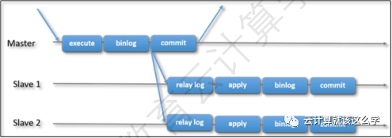
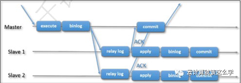
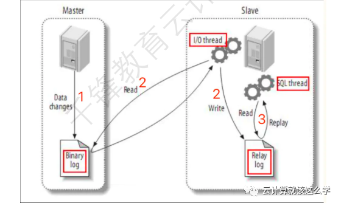

# **第十四节 MySQL 主从复制原理介绍**

## **1、MySQL 异步和半同步复制**

传统的 MySQL 复制提供了一种简单的主–从复制方法。

**有一个主，以及一个或多个从。**

主节点执行和提交事务，然后将它们（异步地）发送到从节点，以重新执行（在基于语句的复制中）或应用（在 基于行的复制中）。

**这是一个 `shared-nothing` 的系统，默认情况下所有 server 成员都有一个完整的 数据副本**




还有一个半同步复制，它在协议中添加了一个同步步骤。这意味着主节点在提交时需要等待从节点 确认它已经接收到事务。只有这样，主节点才能继续提交操作。



在上面的两个图片中，可以看到传统异步 MySQL 复制协议（以及半同步）的图形展示。蓝色箭头 表示在不同 server 之间或者 server 与 client 应用之间的信息交互。

## **2、MySQL 主从复制过程**

开启binlog日志，通过把主库的 binlog 传送到从库，从新解析应用到从库。 


**复制需要3个线程（dump、io、sql）完成。**

复制是异步的过程。主从复制是异步的逻辑的SQL语句级的复制。


## **3、MySQL 主从复制前提**

* 主服务器一定要打开二进制日志
* 必须两台服务器（或者是多个实例）
* 从服务器需要一次数据初始化
* 如果主从服务器都是新搭建的话，可以不做初始化
* 如果主服务器已经运行了很长时间了，可以通过备份将主库数据恢复到从库。
* 主库必须要有对从库复制请求的用户。
* 从库需要有`relay-log`设置，存放从主库传送过来的二进制日志 `show variables like '%relay%';`
* 在第一次的时候，从库需要change master to 去连接主库。
* **change master信息需要存放到 `master.info` 中 `show variables like '%master_info%';`**
* 从库怎么知道，主库发生了新的变化通过`relay-log.info`记录的已经应用过的`relay-log`信息。
* 在复制过程中涉及到的线程
	* 从库会开启一个IO thread(线程)，负责连接主库，请求binlog，接收`binlog`并写入`relaylog`。
	* 从库会开启一个`SQL thread`(线程)，负责执行`relay-log`中的事件。
	* 主库会开启一个`dump thrad`(线程)，负责响应从`IO thread`的请求。

## **4、MySQL 主从复制实现**




* 通过二进制日志
* 至少两台（主、从）
* 主服务器的二进制日志“拿”到从服务器上再运行一遍。
* 通过网络连接两台机器，一般都会出现延迟的状态。也可以说是异步的。
* 从库通过手工执行`change master to `语句连接主库，提供了连接的用户一切条件 user、 password、port、ip
* 并且让从库知道，二进制日志的起点位置（`file`名 `position`号）
* 启动从库同步服务 `start slave`
* 从库的IO和主库的dump线程建立连接
* 从库根据`change master to` 语句提供的`file`名和`position`号，IO线程向主库发起binlog的请求
* 主库dump线程根据从库的请求，将本地binlog以events的方式发给从库IO线程
* 从库IO线程接收binlog evnets，并存放到本地`relay-log`中，传送过来的信息，会记录到 `master.info`中。
* **从库SQL线程应用`relay-log`，并且把应用过的记录到`relay-log.info`,默认情况下，已经应用过的 relay会自动被清理`purge`。**

## **5、MySQL复制有三种核心格式**

复制的工作原理是数据库修改记录到bin log日志并传递到slave，然后slave在本地还原的过程。而 时间记录到bin log的格式会有所不同。


### **1)基于语句的复制（statement based replication）**

基于主库将SQL语句写入到bin log中完成复制。


### **2)基于行数据的复制（row based replication）**

基于主库将每一行数据变化的信息作为时间写入到bin log中完成日志。默认就是基于行级别的复 制，因为它相对语句复制逻辑更为严谨。

### **3)混合复制（mixed based replication）**

上述两者的结合。默认情况下优先使用基于语句的复制，只有当部分语句如果基于语句复制不完全 的情况下才会自动切换为基于行数据的复制。

```
# mysql -uroot -p'Qfedu.123com'
mysql: [Warning] Using a password on the command line interface can be insecure.
Welcome to the MySQL monitor. Commands end with ; or \g.
Your MySQL connection id is 6
Server version: 5.7.25-log MySQL Community Server (GPL)
Copyright (c) 2000, 2019, Oracle and/or its affiliates. All rights reserved.
Oracle is a registered trademark of Oracle Corporation and/or its
affiliates. Other names may be trademarks of their respective
owners.
Type 'help;' or '\h' for help. Type '\c' to clear the current input statement.
mysql> 
mysql> SHOW VARIABLES LIKE '%BINLOG_FORMAT%'; # 默认就是基于行复制的
+---------------+-------+
| Variable_name | Value |
+---------------+-------+
| binlog_format | ROW   |
+---------------+-------+
row in set (0.00 sec)
mysql> 
mysql> SET binlog_format='STATEMENT'; # 修改成基于语句复制
Query OK, 0 rows affected (0.00 sec)
mysql> 
mysql> SHOW VARIABLES LIKE '%BINLOG_FORMAT%';
+---------------+-----------+
| Variable_name | Value     |
+---------------+-----------+
| binlog_format | STATEMENT |
+---------------+-----------+
row in set (0.00 sec)
mysql> 
mysql> quit
Bye
```
