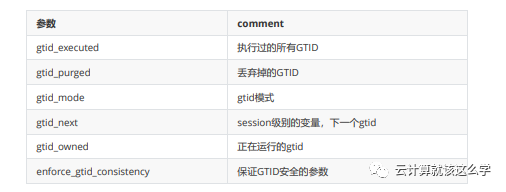

# **第十六节 MySQL 基于 GTID 的主从复制**

## **1、GTID 概念介绍**

GTID即全局事务ID (global transaction identifier), **其保证为每一个在主上提交的事务在复制集群 中可以生成一个唯一的ID**。

GTID最初由google实现，官方MySQL在5.6才加入该功能。mysql主从结构在一主一从情况下对于 GTID来说就没有优势了，而对于2台主以上的结构优势异常明显，可以在数据不丢失的情况下切换 新主。

使用GTID需要注意: 在构建主从复制之前，在一台将成为主的实例上进行一些操作（如数据清理 等），通过GTID复制，这些在主从成立之前的操作也会被复制到从服务器上，引起复制失败。

也就是说通过GTID复制都是从最先开始的事务日志开始，即使这些操作在复制之前执行。比如在 `server1`上执行一些`drop`、`delete`的清理操作，接着在`server2`上执行`change`的操作，会使得`server2`也进行`server1`的清理操作。


**<mark>GTID实际上是由UUID+TID (即transactionId)组成的。</mark>**

其中UUID(即server_uuid) 产生于 auto.conf文件(`cat /data/mysql/data/auto.cn`f)，是一个MySQL实例的唯一标识。

TID代表了该实 例上已经提交的事务数量，并且随着事务提交单调递增，所以GTID能够保证每个MySQL实例事务 的执行（不会重复执行同一个事务，并且会补全没有执行的事务）。GTID在一组复制中，全局唯一。下面是一个GTID的具体形式 :

## **2、GTID 的工作流程为**

* `master`更新数据时，会在事务前产生`GTID`，一同记录到 `binlog` 日志中。
* `slave` 端的 `i/o` 线程将变更的 `binlog`，写入到本地的`relay log` 中。
* `sql` 线程从 `relay log` 中获取 `GTID`，然后对比 `slave` 端的 `binlog` 是否有记录。
* 如果有记录，说明该 `GTID` 的事务已经执行，`slave` 会忽略。
* 如果没有记录，`slave` 就会从 `relay log` 中执行该 `GTID` 的事务，并记录到 `binlog`。
* 在解析过程中会判断是否有主键，如果没有就用二级索引，如果没有就用全部扫描。


## **3、GTID 的优点**

一个事务对应一个唯一ID，一个GTID在一个服务器上只会执行一次;

GTID是用来代替传统复制的方法，GTID复制与普通复制模式的最大不同就是不需要指定二进制文件名和位置;

减少手工干预和降低服务故障时间，当主机挂了之后通过软件从众多的备机中提升一台备机为主机;

## **4、GTID 复制同步过程**

主从架构：`ServerC <-----ServerA ----> ServerB ` 即一个主数据库`ServerA`，两个从数据库`ServerB` 和`ServerC`

* 当主机ServerA 挂了之后 ，此时ServerB执行完了所有从ServerA 传过来的事务，ServerC 延时一 点。这个时候需要把 ServerB 提升为主机 ，Server C 继续为备机；
* 当ServerC 链接ServerB 之后, 首先在自己的二进制文件中找到从ServerA 传过来的最新的GTID，然后将这个GTID 发送到 ServerB ,ServerB 获得这个GTID之后,就开始从这个GTID的下一个GTID开始发送事务给ServerC。
* 这种自我寻找复制位置的模式减少事务丢失的可能性以及故障恢复的时间。

## **5、GTID 的缺点(限制)**

不支持非事务引擎;

不支持`create table ... select` 语句复制(主库直接报错);(原理: 会生成两个sql, 一个是DDL创建表

* SQL, 一个是insert into 插入数据的sql; 
* 由于DDL会导致自动提交, 所以这个sql至少需要两个GTID, 但是GTID模式下, 只能给这个sql生成一个GTID)

不允许一个SQL同时更新一个事务引擎表和非事务引擎表;

在一个复制组中，必须要求统一开启GTID或者是关闭GTID;

开启GTID需要重启 (mysql5.7除外);

开启GTID后，就不再使用原来的传统复制方式;

**对于`create temporary table` 和 `drop temporary table`语句不支持**

## **6、GTID 与 binlog对应关系**

假设有4个binlog: bin.001,bin.002,bin.003,bin.004

```
bin.001 : Previous-GTIDs=empty; binlog_event有：1-40
bin.002 : Previous-GTIDs=1-40; binlog_event有：41-80
bin.003 : Previous-GTIDs=1-80; binlog_event有：81-120
bin.004 : Previous-GTIDs=1-120; binlog_event有：121-160
```

假设现在我们要找`GTID=$A`，那么MySQL的扫描顺序为：从最后一个binlog开始扫描（即：`bin.004`）


* `bin.004`的`Previous-GTIDs=1-120`，如果`$A=140 > Previous-GTIDs,`那么肯定在`bin.004`中
* `bin.004`的`Previous-GTIDs=1-120`，如果`$A=88` 包含在`Previous-GTIDs`中,那么继续对比上一个 binlog文件 `bin.003`,然后再循环前面2个步骤，直到找到为止

## **7、GTID 相关参数**



## **8、GTID 开启必备的条件**

### **1. MySQL 5.6**

```
gtid_mode=ON(必选)
log_bin=ON(必选)
log-slave-updates=ON(必选)
enforce-gtid-consistency(必选)
```

### **2. MySQL 5.7**

MySQL5.7.13 or higher

```
gtid_mode=ON(必选)
enforce-gtid-consistency（必选）
log_bin=ON（可选）--高可用切换，最好设置ON
log-slave-updates=ON（可选）--高可用切换，最好设置ON
```

## **9、 GTID 开启时需要注意的问题**

* slave不能执行任何sql,包括超级用户;
* `read_only=on`, slave必须要开启这个，避免业务执行sql;
* 保证当前slave的事务id为1;
* 当slave同步出现问题时，手动跳过，需要考虑的问题
* 执行的sql，不能记录事务id，否则slave切换为master时，会导致从同步失败，因为binglog早已 删除。
* `SET @MYSQLDUMP_TEMP_LOG_BIN = @@SESSION.SQL_LOG_BIN;`
* `SET @@SESSION.SQL_LOG_BIN= 0;`


## **10、MySQL 配置基于GTID的主从复制**

传统的基于binlog position复制的方式有个严重的缺点：**如果slave连接master时指定的binlog文 件错误或者position错误，会造成遗漏或者重复， 很多时候前后数据是有依赖性的，这样就会出 错而导致数据不一致。**

### 系统配置

```
[root@mysql-master ~]# cat /etc/redhat-release
CentOS Linux release 7.5.1804 (Core)
# 为了方便实验，关闭所有节点的防火墙
[root@mysql-master ~]# systemctl stop firewalld
[root@mysql-master ~]# cat /etc/sysconfig/selinux |grep "SELINUX=disabled"
SELINUX=disabled
[root@mysql-master ~]# setenforce 0              
setenforce: SELinux is disabled
[root@mysql-master ~]# getenforce                
Disabled
```

### **安装 Mysql**

1)MySQL yum包下载

```
# wget http://repo.mysql.com/mysql57-community-releaseel7-10.noarch.rpm
```

2)MySQL 软件源安转

```
# yum -y install mysql57-community-release-el7-10.noarch.rpm
```

3)MySQL 服务安装

```
# yum install -y mysql-community-server mysql
```

4)MySQL 服务启动

```
# systemctl start mysqld.service
```

5)MySQL 服务运行状态检查

```
# systemctl status mysqld.service
```

6)MySQL 修改临时密码

获取MySQL的临时密码

为了加强安全性，MySQL5.7为root用户随机生成了一个密码，在error log中，关于error log的位 置，如果安装的是RPM包，则默认是`/var/log/mysqld.log`。

只有启动过一次mysql才可以查看临时密码

```
 grep 'temporary password' /var/log/mysqld.log
```
 
登陆并修改密码

使用默认的密码登陆

```
# mysql -uroot -p
```

修改密码

```
mysql> ALTER USER 'root'@'localhost' IDENTIFIED BY 'Qfedu.123com';
```

解决不符合密码复杂性要求

```
ERROR 1819 (HY000): Your password does not satisfy the current policy 
requirements
```

修改 密码策略

```
mysql> set global validate_password_policy=0;
```

修改密码的长度

```
mysql> set global validate_password_length=1;
```

执行修改密码成功

```
mysql> ALTER USER 'root'@'localhost' IDENTIFIED BY 'root123';
```

### **MySQL 授权远程主机登录**

```
mysql> GRANT ALL PRIVILEGES ON *.* TO 'root'@'%' IDENTIFIED BY 'mypassword' WITH
GRANT OPTION;
mysql> FLUSH  PRIVILEGES
```

### **主数据库上的操作**

1)在`my.cnf`文件中配置GTID主从复制

```
[root@mysql-master ~]# cp /etc/my.cnf /etc/my.cnf.bak

[root@mysql-master ~]# >/etc/my.cnf

[root@mysql-master ~]# cat /etc/my.cnf
[mysqld]
datadir = /var/lib/mysql
socket = /var/lib/mysql/mysql.sock
  
symbolic-links = 0
  
log-error = /var/log/mysqld.log
pid-file = /var/run/mysqld/mysqld.pid
  
#GTID:
server_id = 1
gtid_mode = on
enforce_gtid_consistency = on
    
#binlog
log_bin = mysql-bin
log-slave-updates = 1
binlog_format = row
sync-master-info = 1
sync_binlog = 1
   
#relay log
skip_slave_start = 1
```

2)重启mysql服务


```
# systemctl restart mysqld
```

3)登录mysql并查看master状态

发现多了一项`"Executed_Gtid_Set "`

```
# mysql -uroot -p'Qfedu.123com'
mysql> show master status;
+-------------------+----------+--------------+------------------+--------------
-----+
| File             | Position | Binlog_Do_DB | Binlog_Ignore_DB | 
Executed_Gtid_Set |
+-------------------+----------+--------------+------------------+--------------
-----+
| mysql-bin.000001 |      154 |             |                 |               
    |
+-------------------+----------+--------------+------------------+--------------
-----+
1 row in set (0.00 sec)
  
mysql> show global variables like '%uuid%';
+---------------+--------------------------------------+
| Variable_name | Value                               |
+---------------+--------------------------------------+
| server_uuid   | 317e2aad-1565-11e9-9c2e-005056ac6820 |
+---------------+--------------------------------------+
1 row in set (0.00 sec)
```

4)查看确认 gtid 功能打开

```
mysql> show global variables like '%gtid%';
+----------------------------------+-------+
| Variable_name                   | Value |
+----------------------------------+-------+
| binlog_gtid_simple_recovery     | ON   |
| enforce_gtid_consistency         | ON   |
| gtid_executed                   |       |
| gtid_executed_compression_period | 1000 |
| gtid_mode                       | ON   |
| gtid_owned                       |       |
| gtid_purged                     |       |
| session_track_gtids             | OFF   |
+----------------------------------+-------+
8 rows in set (0.00 sec)
```
5)查看确认binlog日志功能打开

```
mysql> show variables like 'log_bin';
+---------------+-------+
| Variable_name | Value |
+---------------+-------+
| log_bin       | ON   |
+---------------+-------+
1 row in set (0.00 sec)
```

6)授权slave复制用户并刷新权限

```
mysql> grant replication slave,replication client on *.* to
slave@'192.168.152.%' identified by "Qfedu.123com";
Query OK, 0 rows affected, 1 warning (0.03 sec)
  
mysql> flush privileges;
Query OK, 0 rows affected (0.04 sec)
  
mysql> show grants for slave@'192.168.152.%';
+-------------------------------------------------------------------------------
+
| Grants for slave@192.168.152.%                                               
|
+-------------------------------------------------------------------------------
+
| GRANT REPLICATION SLAVE, REPLICATION CLIENT ON *.* TO 'slave'@'192.168.152.%'
|
+-------------------------------------------------------------------------------
+
1 row in set (0.00 sec)
```

7)再次查看master状态

```
mysql> show master status;
+-------------------+----------+--------------+------------------+--------------
----------------------------+
| File             | Position | Binlog_Do_DB | Binlog_Ignore_DB | 
Executed_Gtid_Set                       |
+-------------------+----------+--------------+------------------+--------------
----------------------------+
| mysql-bin.000001 |      622 |             |                 | 317e2aad-1565-
11e9-9c2e-005056ac6820:1-2 |
+-------------------+----------+--------------+------------------+--------------
----------------------------+
1 row in set (0.00 sec)
```

启动配置之前，同样需要对从服务器进行初始化。对从服务器初始化的方法基本和基于日志点是相 同的，只不过在启动了GTID模式后，在备份中所记录的就不是备份时的二进制日志文件名和偏移 量了，而是记录的是备份时最后的GTID值。


需要先在主数据库机器上把目标库备份一下，假设这里目标库是qfedu（为了测试效果，下面手动 创建）

```
mysql> show databases;
+--------------------+
| Database           |
+--------------------+
| information_schema |
| mysql             |
| performance_schema |
| sys               |
+--------------------+
4 rows in set (0.00 sec)
  
mysql> CREATE DATABASE qfedu CHARACTER SET utf8 COLLATE utf8_general_ci;
Query OK, 1 row affected (0.02 sec)
  
mysql> use qfedu;
Database changed
mysql> create table if not exists demo (id int(10) PRIMARY KEY
AUTO_INCREMENT,name varchar(50) NOT NULL);
Query OK, 0 rows affected (0.27 sec)
  
mysql> insert into qfedu.demo values(1,"congcong"),(2,"huihui"),(3,"grace");   
Query OK, 3 rows affected (0.06 sec)
Records: 3 Duplicates: 0  Warnings: 0
  
mysql> select * from qfedu.demo;
+----+----------+
| id | name     |
+----+----------+
|  1 | congcong |
|  2 | huihui   |
|  3 | grace   |
+----+----------+
3 rows in set (0.00 sec)
```

9)备份qfedu库

```
[root@mysql-master ~]# mysqldump --single-transaction --master-data=2 --triggers 
--routines --databases qfedu -uroot -p'Qfedu.123com' > /root/qfedu.sql
```

* mysql5.6使用mysqldump备份时，指定备份的具体库，使用`--database`
* mysql5.7使用mysqldump备份时，指定备份的具体库，使用`--databases`

```
[root@mysql-master ~]# ls /root/qfedu.sql
/root/qfedu.sql
[root@mysql-master ~]# cat /root/qfedu.sql
-- MySQL dump 10.13 Distrib 5.7.24, for Linux (x86_64)
--
-- Host: localhost   Database: qfedu
-- ------------------------------------------------------
-- Server version       5.7.24-log
.............
.............
--
-- GTID state at the beginning of the backup
--
  
SET @@GLOBAL.GTID_PURGED='317e2aad-1565-11e9-9c2e-005056ac6820:1-5'; 
```


10)同步备份到从库

把备份的`/root/qfedu.sql`文件拷贝到mysql-slave从数据库服务器上

```
[root@mysql-master ~]# rsync -e "ssh -p22" -avpgolr /root/qfedu.sql  root@192.168.152.166:/root/
```

11)从数据库上的操作

* 在my.cnf文件中配置GTID主从复制 
* 与主服务器配置除了`server_id`不一致外，从服务器还可以在配置文件里面添加：`"read_only＝on"` ,
* 使从服务器只能进行读取操作，此参数对超级用户无效，并且不会影响从服务器的复制；

```
[root@mysql-slave ~]# cp /etc/my.cnf /etc/my.cnf.bak
[root@mysql-slave ~]# >/etc/my.cnf
[root@mysql-slave ~]# vim /etc/my.cnf
[mysqld]
datadir = /var/lib/mysql
socket = /var/lib/mysql/mysql.sock
  
symbolic-links = 0
  
log-error = /var/log/mysqld.log
pid-file = /var/run/mysqld/mysqld.pid
  
#GTID:
server_id = 2
gtid_mode = on
enforce_gtid_consistency = on
    
#binlog
log_bin = mysql-bin
log-slave-updates = 1
binlog_format = row
sync-master-info = 1
sync_binlog = 1
   
#relay log
skip_slave_start = 1
read_only = on
```

12)重启mysql服务

```
[root@mysql-slave ~]# systemctl restart mysqld
```

13)从库导入数据

接着将主数据库目标库的备份数据qfedu.sql导入到从数据库里

```
[root@mysql-slave ~]# ls /root/qfedu.sql
/root/qfedu.sql
[root@mysql-slave ~]# mysql -p'Qfedu.123com'
.........
mysql> show databases;
+--------------------+
| Database           |
+--------------------+
| information_schema |
| mysql             |
| performance_schema |
| sys               |
+--------------------+
4 rows in set (0.00 sec)
  
mysql> source /root/qfedu.sql;
  
mysql> select * from qfedu.demo;
+----+----------+
| id | name     |
+----+----------+
|  1 | congcong |
|  2 | huihui   |
|  3 | grace   |
+----+----------+
3 rows in set (0.00 sec)
```

14)从库配置同步

在从数据库里，使用change master 配置主从复制

```
mysql> stop slave;
Query OK, 0 rows affected, 1 warning (0.00 sec)
  
mysql> change master to
master_host='172.16.60.211',master_user='slave',master_password='Qfedu.123com',m
aster_auto_position=1;
Query OK, 0 rows affected, 2 warnings (0.26 sec)
  
mysql> start slave;
Query OK, 0 rows affected (0.02 sec)
  
mysql> show slave status \G;
*************************** 1. row ***************************
               Slave_IO_State: Waiting for master to send event
                 Master_Host: 172.16.60.211
                 Master_User: slave
                 Master_Port: 3306
               Connect_Retry: 60
             Master_Log_File: mysql-bin.000001
         Read_Master_Log_Pos: 1357
               Relay_Log_File: mysql-slave1-relay-bin.000002
               Relay_Log_Pos: 417
       Relay_Master_Log_File: mysql-bin.000001
             Slave_IO_Running: Yes
           Slave_SQL_Running: Yes
................
................
           Executed_Gtid_Set: 317e2aad-1565-11e9-9c2e-005056ac6820:1-5
               Auto_Position: 1
```

由`IO/SQL`线程为 `yes`可知，`mysql-slave`节点已经和 `mysql-master`节点配置了主从同步关系

15)检测主从同步

mysql-master主数据库上进行状态查看和测试测试插入

```
mysql> show master status;
+-------------------+----------+--------------+------------------+--------------
----------------------------+
| File             | Position | Binlog_Do_DB | Binlog_Ignore_DB | 
Executed_Gtid_Set                       |
+-------------------+----------+--------------+------------------+--------------
----------------------------+
| mysql-bin.000001 |     1357 |             |                 | 317e2aad-1565-
11e9-9c2e-005056ac6820:1-5 |
+-------------------+----------+--------------+------------------+--------------
----------------------------+
1 row in set (0.00 sec)
  
mysql> show slave hosts;
+-----------+------+------+-----------+--------------------------------------+
| Server_id | Host | Port | Master_id | Slave_UUID                           |
+-----------+------+------+-----------+--------------------------------------+
|         2 |     | 3306 |         1 | 2c1efc46-1565-11e9-ab8e-00505688047c |
+-----------+------+------+-----------+--------------------------------------+
1 row in set (0.00 sec)
  
mysql> insert into qfedu.demo values(4,"beijing"),(5,"hefei"),(10,"xihu");
Query OK, 3 rows affected (0.06 sec)
Records: 3 Duplicates: 0  Warnings: 0
  
mysql> delete from qfedu.demo where id<4;
Query OK, 3 rows affected (0.10 sec)
  
mysql> select * from qfedu.demo;
+----+---------+
| id | name   |
+----+---------+
|  4 | beijing |
|  5 | hefei   |
| 10 | xihu   |
+----+---------+
3 rows in set (0.00 sec)
```

mysql-slave从数据库上查看

```
mysql> select * from qfedu.demo;
+----+---------+
| id | name   |
+----+---------+
|  4 | beijing |
|  5 | hefei   |
| 10 | xihu   |
+----+---------+
3 rows in set (0.00 sec)
```

发现 mysql-slave从数据库已经将新插入的数据同步完成
