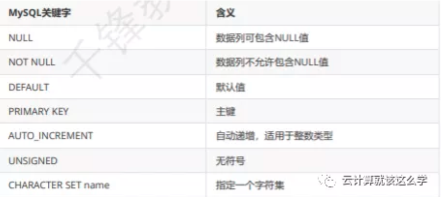

# **第七节 MySQL 数据类型约束**

约束是一种限制，它通过对表的行或者列的数据做出限制，来确保表数据的完整性和唯一性. 在 mysql当中一般有一下这几种约束



## **1、非空约束**

就是限制数据库中某个值是否可以为空，**null字段值可以为空，not null字段值不能为空**

```
mysql> create table testnull(id int, username varchar(20) not null);  # 创建testnull 设置 username 字段为非空约束 notnull
Query OK, 0 rows affected (0.00 sec)


mysql> insert into testnull(id,username) values(1,'qfedu');      # 插入2个数据2个字段
Query OK, 1 row affected (0.01 sec)


mysql> insert into testnull (id) values(2); # 没有插入 username 字段报错，username 必须有一个默认值
ERROR 1364 (HY000): Field 'username' doesn't have a default value


mysql> desc testnull;
+----------+-------------+------+-----+---------+-------+
| Field   | Type       | Null | Key | Default | Extra |
+----------+-------------+------+-----+---------+-------+
| id       | int(11)     | YES |     | NULL   |       |
| username | varchar(20) | NO   |     | NULL   |       |
+----------+-------------+------+-----+---------+-------+
2 rows in set (0.00 sec)

```

**注意：如果约束不生效可以先设置一下`sql_mode`**

```
mysql> set session sql_mode='STRICT_TRANS_TABLES';
```

## **2、唯一约束**

字段添加唯一约束之后，该字段的值不能重复，也就是说在一列当中不能出现一样的值


### **2-1 添加唯一约束**

```
# 添加唯一约束
ALTER TABLE tbl_name ADD [CONSTRAINT[symbol]]
UNIQUE [INDEX|KEY] [index_name] [index_type] (index_col_name)
```

### **2-1 删除唯一约束**

```
# 删除唯一约束
ALTERT TABLE tbl_name DROP {INDEX|KEY} index_name
```

**已经添加的值不能再重复的插入**

```
mysql> select * from testnull;  # 查询表里面的数据
+------+----------+
| id   | username |
+------+----------+
|    1 | qfedu   |
+------+----------+
1 row in set (0.00 sec)


mysql> alter table testnull add unique(id);   # 设置 id 字段添加一个唯一约束 unique
Query OK, 0 rows affected (0.01 sec)
Records: 0 Duplicates: 0  Warnings: 0

mysql> insert into testnull(id,username) values(1,'qfedu1');  # 插入一个值（1）给 id 报错，提示不能重复值
ERROR 1062 (23000): Duplicate entry '1' for key 'id'
```

## **3、主键约束**

* 主键保证记录的唯一性，主键自动为`NOT NULL`
* 每张数据表只能存在一个主键 `NOT NULL + UNIQUE KEY` 一个`UNIQUE KEY `
* 一个`NOT NULL`的时候，那么它被当做`PRIMARY KEY`主键
* 当一张表里没有一个主键的时候，第一个出现的非空且为唯一的列被视为有主键。

```
# 添加主键约束
ALTER TABLE tbl_name ADD [CONSTRAINT[sysbol]]
PRIMARY KEY [index_type] (index_col_name)

# 删除主键约束
ALTER TABLE tbl_name DROP PRIMARY KEY
```

实例

```
mysql> create table user(id int primary key, name varchar(20),number int);
Query OK, 0 rows affected (0.01 sec)

mysql> desc user;
+--------+-------------+------+-----+---------+-------+
| Field | Type       | Null | Key | Default | Extra |
+--------+-------------+------+-----+---------+-------+
| id     | int(11)     | NO   | PRI | NULL   |       |
| name   | varchar(20) | YES |     | NULL   |       |
| number | int(11)     | YES |     | NULL   |       |
+--------+-------------+------+-----+---------+-------+
3 rows in set (0.00 sec)

mysql> insert into user(id,name,number) values(1,'1',1);
Query OK, 1 row affected (0.00 sec)

mysql> select * from user;
+----+------+--------+
| id | name | number |
+----+------+--------+
|  1 | 1   |      1 |
+----+------+--------+
1 row in set (0.00 sec)

mysql> insert into user(id,name,number) values(1,'1',1);
ERROR 1062 (23000): Duplicate entry '1' for key 'PRIMARY'

mysql> insert into user(id,name,number) values(1,'2',2);
ERROR 1062 (23000): Duplicate entry '1' for key 'PRIMARY'

mysql> insert into user(id,name,number) values(2,'2',2);
Query OK, 1 row affected (0.00 sec)

mysql> select * from user;
+----+------+--------+
| id | name | number |
+----+------+--------+
|  1 | 1   |      1 |
|  2 | 2   |      2 |
+----+------+--------+
2 rows in set (0.00 sec)

mysql> insert into user(id,name,number) values(0,'3',3);
Query OK, 1 row affected (0.01 sec)

mysql> select * from user;
+----+------+--------+
| id | name | number |
+----+------+--------+
|  0 | 3   |      3 |
|  1 | 1   |      1 |
|  2 | 2   |      2 |
+----+------+--------+
3 rows in set (0.00 sec)
```

## **4、自增长**

自增长 `AUTO_INCREMENT` 自动编号，且必须与主键组合使用 默认情况下，**起始值为1**，每次的 增量为1。当插入记录时，如果为`AUTO_INCREMENT`数据列明确指定了一个数值，则会出现两种 情况：

如果插入的值与已有的编号重复，则会出现出错信息，因为`AUTO_INCREMENT`数据列的值必须是 唯一的；

如果插入的值大于已编号的值，则会把该插入到数据列中，并使在下一个编号将从这个新值开始递 增。也就是说，可以跳过一些编号。如果自增序列的最大值被删除了，则在插入新记录时，该值被 重用。

### **4-1 添加自增长**

```
mysql> ALTER TABLE user CHANGE id id INT NOT NULL AUTO_INCREMENT;
Query OK, 0 rows affected (0.01 sec)
Records: 0 Duplicates: 0  Warnings: 0

mysql> DESCRIBE user;
+--------+-------------+------+-----+---------+----------------+
| Field | Type       | Null | Key | Default | Extra         |
+--------+-------------+------+-----+---------+----------------+
| id     | int(11)     | NO   | PRI | NULL   | auto_increment |
| name   | varchar(20) | YES |     | NULL   |               |
| number | int(11)     | YES |     | NULL   |               |
+--------+-------------+------+-----+---------+----------------+
3 rows in set (0.00 sec)

mysql> SELECT * FROM user;
Empty set (0.00 sec
```

### **4-2 插入值**

```
mysql> INSERT INTO user(name, number) VALUES('take',2), ('which',4);
Query OK, 2 rows affected (0.00 sec)
Records: 2 Duplicates: 0  Warnings: 0

mysql> SELECT * FROM `user`;
+----+-------+--------+
| id | name | number |
+----+-------+--------+
|  1 | take |      2 |
|  2 | which |      4 |
+----+-------+--------+
2 rows in set (0.00 sec)
```

### **4-3 删除自增长**

```
mysql> ALTER TABLE user CHANGE id id INT NOT NULL;
Query OK, 2 rows affected (0.01 sec)
Records: 2 Duplicates: 0  Warnings: 0

mysql> DESCRIBE user;
+--------+-------------+------+-----+---------+-------+
| Field | Type       | Null | Key | Default | Extra |
+--------+-------------+------+-----+---------+-------+
| id     | int(11)     | NO   | PRI | NULL   |       |
| name   | varchar(20) | YES |     | NULL   |       |
| number | int(11)     | YES |     | NULL   |       |
+--------+-------------+------+-----+---------+-------+
3 rows in set (0.00 sec)
```

## **5、默认约束**


### **5-1 添加/删除默认约束**


```
ALTER TABLE tbl_name ALTER [COLUMN] col_name {SET DEFAULT literal | DROP DEFAULT}
```

### **5-2 设置默认值**

```
mysql> ALTER TABLE user ALTER number SET DEFAULT 0;
Query OK, 0 rows affected (0.00 sec)
Records: 0 Duplicates: 0  Warnings: 0

mysql> DESCRIBE user;
+--------+-------------+------+-----+---------+-------+
| Field | Type       | Null | Key | Default | Extra |
+--------+-------------+------+-----+---------+-------+
| id     | int(11)     | NO   | PRI | NULL   |       |
| name   | varchar(20) | YES |     | NULL   |       |
| number | int(11)     | YES |     | 0       |       |
+--------+-------------+------+-----+---------+-------+
3 rows in set (0.00 sec
```

### **5-3 插入值**

```
mysql> ALTER TABLE user CHANGE id id INT NOT NULL AUTO_INCREMENT;
Query OK, 2 rows affected (0.01 sec)
Records: 2 Duplicates: 0  Warnings: 0

mysql> INSERT INTO user(name) VALUES('rock');
Query OK, 1 row affected (0.00 sec)

mysql> INSERT INTO user(name) VALUES('rock');
Query OK, 1 row affected (0.01 sec)

mysql> SELECT * FROM user;
+----+-------+--------+
| id | name | number |
+----+-------+--------+
|  1 | take |      2 |
|  2 | which |      4 |
|  3 | rock |      0 |
|  4 | rock |      0 |
+----+-------+--------+
4 rows in set (0.00 sec)
```

## **6、外键约束**


外键约束要求数据表的存储引擎只能为 InnoDB

查看当前mysql服务器支持的存储引擎

```
mysql> SHOW ENGINES;
```

### **6-1 编辑数据表的默认存储引擎**

```
[root@qfedu.com ~]# vim /etc/my.cnf
[mysqld]
datadir=/var/lib/mysql
socket=/var/lib/mysql/mysql.sock
character-set-server=utf8mb4
default-storage-engine=INNODB
[root@qfedu.com ~]# systemctl restart mysqld
```


```
mysql> create table teacher(id int primary key auto_increment, name varchar(20)
not null);   # 创建老师表

Query OK, 0 rows affected (0.00 sec)

mysql> create table students(id int primary key auto_increment, name varchar(20)
not null,teacher_id int,foreign key(teacher_id) references teacher(id));  # 创建学生表
Query OK, 0 rows affected (0.01 sec)

mysql> insert into teacher(id,name) values(1,'qfedu');
Query OK, 1 row affected (0.00 sec)

mysql> insert into students(id,name,teacher_id) values(1,'qfedu',1);     # 插入老师表中id来关联
Query OK, 1 row affected (0.00 sec)

mysql> select * from students;
+----+-------+------------+
| id | name | teacher_id |
+----+-------+------------+
|  1 | qfedu |          1 |
+----+-------+------------+
1 row in set (0.00 sec)

mysql> select * from teacher;
+----+-------+
| id | name |
+----+-------+
|  1 | qfedu |
+----+-------+
1 row in set (0.00 sec)
```