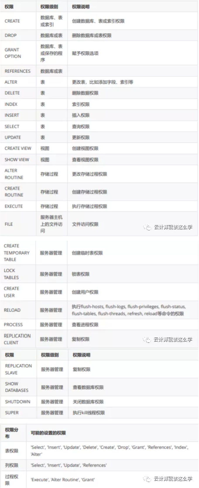

# **第九节 MySQL 的用户管理和权限管理**

## **1、DCL（数据库控制语言）**

数据库授权、角色控制等操作

* **`GRANT` 用户授权，为用户赋予访问权限**
* **`REVOKE` 取消授权，撤回授权权限**

## **2、MySQL 权限表**

### **2-1 `mysql.user`**

* **用户字段**：Host、User、Password
* **权限字段**：`_Priv`结尾的字段
* **安全字段**：`ssl x509`字段
* **资源控制字段**：`max_`开头的字段

### **2-2 mysql.db**
 
* 用户字段：Host、User、Password
* 权限字段：剩下的`_Priv`结尾的字段 


### **2-3 `mysql.tables_priv`，`mysql.columns_priv`、`procs_priv`**

表、列、存储过程的授权表

### **2-4 授权级别排列**

* `mysql.user` #全局授权
* `mysql.db` #数据库级别授权
* 其他 #表级，列级授权

### **2-5 数据库和表格式**

* 数据库名.* 数据库中的所有
* 数据库名.表名 指定数据库中的某张表
* 数据库名.存储过程 指定数据库中的存储过程
* `*.* `所有数据库

### **2-6 用户和 IP格式**

* 用户名@IP地址 用户只能在改IP下才能访问
* 用户名@192.168.1.%   用户只能在改IP段下才能访问(通配符%表示任意)
* 用户名@%.qfedu.com
* 用户名@% 用户可以再任意IP下访问(默认IP地址为%)

## **3、MySQL 用户管理**

### **3-1 创建用户**

**`CREATE USER`语句创建**

```
CREATE USER '用户名'@'IP地址' [ IDENTIFIED BY '密码' ]；
```

**GRANT语句创建**

```
GRANT SELECT ON *.* TO '用户名'@’IP地址’ IDENTIFIED BY "密码"；
```

创建实例

```
CREATE USER 'qfedu'@'localhost' IDENTIFIED BY '123456';
CREATE USER 'qfedu'@'192.168.1.101' IDENDIFIED BY '123456';
CREATE USER 'qfedu'@'192.168.1.%' IDENDIFIED BY '123456';
CREATE USER 'qfedu'@'%' IDENTIFIED BY '123456';
GRANT ALL ON *.* TO 'user3'@’localhost’ IDENTIFIED BY ‘123456’;
```

### **3-2 删除用户**

**DROP USER 删除**

```
DROP USER 删除
```

```
DROP USER 'user1'@’localhost’;
```

**DELETE 语句删除**

```
DELETE FROM mysql.user WHERE user='用户名' AND host='IP地址'
```

```
DELETE FROM mysql.user WHERE user=’user2’ AND host=’localhost’;
```


### **3-3 修改用户**

```
RENAME USER '旧用户名'@'IP地址' TO '新用户名'@'IP地址' ;
```

```
RENAME USER 'old_user'@‘localhost’ TO 'new_user'@'localhost';
```

### **3-4 修改密码**

注意：修改完密码必须刷新权限

```
FLUSH PRIVILEGES;
```

root 用户修改自己密码

```
方法一：
mysqladmin -uroot -p123 password 'new_password'  # 123为旧密码

方法二： 
alter user 'root'@'localhost' identified by 'new_pssword';

方法三：
SET PASSWORD=password(‘new_password’);
```

root 修改其他用户密码

```
方法一：
alter user 'qfedu'@'localhost' identified by 'Qfedu.1234com';

方法三：
GRANT SELECT ON *.* TO 用户名@’ip地址’ IDENTIFIED BY ‘yuan’;
```

普通用户修改自己密码

```
SET password=password(‘new_password’);
```

### **3-5 找回 root 密码**

修改 MySQL 配置文件

在`[mysqld]`下面加上 `skip-grant-tables`

```
[root@qfedu.com ~]# vim /etc/my.cnf
[mysqld]
···

#设置免密登录
skip-grant-tables
```
```
[root@qfedu.com ~]# vim /etc/my.cnf
[mysqld]
```

重启 MySQL

```
[root@qfedu.com ~]# systemctl restart mysqld
```

终端输入 mysql 直接登录 MySQL数据库

```
切换到 MySQL 系统库 mysql
```

设置密码

```
mysql> update user set authentication_string=password('密码') where user='root';
```

### **3-6 注释掉免密登录**

```
[root@qfedu.com ~]# vim /etc/my.cnf
[mysqld]
···
#设置免密登录
#skip-grant-tables
```


### **3-7 重启 MySQL 然后登录**

```
[root@qfedu.com ~]# systemctl restart mysqld
[root@qfedu.com ~]# mysql -uroot -p
```

### **3-8 密码复杂度**

安装密码插件

**MySQL 默认启用了密码复杂度设置，插件名字叫做 `validate_password`**

```
mysql> INSTALL PLUGIN validate_password SONAME 'validate_password.so';
```

修改配置文件

修改配置

```
[root@qfedu.com ~]# vim /etc/my.cnf
[mysqld]
plugin-load=validate_password.so
validate_password_policy=0
validate-password=FORCE_PLUS_PERMANENT
```

重启MySQL生效

```
[root@qfedu.com ~]# systemctl restart mysqld
```

查看错误日志

登陆数据库查看

```
mysql> show variables like 'validate%';
+--------------------------------------+--------+
| Variable_name | Value |
+--------------------------------------+--------+
| validate_password_check_user_name | OFF |
| validate_password_dictionary_file | |
| validate_password_length | 8 |
| validate_password_mixed_case_count | 1 |
| validate_password_number_count | 1 |
| validate_password_policy | MEDIUM |
| validate_password_special_char_count | 1 |
+--------------------------------------+--------+
7 rows in set (0.04 sec)
```

**`validate_password_policy`**


**代表的密码策略，可配置的值有以下：默认是`MEDIUM 0 or LOW` 仅需需符合密码长度（由参数`validate_password_length`指定）**

* 1 or MEDIUM 满足LOW策略，同时还需满足至少有1个数字，小写字母，大写字母和特殊字符
* 2 or STRONG 满足MEDIUM策略，同时密码不能存在字典文件（dictionary file）中


**`validate_password_dictionary_file`**

用于配置密码的字典文件，当`validate_password_policy`设置为`STRONG`时可以配置密码字典文 件，字典文件中存在的密码不得使用。

**`validate_password_length`**

用来设置密码的最小长度，默认值是8最小是0

**`validate_password_mixed_case_count`**

当`validate_password_policy`设置为`MEDIUM`或者`STRONG`时，密码中至少同时拥有的小写和大写 字母的数量，默认是1最小是0；默认是至少拥有一个小写和一个大写字母。

**`validate_password_number_count`**

当`validate_password_policy`设置为MEDIUM或者STRONG时，密码中至少拥有的数字的个数，默 认1最小是0

**`validate_password_special_char_count`**

当`validate_password_policy`设置为MEDIUM或者STRONG时，密码中至少拥有的特殊字符的个 数，默认1最小是0

### **3-9 密码不符合复杂性**

```
mysql> GRANT ALL ON *.* TO admin1@'%' IDENTIFIED BY '123';
ERROR 1819 (HY000): Your password does not satisfy the current policy
requirements
```

处理方法：

**<mark>查看密码策略</mark>**

```
mysql> select @@validate_password_policy; # 查看密码复杂性策略

mysql> select @@validate_password_length; # 查看密码复杂性要求密码最低长度大小
```

更换符合复杂性要求的密码

```
mysql> set global validate_password_length=1; # 设置密码复杂性要求密码最低长度为1
```

关闭复杂性策略

```
mysql> set global validate_password_policy=0; # 关闭密码复杂性策略
```

## **4、MySQL 登录**

```
mysql -u用户名 -p密码 [ -h主机 ] [ -P端口 ]；

mysql -u用户名 -p密码 [ -h主机 ] [ -P端口 ] [ -e"SQL语句" ]；
```

实例

```
[root@qfedu.com ~]# mysql -uroot -hlocalhost -p'qfedu.123com' -P3306

mysql: [Warning] Using a password on the command line interface can be insecure.
Welcome to the MySQL monitor. Commands end with ; or \g.
Your MySQL connection id is 8
Server version: 5.7.29 MySQL Community Server (GPL)
Copyright (c) 2000, 2020, Oracle and/or its affiliates. All rights reserved.
Oracle is a registered trademark of Oracle Corporation and/or its
affiliates. Other names may be trademarks of their respective
owners.
Type 'help;' or '\h' for help. Type '\c' to clear the current input statement.
mysql>
```

## **5、MySQL 权限管理**

### **5-1 查看权限**

```
SHOW GRANTS FOR '用户'@'IP地址';
```

可以不指定用户，则显示当前用户权限

实例

```
mysql> SHOW GRANTS FOR 'root'@'localhost';
```

### **5-2 授权及设置密码**

授权及设置密码

```
GRANT 权限 [,权限...[,权限]] NO 数据库.数据表 TO '用户'@'IP地址';

GRANT 权限 [,权限...[,权限]] NO 数据库.数据表 TO '用户'@'IP地址' IDENTIFIED BY '密码';
```

可以简化多次授权，并用逗号分隔


**GRANT需要明确一下信息 要授予的权限 被授予权限的数据库或表 用户名**

权限简介



授权设置密码实例

```
mysql> GRANT ALL ON *.* TO admin1@'%' IDENTIFIED BY '(Qfedu.123com)';

mysql> GRANT ALL ON *.* TO admin2@'%' IDENTIFIED BY '(Qfedu.123com)' WITH GRANT
OPTION;

mysql> GRANT ALL ON qfedu.* TO admin3@'%' IDENTIFIED BY '(Qfedu.123com)';
mysql> GRANT ALL ON qfedu.* TO admin3@'192.168.122.220' IDENTIFIED BY
'(Qfedu.123com)';

mysql> GRANT ALL ON qfedu.user TO admin4@'%' IDENTIFIED BY '(Qfedu.123com)';
mysql> GRANT SELECT(col1),INSERT(col2,col3) ON qfedu.user TO admin5@'%'
IDENTIFIED BY '(Qfedu.123com)';
```

### **5-3 MySQL 8.x 授权方式**

**创建新的用户**

```
CREATE USER '用户名'@'localhost' IDENTIFIED BY '密码';
```

**数据库授权**

```
GRANT ALL PRIVILEGES ON 数据库名.* TO '用户名'@'IP地址';
```

**回收权限**

```
REVOKE 权限 ON 数据库.数据表 FROM '用户'@'IP地址';
```

被回收的权限必须存在，否则会出错

* 整个服务器，使用 `GRANT ALL` 和 `REVOKE ALL`；
* 整个数据库，使用 `ON datebase.*`；
* 特定的表：使用 `ON datebase.table`；

实例

```
mysql> REVOKE DELETE ON *.* FROM admin1@’%’;
# 回收指定权限

mysql> REVOKE ALL PRIVILEGES ON *.* FROM admin2@’%’;
# 回收所有权限

mysql> REVOKE ALL PRIVILEGES,GRANT OPTION ON *.* FROM 'admin2'@'%';
# 回收多个指定权限
```

### **5-4 刷新权限**

```
mysql> FLUSH PRIVILEGES;
```

flush privileges 命令本质上的作用是将当前user和privilige表中的用户信息/权限设置从mysql库 (MySQL数据库的内置库)中提取到内存里。


MySQL用户数据和权限有修改后，搜索希望在"不重启MySQL服务"的情况下直接生效，那么就需 要执行这个命令
