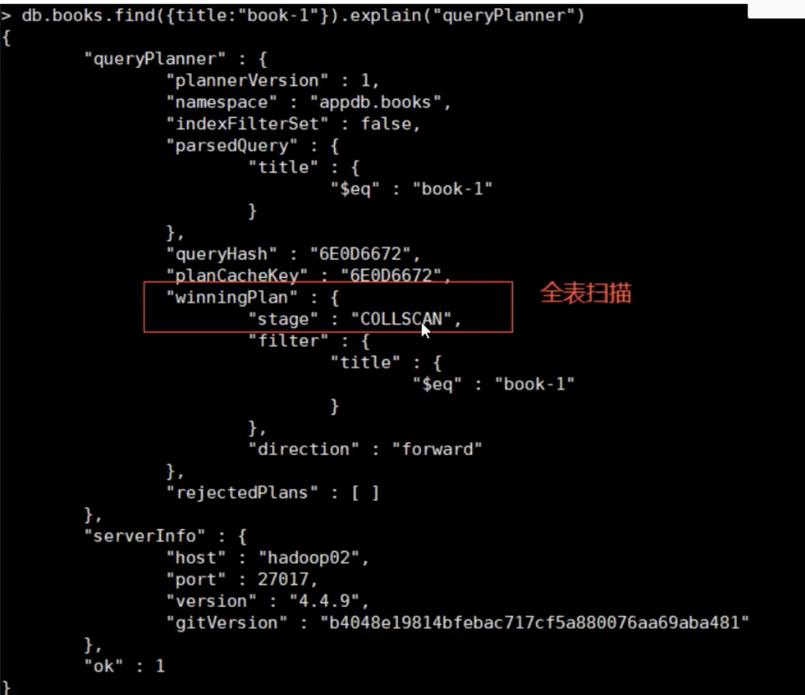
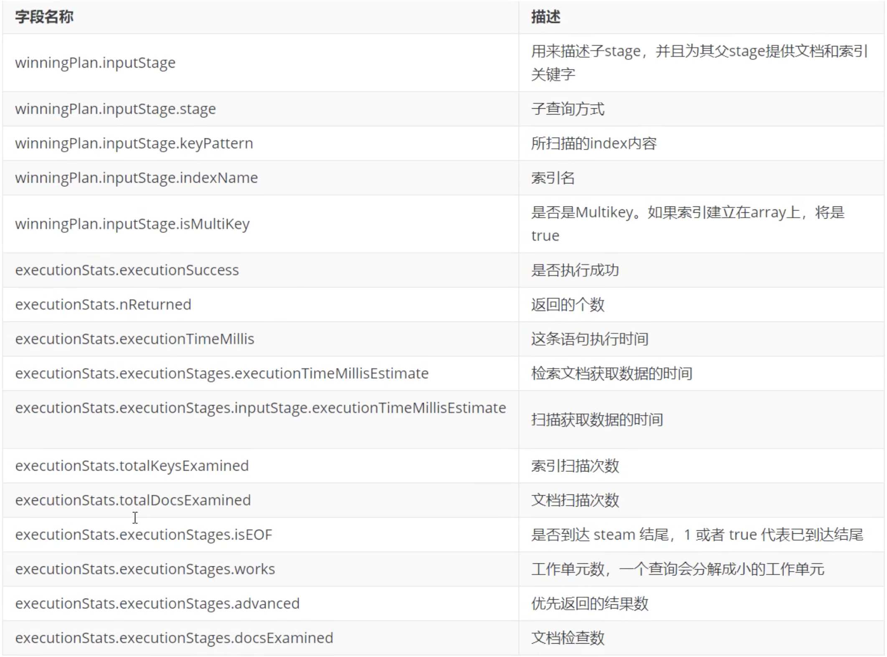
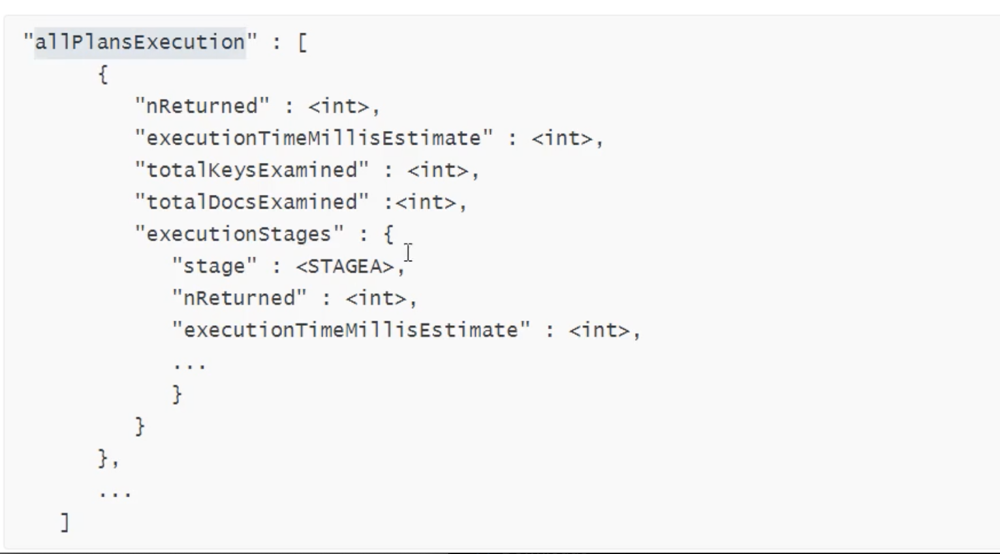
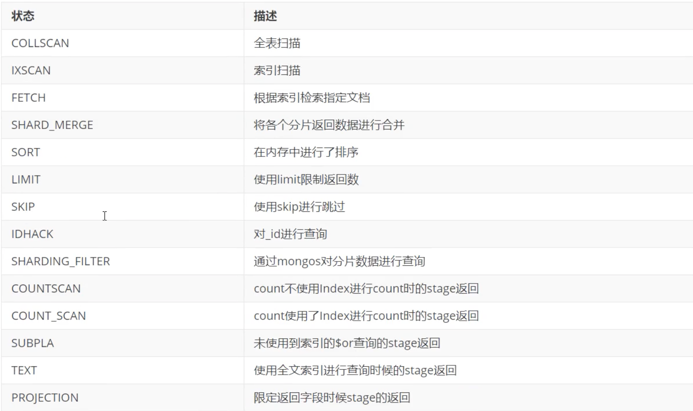

# **11 explain执行计划详解**

通常我们需要关心的问题： 

* 查询是否使用了索引 
* 索引是否减少了扫描的记录数量 
* 是否存在了低效的内存排序 

MongoDB提供了explain命令，它可以帮助我们评估指定查询模型(querymodel）的执行计划，根据实际情况进行调整，然后提高查询效率。 

explain(）方法的形式如下： 


```
db.collection.find().explain(<verbose>) 
```

verbose可选参数，表示执行计划的输出模式，默认queryPlanner 





**executionStats** 


executionStats模式的返回信息中包含了queryPlanner模式的所有字段，并且还包含了最佳执行计划的执行清况 

```
＃创建索引 
db.books.createIndex({title:1}) 

db.books.find({title:"book-1"}).explain("executionStats") 
```



**aliPlansExecution** 


allPlansExecution返回的信息包含executionStats模式的内容，且包含`allPlansExecution:[]`块 



**stage状态**



执行计划的返回结果中尽量不要出现以下stage: 

* COLLSCAN(全表扫描） 
* SORT（使用sort但是无index) 
* 不合理的SKIP 
* SUBPLA（未用到index的＄or) 
* COUNTSCAN（不使用index进行count) 
