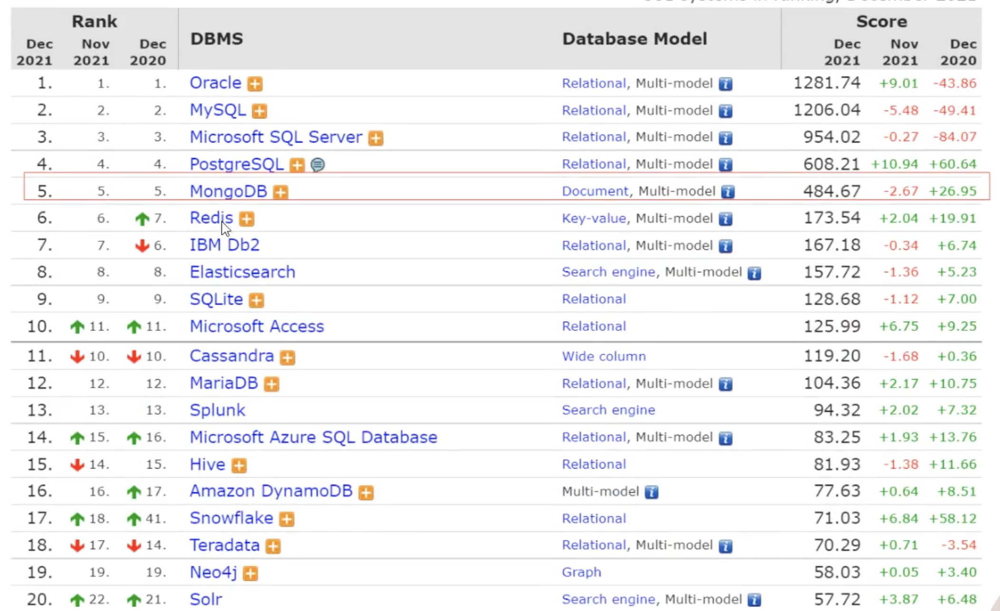
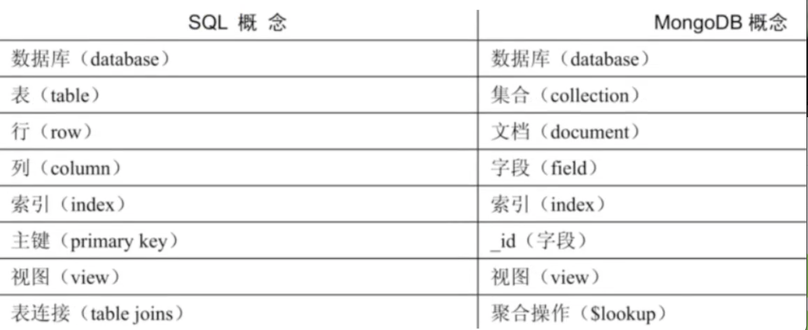
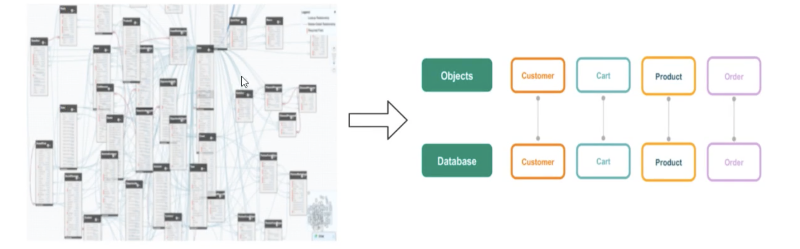
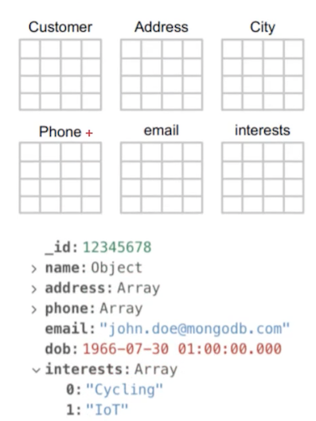
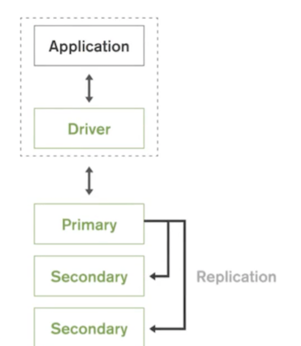
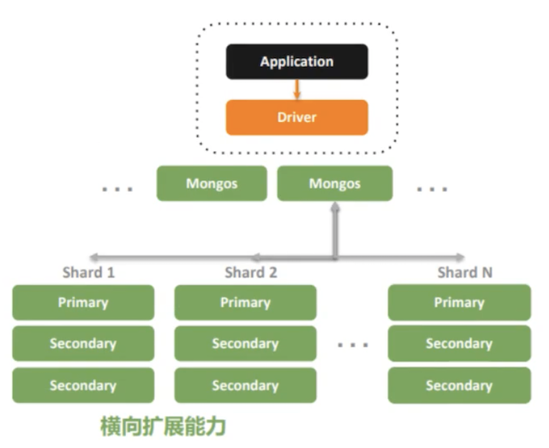
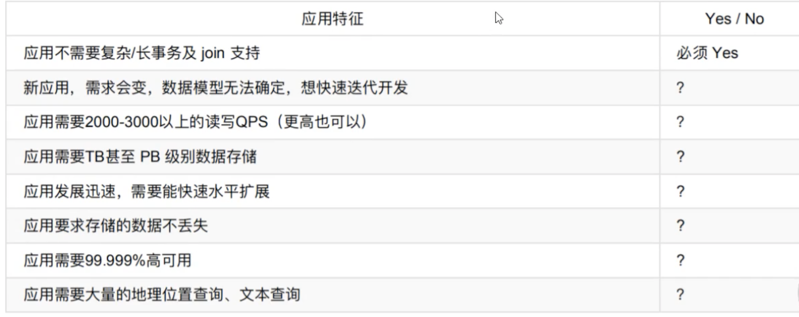

# **1 MongoDB介绍**

## **1.1 什么是MongoDB**

**MongoDB是一个文档数据库（以JSON为数据模型），由c+＋语言编写，旨在为WEB应用提供可扩展的高性能数据存储解决方案。** 

> 文档来自于 “JSON Document”，并非一般理解的PDF, WORD 文档。 

MongoDB是一个介于关系数据库和非关系数据库之间的产品，是非关系数据库当中功能最丰富，最像关系数据库的。

它支持的数据结构 非常松散，数据格式是BSON，一种类似于JSON的二进制形式的存储格式，简称Binary JSON，和JSON一样支持内嵌的文档对象和数组对象，因此可以存储比较复杂的数据类型。

MongoDB最大的特点是它支持的查询语言非常强大，其语法有点类似于面向对象的查询语言，几乎可以实现类似关系数据库单表查询的绝大部分功能，而且还支持对数据建立索引。

**<mark>原则上Oracle和MySQL能做的事情 MongoDB都能做（包括ACID事务）</mark>**

MongoDB在数据库总排名第5 指数持续上升。 仅次于Oracle、 MySQL等RDBMS，在NoSQL数据库排名首位。从诞生以来，其项目应用广度、社区活跃持续上升

MongoDB的概念与关系型数据库（RDBMS)非常类似

* 数据库（database)：最外层的概念，可以理解为逻辑上的名称空间，一个数据库包．含多个不同名称的集合。 
* **集合（Collection)：相当于SQL中的表，一个集合可以存放多个不同的文档**。 
* **文档（document)：一个文档相当于数据表中的一行，由多个不同的字段组成**。 
* **字段（field)：文档中的一个属性，等同于列（column)**。 
* 索引（index)：独立的检索式数据结构，与SQL概念一致。 
* Id:每个文档中都拥有一个唯一的id字段，相当于SQL中的主键(primary key)。 
* 视图（view）二可以看作一种虚拟的（非真实存在的）集合，与SQL中的视图类似。从MongoDB 3.4版本开始提供了视图功能，其通过聚合管道技术实现。 
* **聚合操作（`$lookup`):MongoDB用于实现“类似”表连接（tablejoin）的聚合操作符。** 

尽管这些概念大多与SQL标准定义类似，但MongoDB与传统RDBMS仍然存在不少差异，包括： 

* 半结构化，在一个集合中，文档所拥有的字段并不需要是泪同的，而且也不需要对所用的字段进行声明。**因此，MongoDB具有很明 显的半结构化特点。除了松散的表结构，文档还可以支持多级的嵌套、数组等灵活的数据类型，非常契合面向对象的编程模型**。 
* **弱关系，MongoDB没有外健的约束，也没有非常强大的表连接能力。类似的功能需要使用聚合管道技术来弥补**。 

## **1.2 MongoDB技术优势**

MongoDB基于灵活的JSON文档模型，非常适合敏捷式的快速开发。与此同时，其与生俱来的高可用、高水平扩展能力使得它在处理海 量、高并发的数据应用时颇具优势。 

* JSON结构和对象模型接近，开发代码量低 
* JSON的动态模型意味着更容易响应新的业务需求
* 复制集提供99.999％高可用 
* 分片架构支持海量数据和无缝扩司 

**<mark>简单直观：从错综复杂的关系模型到一目了然的对象模型 </mark>**

### **快速： 最简单的快速的开发方式**

JSON模型之快速特性： 

* **数据库引擎只需要在一个存储区读写** 
* 反范式、无关联的组织极大优化查询速度 
* 程序API自然，开发快速 

### **快速： 快速响应业务变化**

> 动态增加新字段

* **多形性**: 同一个集合中可以包含不同字段（类型）的文档对象 
* **动态性**；线上修改数据模式，**修改是应用与数据库均无须下线 **
* **据治理支持使用**: `JSON Schema`来规范数据模式。在保证模式灵活动态的前提下，提供数据治理能力 

### **MongoDB优势： 原生的高可用**

* Replica Set —— 2 to 50个成员 
* 自恢复 
* 多中，自容灾能力 
* 滚动服务一最小化服务终端 

### **MongoDB优势：横向扩展能力**

* 需要的时候无缝扩展 
* 应用全透明 
* 4多种数据分布策略 
* 轻松支持TB一PB数量级 

## **1.3 MongoDB**

应用场景 从目前阿里云MongoDB云数据库上的用户看，MongoDB的应用已经渗透到各个领域： 

* 游戏场景，使用MongoDB存诸旅戏用户信息，用户的装备、积分等直接以内嵌文档的形式存储，方便查询、更新； 
* 物流场景，使用MongoDB存储订单信息，订覃状态在运送过程中会不断更新，以MongoDB内嵌数组的形式来存储，一次查询就能 将订单所有的变更读取出来； 
* 社交场景，使用MongoDB存储存储用户信息，以及用户发表的朋友圈信息，通过地理位置索引实现附近的人、地点等功能； 
* 物联网场景，使用MongoDB存储所有接入的智能设备信息，以及一设备汇报的日志信息，并对这些信息进行多维度的分析； 
* 视频直播，使用MongoDB存储用户信息、礼物信息等； 
* 大数据应用，使用云数据库MongoDB作为大数据的云存储系统，随时进行数据提取分析，掌握行业动态。

### **如何考虑是否选择MongoDB?** 

没有某个业务场景必须要使用MongoDB才能解决，但使用MongoDB通常能让你以更低的成本解决问题。如果你不清楚当前业务是否适 合使用MongoDB，可以通过做几道选择题来辅助决策。 

