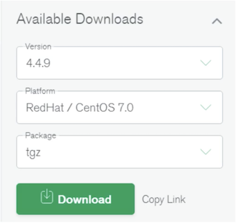
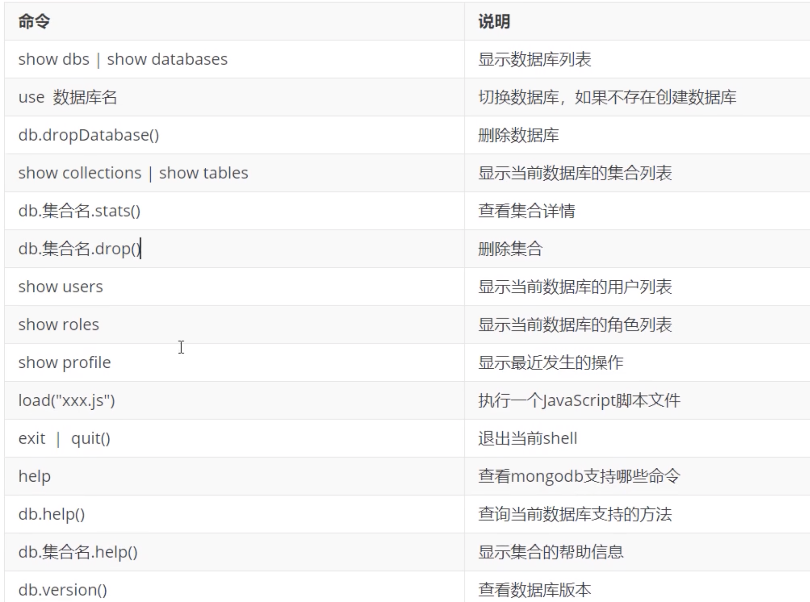
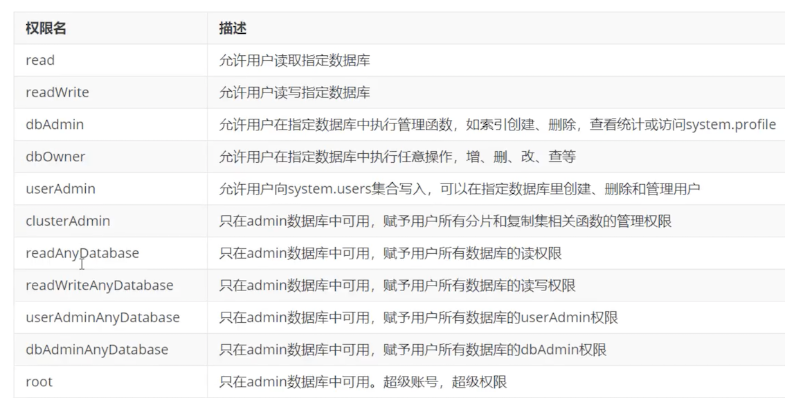

# **2 MongoDB 快速安装**

## **2.1 linux安装MongoDB 环境准备：** 

* linux系统：centos7 安装MongoDB社区版 

**下载MongoDB Community Server 下载地址**：

[https://www.mongodb.com/try/download/community](https://www.mongodb.com/try/download/community)




```
＃下载MongoDB

sudo su
wget https://fastdl.mongodb.org/linux/mongodb-linux-x86_64-rhel70-4.4.13.tgz

tar -zxvf mongodb-linux-x86_64-rhel70-4.4.13.tgz

cd mongodb-linux-x86_64-rhel70-4.4.13
```

```
# cd tmp/mongodb-linux-x86_64-rhel70-4.4.13/bin
# ./mongod --help
```


### **启动MongoDB Server** 

```
# 创建dbpath 和 logpath 
mkdir -p /mongodb/data /mongodb/log 

# 进入mongodb目录，启动mongodb服务 
bin/mongod --port=27017 --dbpath=/mongodb/data  --logpath=/mongodb/log/mongodb.log --bind_ip=0.0.0.0 --fork 
```

* `--dbpath`:指定数据文件存放目录
* `--logpath`:指定日志文件，注意是指定文件不是目录  
* `--logappend`:使用追加的方式记录日志 
* `--port`：指定端口，默认为27017
* `--bind_ip`:默认只监听locaihost网卡 
* `--fork`:后台启动 
* `--auth`:开启认证模式 

```
[root@jabox bin]# ./mongod --port=27017 --dbpath=/mongodb/data  --logpath=/mongodb/log/mongodb.log --bind_ip=0.0.0.0 --fork
about to fork child process, waiting until server is ready for connections.
forked process: 3087
child process started successfully, parent exiting
```

```
./mongo
MongoDB shell version v4.4.13
connecting to: mongodb://127.0.0.1:27017/?compressors=disabled&gssapiServiceName=mongodb
Implicit session: session { "id" : UUID("e688e93e-3a2a-4f13-9c38-c090a6b96762") }
MongoDB server version: 4.4.13
Welcome to the MongoDB shell.
For interactive help, type "help".
For more comprehensive documentation, see
	https://docs.mongodb.com/
Questions? Try the MongoDB Developer Community Forums
	https://community.mongodb.com
---
The server generated these startup warnings when booting:
        2022-03-22T09:56:35.598+00:00: Access control is not enabled for the database. Read and write access to data and configuration is unrestricted
        2022-03-22T09:56:35.598+00:00: You are running this process as the root user, which is not recommended
        2022-03-22T09:56:35.599+00:00: /sys/kernel/mm/transparent_hugepage/enabled is 'always'. We suggest setting it to 'never'
        2022-03-22T09:56:35.599+00:00: /sys/kernel/mm/transparent_hugepage/defrag is 'always'. We suggest setting it to 'never'
        2022-03-22T09:56:35.599+00:00: Soft rlimits too low
        2022-03-22T09:56:35.599+00:00:         currentValue: 1024
        2022-03-22T09:56:35.599+00:00:         recommendedMinimum: 64000
---
---
        Enable MongoDB's free cloud-based monitoring service, which will then receive and display
        metrics about your deployment (disk utilization, CPU, operation statistics, etc).

        The monitoring data will be available on a MongoDB website with a unique URL accessible to you
        and anyone you share the URL with. MongoDB may use this information to make product
        improvements and to suggest MongoDB products and deployment options to you.

        To enable free monitoring, run the following command: db.enableFreeMonitoring()
        To permanently disable this reminder, run the following command: db.disableFreeMonitoring()
---

> show dbs
admin   0.000GB
config  0.000GB
local   0.000GB
```

**关闭数据库**

```
> use admin
switched to db admin

db.shutdownServer()
server should be down...
```


### **环境变量启动**

```
sudo -i

vim .bash_profile
export MONGODATA=/mongodb/data 
export MONGOHOME=/home/vagrant/tmp/mongodb-linux-x86_64-rhel70-4.4.13
export MONGOTOOL=/home/vagrant/tmp/mongodb-database-tools-rhel70-x86_64-100.5.2
export PATH=$MONGOHOME/bin:$MONGOTOOL/bin::$PATH:.

source .bash_profile
```

```
[root]mongod --port=27017 --dbpath=/mongodb/data  --logpath=/mongodb/log/mongodb.log --bind_ip=0.0.0.0 --fork
```
```
mongo
MongoDB shell version v4.4.13
connecting to: mongodb://127.0.0.1:27017/?compressors=disabled&gssapiServiceName=mongodb
Implicit session: session { "id" : UUID("23fcb1a7-2a20-4f2b-8576-31643ae25961") }
MongoDB server version: 4.4.13

> show dbs
admin     0.000GB
config    0.000GB
local     0.000GB
```


### **利用配置文件启动服务**

```
mkdir /mongodb/conf/
```

编辑`/mongodb/conf/mongo.conf`文件，内容如下

**`vim /mongodb/conf/mongo.conf`**

``` 
systemLog:
  destination: file
  path: /mongodb/log/mongod.log    # log path
  logAppend: true
storage:
  dbPath: /mongodb/data #data directory
  engine: wiredTiger
  journal:
    enabled: true
net:
  bindIp: 0.0.0.0
  port: 27017  #port
processManagement:
  fork: true
```
注意：一定要yaml格式 

启动 mongod

```
# ./mongod -f /mongodb/conf/mongo.conf
about to fork child process, waiting until server is ready for connections.
forked process: 5618
child process started successfully, parent exiting
```

### **关闭MongoDB服务** 

**方式1:**

```
mongod --port=27017 --dbpath=/mongodb/data --shutdown 
```

```
# ./mongod --port=27017 --dbpath=/mongodb/data --shutdown
{"t":{"$date":"2022-03-22T10:48:58.873+00:00"},"s":"I",  "c":"CONTROL",  "id":23285,   "ctx":"main","msg":"Automatically disabling TLS 1.0, to force-enable TLS 1.0 specify --sslDisabledProtocols 'none'"}
{"t":{"$date":"2022-03-22T10:48:58.879+00:00"},"s":"W",  "c":"ASIO",     "id":22601,   "ctx":"main","msg":"No TransportLayer configured during NetworkInterface startup"}
{"t":{"$date":"2022-03-22T10:48:58.879+00:00"},"s":"I",  "c":"NETWORK",  "id":4648601, "ctx":"main","msg":"Implicit TCP FastOpen unavailable. If TCP FastOpen is required, set tcpFastOpenServer, tcpFastOpenClient, and tcpFastOpenQueueSize."}
killing process with pid: 5618
```


**方式2**

进入mongo shell 

```
> use admin
switched to db admin      # 必须在admin库使用

db.shutdownServer()
server should be down...   # 成功关闭mongoDB服务
```


## **2.2 Mongo Shell 使用**

是MongoDB的交互式`JavaScript Shell`界面，它为系统管理员提供了强大的界面，并为开发人员提供了直接测试数据库查询和操作 的方法。 

```
mongo --port=27017 
```

* `--port`: 指定定端口，默认为`27017` 
* `--host`: 连接的主机地址，默认为`127.0.0.1` 


### **JavaScript支持**

mongo shell是基于JavaScript语法的rMongoDB使用了SpiderMonkey作为其内部javaScript解释器引擎，这是由Mozilla官方提供的JavaScript内核解释器，该解释器也被同样用于大名鼎鼎的`Firefox`浏览器产品之中。

SpiderMonkey对`ECMA Script`标准兼容性非常好，可以支持`ECMA Script 6`。可以通过下面的命令JavaScript解释器的版本： 

```
./mongo

> interpreterVersion()
MozJS-60
```

**数据库操作**

```
＃查看所有库
show dbs

＃切换到指定数据库，不存在则创建 
use test 

＃删除与前数据库 
db.dropDatabase() 
```

**集合操作**

```
# 查看所有集合 
show collecdons 

＃创建集合 
db.createCollection ('emp") 

＃删除集合 
db.emp.drop() 
```

**创建集合语法**

```
db.createCollection(name, options) 
```

**Mongo Shell 常用命令**



**Options 参数**


## **2.3 安全认证** 

### **创建管理员账号**

```
＃设置管理员用户名密码需要切换到admin库
use admin 

＃创建管理员
db.createUser({user:"fox", pwd:"fox", roles: ["root"] }) 

Successfully added user: { "user" : "fox", "roles" : [ "root" ] }

# 查看所有用户信息 
show users  

{
	"_id" : "admin.fox",
	"userId" : UUID("8e6a0d0f-7204-4e94-b53f-c060b8b06a21"),
	"user" : "fox",
	"db" : "admin",
	"roles" : [
		{
			"role" : "root",
			"db" : "admin"
		}
	],
	"mechanisms" : [
		"SCRAM-SHA-1",
		"SCRAM-SHA-256"
	]
}

> db.auth("fox","fox")
1

# 删除用户 
db.dropUser("fox") 
```

### **常用权限**

```
{
	"role" : "__queryableBackup",
	"db" : "admin",
	"isBuiltin" : true,
	"roles" : [ ],
	"inheritedRoles" : [ ]
}
{
	"role" : "__system",
	"db" : "admin",
	"isBuiltin" : true,
	"roles" : [ ],
	"inheritedRoles" : [ ]
}
{
	"role" : "backup",
	"db" : "admin",
	"isBuiltin" : true,
	"roles" : [ ],
	"inheritedRoles" : [ ]
}
{
	"role" : "clusterAdmin",
	"db" : "admin",
	"isBuiltin" : true,
	"roles" : [ ],
	"inheritedRoles" : [ ]
}
{
	"role" : "clusterManager",
	"db" : "admin",
	"isBuiltin" : true,
	"roles" : [ ],
	"inheritedRoles" : [ ]
}
{
	"role" : "clusterMonitor",
	"db" : "admin",
	"isBuiltin" : true,
	"roles" : [ ],
	"inheritedRoles" : [ ]
}
{
	"role" : "dbAdmin",
	"db" : "admin",
	"isBuiltin" : true,
	"roles" : [ ],
	"inheritedRoles" : [ ]
}
{
	"role" : "dbAdminAnyDatabase",
	"db" : "admin",
	"isBuiltin" : true,
	"roles" : [ ],
	"inheritedRoles" : [ ]
}
{
	"role" : "dbOwner",
	"db" : "admin",
	"isBuiltin" : true,
	"roles" : [ ],
	"inheritedRoles" : [ ]
}
{
	"role" : "enableSharding",
	"db" : "admin",
	"isBuiltin" : true,
	"roles" : [ ],
	"inheritedRoles" : [ ]
}
{
	"role" : "hostManager",
	"db" : "admin",
	"isBuiltin" : true,
	"roles" : [ ],
	"inheritedRoles" : [ ]
}
{
	"role" : "read",
	"db" : "admin",
	"isBuiltin" : true,
	"roles" : [ ],
	"inheritedRoles" : [ ]
}
{
	"role" : "readAnyDatabase",
	"db" : "admin",
	"isBuiltin" : true,
	"roles" : [ ],
	"inheritedRoles" : [ ]
}
{
	"role" : "readWrite",
	"db" : "admin",
	"isBuiltin" : true,
	"roles" : [ ],
	"inheritedRoles" : [ ]
}
{
	"role" : "readWriteAnyDatabase",
	"db" : "admin",
	"isBuiltin" : true,
	"roles" : [ ],
	"inheritedRoles" : [ ]
}
{
	"role" : "restore",
	"db" : "admin",
	"isBuiltin" : true,
	"roles" : [ ],
	"inheritedRoles" : [ ]
}
{
	"role" : "root",
	"db" : "admin",
	"isBuiltin" : true,
	"roles" : [ ],
	"inheritedRoles" : [ ]
}
{
	"role" : "userAdmin",
	"db" : "admin",
	"isBuiltin" : true,
	"roles" : [ ],
	"inheritedRoles" : [ ]
}
{
	"role" : "userAdminAnyDatabase",
	"db" : "admin",
	"isBuiltin" : true,
	"roles" : [ ],
	"inheritedRoles" : [ ]
}
```

用户认证，返回1表示认证成功




### **创建应用数据库用户**

```
use appdb

db.createUser({user:"appdb", pwd:"jack", roles: ["dbOwner"] }) 
```

```
use appdb
switched to db appdb

db.createUser({user:"appdb", pwd:"jack", roles: ["dbOwner"] })
Successfully added user: { "user" : "appdb", "roles" : [ "dbOwner" ] }
```

```
> use admin
switched to db admin

db.shutdownServer()
server should be down...
```

默认情况下，MongoDB不会启用鉴权，以鉴权模式启动MongoDB

```
# ./mongod -f /mongodb/conf/mongo.conf --auth
about to fork child process, waiting until server is ready for connections.
forked process: 11967
child process started successfully, parent exiting
```

```
./mongo localhost:27017 -u fox -p fox --authenticationDatabase=admin

MongoDB shell version v4.4.13
connecting to: mongodb://localhost:27017/test?authSource=admin&compressors=disabled&gssapiServiceName=mongodb
Implicit session: session { "id" : UUID("b964da45-44d2-41e1-a0f6-ce06eed70b9d") }
MongoDB server version: 4.4.13

show dbs
admin   0.000GB
config  0.000GB
local   0.000GB
```

```
use appdb
> show users
{
	"_id" : "appdb.appdb",
	"userId" : UUID("472c8289-e2c9-42e9-ae1d-63ead575fad8"),
	"user" : "appdb",
	"db" : "appdb",
	"roles" : [
		{
			"role" : "dbOwner",
			"db" : "appdb"
		}
	],
	"mechanisms" : [
		"SCRAM-SHA-1",
		"SCRAM-SHA-256"
	]
}

./mongo localhost:27017 -u appdb -p jack --authenticationDatabase=appdb

MongoDB shell version v4.4.13
connecting to: mongodb://localhost:27017/test?authSource=appdb&compressors=disabled&gssapiServiceName=mongodb
Implicit session: session { "id" : UUID("ff0d8084-b915-4581-ae5a-cd203f061f9b") }
MongoDB server version: 4.4.13
```

