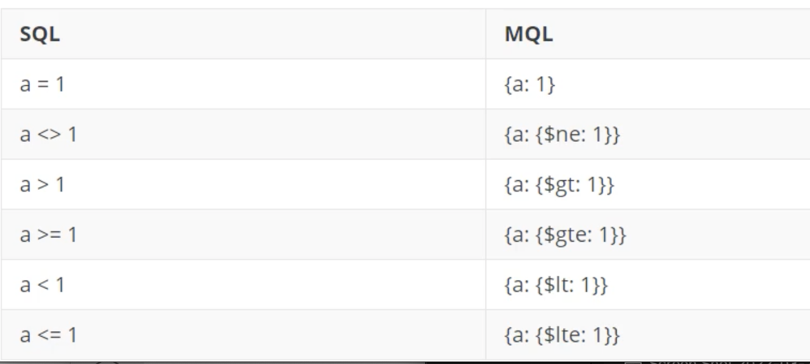
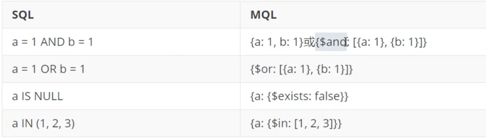
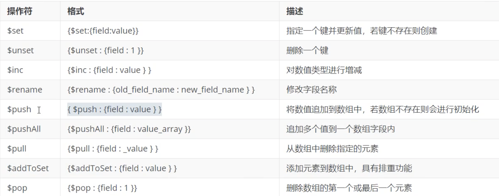

# **4. MongoDB文档操作** 


## **4.1 插入文档**

3.2 版本之后新增了`db.collection.insertOne()`和`db.collection.insertMany()`

### **新增单个文档**

* **InsertOne：支持 `writeConcern`**

```
db.collection.insertOne(
	<document>, 
	{ 
		writeConcern: <document> 
	} 
) 
```
 
> writeConcern 决定一个写操作落到多少个节点上才算成功。writeConcern的取值包括：
>  
> 0: 发起写操作，不关心是否成功； 
> 
> 1一 集群最大数据节点数：写操作需要被复制到指定节点数才算成功； 
> 
> majority：写操作需要被复制到大多数节点上才算成功。 

* insert: 若插入的数据主键已经存在，则会抛`DuplicateKeyException`异常，提示主键重复，不保存当前数据。 
* save：如果`_id`主键存在则更新数据，如果不存在就插入数据。 

```
cd tmp/mongodb/bin
```

```
> use appdb
switched to db appdb

> db.emps.save({x:1})
WriteResult({ "nInserted" : 1 })

> db.emps.save({x:2})
WriteResult({ "nInserted" : 1 })

> db.emps.insert({x:3})
WriteResult({ "nInserted" : 1 })

> db.emps.insertOne({x:3})
{
	"acknowledged" : true,
	"insertedId" : ObjectId("623af68d22bf9364d532766e")
}

> db.emps.find()
{ "_id" : ObjectId("623af5ed22bf9364d532766b"), "x" : 1 }
{ "_id" : ObjectId("623af5f622bf9364d532766c"), "x" : 2 }
{ "_id" : ObjectId("623af62622bf9364d532766d"), "x" : 3 }
{ "_id" : ObjectId("623af68d22bf9364d532766e"), "x" : 3 }
```

```
> db.user.insert({"name":"jacob"})
WriteResult({ "nInserted" : 1 })


> db.user.find()
{ "_id" : ObjectId("623af9c722bf9364d532766f"), "name" : "jacob" }

db.user.insert({"name":"jacob", "age":"31"})

> db.user.find()
{ "_id" : ObjectId("623af9c722bf9364d532766f"), "name" : "jacob" }
{ "_id" : ObjectId("623af9ff22bf9364d5327670"), "name" : "jacob", "age" : "31" }

> db.user.insertMany([{"name":"jack", "age":"30"}, {"name":"christine", "age":"28"}])
{
	"acknowledged" : true,
	"insertedIds" : [
		ObjectId("623afa4a22bf9364d5327671"),
		ObjectId("623afa4a22bf9364d5327672")
	]
}

> db.user.find()
{ "_id" : ObjectId("623af9c722bf9364d532766f"), "name" : "jacob" }
{ "_id" : ObjectId("623af9ff22bf9364d5327670"), "name" : "jacob", "age" : "31" }
{ "_id" : ObjectId("623afa4a22bf9364d5327671"), "name" : "jack", "age" : "30" }
{ "_id" : ObjectId("623afa4a22bf9364d5327672"), "name" : "christine", "age" : "28" }
```

### **批量新增文档** 

* `insertMany`：向指定集合中插入多条文档数据 

```
db.collection.insertMany(
	[ <document 1> <document 2>, ...], 
	{
		writeConcern: <document>, 
		ordered: <boolean>
	}
) 
```

* **writeConcern：写入策略，默认为 1, 即要求确认写操作，0是不要求**。 
* **ordered：指定是否按顺序写入，默认true，按顺序写入**。
* insert和save也可以实现批量插入 

```
> db.emps.insert([{x:3},{y:5}])
BulkWriteResult({
	"writeErrors" : [ ],
	"writeConcernErrors" : [ ],
	"nInserted" : 2,
	"nUpserted" : 0,
	"nMatched" : 0,
	"nModified" : 0,
	"nRemoved" : 0,
	"upserted" : [ ]
})
```
```
> db.emps.save([{x:3, y:0},{y:5, z:7}])
BulkWriteResult({
	"writeErrors" : [ ],
	"writeConcernErrors" : [ ],
	"nInserted" : 2,
	"nUpserted" : 0,
	"nMatched" : 0,
	"nModified" : 0,
	"nRemoved" : 0,
	"upserted" : [ ]
})
```

```
> db.emps.insertMany([{x:3, y:0},{y:5, z:7}])
{
	"acknowledged" : true,
	"insertedIds" : [
		ObjectId("623afead22bf9364d5327678"),
		ObjectId("623afead22bf9364d5327679")
	]
}
```

### **测试：**

批量插入50条随机数据 编辑脚本book.js 

```
var tags = ["nosql","mongodb","document","developer","popular"]; 
var types = ["technology","sociality","travel","novel","literature"]; 
var books=[]; 
for(var i=0;i<50;i++){ 
	var typeIdx = Math.floor(Math.random()*types.length); 
	var tagIdx = Math.floor(Math.random()*tags.length); 
	var favCount = Math.floor(Math.random()-100);
	var book = { 
		title: "book-" +i, 
		type: types[typeIdx], 
		tag: tags[tagIdx], 
		favCount: favCount, 
		author: "xxx"+i 
	};
	books.push(book)
} 
db.books.insertMany(books); 
```

**`vim book.js`**

```
[root@jabox bin]# ./mongo localhost:27017 -u appdb -p jack --authenticationDatabase=appdb
MongoDB shell version v4.4.13
connecting to: mongodb://localhost:27017/test?authSource=appdb&compressors=disabled&gssapiServiceName=mongodb
Implicit session: session { "id" : UUID("71e14edf-9b18-4acd-9a47-8f40178950b9") }
MongoDB server version: 4.4.13
> use appdb
switched to db appdb

> load("book.js")
true

> pwd()
/home/vagrant/tmp/mongodb-linux-x86_64-rhel70-4.4.13/bin

```

```
> db.books.find()
{ "_id" : ObjectId("623b0766b815b989a2335e75"), "title" : "book-0", "type" : "novel", "tag" : "document", "favCount" : -100, "author" : "xxx0" }
{ "_id" : ObjectId("623b0766b815b989a2335e76"), "title" : "book-1", "type" : "literature", "tag" : "mongodb", "favCount" : -100, "author" : "xxx1" }
{ "_id" : ObjectId("623b0766b815b989a2335e77"), "title" : "book-2", "type" : "sociality", "tag" : "mongodb", "favCount" : -100, "author" : "xxx2" }
{ "_id" : ObjectId("623b0766b815b989a2335e78"), "title" : "book-3", "type" : "sociality", "tag" : "popular", "favCount" : -100, "author" : "xxx3" }
{ "_id" : ObjectId("623b0766b815b989a2335e79"), "title" : "book-4", "type" : "literature", "tag" : "popular", "favCount" : -100, "author" : "xxx4" }
{ "_id" : ObjectId("623b0766b815b989a2335e7a"), "title" : "book-5", "type" : "technology", "tag" : "popular", "favCount" : -100, "author" : "xxx5" }
{ "_id" : ObjectId("623b0766b815b989a2335e7b"), "title" : "book-6", "type" : "travel", "tag" : "nosql", "favCount" : -100, "author" : "xxx6" }
{ "_id" : ObjectId("623b0766b815b989a2335e7c"), "title" : "book-7", "type" : "travel", "tag" : "mongodb", "favCount" : -100, "author" : "xxx7" }
{ "_id" : ObjectId("623b0766b815b989a2335e7d"), "title" : "book-8", "type" : "sociality", "tag" : "mongodb", "favCount" : -100, "author" : "xxx8" }
{ "_id" : ObjectId("623b0766b815b989a2335e7e"), "title" : "book-9", "type" : "sociality", "tag" : "popular", "favCount" : -100, "author" : "xxx9" }
{ "_id" : ObjectId("623b0766b815b989a2335e7f"), "title" : "book-10", "type" : "travel", "tag" : "nosql", "favCount" : -100, "author" : "xxx10" }
{ "_id" : ObjectId("623b0766b815b989a2335e80"), "title" : "book-11", "type" : "literature", "tag" : "popular", "favCount" : -100, "author" : "xxx11" }
{ "_id" : ObjectId("623b0766b815b989a2335e81"), "title" : "book-12", "type" : "novel", "tag" : "developer", "favCount" : -100, "author" : "xxx12" }
{ "_id" : ObjectId("623b0766b815b989a2335e82"), "title" : "book-13", "type" : "sociality", "tag" : "mongodb", "favCount" : -100, "author" : "xxx13" }
{ "_id" : ObjectId("623b0766b815b989a2335e83"), "title" : "book-14", "type" : "sociality", "tag" : "popular", "favCount" : -100, "author" : "xxx14" }
{ "_id" : ObjectId("623b0766b815b989a2335e84"), "title" : "book-15", "type" : "sociality", "tag" : "developer", "favCount" : -100, "author" : "xxx15" }
{ "_id" : ObjectId("623b0766b815b989a2335e85"), "title" : "book-16", "type" : "travel", "tag" : "developer", "favCount" : -100, "author" : "xxx16" }
{ "_id" : ObjectId("623b0766b815b989a2335e86"), "title" : "book-17", "type" : "travel", "tag" : "developer", "favCount" : -100, "author" : "xxx17" }
{ "_id" : ObjectId("623b0766b815b989a2335e87"), "title" : "book-18", "type" : "sociality", "tag" : "developer", "favCount" : -100, "author" : "xxx18" }
{ "_id" : ObjectId("623b0766b815b989a2335e88"), "title" : "book-19", "type" : "travel", "tag" : "mongodb", "favCount" : -100, "author" : "xxx19" }
Type "it" for more
```

## **3.2 查询文档**

`find` 查询集合中的若干文档。语法格式如下： 

```
db.collection.find(query, projection)
```

选择语言 

* query：可选, 使用查询操作符指定查询条件 
* projection: **可选，使用投影操作符指定返回的键。** 查询时返回文档中所有键值，只需省略该参数即可（默认省略）。**投影时，Id为1的时候， 其他字段必须为1; Id是0的时候，其他字段可以是0；如果没有`_id`字段约束，多个同为0或同。** 

```
> show tables
books
emps
user

> db.books.find()
{ "_id" : ObjectId("623b0766b815b989a2335e75"), "title" : "book-0", "type" : "novel", "tag" : "document", "favCount" : -100, "author" : "xxx0" }
{ "_id" : ObjectId("623b0766b815b989a2335e76"), "title" : "book-1", "type" : "literature", "tag" : "mongodb", "favCount" : -100, "author" : "xxx1" }
...
```

如果查询返回的条目数量较多，mongo shell则会自动实现分批显示。**默认倩况下每次只显示20。条，可以输入`it`命令读取下一批**。 findOne查询集合中的第一个文档。语法格式如下： 

```
> it
{ "_id" : ObjectId("623b0766b815b989a2335e9d"), "title" : "book-40", "type" : "technology", "tag" : "developer", "favCount" : -100, "author" : "xxx40" }
{ "_id" : ObjectId("623b0766b815b989a2335e9e"), "title" : "book-41", "type" : "novel", "tag" : "developer", "favCount" : -100, "author" : "xxx41" }
{ "_id" : ObjectId("623b0766b815b989a2335e9f"), "title" : "book-42", "type" : "novel", "tag" : "nosql", "favCount" : -100, "author" : "xxx42" }
{ "_id" : ObjectId("623b0766b815b989a2335ea0"), "title" : "book-43", "type" : "novel", "tag" : "document", "favCount" : -100, "author" : "xxx43" }
...
```

```
> db.books.find({title:"book-20"})
{ "_id" : ObjectId("623b0766b815b989a2335e89"), "title" : "book-20", "type" : "sociality", "tag" : "document", "favCount" : -100, "author" : "xxx20" }
```


```
> db.books.find({type:"travel", tag:"developer"})
{ "_id" : ObjectId("623b0766b815b989a2335e85"), "title" : "book-16", "type" : "travel", "tag" : "developer", "favCount" : -100, "author" : "xxx16" }
{ "_id" : ObjectId("623b0766b815b989a2335e86"), "title" : "book-17", "type" : "travel", "tag" : "developer", "favCount" : -100, "author" : "xxx17" }
{ "_id" : ObjectId("623b0766b815b989a2335e92"), "title" : "book-29", "type" : "travel", "tag" : "developer", "favCount" : -100, "author" : "xxx29" }
```

```
> db.books.find({type:"travel", tag:"developer"},{title:1,favCount:1})

{ "_id" : ObjectId("623b0766b815b989a2335e85"), "title" : "book-16", "favCount" : -100 }
{ "_id" : ObjectId("623b0766b815b989a2335e86"), "title" : "book-17", "favCount" : -100 }
{ "_id" : ObjectId("623b0766b815b989a2335e92"), "title" : "book-29", "favCount" : -100 }
```


```
> db.books.findOne({type:"travel", tag:"developer"},{title:1,favCount:1})
{
	"_id" : ObjectId("623b0766b815b989a2335e85"),
	"title" : "book-16",
	"favCount" : -100
}
```

### **条件查询**

**指定条件查询**

```
＃查询带有nosql标签的book文档
db.books.find({tag:"nosql"})


> db.books.find({tag:"nosql"})
{ "_id" : ObjectId("623b0766b815b989a2335e7b"), "title" : "book-6", "type" : "travel", "tag" : "nosql", "favCount" : -100, "author" : "xxx6" }
{ "_id" : ObjectId("623b0766b815b989a2335e7f"), "title" : "book-10", "type" : "travel", "tag" : "nosql", "favCount" : -100, "author" : "xxx10" }
{ "_id" : ObjectId("623b0766b815b989a2335e8c"), "title" : "book-23", "type" : "sociality", "tag" : "nosql", "favCount" : -100, "author" : "xxx23" }
{ "_id" : ObjectId("623b0766b815b989a2335e8f"), "title" : "book-26", "type" : "literature", "tag" : "nosql", "favCount" : -100, "author" : "xxx26" }
{ "_id" : ObjectId("623b0766b815b989a2335e94"), "title" : "book-31", "type" : "technology", "tag" : "nosql", "favCount" : -100, "author" : "xxx31" }
{ "_id" : ObjectId("623b0766b815b989a2335e99"), "title" : "book-36", "type" : "travel", "tag" : "nosql", "favCount" : -100, "author" : "xxx36" }
{ "_id" : ObjectId("623b0766b815b989a2335e9f"), "title" : "book-42", "type" : "novel", "tag" : "nosql", "favCount" : -100, "author" : "xxx42" }
{ "_id" : ObjectId("623b0766b815b989a2335ea2"), "title" : "book-45", "type" : "travel", "tag" : "nosql", "favCount" : -100, "author" : "xxx45" }
{ "_id" : ObjectId("623b0766b815b989a2335ea5"), "title" : "book-48", "type" : "literature", "tag" : "nosql", "favCount" : -100, "author" : "xxx48" }
{ "_id" : ObjectId("623b0766b815b989a2335ea6"), "title" : "book-49", "type" : "sociality", "tag" : "nosql", "favCount" : -100, "author" : "xxx49" }
```


```
按照Id查询单个book文档： 

> db.books.find({_id:ObjectId("623b0766b815b989a2335e8f")})
{ "_id" : ObjectId("623b0766b815b989a2335e8f"), "title" : "book-26", "type" : "literature", "tag" : "nosql", "favCount" : -100, "author" : "xxx26" }
```


```
＃汽询分类为"travel"、收藏数超过60个的book之档： 

db.books.find({type:"travel",favCount:{$gt:60}}) 
```

### **查询条件对照表**




### **查询逻辑对照表**



```
db.books.find({tag:{$in:["nosql","document"]}}) 
```

```
> db.books.find({tag:{$in:["nosql","document"]}})
{ "_id" : ObjectId("623b0766b815b989a2335e75"), "title" : "book-0", "type" : "novel", "tag" : "document", "favCount" : -100, "author" : "xxx0" }
{ "_id" : ObjectId("623b0766b815b989a2335e7b"), "title" : "book-6", "type" : "travel", "tag" : "nosql", "favCount" : -100, "author" : "xxx6" }
{ "_id" : ObjectId("623b0766b815b989a2335e7f"), "title" : "book-10", "type" : "travel", "tag" : "nosql", "favCount" : -100, "author" : "xxx10" }
{ "_id" : ObjectId("623b0766b815b989a2335e89"), "title" : "book-20", "type" : "sociality", "tag" : "document", "favCount" : -100, "author" : "xxx20" }
{ "_id" : ObjectId("623b0766b815b989a2335e8c"), "title" : "book-23", "type" : "sociality", "tag" : "nosql", "favCount" : -100, "author" : "xxx23" }
{ "_id" : ObjectId("623b0766b815b989a2335e8f"), "title" : "book-26", "type" : "literature", "tag" : "nosql", "favCount" : -100, "author" : "xxx26" }
{ "_id" : ObjectId("623b0766b815b989a2335e90"), "title" : "book-27", "type" : "technology", "tag" : "document", "favCount" : -100, "author" : "xxx27" }
{ "_id" : ObjectId("623b0766b815b989a2335e93"), "title" : "book-30", "type" : "travel", "tag" : "document", "favCount" : -100, "author" : "xxx30" }
...
```


### **查询逻辑运算符**.

* `$It`：存在并小于
* `$Ite`:存在并小于等于 
* `$gt`: 存在并大于 
* `$gte`:	存在并大于等于 
* `$ne`: 不存在或存在但不等于 
* `$in`：存在并在指定数组中 
* `$nin`:不存在或不在指定数组中 
* `$or`：匹配两个或多个条件中的一个 
* `$and`:匹配全部条件 


```
> db.books.find({$and:[{tag:"nosql"}, {favCount:{$gte:-100}}]})
{ "_id" : ObjectId("623b0766b815b989a2335e7b"), "title" : "book-6", "type" : "travel", "tag" : "nosql", "favCount" : -100, "author" : "xxx6" }
{ "_id" : ObjectId("623b0766b815b989a2335e7f"), "title" : "book-10", "type" : "travel", "tag" : "nosql", "favCount" : -100, "author" : "xxx10" }
{ "_id" : ObjectId("623b0766b815b989a2335e8c"), "title" : "book-23", "type" : "sociality", "tag" : "nosql", "favCount" : -100, "author" : "xxx23" }
{ "_id" : ObjectId("623b0766b815b989a2335e8f"), "title" : "book-26", "type" : "literature", "tag" : "nosql", "favCount" : -100, "author" : "xxx26" }
{ "_id" : ObjectId("623b0766b815b989a2335e94"), "title" : "book-31", "type" : "technology", "tag" : "nosql", "favCount" : -100, "author" : "xxx31" }
{ "_id" : ObjectId("623b0766b815b989a2335e99"), "title" : "book-36", "type" : "travel", "tag" : "nosql", "favCount" : -100, "author" : "xxx36" }
{ "_id" : ObjectId("623b0766b815b989a2335e9f"), "title" : "book-42", "type" : "novel", "tag" : "nosql", "favCount" : -100, "author" : "xxx42" }
{ "_id" : ObjectId("623b0766b815b989a2335ea2"), "title" : "book-45", "type" : "travel", "tag" : "nosql", "favCount" : -100, "author" : "xxx45" }
{ "_id" : ObjectId("623b0766b815b989a2335ea5"), "title" : "book-48", "type" : "literature", "tag" : "nosql", "favCount" : -100, "author" : "xxx48" }
{ "_id" : ObjectId("623b0766b815b989a2335ea6"), "title" : "book-49", "type" : "sociality", "tag" : "nosql", "favCount" : -100, "author" : "xxx49" }
```


### **排序＆分页**

**指定排序:**

**在MongoDB中使用`sort()`方法对数据进行排序**

```
＃指定按收藏数(favcount）降序返回 
db.books.find({type:"travel"}).sort({favCount:-1}) 
```


**分页查询** 

skip用于指定跳过记录数，limit 则用于限定返回结果数量。可以在执行`find`命令的同时指定skip,limit参数，一次实现分页的功能。比如，假定每页大小为8条， 查询第3页的book文档：

```
> db.books.find().skip(8).limit(4)
{ "_id" : ObjectId("623b0766b815b989a2335e7d"), "title" : "book-8", "type" : "sociality", "tag" : "mongodb", "favCount" : -100, "author" : "xxx8" }
{ "_id" : ObjectId("623b0766b815b989a2335e7e"), "title" : "book-9", "type" : "sociality", "tag" : "popular", "favCount" : -100, "author" : "xxx9" }
{ "_id" : ObjectId("623b0766b815b989a2335e7f"), "title" : "book-10", "type" : "travel", "tag" : "nosql", "favCount" : -100, "author" : "xxx10" }
{ "_id" : ObjectId("623b0766b815b989a2335e80"), "title" : "book-11", "type" : "literature", "tag" : "popular", "favCount" : -100, "author" : "xxx11" }
```

```
> db.books.find({tag:{$in:["nosql","document"]}}).sort({favCount:-1})
{ "_id" : ObjectId("623b0766b815b989a2335e75"), "title" : "book-0", "type" : "novel", "tag" : "document", "favCount" : -100, "author" : "xxx0" }
{ "_id" : ObjectId("623b0766b815b989a2335e7b"), "title" : "book-6", "type" : "travel", "tag" : "nosql", "favCount" : -100, "author" : "xxx6" }
{ "_id" : ObjectId("623b0766b815b989a2335e7f"), "title" : "book-10", "type" : "travel", "tag" : "nosql", "favCount" : -100, "author" : "xxx10" }
{ "_id" : ObjectId("623b0766b815b989a2335e89"), "title" : "book-20", "type" : "sociality", "tag" : "document", "favCount" : -100, "author" : "xxx20" }
{ "_id" : ObjectId("623b0766b815b989a2335e8c"), "title" : "book-23", "type" : "sociality", "tag" : "nosql", "favCount" : -100, "author" : "xxx23" }
...
```

### **正则表达式匹配查询**

MongoDB使用`$regex`操作符来设置匹配字符串的正则表达式。

```
//使用止则表达式查找type包含so 字符串的 books
db.books.find({type:{$regex:"so"}}) 

> db.books.find({type:{$regex:"so"}})
{ "_id" : ObjectId("623b0766b815b989a2335e77"), "title" : "book-2", "type" : "sociality", "tag" : "mongodb", "favCount" : -100, "author" : "xxx2" }
{ "_id" : ObjectId("623b0766b815b989a2335e78"), "title" : "book-3", "type" : "sociality", "tag" : "popular", "favCount" : -100, "author" : "xxx3" }


/／或者 
db.books.find({type:/so/}) 

db.books.find({type:/so/})
{ "_id" : ObjectId("623b0766b815b989a2335e77"), "title" : "book-2", "type" : "sociality", "tag" : "mongodb", "favCount" : -100, "author" : "xxx2" }
{ "_id" : ObjectId("623b0766b815b989a2335e78"), "title" : "book-3", "type" : "sociality", "tag" : "popular", "favCount" : -100, "author" : "xxx3" }
{ "_id" : ObjectId("623b0766b815b989a2335e7d"), "title" : "book-8", "type" : "sociality", "tag" : "mongodb", "favCount" : -100, "author" : "xxx8" }
```

## **3.3 更新文档** 


可以用update命令对指定的数据进行更新，命令的格式如下： 

```
db.collection.update(query,update,options)
```


* query： 描述更新的查询条件； 
* update:	描述更新的动作及新的内容 
* options：描述更新的选项 
	* upsert：可选，如果不存在update的记录，是否插入新的i己录。默认false，不插入 
	* multi: 可选，是否按条件查询出的多条记录全部更新。默认false，只更新找到的第一条记录 
	* **writeConcern：可选，决定一个写操作落到多少个节点上才算成功。** 


### **更新操作符**



### **更新单个文档** 

某个`book`文档被收藏了，则需要将该文档的`favCount` 字段自增

```
> show dbs
appdb  0.000GB
> use appdb
switched to db appdb
> show tables
books
emps
user
```

```
db.books.update({_id: ObjectId("623b0766b815b989a2335e84")},{$inc:{favCount: 160}})
```

```
db.books.update({_id: ObjectId("623b0766b815b989a2335e84")},{$inc:{favCount: 160}})
WriteResult({ "nMatched" : 1, "nUpserted" : 0, "nModified" : 1 })
```

### **更新多个文档**

默认情况下，update命令只在更新第一个文档之后返回，如果需要更新多个文档，则可以使用multi选项。

**将分类为"novel"的文档的增加发布时间（publishedDate)**

```
db.books.update({tag: "novel"},{$set:{publishDate: new Date()}}, {"multi": true})
```

```
> db.books.find({tag: "nosql"})
{ "_id" : ObjectId("623b0766b815b989a2335e7b"), "title" : "book-6", "type" : "travel", "tag" : "nosql", "favCount" : -100, "author" : "xxx6" }
{ "_id" : ObjectId("623b0766b815b989a2335e7f"), "title" : "book-10", "type" : "travel", "tag" : "nosql", "favCount" : -100, "author" : "xxx10" }
{ "_id" : ObjectId("623b0766b815b989a2335e8c"), "title" : "book-23", "type" : "sociality", "tag" : "nosql", "favCount" : -100, "author" : "xxx23" }
{ "_id" : ObjectId("623b0766b815b989a2335e8f"), "title" : "book-26", "type" : "literature", "tag" : "nosql", "favCount" : -100, "author" : "xxx26" }
{ "_id" : ObjectId("623b0766b815b989a2335e94"), "title" : "book-31", "type" : "technology", "tag" : "nosql", "favCount" : -100, "author" : "xxx31" }
{ "_id" : ObjectId("623b0766b815b989a2335e99"), "title" : "book-36", "type" : "travel", "tag" : "nosql", "favCount" : -100, "author" : "xxx36" }
{ "_id" : ObjectId("623b0766b815b989a2335e9f"), "title" : "book-42", "type" : "novel", "tag" : "nosql", "favCount" : -100, "author" : "xxx42" }
{ "_id" : ObjectId("623b0766b815b989a2335ea2"), "title" : "book-45", "type" : "travel", "tag" : "nosql", "favCount" : -100, "author" : "xxx45" }
{ "_id" : ObjectId("623b0766b815b989a2335ea5"), "title" : "book-48", "type" : "literature", "tag" : "nosql", "favCount" : -100, "author" : "xxx48" }
{ "_id" : ObjectId("623b0766b815b989a2335ea6"), "title" : "book-49", "type" : "sociality", "tag" : "nosql", "favCount" : -100, "author" : "xxx49" }
```

```
db.books.update({tag: "nosql"},{$set:{publishDate: new Date()}})
```

```
db.books.update({tag: "nosql"},{$set:{publishDate: new Date()}})
WriteResult({ "nMatched" : 1, "nUpserted" : 0, "nModified" : 1 })
```

```
> db.books.update({tag: "nosql"},{$set:{publishDate: new Date()}}, {"multi": true})
WriteResult({ "nMatched" : 10, "nUpserted" : 0, "nModified" : 10 })
```
> multi:可选，mongodb默认是false，只更新找到的第一条记录，如果这个参数为true，就把按条件查出来多条记录全部更新 

```
> db.books.find({tag: "nosql"})
{ "_id" : ObjectId("623b0766b815b989a2335e7b"), "title" : "book-6", "type" : "travel", "tag" : "nosql", "favCount" : -100, "author" : "xxx6", "publishDate" : ISODate("2022-03-26T09:09:54.851Z") }
{ "_id" : ObjectId("623b0766b815b989a2335e7f"), "title" : "book-10", "type" : "travel", "tag" : "nosql", "favCount" : -100, "author" : "xxx10", "publishDate" : ISODate("2022-03-26T09:09:54.851Z") }
{ "_id" : ObjectId("623b0766b815b989a2335e8c"), "title" : "book-23", "type" : "sociality", "tag" : "nosql", "favCount" : -100, "author" : "xxx23", "publishDate" : ISODate("2022-03-26T09:09:54.851Z") }
{ "_id" : ObjectId("623b0766b815b989a2335e8f"), "title" : "book-26", "type" : "literature", "tag" : "nosql", "favCount" : -100, "author" : "xxx26", "publishDate" : ISODate("2022-03-26T09:09:54.851Z") }
{ "_id" : ObjectId("623b0766b815b989a2335e94"), "title" : "book-31", "type" : "technology", "tag" : "nosql", "favCount" : -100, "author" : "xxx31", "publishDate" : ISODate("2022-03-26T09:09:54.851Z") }
{ "_id" : ObjectId("623b0766b815b989a2335e99"), "title" : "book-36", "type" : "travel", "tag" : "nosql", "favCount" : -100, "author" : "xxx36", "publishDate" : ISODate("2022-03-26T09:09:54.851Z") }
{ "_id" : ObjectId("623b0766b815b989a2335e9f"), "title" : "book-42", "type" : "novel", "tag" : "nosql", "favCount" : -100, "author" : "xxx42", "publishDate" : ISODate("2022-03-26T09:09:54.851Z") }
{ "_id" : ObjectId("623b0766b815b989a2335ea2"), "title" : "book-45", "type" : "travel", "tag" : "nosql", "favCount" : -100, "author" : "xxx45", "publishDate" : ISODate("2022-03-26T09:09:54.851Z") }
{ "_id" : ObjectId("623b0766b815b989a2335ea5"), "title" : "book-48", "type" : "literature", "tag" : "nosql", "favCount" : -100, "author" : "xxx48", "publishDate" : ISODate("2022-03-26T09:09:54.851Z") }
{ "_id" : ObjectId("623b0766b815b989a2335ea6"), "title" : "book-49", "type" : "sociality", "tag" : "nosql", "favCount" : -100, "author" : "xxx49", "publishDate" : ISODate("2022-03-26T09:09:54.851Z") }
```


update命令的选项配置较多，为了简化使用还可以使用一些快捷命令： 

* updateOne:更新单个文档。 
* updateMany：更新多个文档。 
* replaceOne：替换单个文档。 

```
> db.books.updateMany({type: "novel"},{$set:{publishDate: new Date()}})
```

```
> db.books.updateMany({type: "novel"},{$set:{publishDate: new Date()}})
{ "acknowledged" : true, "matchedCount" : 9, "modifiedCount" : 9 }

> db.books.find({type: "novel"})
{ "_id" : ObjectId("623b0766b815b989a2335e75"), "title" : "book-0", "type" : "novel", "tag" : "document", "favCount" : -100, "author" : "xxx0", "publishDate" : ISODate("2022-03-26T09:17:39.729Z") }
{ "_id" : ObjectId("623b0766b815b989a2335e81"), "title" : "book-12", "type" : "novel", "tag" : "developer", "favCount" : -100, "author" : "xxx12", "publishDate" : ISODate("2022-03-26T09:17:39.729Z") }
{ "_id" : ObjectId("623b0766b815b989a2335e8b"), "title" : "book-22", "type" : "novel", "tag" : "mongodb", "favCount" : -100, "author" : "xxx22", "publishDate" : ISODate("2022-03-26T09:17:39.729Z") }
{ "_id" : ObjectId("623b0766b815b989a2335e96"), "title" : "book-33", "type" : "novel", "tag" : "popular", "favCount" : -100, "author" : "xxx33", "publishDate" : ISODate("2022-03-26T09:17:39.729Z") }
```

### **使用upsert命令** 

Upsert是一种特殊的更新，其表现为如果目标文档不存在，则执行插入命令。 

```
db.books.update( 
	{title:"my book"},
	{$set:{tags:["nosql","mongodb"] ,type:"none", author:"jacob"}},
	{upsert:true}
)
```

```
> db.books.update(
... {title:"my book"},
... {$set:{tags:["nosql","mongodb"] ,type:"none", author:"jacob"}},
... {upsert:true}
... )
WriteResult({
	"nMatched" : 0,
	"nUpserted" : 1,
	"nModified" : 0,
	"_id" : ObjectId("623edc883d8c8e61e23b57c3")
})
```

**nMatched, nModified都为0，表示没有文档被匹配及更新，`nUpserted=1`提示执行了`Upsert`动作** 


```
> db.books.find({title: "my book"})
{ "_id" : ObjectId("623edc883d8c8e61e23b57c3"), "title" : "my book", "author" : "jacob", "tags" : [ "nosql", "mongodb" ], "type" : "none" }
```


### **实现replace语义**

update命令中的更新描述（update)通常由操作符描述，如果更新描述中不包含任何操作符，那么MongoDB会实现文档的replace语义 

```
db.books.update( 
	{title:"my book"}, 
	{justTitle:"my first book"} 
)
```

```
> db.books.update(
... {title:"my book"},
... {justTitle:"my first book"}
... )
WriteResult({ "nMatched" : 1, "nUpserted" : 0, "nModified" : 1 })
```

```
> db.books.find({justTitle:"my first book"})
{ "_id" : ObjectId("623edc883d8c8e61e23b57c3"), "justTitle" : "my first book" }
```

### **findAndModify命令**

`findAndModify`兼容了查询和修改指定文档的功能，`findAndModify`只能更新单个文档 

```
//将某个book文档的收藏数（favCount)加1
db.books.findAndModify({
	query: {_id: ObjectId("623b0766b815b989a2335e75")},
	update: {$inc:{favCount: 130}}
})
```
```
> db.books.findAndModify({
... query: {_id: ObjectId("623b0766b815b989a2335e75")},
... update: {$inc:{favCount: 130}}
... })
{
	"_id" : ObjectId("623b0766b815b989a2335e75"),
	"title" : "book-0",
	"type" : "novel",
	"tag" : "document",
	"favCount" : -100,
	"author" : "xxx0",
	"publishDate" : ISODate("2022-03-26T09:17:39.729Z")
}
```

该操作会返回符合查询条件的文档数据，并完成对文档的修改。 

```
db.books.find({"_id": ObjectId("623b0766b815b989a2335e75")})
```
```
> db.books.find({"_id": ObjectId("623b0766b815b989a2335e75")})
{ "_id" : ObjectId("623b0766b815b989a2335e75"), "title" : "book-0", "type" : "novel", "tag" : "document", "favCount" : 30, "author" : "xxx0", "publishDate" : ISODate("2022-03-26T09:17:39.729Z") }
```

**`"favCount" : 30, "author" : "xxx0", "publishDate" : `**

**默认情况下，findAndModify会返回修改前的“旧“数据。如果希望返回修改改后的数据，则可以指定new选项**

**`new: true`**


```
db.books.findAndModify({
	query: {_id: ObjectId("623b0766b815b989a2335e75")},
	update: {$inc:{favCount: 130}},
	new: true
})

> db.books.findAndModify({
... query: {_id: ObjectId("623b0766b815b989a2335e75")},
... update: {$inc:{favCount: 130}},
... new: true
... })
{
	"_id" : ObjectId("623b0766b815b989a2335e75"),
	"title" : "book-0",
	"type" : "novel",
	"tag" : "document",
	"favCount" : 160,
	"author" : "xxx0",
	"publishDate" : ISODate("2022-03-26T09:17:39.729Z")
}
```

与findAndModify语义相近的命令如下 

* findOneAndUpdate:更新单个文档并返回更新前（或更新后）的文档。 
* findOneAndRepIace:替换单个文档并返回替换前（或替换后）的文档。 


