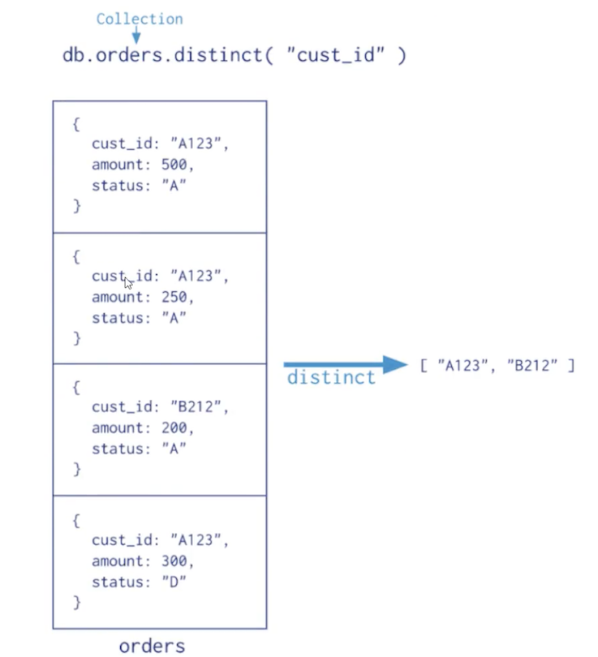
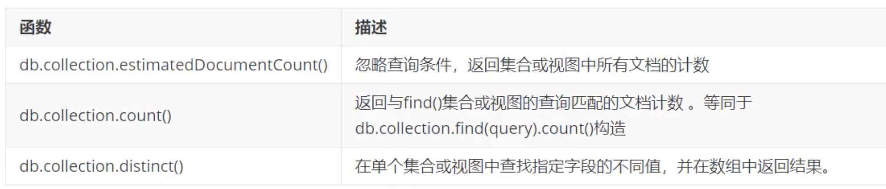
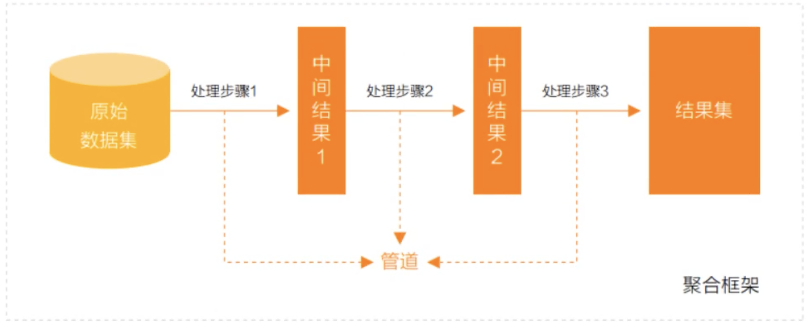
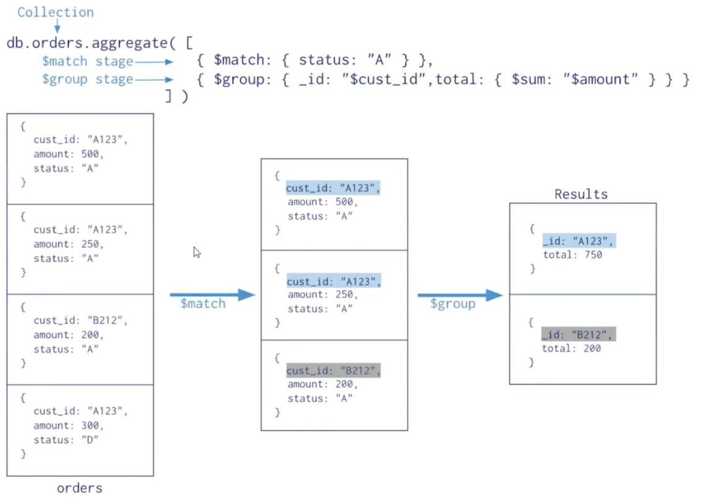
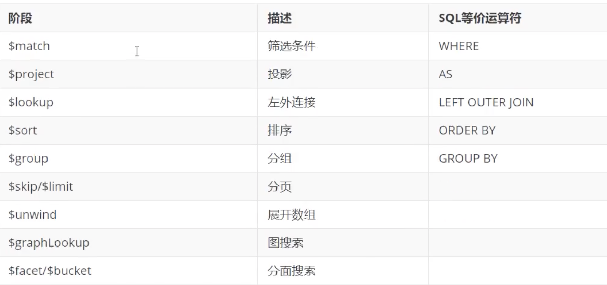
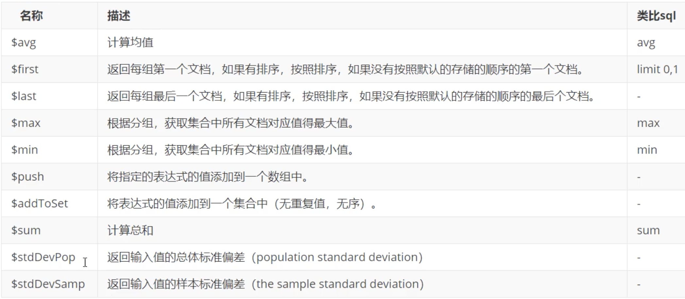
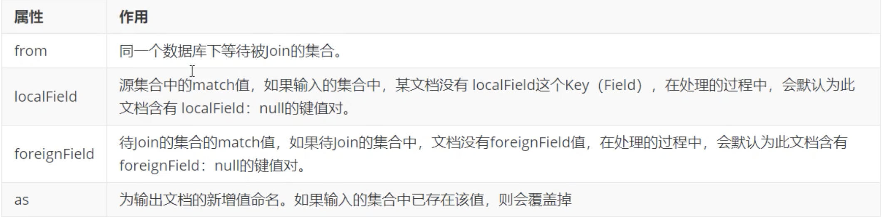

# **6 MongoDB 聚合操作**

聚合操作处理数据记录并返回计算结果（诸如统计平均值，求和等）。聚合操作组值来自多个文档，可以对分组数据执行各种操作以返回单个结果。聚合操作包含三类：**单一作用聚合、聚合管道、Map Reduce**

* **单一作用聚合**：**提供了对常见聚合过程的简单访问，操作都从单个集合聚合文档**。
* **聚合管道是一个数据聚合的框架，模型基于数据处理流水线的概念**。文档进入多级管道，将文档转换为聚合结果。
* **MapReduce操作具有两个阶段:  处理每个文档并向每个输入文档发射一个或多个对象的map阶段，以及reduce组合map操作的输出阶段**
 

## **6.1 单一作用聚合** 

MongoDB提供`db.collection.estimatedDocumentCount()`, `db.collection.count()`, `db.collection.distinct()` 这类单一作用的聚合函数。

所有这些操作都聚合来自单个集合的文档。虽然这些操作提供了对公共聚合过程的简单访问，但它们缺乏聚合管道和`map-Reduce`的灵活性和功能。 

```
# ./mongod -f /mongodb/conf/mongo.conf

[root@jabox bin]# ./mongo localhost:27017 -u appdb -p jack --authenticationDatabase=appdb
MongoDB shell version v4.4.13
connecting to: mongodb://localhost:27017/test?authSource=appdb&compressors=disabled&gssapiServiceName=mongodb
Implicit session: session { "id" : UUID("83295a08-879f-46bf-92a0-a36769fdded9") }
MongoDB server version: 4.4.13
> use appdb
switched to db appdb

>  db.books.find().count()
48

> db.books.count()
48

> db.books.count({type:"travel"})
11

> db.books.estimatedDocumentCount({type:"travel"})
48

> db.books.distinct("type")


> db.books.distinct("type")
[ "literature", "novel", "sociality", "technology", "travel" ]
```






```
# 检索books集合中所有文档的计数
db.books.estimatedDocumentCount()


# 计算与查询匹配的所有文档
db.books.count({favCount:{$gt:50}})

> db.books.count({favCount:{$gt:50}})
1

# 返回不同type的数组
> db.books.distinct("type")

# 返回收藏数大于20的文档不同type的数组
> db.books.distinct("type",{favCount:{$gt:20}})
[ "sociality" ]
```

## **6.2 聚合管道** 

### **什么是MongoDB聚合框架** 

MongoDB聚合框架（Aggregation Framework）是一个计算框架，它可以：

* 作用在一个或几个集合上： 
* 对集合中的数据进行的一系列运算； 
* 将这些数据转化为期望的形式； 

从效果而言，聚合框架相当于SQL查询中的`GROUP BY`、`LEFT OUTER JOIN`、`AS`等

###**管道（Pipeline）和阶段（Stage)** 


**整个聚合运算过程称为管道（Pipeline)，它是由多个阶段（Stage)组成的，每个管道**

* 接受一系列文档（原始数据）; 
* 每个阶段对这些文档进行一系列运算； 
* 结果文档输出给下一个阶段； 




聚合管道操作语法 

```
pipeline ＝[$stage1, $stage2，… $stageN]; 
db.collection.aggregate(pipeline,{options}) 
```

* **pipelines一组数据聚合阶段**。除`$out`、 `$Merge`和`＄geonear`阶段之外、每个阶段都可以在管道中出现多次。 
* **options可选，聚合操作的其他参数。包含：查询计划、是否使用临时文件、游标、最大操作时间、读写策略、强制索引等等**




### **常用的管道聚合阶段**

聚台管道包含非常丰富的聚合阶段，下面是最常用的聚合阶段 




https://www.mongodb.com/docs/manual/core/aggregation-pipeline/

### **聚合管道之`$project`**

**数据准备**

准备数据集，执行脚本 

**booksnew.js**

```
var tags = ["nosql","mongodb","document","developer","popular"]; 
var types = ["technology","sociality","travel","novel","literature"]; 
var books=[];
for(var i=0;i<50;i++){
	var typeIdx = Math.floor(Math.random()*types.length);
	var tagIdx = Math.floor(Math.random()*tags.length);
	var tagIdx2 = Math.floor(Math.random()*tags.length);
	var favCount = Math.floor(Math.random()*100);
	var username = "xx00" + Math.floor(Math.random()*100);
	var age = 20 + Math.floor(Math.random()*15);
	var book = { 
        title: "book-" +i, 
        type: types[typeIdx], 
        tag: tags[tagIdx], 
        favCount: favCount, 
        author: "xxx"+i 
	};
	books.push(book)
}
db.books.insertMany(books);
```


```
./mongo localhost:27017 -u fox -p fox --authenticationDatabase=admin
> show dbs
admin   0.000GB
appdb   0.000GB
config  0.000GB
local   0.000GB
```

```

> use aggdemo
switched to db aggdemo

> load("booksnew.js")
true
```

### **`$project` 投影操作**

**将原始字段投影成指定名称**，如将集合中的：**title投影成name**

```
db.books.aggregate([{$project:{name:"$title"}}]) 
```

```
db.books.aggregate([{$project:{name:"$title"}}])
{ "_id" : ObjectId("624a4d590617ff50cb3e55d2"), "name" : "book-0" }
{ "_id" : ObjectId("624a4d590617ff50cb3e55d3"), "name" : "book-1" }
{ "_id" : ObjectId("624a4d590617ff50cb3e55d4"), "name" : "book-2" }
{ "_id" : ObjectId("624a4d590617ff50cb3e55d5"), "name" : "book-3" }
{ "_id" : ObjectId("624a4d590617ff50cb3e55d6"), "name" : "book-4" }
{ "_id" : ObjectId("624a4d590617ff50cb3e55d7"), "name" : "book-5" }
```


`$project`**可以灵活控制输出文档的格式，也可以剔除不需要的字段** 

* **1 show the cols**
* **0 hide the cols**

```
db.books.aggregate([{$project:{name:"$title",_id:0,type:1,author:1}}])
```

```
> db.books.aggregate([{$project:{name:"$title",_id:0,type:1,author:1}}])
{ "type" : "novel", "author" : "xxx0", "name" : "book-0" }
{ "type" : "literature", "author" : "xxx1", "name" : "book-1" }
{ "type" : "technology", "author" : "xxx2", "name" : "book-2" }
{ "type" : "novel", "author" : "xxx3", "name" : "book-3" }
{ "type" : "technology", "author" : "xxx4", "name" : "book-4" }
```
从嵌套文档中排除字段 


``` 
db.books.aggregate([
	{$project:{name:"$title",_id:0,type:1,"author.name":1}}
])
```

```
> db.books.aggregate([
... {$project:{name:"$title",_id:0,type:1,"author.name":1}}
... ])
{ "type" : "novel", "name" : "book-0" }
{ "type" : "literature", "name" : "book-1" }
{ "type" : "technology", "name" : "book-2" }
{ "type" : "novel", "name" : "book-3" }
{ "type" : "technology", "name" : "book-4" }
```

或者

```
db.books.aggregate([
	{$project:{name:"$title",_id:1,type:1, author:{name:1}}}
])
```

```
> db.books.aggregate([
... {$project:{name:"$title",_id:1,type:1, author:{name:1}}}
... ])
{ "_id" : ObjectId("624a4d590617ff50cb3e55d2"), "type" : "novel", "name" : "book-0" }
{ "_id" : ObjectId("624a4d590617ff50cb3e55d3"), "type" : "literature", "name" : "book-1" }
{ "_id" : ObjectId("624a4d590617ff50cb3e55d4"), "type" : "technology", "name" : "book-2" }
{ "_id" : ObjectId("624a4d590617ff50cb3e55d5"), "type" : "novel", "name" : "book-3" }
{ "_id" : ObjectId("624a4d590617ff50cb3e55d6"), "type" : "technology", "name" : "book-4" }
{ "_id" : ObjectId("624a4d590617ff50cb3e55d7"), "type" : "technology", "name" : "book-5" }
```


### **`$match`**

**`$match`用于对文档进行筛选，之后可以在得到的文档子集上做聚合，`$match`可以使用除了地理空间之外的所有常规查询操作符，在实际应用中尽可能将`$match`放在管道的前面位置。**

**类似于where**

这样有两个好处：一是可以快速将不需要的文档过滤掉，以减少管道的工作量；二是如果再投射和分组之前执行`＄match`，查询可以使用索引。 

```
db.books.aggregate([{$match:{type:"technology"}}])
```

```
> db.books.aggregate([{$match:{type:"technology"}}])
{ "_id" : ObjectId("624a4d590617ff50cb3e55d4"), "title" : "book-2", "type" : "technology", "tag" : "document", "favCount" : 4, "author" : "xxx2" }
{ "_id" : ObjectId("624a4d590617ff50cb3e55d6"), "title" : "book-4", "type" : "technology", "tag" : "developer", "favCount" : 37, "author" : "xxx4" }
{ "_id" : ObjectId("624a4d590617ff50cb3e55d7"), "title" : "book-5", "type" : "technology", "tag" : "popular", "favCount" : 34, "author" : "xxx5" }
{ "_id" : ObjectId("624a4d590617ff50cb3e55d8"), "title" : "book-6", "type" : "technology", "tag" : "nosql", "favCount" : 61, "author" : "xxx6" }
...
```

 
筛选管道操作和其他管道操作配合时候时，尽**量放到开始阶段，这样可以减少后续管道操作符要操作的文档数，提升效率** 

```
db.books.aggregate([{$match:{type:"technology",title:/book-2/}}])
```

```
> db.books.aggregate([{$match:{type:"technology",title:/book-2/}}])
{ "_id" : ObjectId("624a4d590617ff50cb3e55d4"), "title" : "book-2", "type" : "technology", "tag" : "document", "favCount" : 4, "author" : "xxx2" }
{ "_id" : ObjectId("624a4d590617ff50cb3e55ea"), "title" : "book-24", "type" : "technology", "tag" : "document", "favCount" : 77, "author" : "xxx24" }
```

### **`$count`**

计数并返回与查询匹配的结果数 

```
db.books.aggregate([ {$match:{type:"technology"}}, {$count:"type_count"} ])
```

```
> db.books.aggregate([ {$match:{type:"technology"}}, {$count:"type_count"} ])
{ "type_count" : 13 }
```

* `$match`阶段筛选出type匹配technology的文档，并传到下一阶段； 
* `$count`阶段返回聚合管道中剩余文档的计数，并将该值分配给`type_count`


### **`$group`** 

按指定的表达式对文档进行分组，并将每个不同分组的文档输出到下一个阶段。输出文档包含一个`_id`字段，该字段按键包含不同的组。 

输出文档还可以包含计算字段，该字段保存由`$group`的`_Id`字段分组的一些`accumulator`表达式的值。`$group`不会输出具体的文档而只是统计信息。 

```
{$group:{_id:<expression>, <field1>: {<accumlator1> : <expression1>},...}}
```

* id字段是必填的，但是，可以指定id为null来为整个输入文档计算累计值
* 剩余的计算字段是可选的，并使用`＜accumulator＞`运算符进行计算。 
* `_id`和`<accumulator＞`表达式可以接受任何有效的表达式。 


**accumulator 操作符**



`$group`阶段的内存限制为`1OOM`默认情况下，如果`stage`超过此限制，`$group`将产生错误。但是，要允许处理大型数据集，请将`allowDiskUse`选项设置为`true`以启用`＄group`操作以写入临时文件。 

book的数量，收藏总数和平均值 

```
db.books.aggregate([
	{$group: {_id: null, count:{$sum:1}, pop:{$sum: "$favCount"}, avg:{$avg:"$favCount"}}} 
]) 
```

```
> db.books.aggregate([
... {$group: {_id: null, count:{$sum:1}, pop:{$sum: "$favCount"}, avg:{$avg:"$favCount"}}}
... ])
{ "_id" : null, "count" : 50, "pop" : 2415, "avg" : 48.3 }
```

**统计每个作者的book收藏总数**

```
db.books.aggregate([ 
	{$group:{_id:"$author.name", pop:{$sum:"$favCount"}}} 
]) 
```

```
> db.books.aggregate([
... {$group:{_id:"$author.name", pop:{$sum:"$favCount"}}}
... ])
{ "_id" : null, "pop" : 2415 }
```

```
db.books.aggregate([ 
	{$group:{_id:"$author.name", types:{$addToSet:"$type"}}} 
]) 
```

### **`$unwind`**

**可以将数组拆分为单独的文档**

`v3.2+` 支持如下语法： 

```
{ 
	$unwind: 
	{ 
	# 要指定宇段路径，在字段名称前加上$符并用引号括起来。 
	path: <field path>, 
	# 可选，一个新字段的名称用于存放元素的数组索引。该名称不能以$开头。 
	includeArraylndex: <string>, 
	# 可选，default :false，若为true，如果路径为空，缺少或为空数组，则`$unwind`输出文档 
	preserveNullAndEmptyArrays: <boolean> 
}} 
```

* `$unwind`: 要指定宇段路径，在字段名称前加上$符并用引号括起来
* path: 可选，一个新字段的名称用于存放元素的数组索引。该名称不能以`$`开头。
*  includeArraylndex: 可选，default :false，若为true，如果路径为空，缺少或为空数组，则`$unwind`输出文档 


**姓名为xx0006的作者的book的tag数组拆分为多个文档**

```
db.books.aggregate([
	{$match:{"author": "name":"xxOO6"}}, 
	{{$unwind:"$tag"}
]) 
```


```
db.books.aggregate([{$unwind:"$tag"}])
```

```
> db.books.aggregate([{$unwind:"$tag"}])
{ "_id" : ObjectId("624a4d590617ff50cb3e55d2"), "title" : "book-0", "type" : "novel", "tag" : "developer", "favCount" : 99, "author" : "xxx0" }
{ "_id" : ObjectId("624a4d590617ff50cb3e55d3"), "title" : "book-1", "type" : "literature", "tag" : "mongodb", "favCount" : 22, "author" : "xxx1" }
{ "_id" : ObjectId("624a4d590617ff50cb3e55d4"), "title" : "book-2", "type" : "technology", "tag" : "document", "favCount" : 4, "author" : "xxx2" }
{ "_id" : ObjectId("624a4d590617ff50cb3e55d5"), "title" : "book-3", "type" : "novel", "tag" : "popular", "favCount" : 93, "author" : "xxx3" }
{ "_id" : ObjectId("624a4d590617ff50cb3e55d6"), "title" : "book-4", "type" : "technology", "tag" : "developer", "favCount" : 37, "author" : "xxx4" }
```

```
db.books.aggregate([{$match:{type:"travel"}},{$unwind:"$tag"}])
```

```
> db.books.aggregate([{$match:{type:"travel"}},{$unwind:"$tag"}])
{ "_id" : ObjectId("623b0766b815b989a2335e7c"), "title" : "book-7", "type" : "travel", "tag" : "mongodb", "favCount" : -100, "author" : "xxx7" }
{ "_id" : ObjectId("623b0766b815b989a2335e7f"), "title" : "book-10", "type" : "travel", "tag" : "nosql", "favCount" : -100, "author" : "xxx10", "publishDate" : ISODate("2022-03-26T09:09:54.851Z") }
{ "_id" : ObjectId("623b0766b815b989a2335e85"), "title" : "book-16", "type" : "travel", "tag" : "developer", "favCount" : -100, "author" : "xxx16" }
```


姓名为`xx006`的作者的book的tag数组拆分为多个文档 

```
db.books.aggregate([
	{$match:{"author.name":"xxx006"}}, 
	{$unwind:"$tag"}
])
``` 

每个作者的book的tag合集

``` 
db.books.aggregate([ 
	{$unwind: "$tag"},
	{$group:{_id:"$author.name", types:{$addToSet:"$tag"}}} 
]) 
```

```
> db.books.aggregate([
... {$unwind: "$tag"},
... {$group:{_id:"$author.name", types:{$addToSet:"$tag"}}}
... ])
{ "_id" : null, "types" : [ "developer", "mongodb", "document", "popular", "nosql" ] }
```

**案例**

```
db.books.insert([
{   "title" : "book-51",
	"type" : "technology",
	"favCount": 11,
	"tag": [], 
	"author" : { 
		"name" : "fox", 
		"age" : 28 
	} 
},{
	"title" : "book-52", 
	"type" : "technology", 
	"favCount" : 15, 
	"author" : { 
		"name" : "fox", 
		"age" : 28 
	} 
},{ 
  "title" : "book-53", 
  "type" : "technology", 
  "tag" : [ 
  	"nosql", 
  	"document" 
   ], 
  "favCount" : 20, 
  "author" : { 
  	"name" : "fox", 
  	"age" : 28 
	}
}])
```

```
BulkWriteResult({
	"writeErrors" : [ ],
	"writeConcernErrors" : [ ],
	"nInserted" : 3,
	"nUpserted" : 0,
	"nMatched" : 0,
	"nModified" : 0,
	"nRemoved" : 0,
	"upserted" : [ ]
})
```

**测试**

```
# 使用includeArrayIndex选项来输出数组元素的数组索引
db.books.aggregate([ 
	{$match:{"author.name":"fox"}}, 
	{$unwind: {path: "$tag", includeArrayIndex: "arraylndex"}} 
]) 
# 使用 preserveNullAndEmptyArrays选项在输出中缺少size, null或者空数组文档
db.books.aggregate([ 
	{$match: {"author.name":"fox"}}, 
	{$unwind: {path:"$tag", preserveNullAndEmptyArrays: true}} 
])
```

```
> db.books.aggregate([
... {$match:{"author.name":"fox"}},
... {$unwind: {path: "$tag", includeArrayIndex: "arraylndex"}}
... ])
{ "_id" : ObjectId("624d6de764f997879be8a9ee"), "title" : "book-53", "type" : "technology", "tag" : "nosql", "favCount" : 20, "author" : { "name" : "fox", "age" : 28 }, "arraylndex" : NumberLong(0) }
{ "_id" : ObjectId("624d6de764f997879be8a9ee"), "title" : "book-53", "type" : "technology", "tag" : "document", "favCount" : 20, "author" : { "name" : "fox", "age" : 28 }, "arraylndex" : NumberLong(1) }
```

```
> db.books.aggregate([
... {$match: {"author.name":"fox"}},
... {$unwind: {path:"$tag", preserveNullAndEmptyArrays: true}}
... ])
{ "_id" : ObjectId("624d6de764f997879be8a9ec"), "title" : "book-51", "type" : "technology", "favCount" : 11, "author" : { "name" : "fox", "age" : 28 } }
{ "_id" : ObjectId("624d6de764f997879be8a9ed"), "title" : "book-52", "type" : "technology", "favCount" : 15, "author" : { "name" : "fox", "age" : 28 } }
{ "_id" : ObjectId("624d6de764f997879be8a9ee"), "title" : "book-53", "type" : "technology", "tag" : "nosql", "favCount" : 20, "author" : { "name" : "fox", "age" : 28 } }
{ "_id" : ObjectId("624d6de764f997879be8a9ee"), "title" : "book-53", "type" : "technology", "tag" : "document", "favCount" : 20, "author" : { "name" : "fox", "age" : 28 } }
```

### **`$limit`**

限制传递到管道中下一阶段的文档数 

```
db.books.aggregate([
	{$limit : 5}
])
```

**此操作仅返回管道传递给它的前5个文档。`$limt`对其传递的文档内容没有影响。**

**注意：当`＄sort`在管道中的`$Iimit`之前立即出现时，`$sort`操作只会在过程中维持前n个结果，其中n是指定的限制，而`MongoDB`只需要将n个项存储在内存中。**


### **`$skip `**

跳过进入stage的指定数量的文档，并将其余文档传递到管道中的下一个阶段 

```
db.books.aggregate([
	{$skip : 5}
])
```

此操作将跳过管道传递给它的前5个文档。`$skip`对沿着管道传递的文档的内容没有影响。 


### **`$sort`**

对所有输入文档进行排序，并按排序顺序将他们返回到管道。 语法： 

```
{$sort: { <field1>: <sort order>,<field 2>: <sort order＞… }} 
```

**要对字段进行排序，请将排序顺序设置为`1`或`-1`，以分别指定升序或降序排序**，如下例所示 

```
db.books.aggregate([ 
	{$sort: {favCount:-1, title: 1}} 
])
```

```
> db.books.aggregate([
... {$sort: {favCount:-1, title: 1}}
... ])
{ "_id" : ObjectId("624a4d590617ff50cb3e55d2"), "title" : "book-0", "type" : "novel", "tag" : "developer", "favCount" : 99, "author" : "xxx0" }
{ "_id" : ObjectId("624a4d590617ff50cb3e5601"), "title" : "book-47", "type" : "sociality", "tag" : "popular", "favCount" : 97, "author" : "xxx47" }
{ "_id" : ObjectId("624a4d590617ff50cb3e55d5"), "title" : "book-3", "type" : "novel", "tag" : "popular", "favCount" : 93, "author" : "xxx3" }
{ "_id" : ObjectId("624a4d590617ff50cb3e55ef"), "title" : "book-29", "type" : "sociality", "tag" : "document", "favCount" : 91, "author" : "xxx29" }
{ "_id" : ObjectId("624a4d590617ff50cb3e55fd"), "title" : "book-43", "type" : "novel", "tag" : "nosql", "favCount" : 90, "author" : "xxx43" }
{ "_id" : ObjectId("624a4d590617ff50cb3e55fb"), "title" : "book-41", "type" : "literature", "tag" : "nosql", "favCount" : 87, "author" : "xxx41" }
{ "_id" : ObjectId("624a4d590617ff50cb3e55e5"), "title" : "book-19", "type" : "travel", "tag" : "document", "favCount" : 86, "author" : "xxx19" }
{ "_id" : ObjectId("624a4d590617ff50cb3e55dc"), "title" : "book-10", "type" : "technology", "tag" : "developer", "favCount" : 84, "author" : "xxx10" }
{ "_id" : ObjectId("624a4d590617ff50cb3e55fe"), "title" : "book-44", "type" : "technology", "tag" : "document", "favCount" : 80, "author" : "xxx44" }
{ "_id" : ObjectId("624a4d590617ff50cb3e55ea"), "title" : "book-24", "type" : "technology", "tag" : "document", "favCount" : 77, "author" : "xxx24" }
{ "_id" : ObjectId("624a4d590617ff50cb3e55f5"), "title" : "book-35", "type" : "sociality", "tag" : "popular", "favCount" : 77, "author" : "xxx35" }
{ "_id" : ObjectId("624a4d590617ff50cb3e55df"), "title" : "book-13", "type" : "literature", "tag" : "document", "favCount" : 74, "author" : "xxx13" }
{ "_id" : ObjectId("624a4d590617ff50cb3e55f0"), "title" : "book-30", "type" : "technology", "tag" : "developer", "favCount" : 72, "author" : "xxx30" }
{ "_id" : ObjectId("624a4d590617ff50cb3e55fc"), "title" : "book-42", "type" : "technology", "tag" : "popular", "favCount" : 71, "author" : "xxx42" }
{ "_id" : ObjectId("624a4d590617ff50cb3e55e7"), "title" : "book-21", "type" : "sociality", "tag" : "popular", "favCount" : 65, "author" : "xxx21" }
{ "_id" : ObjectId("624a4d590617ff50cb3e55f3"), "title" : "book-33", "type" : "novel", "tag" : "document", "favCount" : 65, "author" : "xxx33" }
{ "_id" : ObjectId("624a4d590617ff50cb3e55e1"), "title" : "book-15", "type" : "novel", "tag" : "mongodb", "favCount" : 64, "author" : "xxx15" }
{ "_id" : ObjectId("624a4d590617ff50cb3e55d9"), "title" : "book-7", "type" : "literature", "tag" : "document", "favCount" : 63, "author" : "xxx7" }
{ "_id" : ObjectId("624a4d590617ff50cb3e55ee"), "title" : "book-28", "type" : "travel", "tag" : "mongodb", "favCount" : 62, "author" : "xxx28" }
{ "_id" : ObjectId("624a4d590617ff50cb3e55d8"), "title" : "book-6", "type" : "technology", "tag" : "nosql", "favCount" : 61, "author" : "xxx6" }
```


### **`$lookup`**

**Mongodb 3.2版本新增，主要用来实现多表关联查询，相当关系型数据库中多表关联查询。每个输入待处理的文档的处理，经过＄lookup阶段 的适配文档，输出的新文档中会包含一个新生成的数组(可根据需要命名新key)。数组列存放的数据是来自被`Join`集合，如果没 有，集合为空（即为`[]`)**

语法 

```
db.collection.aggregate([{
	$lookup:{ 
		from: "<collection to join>" 
		localField: "<field from the input documents>"
         foreignField: "<field from the documents of the from collection>" 
         as: "<output array field>" 
	} 
}) 
```



注意：null = null 此为真

其语法功能类似于下面的伪SQL语句

```
SELECT * ＜output array field> 
FROM collection
WHERE ＜output array field＞ IN (SELECT * 
								FROM <collection to join> 
								WHERE <foreignField＞=＜collection.local.Field>);
```

**准备数据**

```
db.customer.insert({customerCode:1, name:"customer1", phone:"13112345678",address:"test1"}) db.customer.insert({customerCode:2,name:"customer2",phone:"13112345679",address:"test2"}) 

db.order.insert({orderId:1, orderCode:"order001",customerCode:1, price:200})
db.order.insert({orderId1:2,orderCode:"order002",customerCode:2,price:400}) 


db.orderitem.insert({itemId:1,productName:"apples",qutity:2,orderId:1}) 
db.orderItem.insert({itemId:2, productName:"oranges", qutity:2, orderId:1}) 
```

**关联查询**

```
db.customer.aggregate([ 
	{$lookup:  {
	from: "order", 
	localField: "customerId", 
	foreignField: "customerId", 
	as: "customerOrder" 
	}
  }
 ])
```

```
> db.customer.aggregate([
... {$lookup:  {
... from: "order",
... localField: "customerId",
... foreignField: "customerId",
... as: "customerOrder"
... }
...   }
...  ])
{ "_id" : ObjectId("624db55c64f997879be8a9ef"), "customerCode" : 1, "name" : "customer1", "phone" : "13112345678", "address" : "test1", "customerOrder" : [ { "_id" : ObjectId("624db5b964f997879be8a9f1"), "orderId" : 1, "orderCode" : "order001", "customerCode" : 1, "price" : 200 }, { "_id" : ObjectId("624db5c064f997879be8a9f2"), "orderId1" : 2, "orderCode" : "order002", "customerCode" : 2, "price" : 400 } ] }
{ "_id" : ObjectId("624db56164f997879be8a9f0"), "customerCode" : 2, "name" : "customer2", "phone" : "13112345679", "address" : "test2", "customerOrder" : [ { "_id" : ObjectId("624db5b964f997879be8a9f1"), "orderId" : 1, "orderCode" : "order001", "customerCode" : 1, "price" : 200 }, { "_id" : ObjectId("624db5c064f997879be8a9f2"), "orderId1" : 2, "orderCode" : "order002", "customerCode" : 2, "price" : 400 } ] }
```

**`$lookup`:**

```
db.customer.aggregate([ 
	{$lookup:  {
	from: "customer", 
	localField: "customerCode", 
	foreignField: "customerCode", 
	as: "customer" 
	}
  },
	{$lookup:  {
		from: "orderItem", 
		localField: "orderId", 
		foreignField: "orderId", 
		as: "orderItem" 
	}
  }  
])
```

```
{ "_id" : ObjectId("624db55c64f997879be8a9ef"), "customerCode" : 1, "name" : "customer1", "phone" : "13112345678", "address" : "test1", "customer" : [ { "_id" : ObjectId("624db55c64f997879be8a9ef"), "customerCode" : 1, "name" : "customer1", "phone" : "13112345678", "address" : "test1" } ], "orderItem" : [ ] }
{ "_id" : ObjectId("624db56164f997879be8a9f0"), "customerCode" : 2, "name" : "customer2", "phone" : "13112345679", "address" : "test2", "customer" : [ { "_id" : ObjectId("624db56164f997879be8a9f0"), "customerCode" : 2, "name" : "customer2", "phone" : "13112345679", "address" : "test2" } ], "orderItem" : [ ] }
```