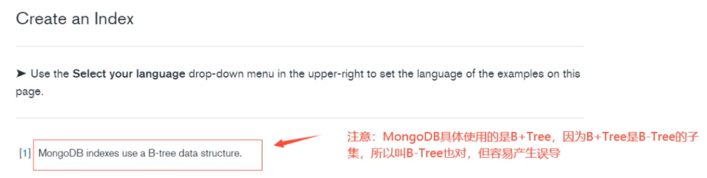
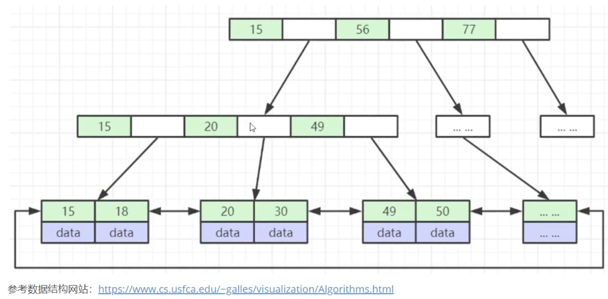
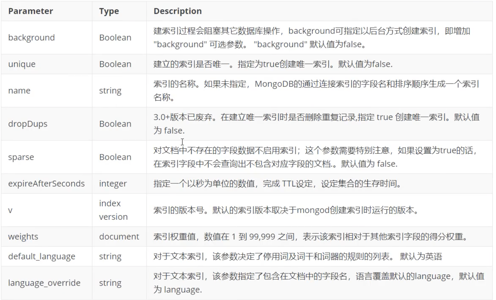
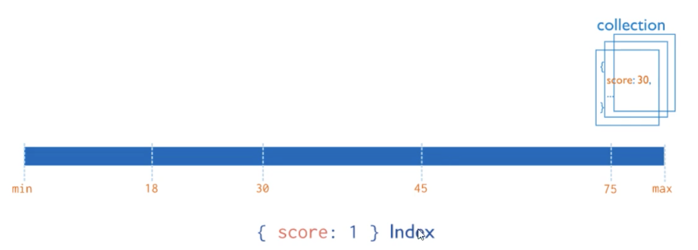
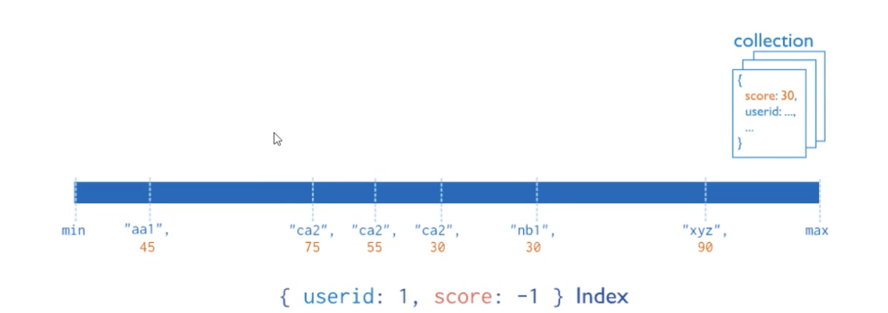
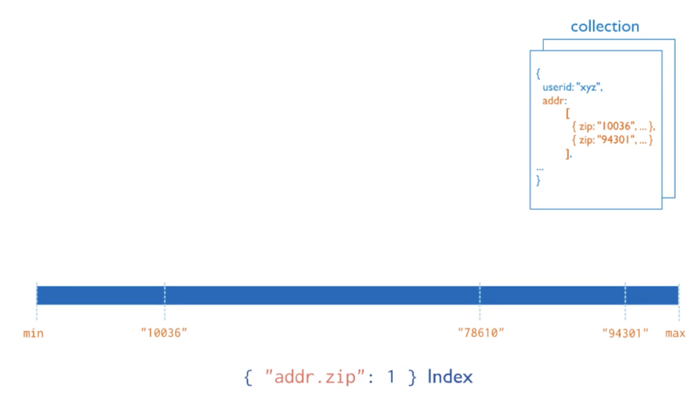
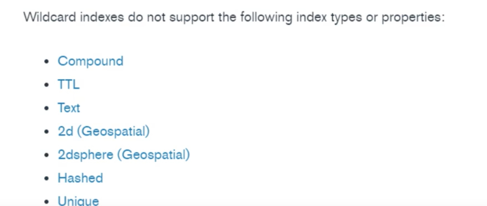

# **9 MongoDB索引**

## **9.1 介绍** 

索引是一种用来快速查询数据的数据结构。B+ Tree就是一种常用的数据库索引数据结构，MongoDB采用`B+ Tree`做索引，索引创建在`colletions`上。

MongoDB不使用索引的查询，先扫描所有的文档，再匹配符合条件的文档。使用索引的查询，通过索引找到文档，使用索引能够极大的提升查询效率。 

### **MongoDB索引数据结构**

**思考：MongoDB索引数据结构是`B-Tree`还是`B+ Tree` ？**

`B-Tree`说法来源于官方文档，然后就导致了分歧：有人说`MongoDB`索引数据结构使用的是`B-Tree`，有的人又说是`B＋ Tree` 

> MongoDB官方文档：[https://docs.mongodb.com/manual/indexes/](https://docs.mongodb.com/manual/indexes/)
> 
> MongoDB indexes use a B-tree data structure. 


 

 
### **索引的分类**

* 按照索引包含的字段数量，**可以分为单键索引和组合索引（或复合索引）**。 
* 按照索引字段的类型，**可以分为主键索引和非主键索引**。 
* 按照索引节点与物理记录的对应方式来分，**可以分为聚簇索引和非聚簇索引，其中聚簇索引是指索引节点上直接包含了数据记录，而后者则仅仅包含一个指向数据记录的指针**。 
* 按照索引的特性不同，又可以分为**唯一索引、稀疏索引、文本索引、地理空间索引等**

与大多数数据库一样，MongoDB支持各种丰富的索引类型，包活单键索引、复合索引唯一索引等一些常用的结构。

由于采用了灵活可变的文档类型，因此它也同样支持对嵌套字段、数组进行索引。通过建立合适的索引，我们可以极大地提升数据的检索速度。在一些特殊应用场景，MongoDB还支持地理空间索引、文本检索索引、TTL索引等不同的特性。 

## **9.2 索引操作**

### **创建索引** 

创建索引语法格式 

```
db.collection.createIndex(keys,options) 
```

* Key值为你要创建的索引字段，1按升序创建索索引, -1 按降序创建索引
* 可选参数列表如下： 



注意：3.0.0版本前创建索引方法为`db.collection.ensurelndex()` 

```
＃创建索引后台执行 
db.values.createIndex({open:1, close:1}, {background:true}) 

＃创建唯一索引 
db.values.createlndex({title:1}, {unique:true}) 
```
```
---
> show dbs
admin     0.000GB
aggdemo   0.000GB
appdb     0.000GB
config    0.000GB
local     0.000GB
test      0.002GB
viewdemo  0.001GB
> use appdb
switched to db appdb
> show tables
books
emps
user
```

```
> db.books.getIndexes()
[ { "v" : 2, "key" : { "_id" : 1 }, "name" : "_id_" } ]
```

```
> db.books.find({title:"book-8"})
{ "_id" : ObjectId("623b0766b815b989a2335e7d"), "title" : "book-8", "type" : "sociality", "tag" : "mongodb", "favCount" : -100, "author" : "xxx8" 
```

```
> db.books.find({title:"book-8"}).explain()
{
	"queryPlanner" : {
		"plannerVersion" : 1,
		"namespace" : "appdb.books",
		"indexFilterSet" : false,
		"parsedQuery" : {
			"title" : {
				"$eq" : "book-8"
			}
		},
		"queryHash" : "6E0D6672",
		"planCacheKey" : "6E0D6672",
		"winningPlan" : {
			"stage" : "COLLSCAN",
	...
```

```
db.books.createIndex({title:1})
```

```
> db.books.createIndex({title:1})
{
	"createdCollectionAutomatically" : false,
	"numIndexesBefore" : 1,
	"numIndexesAfter" : 2,
	"ok" : 1
}
```

```
db.books.getIndexes()

> db.books.getIndexes()
[
	{
		"v" : 2,
		"key" : {
			"_id" : 1
		},
		"name" : "_id_"
	},
	{
		"v" : 2,
		"key" : {
			"title" : 1
		},
		"name" : "title_1"
	}
]
```

注意：3.0.0版本前创建索引方法为`db.collection.ensureIndex()`

``` 
＃创建索引后台执行 
db.values.createIndex({open:1, close:1}, {background:true}) 
＃创建唯一索引 
db.values.createIndex({title:1},{unique:true}) 
```


### **查看索引** 

```
#查看索引信息 
db.books.getIndexes() 

＃查看索引键 
db.books.getIndexKeys() 
```

```
查看索引占用空间 
db.collection.totalIndexSize([is_detail]） 
```

* `is_detail`：可选参数，传入除0或false外的任意数据，都会显示该集合中每个索引的大小及总大小。如果传入0或false则只显示该集合中所有索引的总大小。默认值为false

```
> db.books.getIndexKeys()
[ { "_id" : 1 }, { "title" : 1 } ]

> db.books.totalIndexSize()
57344

> db.books.totalIndexSize(0)
57344

> db.books.totalIndexSize(1)
_id_	36864
title_1	20480
57344
```


### **删除索引**

```
＃删除集合指定索引 
db.col.dropIndex("索引名称") 

＃删除集合所有索引 
db.col.dropIndexes()
```


## **9.3 索引类型**

### **单键索引（Single Field Indexes)**

在某一个特定的字段上建立索引mongoDB在ID上建立了唯一的单键索引，所以经常会使用Id来进行查询；在索引字段上进行精确匹配、 排序以及范围查找都会使用此索引 




```
db.books.createIndex({title:1})
```

**内嵌文档字段创建索引**

```
db.books.createIndex({"author.name":1}


> db.books.createIndex({"author.name":1})
{
	"createdCollectionAutomatically" : false,
	"numIndexesBefore" : 2,
	"numIndexesAfter" : 3,
	"ok" : 1
}
```

```
> db.books.getIndexes()
[
	{
		"v" : 2,
		"key" : {
			"_id" : 1
		},
		"name" : "_id_"
	},
	{
		"v" : 2,
		"key" : {
			"title" : 1
		},
		"name" : "title_1"
	},
	{
		"v" : 2,
		"key" : {
			"author.name" : 1
		},
		"name" : "author.name_1"
	}
]
```


### **复合索引（Compound Index)**

复合索引是多个字段组合而成的界引，其性质和单字段索引类似。但不同的是，复合索引中字段的顺序、字段的升降序对查询性能有直接 的影响，因此在设计复合索引时则需要考虑不同的查询场景。 




```
db.books.createIndex({type:1, favCount:1})
```

```
> db.books.createIndex({type:1, favCount:1})
{
	"createdCollectionAutomatically" : false,
	"numIndexesBefore" : 3,
	"numIndexesAfter" : 4,
	"ok" : 1
}
```

```
> db.books.getIndexes()
...
{
		"v" : 2,
		"key" : {
			"type" : 1,
			"favCount" : 1
		},
		"name" : "type_1_favCount_1"
	}
]
```

### **多键索引（Multikey Index)**

**在数组的属性上建立索引**。针对这个数喇的任意值的查询都会定位到这个文档，既多个索引入口或者键值引用同一个文档 




```
db.inventory.insertMany([ 
	{ _id: 5, type: "food", item: "aaa", ratings: [ 5, 8, 9 ] }, 
	{ _id: 6, type: "food", item: "bbb", ratings: [ 5, 9 ] }, 
	{ _id: 7, type: "food", item: "ccc", ratings: [ 9, 5, 8 ] }, 
	{ _id: 8, type: "food", item: "ddd", ratings: [ 9, 5 ] },
	{ _id: 9, type: "food", item: "eee", ratings: [ 5, 9, 5 ] }
]) 
```

```
> db.inventory.insertMany([
... { _id: 5, type: "food", item: "aaa", ratings: [ 5, 8, 9 ] },
... { _id: 6, type: "food", item: "bbb", ratings: [ 5, 9 ] },
... { _id: 7, type: "food", item: "ccc", ratings: [ 9, 5, 8 ] },
... { _id: 8, type: "food", item: "ddd", ratings: [ 9, 5 ] },
... { _id: 9, type: "food", item: "eee", ratings: [ 5, 9, 5 ] }
... ])
{ "acknowledged" : true, "insertedIds" : [ 5, 6, 7, 8, 9 ] }
```

**创建多键索引**

```
> db.inventory.createIndex({ ratings:1 })
```

```
> db.inventory.createIndex({ ratings:1 })
{
	"createdCollectionAutomatically" : false,
	"numIndexesBefore" : 1,
	"numIndexesAfter" : 2,
	"ok" : 1
}
```


多键索引很容易与复合索引产生混淆，**复合索引是多个字段的组合**，**而多键索引则仅仅是在一个字段上出现了多键(multi key)。而实质上，多键索引也可以出现在复合字段上** 

```
＃创建复合多值索引 
db.inventory.createIndex({item:1, ratings:1}) 
```

汪意：MongoDB并不支持一个复合索引中同时出现多个数组字段


**嵌入文档的索引数组**

```
> db.inventory.createIndex({item:1, ratings:1})
{
	"createdCollectionAutomatically" : false,
	"numIndexesBefore" : 2,
	"numIndexesAfter" : 3,
	"ok" : 1
}
```

```
> db.inventory.getIndexes()
[
	{
		"v" : 2,
		"key" : {
			"_id" : 1
		},
		"name" : "_id_"
	},
	{
		"v" : 2,
		"key" : {
			"ratings" : 1
		},
		"name" : "ratings_1"
	},
	{
		"v" : 2,
		"key" : {
			"item" : 1,
			"ratings" : 1
		},
		"name" : "item_1_ratings_1"
	}
]
```

```
db.inventory.insertMany([ 
{ 
	_id: 1, 
	item: "abc",
	stock: [ 
		{ size: "S", color: "red", quantity: 25 }, 
		{ size: "S", color: "blue", quantity: 10 }, 
		{ size: "M", color: "blue", quantity: 50 } 
	] 
},
{ 
	_id: 2, 
	item: "def",
	stock: [ 
	{ size: "S", color: "blue", quantity: 20 }, 
	{ size: "M", color: "blue", quantity: 5 },
	{ size: "M", color: "black", quantity: 10 }, 
	{ size: "L", color: "red", quantity: 2 } 
  ] 
},
{
	_id: 3, 
	item: "def",
	stock: [ 
	{ size: "S", color: "blue", quantity: 15 }, 
	{ size: "L", color: "blue", quantity: 100 },
	{ size: "L", color: "red", quantity: 25 } 
  ] 
}
])
```

```
{ "acknowledged" : true, "insertedIds" : [ 1, 2, 3 ] }
```

```
> db.inventory.find()
{ "_id" : 1, "item" : "abc", "stock" : [ { "size" : "S", "color" : "red", "quantity" : 25 }, { "size" : "S", "color" : "blue", "quantity" : 10 }, { "size" : "M", "color" : "blue", "quantity" : 50 } ] }
{ "_id" : 2, "item" : "def", "stock" : [ { "size" : "S", "color" : "blue", "quantity" : 20 }, { "size" : "M", "color" : "blue", "quantity" : 5 }, { "size" : "M", "color" : "black", "quantity" : 10 }, { "size" : "L", "color" : "red", "quantity" : 2 } ] }
{ "_id" : 3, "item" : "def", "stock" : [ { "size" : "S", "color" : "blue", "quantity" : 15 }, { "size" : "L", "color" : "blue", "quantity" : 100 }, { "size" : "L", "color" : "red", "quantity" : 25 } ] }
```


在包含嵌套对象的数组字段上创建多键索引 

```
db.inventory.createIndex( {"stock.size":1, "stock.quantity": 1 }) 
```

```
> db.inventory.createIndex( {"stock.size":1, "stock.quantity": 1 })
{
	"createdCollectionAutomatically" : false,
	"numIndexesBefore" : 3,
	"numIndexesAfter" : 4,
	"ok" : 1
}
```

```
db.inventory.find( {"stock.size": "S", "stock.quantity": { $gt:20 } }) 

> db.inventory.find( {"stock.size": "S", "stock.quantity": { $gt:20 } })
{ "_id" : 1, "item" : "abc", "stock" : [ { "size" : "S", "color" : "red", "quantity" : 25 }, { "size" : "S", "color" : "blue", "quantity" : 10 }, { "size" : "M", "color" : "blue", "quantity" : 50 } ] }
{ "_id" : 3, "item" : "def", "stock" : [ { "size" : "S", "color" : "blue", "quantity" : 15 }, { "size" : "L", "color" : "blue", "quantity" : 100 }, { "size" : "L", "color" : "red", "quantity" : 25 } ] }
```


### **地理空间索引（Geospatial Index)**

在移动互联网时代，基于地理位置的检索（LBS)功能几乎是所有应用系统的标配。MongoDB为地理空间检索提供了非常方便的功能。 地理空间索引(2dsphereindex）就是专门用于实现位置检索的一种特殊索引。 

案例：MongoDB如何实现“查询附近商家"？ 

假设商家的数据模型如下： 

```
db.restaurant.insert({
	restaurantld: 0, 
	restaurantName:"KFC", 
	location : { 
		type: "Point", 
		coordinates: [ -73.97, 40.77 ] 
	}
})
```

```
WriteResult({ "nInserted" : 1 })
```

**创建一个2dsphere索引**

```
db.restaurant.createIndex({location : "2dsphere"}) 
```

```
> db.restaurant.createIndex({location : "2dsphere"})
{
	"createdCollectionAutomatically" : false,
	"numIndexesBefore" : 1,
	"numIndexesAfter" : 2,
	"ok" : 1
}
```

```
> db.restaurant.getIndexes()
[
	{
		"v" : 2,
		"key" : {
			"_id" : 1
		},
		"name" : "_id_"
	},
	{
		"v" : 2,
		"key" : {
			"location" : "2dsphere"
		},
		"name" : "location_2dsphere",
		"2dsphereIndexVersion" : 3
	}
]
```

**查询附近10000米商家信息** 

```
db.restaurant.find({ 
	location: { 
		$near: { 
			$geometry: { 
				type: "Point",
				coordinates: [-73.88, 40.78] 
		}, 
		$maxDistance: 10000 
	   } 
	} 
}) 
```

```
{ "_id" : ObjectId("62626b3261515830838dcb6e"), "restaurantld" : 0, "restaurantName" : "KFC", "location" : { "type" : "Point", "coordinates" : [ -73.97, 40.77 ] } }
```

* `$near` 查询操作符，用于实现附近商家的检索，返回数据结果会按距离排序。
*  `$geometry`操作符用于指定一个`GeoJSON`格式的地理空间对象，`type=Point`表示地理坐标点，`coordinates` 则是用户当前所在的经纬度位置；`$maxDistance`限定了最大距离，单位是米。 

### **全文索引(Text Indexes)**

**MongoDB支持全文检索功能，可通过建立文本索引来实现简易的分词检索。**

```
db.reviews.CreateIndex({ comments:"text" }) 
```

`$text`操作符可以在有`text index`的集合上执行文本检索。**`$text`将会使用空格和标点符号作为分隔符对检索字符串进行分词，并且对检索字符串中所有的分词结果进行一个逻辑上的`OR`操作**。 


全文索引能解决快速文本查找的需求，比如有一个博客文章集合，需要根据博客的内容来快速查找，则可以针对博客内容建立文本索引。 

**案例** 

数据准备

``` 
db.stores.insert(
	[
		{_id: 1, name: "Java Hut", description: "Coffe and Cakes"},
		{_id: 2, name: "Burger Buns", description: "Gourmet hamburgers"},
		{_id: 3, name: "Coffee Shop", description: "Just Coffee"},
		{_id: 4, name: "Clothes Clothes Clothes", description: "Discount clothing"},
		{_id: 5, name: "Java Shopping", description: "Indonesian Goods"},
	]
)
```

```
BulkWriteResult({
	"writeErrors" : [ ],
	"writeConcernErrors" : [ ],
	"nInserted" : 5,
	"nUpserted" : 0,
	"nMatched" : 0,
	"nModified" : 0,
	"nRemoved" : 0,
	"upserted" : [ ]
})
```


创建name和description的全文索引 

```
db.stores.createIndex({ name:"text", description:"text"})  
```

```
> db.stores.createIndex({ name:"text", description:"text"})
{
	"createdCollectionAutomatically" : true,
	"numIndexesBefore" : 1,
	"numIndexesAfter" : 2,
	"ok" : 1
}
```

```
> db.stores.getIndexes()
[
	{
		"v" : 2,
		"key" : {
			"_id" : 1
		},
		"name" : "_id_"
	},
	{
		"v" : 2,
		"key" : {
			"_fts" : "text",
			"_ftsx" : 1
		},
		"name" : "name_text_description_text",
		"weights" : {
			"description" : 1,
			"name" : 1
		},
		"default_language" : "english",
		"language_override" : "language",
		"textIndexVersion" : 3
	}
]
```


**测试**

通过`$text`操作符来查寻数据中所有包含“coffee","shop",'java"列表中任何词语的商店 

```
db.stores.find({ $text: {$search: "java coffee shop" }}) 
```

MongoDB的文本索引功能存在诸多限制，而官方并未提供中文分词的功能，这使得该功能的应用场景十分受限。 

```
> db.stores.find({ $text: {$search: "java coffee shop" }})
{ "_id" : 3, "name" : "Coffee Shop", "description" : "Just Coffee" }
{ "_id" : 5, "name" : "Java Shopping", "description" : "Indonesian Goods" }
{ "_id" : 1, "name" : "Java Hut", "description" : "Coffe and Cakes" }
```

### **Hash索引（Hashed Indexes)**

不同于传统的B-Tree索引，哈希索引使用hash函数来创建索引。在索引字段上进行精确匹配，但不支持范围查询，不支持多键hash, Hash索 引上的入口是均匀分布的，在分片集合中非常有用： 

```
db.users.createIndex({username: 'hashed' }) 
```
```
{
	"createdCollectionAutomatically" : true,
	"numIndexesBefore" : 1,
	"numIndexesAfter" : 2,
	"ok" : 1
}
```

### **通配符索引（Wildcard Indexes)**

MongoDB的文档模式异动态变化的，而通配符索引可以建立在一些不可预知的字段上, 以此实现查询的加速。

**案例**

MongoDB4.2引入了通配符索引来支持对未知或任意字段的查询。 案例准备商品数据，不同商品属性不一样


**案例**

准备商品数据，不同商品属性不一样 

```
db.products.insert([ 
	{ 
		"product_name" : "Spy Coat", 
		"product_attributes" : {
			 "material" : [ "Tweed", "Wool", "Leather" ], 
			 "size" : { 
			 	"length" : 72, 
			 	"units" : "inches" 
	}
 }
},{
	"product_name" : "spy Pen", 
	"product_attributes" : { 
		"colors" : [ "Blue", "Black" ], 
		"secret_feature" : 
			{ "name" : "laser", 
			"power" : "1000", 
			"units" : "watts", 
			}	
		} 
	} ,
  {
  "product_name" : "spy Book" 
  }
])
```


```
BulkWriteResult({
	"writeErrors" : [ ],
	"writeConcernErrors" : [ ],
	"nInserted" : 3,
	"nUpserted" : 0,
	"nMatched" : 0,
	"nModified" : 0,
	"nRemoved" : 0,
	"upserted" : [ ]
})
```

创建通配符索引

``` 
db.products.createIndex({"product_attributes.$**":1}) 
```

```
{
	"createdCollectionAutomatically" : false,
	"numIndexesBefore" : 1,
	"numIndexesAfter" : 2,
	"ok" : 1
}
```


**测试**

通配符索引可以支持任意单字段查询`product_attributes`或其嵌入字段 

```
db.products.find({"product_attributes.size.length" : { $gt : 60 } }) 
db.products.find( { "product_attributes.material" : "Leather" } ) db.products.find( { "product_attributes.secret_feature.name" : "laser" }) 
```

```
> db.products.getIndexes()
[
	{
		"v" : 2,
		"key" : {
			"_id" : 1
		},
		"name" : "_id_"
	},
	{
		"v" : 2,
		"key" : {
			"product_attributes.$**" : 1
		},
		"name" : "product_attributes.$**_1"
	}
]
```

```
> db.products.find( { "product_attributes.material" : "Leather" } )
{ "_id" : ObjectId("626294ee61515830838dcb6f"), "product_name" : "Spy Coat", "product_attributes" : { "material" : [ "Tweed", "Wool", "Leather" ], "size" : { "length" : 72, "units" : "inches" } } }
```

```
> db.products.find({"product_attributes.size.length" : { $gt : 60 } })
{ "_id" : ObjectId("626294ee61515830838dcb6f"), "product_name" : "Spy Coat", "product_attributes" : { "material" : [ "Tweed", "Wool", "Leather" ], "size" : { "length" : 72, "units" : "inches" } } }
```

```
> db.products.find( { "product_attributes.secret_feature.name" : "laser" })
{ "_id" : ObjectId("626294ee61515830838dcb70"), "product_name" : "spy Pen", "product_attributes" : { "colors" : [ "Blue", "Black" ], "secret_feature" : { "name" : "laser", "power" : "1000", "units" : "watts" } } }
```

**注意事项**

通配符索引不兼容的索引类型或属性 




* 通配符索引是稀疏的，不索引空字段。因此，通配符索引不能支持查询字段不存在的文档。 工 #j!

```
# 通配符索引索引不能支持以下查询 
db.products.find({"product_attributes":{ $exists:false }}) 
```

```
db.products.aggregate([{$match:
	{"product_attributes": {$exists:false}}} 
])
```

```
{ "_id" : ObjectId("626294ee61515830838dcb71"), "product_name" : "spy Book" }
```

* 通配符索引为文档或数组的内容生成条目，而不是文档／数得本身。能支持精确的文档／数组相等匹配。 因此通配符索引可以支持查询字段等于空文档`｛｝`的情况

```
# 通配符索引不能支持以下查询：
db.products.find({"product_attributes.color": ["Blue", "Black"] }) 


db.products.aggregate([{$match:
	{"product_attributes.color": ["Blue", "Black"] }
	
}])
```
