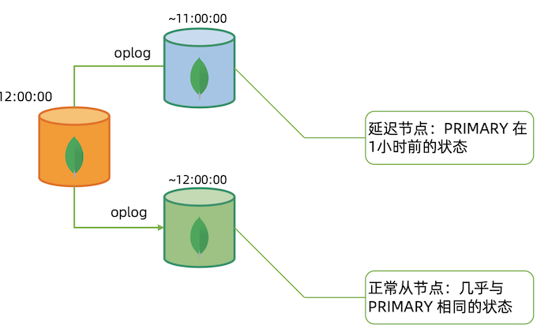
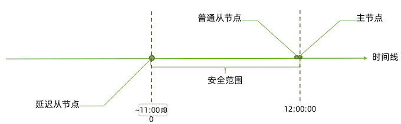
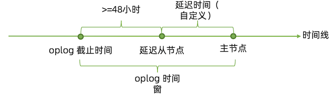
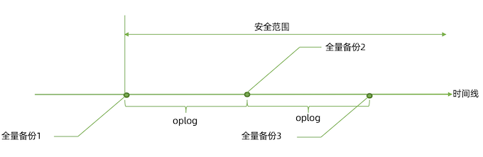
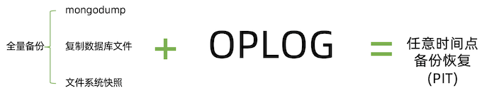
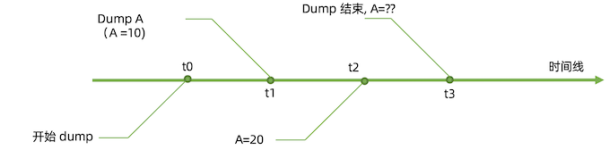
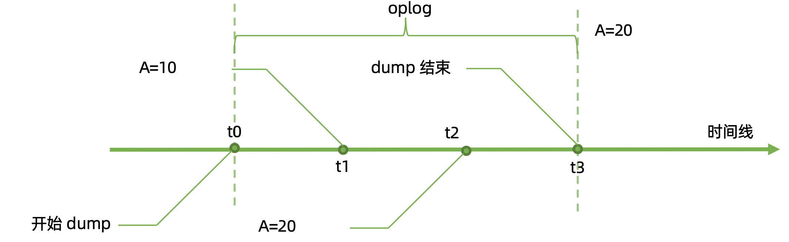
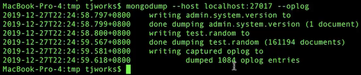
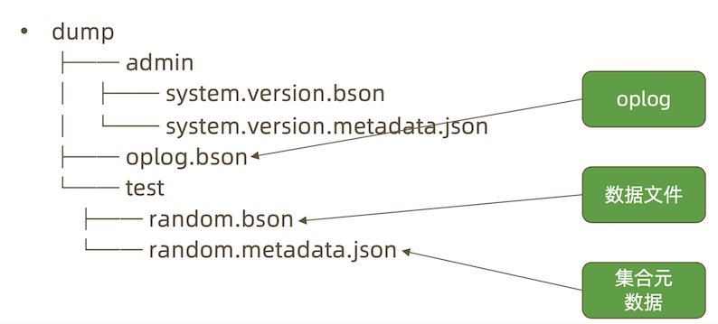

# **10 MongoDB 备份与恢复**

## **1 备份与恢复**

### **备份的目的:**

* 防止硬件故障引起的数据丢失 
* 防止人为错误误删数据
* 时间回溯
* 监管要求

 第一点 MongoDB 生产集群已经通过复制集的多节点实现，本讲的备份主要 是为其他几个目的。
 
### **MongoDB 的备份**

**MongoDB 的备份机制分为:**

* 延迟节点备份
* 全量备份 + Oplog 增量

**最常见的全量备份方式包括:**

* mongodump;
* 复制数据文件; 
* 文件系统快照;

### **方案一:延迟节点备份**






`安全范围内的任意时间点状态 = 延迟从节点当前状态 + 定量重放 oplog`

**<mark>但是会丢失一个小时的操作</mark>**

**延迟备份注意事项**

主节点的 oplog 时间窗t应满足: `t >= 延迟时间 + 48小时`



### **方案二:全量备份加 oplog**



* 最近的 oplog 已经在 `oplog.rs` 集合中，**因此可以在定期从集合中导出便得到了 oplog;**
* 如果主节点上的 `oplog.rs` 集合足够大，**全量备份足够密集，自然也可以不用备份 oplog**;
* **只要有覆盖整个时间段的 `oplog`，就可以结合全量备份得到任意时间点的备份**。



### **复制文件全量备份注意事项**

复制数据库文件:

* **必须先关闭节点才能复制，否则复制到的文件无效**;
* 也可以选择 `db.fsyncLock()` 锁定节点，但完成后不要忘记 `db.fsyncUnlock()` 解锁; 
* 可以且应该在从节点上完成;
* **该方法实际上会暂时宕机一个从节点，所以整个过程中应注意投票节点总数**。

### **全量备份加 oplog 注意事项 – 文件系统快照**

**文件系统快照:**

* MongoDB 支持使用文件系统快照直接获取数据文件在某一时刻的镜像; 
* 快照过程中可以不用停机;
* 数据文件和 Journal 必须在同一个卷上;
* 快照完成后请尽快复制文件并删除快照;

### **Mongodump 全量备份注意事项**

mongodump:

*  **使用 mongodump 备份最灵活，但速度上也是最慢的;**
* **mongodump 出来的数据不能表示某个个时间点，只是某个时间段**



可能出现的问题：

* Dump A (A=10) t1 -> Dump A (A=10) t3 (结束)
* 中间 t2 A=20 已经发生了改变

### **解决方案:幂等性**

假设集合中有2个文档:

```
– {_id: 1, a: 1}
– {_id: 2, b: 0}
```

考虑以下三条 oplog:

- 将 `_id` 为1的记录的a字段更新为5; 
- 将 `_id` 为1的记录的a字段更新为10; 
- 将 `_id `为2的记录的b字段更新为20;

这三条 oplog 顺序执行，无论执行多少次，最终得 到的结果均是: `{_id: 1, a: 10}, {_id: 2, b: 20}`

```
{
	"ts": Timestamp(1546531845, 1),
	"t": NumberLong(125),
	"h": NumberLong("7330107490438995549"),
	"v": 2,
	"op": "u",
	"ns": "test.test",
	"ui": UUID("efe7e331-4fe6-4a4c-a57a-d4a3c36b28d9"), 
	"o2": {
		"_id": 1 
	},
	"wall": ISODate("2019-01-03T16:10:45.557Z"), 
	"o": {
		"$v": 1, "
		$set": {
		 "a": 5
		 } 
	}
 }
```

### **幂等性(idempotent)**

有些时候为了保持幂等性，变更转变成oplog时需要做一些特殊处理。例如:

```
db.coll.update({...}, {$inc: {x: 1}}); // 假设结果:x=2
```

这个操作本身不是幂等的，每执行一次x就会`+1`。而为了让它成为幂等的， MongoDB在oplog中记录的实际内容是:将x赋值为2，而不是让x增加1。

用幂等性解决一致性问题




## **2 备份和恢复操作**

### **备份和恢复工具参数**

几个重要参数:

* mongodump： 
	* `--oplog`: 复制 `mongodump` 开始到结束过程中的所有 `oplog` 并输出到结果中。 输出文件位于 `dump/oplog.bson`
	* mongorestore

* `--oplogReplay`: 恢复完数据文件后再重放 `oplog`。默认重放 `dump/oplog.bson
=> <dump-directory>/local/oplog.rs.bson`。如果 oplog 不在这，则可以:
	* `--oplogFile`: 指定需要重放的 oplog 文件位置
	* `--oplogLimit`: 重放 oplog 时截止到指定时间点

更多说明:

* [mongodump — MongoDB Manual](https://www.mongodb.com/docs/database-tools/mongodump/)
* [mongorestore — MongoDB Manual](https://www.mongodb.com/docs/database-tools/mongorestore/)

实际操作: `mongodump/mongorestore`

为了模拟 dump 过程中的数据变化，我们开启一个循环插入数据的线程:

```
 use test
switched to db test
> show tables
books_favCount
log_events
movies
restaurants
scores
users
zips
> db.random.count()
0
```

```
for(var i=0; i<100000; i++){  db.random.insertOne({x: Math.random() * 100000}); }
```

在另一个窗口中我们对其进行 mongodump

```
mongodump -h 127.0.0.1:27017 --oplog
```

```
2022-05-05T09:07:02.106+0000	Failed: error dumping metadata: error creating directory for metadata file dump/appdb: mkdir dump: permission denied
```

```
sudo chmod 777 $MONGODATA/dump

$ ll | grep dump
drwxrwxrwx. 3 root root       18 Apr 30 03:57 dump
```

```
$ mongodump -h 127.0.0.1:27017 --oplog
2022-05-05T09:15:09.195+0000	writing admin.system.users to dump/admin/system.users.bson
2022-05-05T09:15:09.196+0000	done dumping admin.system.users (2 documents)
2022-05-05T09:15:09.197+0000	writing admin.system.version to dump/admin/system.version.bson
2022-05-05T09:15:09.197+0000	done dumping admin.system.version (2 documents)
```



```
[dump]$ ll dump | grep test
drwxrwxr-x. 2 vagrant vagrant  244 May  5 09:13 test
[dump]$ ll dump/test | grep random
-rw-rw-r--. 1 vagrant vagrant 173 May  5 09:15 random.metadata.json
-rw-rw-r--. 1 vagrant vagrant 173 May  5 09:15 random.bson
```

**实际操作: `mongodump/mongorestore`**

```
> db.random.count()
100000
```

得到以下目录:



### **实际操作:mongodump/mongorestore**

使用`mongorestore`恢复到一个新集群:

```
mongorestore --host 127.0.0.1 --oplogReplay dump
```

* `--oplogReplay dump` : 重放oplog

```
2019-12-27T21:15:30.708+0800 2019-12-27T21:15:30.709+0800 2019-12-27T21:15:30.748+0800 2019-12-27T21:15:31.471+0800 2019-12-27T21:15:31.471+0800 2019-12-27T21:15:31.471+0800 2019-12-27T21:15:31.524+0800 2019-12-27T21:15:31.524+0800
preparing collections to restore from
reading metadata for test.random from dump/test/random.metadata.json restoring test.random from dump/test/random.bson
no indexes to restore
finished restoring test.random (14324 documents, 0 failures)
replaying oplog
applied 163 oplog entries
14324 document(s) restored successfully. 0 document(s) failed to restore.
```

*  重放了163 条oplog

### **更复杂的重放 oplog**

假设全量备份已经恢复到数据库中(无论使用快照、mongodump 或复制数据文件的方式)，要重放一部分增量怎么办?

**导出主节点上的 oplog:**

```
mongodump --host 127.0.0.1 -d local -c oplog.rs
```

* 可以通过 `-query` 参数添加时间范围

使用 bsondump 查看导出的 oplog，找到需要截止的时间点:

```
例如:{ "ts" : Timestamp(1577355175, 1), "t" : NumberLong(23), "h" : NumberLong(0), "v" : 2, "op" : "c", "ns" : "foo.$cmd", "ui" : UUID("767b3a2b-a1cd-4db8-a74a-71ce9711f368"), "o2" : { "numRecords" : 1 }, "wall" : ISODate("2019-12-26T10:12:55.436Z"), "o" : { "drop" : "employees" } }
```

**恢复到指定时间点**

*  利用 `--oplogLimit` 指定恢复到这条记录之前
* `mongorestore -h 127.0.0.1 --oplogLimit "1577355175:1" --oplogFile dump/local/oplog.rs <空文件夹>`

bsondump手册: [bsondump](https://www.mongodb.com/docs/database-tools/bsondump/)

### **分片集备份**

分片集备份大致与复制集原理相同，不过存在以下差异:

* 应分别为每个片和 config 备份;
* 分片集备份不仅要考虑一个分片内的一致性问题，还要考虑分片间的一致性问题，因此每 个片要能够恢复到同一个时间点;

### **分片集的增量备份**

尽管理论上我们可以使用与复制集同样的方式来为分片集完成增量备份，但实际上 分片集的情况更加复杂。这种复杂性来自两个方面

*  各个数据节点的时间不一致:每个数据节点很难完全恢复到一个真正的一致时间点上，通 常只能做到大致一致，而这种大致一致通常足够好，除了以下情况;
*  分片间的数据迁移:当一部分数据从一个片迁移到另一个片时，最终数据到底在哪里取决 于 config 中的元数据。如果元数据与数据节点之间的时间差异正好导致数据实际已经迁 移到新分片上，而元数据仍然认为数据在旧分片上，就会导致数据丢失情况发生。虽然这 种情况发生的概率很小，但仍有可能导致问题。

**要避免上述问题的发生，只有定期停止均衡器;只有在均衡器停止期间，增量恢复才能保证正确。**