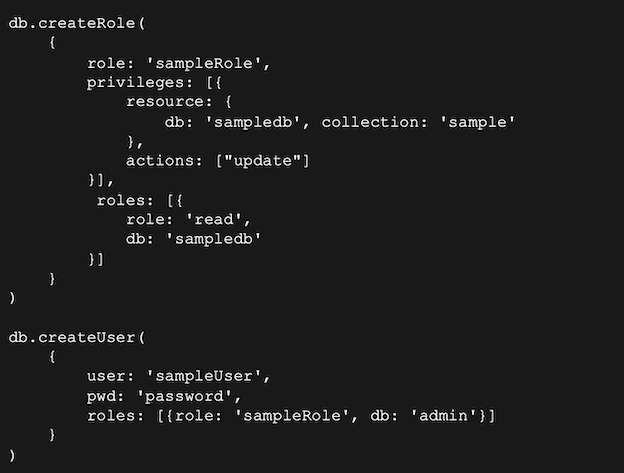

# **11 MongoDB 安全设计**

## **MongoDB 安全架构**

**MongoDB 安全架构一览图**


### **MongoDB 用户认证方式**

**用户名 + 密码**

* 默认认证方式
* SCRAM-SHA-1 哈希算法
* 用户信息存于 MongoDB 本地数

**证书方式**

* X.509 标准
* 服务端需要提供证书文件启动
* 客户端需要证书文件连接服务端 
* 证书由外部或内部 CA 颁发

**LDAP 外部认证**

* 连接到外部 LDAP 服务器
* 企业版功能

**Kerberos 外部认证**

*  连接到外部Kerberos服务器 
*  企业版功能

### **MongoDB 集群节点认证**

* **Keyfile**: 将统一Keyfile文件拷贝到不同的节点 Keyfile 就是一个字符串


* X.509 (更加安全) 基于证书的认证模式，**推荐不同的节点 使用不同的证书**


### **MongoDB 鉴权 – 基于角色的权限机制**

* MongoDB 授权基于角色的权限控制，不同的权限的用户对数据库的操作不同
* 例如 DBA 可以创建用户;应用开发者可以插入数据;报表开发者可以读取数据。


### **角色的组成**


**MongoDB 内置角色及权限继承关系**


### **自定义角色**

MongoDB 支持按需自定义角色，适合一些高安全要求的业务场景



### **传输加密**

MongoDB 支持 TLS/SSL 来加密 MongoDB 的所有网络传输(客户端应用和服务器端之间，内部复制集之间)。 TLS/SSL 确保 MongoDB 网络传输仅可由允许的客户端读取。


### **落盘加密**

**流程:**

1. 生成 master key，用来加密每一个数据库的 key。
2. **生成每一个数据库的 key，用来加密各自的数据库**。
3. **基于生成的数据库 key 加密各个数据库中的数据**。
4. Key 管理(只针对 master key，数据库 key 保存 在数据库内部)。


**<mark>加密解密都在服务端</mark>**


### **字段级加密**

* 单独文档字段通过自身密钥加密
* 数据库只看见密文
* 优势
	* 便捷:自动及透明
	* 任务分开:(简化基于服务的系统步骤，因为没有服务工程师能够看到纯文本) 
	* 合规:监管“被遗忘权”
	* 快速:最小性能代偿

### **字段级加密查询流程**


**<mark>加密解密都在驱动端</mark>**

### **审计**

* 数据库等记录型系统通常使用审计监控数据库相关的一些活动，以及对一些可疑的操作进行调查。
* 记录格式: JSON
* 记录方式:本地文件 或 syslog
* 记录内容:
	* Schema change (DDL)
	* CRUD 操作 (DML) 
	* 用户认证

### **审计配置参数举例**

* 审计日志记录到 syslog： `--auditDestination syslog`
* 审计日志记录写到指定文件

```
--auditDestination file --auditFormat JSON --auditPath /path/to/auditLog.json
```

* 对删表和创建表动作进行审计日志记录

```
--auditDestination file --auditFormat JSON --auditPath auditLog.json -- auditFilter '{atype: {$in: ["createCollection", "dropCollection"]}}’
```

### **MongoDB 安全架构总结**


## **2 MongoDB 安全加固实践**

### **MongoDB 安全最佳实践**

1. 启用身份认证
	* 启用访问控制并强制
	* 执行身份认证
	* 使用强密码

2. 权限控制
	* 基于 Deny All 原则 不多给多余权限.

3. 加密和审计
	* 启用传输加密、数据保护和活动审计

4. 网络加固
	* 内网部署服务器
	* 设置防火墙
	* 操作系统设置

5. 遵循安全准则
	* 遵守不同行业或地区安全标准合规性要求

### **合理配置权限**

**创建管理员 / 使用复杂密码 / 不同用户不同账户 / 应用隔离 / 最小权限原则**

### **启用加密**

* 使用 TLS 作为传输协议
* 使用4.2版本的字段级加密对敏感字段加密 
* 如有需要，使用企业版进行落盘加密
* 如有需要，使用企业版并启用审计日志

### **Demo: 启用认证**

* 方式一: 命令行方式通过 `--auth` 参数
* 方式二: 配置文件方式在 security 下添加 `authorization: enabled`

```
mongod  --auth  --port 27017 --dbpath /data/db
```

启用鉴权后，无密码可以登录，但是只能执行创建用户操作

```
mongo
> use admin
> db.createUser({user: "superuser", pwd: "password", roles: [{role: "root", db: "admin"}]} )
```

安全登录，执行如下命令查看认证机制

```
mongo -u superuser -p password --authenticationDatabase admin 

db.runCommand({getParameter: 1, authenticationMechanisms: 1})
```

```
mongod --dbpath /data/db  --fork  --logpath  --port 27017   --auth 

mongo
```

从数据库中查看用户

```
db.system.users.find()
```

无法进行任何 list, use, find 的操作


Not authorized 


```
db.createUser({user: "superuser", pwd: "password", roles: [{role: "root", db: "admin"}]} )
```


**用的admin 登录就可以看到自己家想看的db, collections，还有记录**

```
mongo -u superuser -p abc123 --authenticationDatabase admin
```


### **创建应用用户**

**创建只读用户**

```
db.createUser({user: "reader", pwd: "abc123", roles: [{ role:"read", db: "acme" }]})
```


acme Reader 只能针对acme读表数据


> 不能对其他collection操作


> 不能有写入操作


**创建读写用户**

```
db.createUser({user: "writer", pwd: "abc123", roles: [{ role:"readWrite", db: "acme" }]})
```


> 只能对acme collection操作