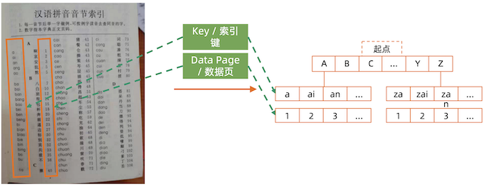
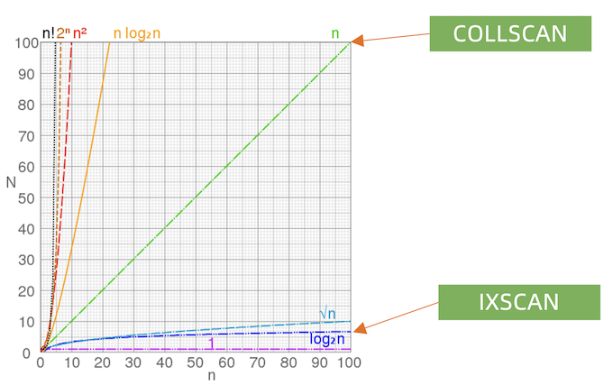
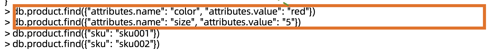
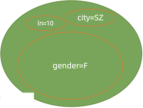
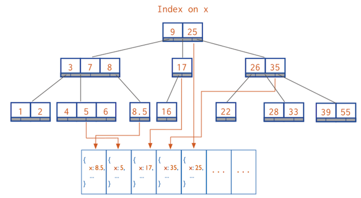
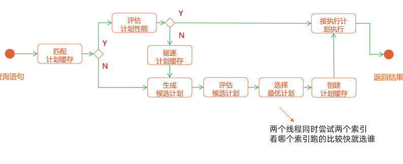
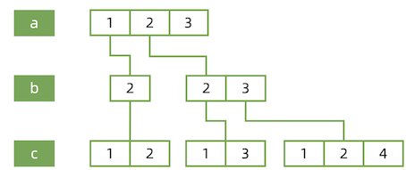
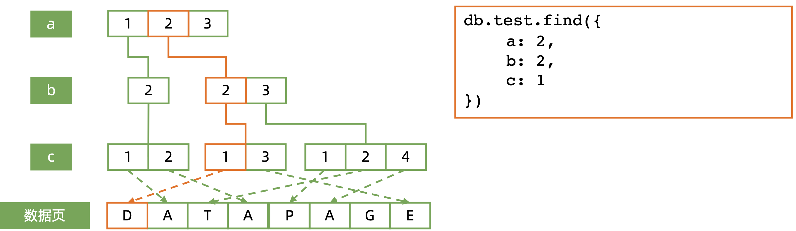
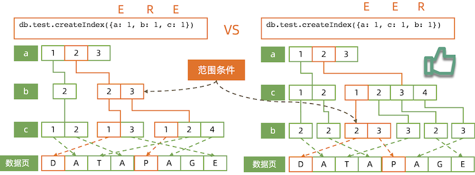
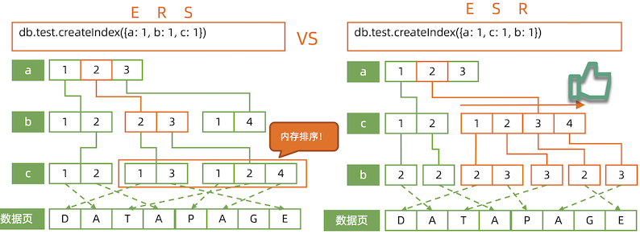

# **12 MongoDB 索引**

## **MongoDB 索引机制**

### **1 术语 – Index / Key**

**Index/Key/DataPage——索引/键/数据页?**



### **2 术语 – Covered Query**

Covered Query/FETCH——查询覆盖/抓取?

如果所有需要的字段都在索引中，不需要额外的字段，就可 以不再需要从数据页加载数据，这就是查询覆盖。

```
db.human.createIndex({firstName: 1, lastName: 1, gender: 1, age: 1})
```


### **术语 – IXSCAN/COLLSCAN**

IXSCAN/COLLSCAN——索引扫描/集合扫描


术语 – Big O Notation



### **术语 – Query Shape**

**Query Shape——查询的形状?**

```
query Shape = {
	"attribute.name": 1, 
	"attribute.value": 1
}
```



### **术语 – Index Prefix**

**`Index Prefix——索引前缀`**

```
db.human.createIndex({firstName: 1, lastName: 1, gender: 1, age: 1})
```

以上索引的全部前缀包括:

*  `{firstName: 1}`
* `{firstName: 1, lastName: 1}`
* `{firstName: 1, lastName: 1, gender: 1}`

**所有索引前缀都可以被该索引覆盖，没有必要针对这些查询建立额外的索引**

### **术语 - Selectivity**

>  Selectivity——过滤性

在一个有10000条记录的集合中:

* 满足 `gender= F` 的记录有4000 条
* 满足 `city=LA` 的记录有 100 条
* 满足 `ln='parker'` 的记录有 10 条

条件 ln 能过滤掉最多的数据，city 其次，gender 最弱。所以 ln 的过 滤性(selectivity)大于 city 大于 gender。

如果要查询同时满足:

`gender == F && city == SZ && ln == 'parker'`

的记录，但只允许为 `gender/city/ln` 中的一个建立索引，应该把索引放在哪里?



**ln 更高效**

### **B树结构**

索引背后是 B-树。要正确使用索引，必须先了解 B-树的工作原理。




B- 树: 基于B树，但是子节点数量可以超过2个

### **数据结构与算法复习**

由于 B树/B-树的工作过程过于复杂，但本质上它是一个有序的数据结构。我们 用数组来理解它。假设索引为`{a: 1}(a 升序)`:

``` 
数据                               索引
db.table.insert({a: 1})          [1]
db.table.insert({a: 10})         [1, 10]
db.table.insert({a: 5})          [1, 5, 10]
db.table.insert({a: 7})          [1, 5, 7, 10]
db.table.insert({a: 3})          [1, 3,5,7,10]
```

* 数据增加/删除时始终 保持被索引字段有序
* 数组插入效率太低，但 B 树可以高效实现
* 在有序结构上实施二分查找，可实现 O(log2(n)) 高效搜索
 
## **2  MongoDB 索引机制**

### **索引执行计划**


 
**假设集合有两个索引**

1. `{city: 1}`
2. `{last_name:1 }`

查询:

`db.members.find({ city: "LA", last_name: "parker"}) ` 问题:用哪个索引?

### **`explain()`**

```
-- 写入10000条文档

for (var i=1;i<100000; i++)
	db.col.insert({name:i, age:i, date:new Date() 
} )

-- 查询
db.col.find({name:1111}).explain(true)
```

```
>>"executionStats" :
{ 
	"executionSuccess" : true,
	"nReturned" : 1,
	"executionTimeMillis" : 58,
	"totalKeysExamined" : 0,
	"totalDocsExamined" : 99999,
		"executionStages" : {
		"stage" : "COLLSCAN",
		"filter" : {"name" : {"$eq" : 1111}}, 
		"nReturned" : 1,
		"executionTimeMillisEstimate" : 53, 
		"works" : 100001,
		"advanced" : 1, 
		"needTime" : 99999, 
		"needYield" : 0, 
		"saveState" : 783, 
		"restoreState" : 783, 
		"isEOF" : 1,
		"invalidates" : 0, 
		"direction" : "forward", 
		"docsExamined" : 99999
```

* `"executionTimeMillis" : 58`
* `"totalDocsExamined" : 99999`
* `"stage" : "COLLSCAN",`
* `"docsExamined" : 99999`

**插入索引**

```
-- 写入10000条文档
for (var i=1;i<100000; i++)
	db.col.insert(
		{name:i, age:i, date:new Date() } 
)
-- 创建name索引 
db.col.createIndex({name:1})

-- 查询 
db.col.find({name:1111}).explain(true)
```

```
> "executionStats" : {
	"executionSuccess" : true, 
	"nReturned" : 1,
	"executionTimeMillis" : 3, 
	"totalKeysExamined" : 1, 
	"totalDocsExamined" : 1, 
	"executionStages" : {
		"stage" : "FETCH", 
		"nReturned" : 1,
	"executionTimeMillisEstimate" : 0,
		"docsExamined" : 1, 
		"alreadyHasObj" : 0, 
		"inputStage" : {
			"stage" : "IXSCAN",
			"nReturned" : 1,
			"executionTimeMillisEstimate" : 0,
			"works" : 2,
			"advanced" : 1,
		 ...
}
```

* **`"executionTimeMillis" : 3, `**
* **`"totalDocsExamined" : 1,`**
* **`"docsExamined" : 1`**
* **`"stage" : "IXSCAN",`**


### **MongoDB 索引类型**

* 单键索引
* **组合索引**
* 多值索引
* **地理位置索引**
* **全文索引**
* TTL索引 
* **部分索引** 
* 哈希索引

### **组合索引 – Compound Index**

```
db.members.find({ gender: "F"， age: {$gte: 18}}).sort("join_date:1")
```

```
{ gender: 1, age: 1, join_date: 1 } 
{ gender: 1, join_date:1, age: 1 } 
{ join_date: 1, gender: 1, age: 1 } 
{ join_date: 1, age: 1, gender: 1 } 
{ age: 1, join_date: 1, gender: 1} 
{ age: 1, gender: 1, join_date: 1}
```

这么多候选的，用哪一个?

**组合索引的最佳方式:ESR原则**

* 精确(**E**qual)匹配的字段放最前面
* 排序(**S**ort)条件放中间
* 范围(**R**ange)匹配的字段放最后面

同样适用: ES, ER

### **组合索引工作模式**

```
{a: 1, b: 2, c: 1} 
{a: 1, b: 2, c: 2} 
{a: 2, b: 2, c: 1} 
{a: 2, b: 2, c: 3} 
{a: 2, b: 3, c: 1} 
{a: 2, b: 3, c: 2} 
{a: 2, b: 3, c: 4}

db.test.createIndex({ 
	a: 1,
	b: 1,
	c: 1 
})
```




**组合索引工作模式: 精确匹配**

`db.test.createIndex({a: 1, b: 1, c: 1})`

```
db.test.find({
    a: 2,
    b: 2,
    c: 1 
})
```




####**范围组合查询: 索引字段顺序的影响**

`db.test.find({a: 2, b: {$gte: 2, $lte: 3}, c: 1})`



**EER is much better**

### **范围+排序组合查询: 索引字段顺序的影响**

**`db.test.find({a: 2, b: {$gte: 2, $lte: 3}).sort({c: 1})`**



**ESR is much better**


**<mark>ERS 里面内存排序将会耗费大量的内存</mark>**

### **地理位置索引**

```
-- 创建索引
db.geo_col.createIndex(
		{ location: "2d"} ,
		{ min:-20, max: 20 , bits: 10},
		{collation:{locale: "simple"} }
)

db.geo_col.find(
	{ location :
		{ $geoWithin:  { $box : [ [ 1, 1 ] , [ 3, 3 ] ] } } }
)
```
```
-- 查询结果
{ "_id" : ObjectId("5c7e7a6243513eb45bf06125"), "location" : [ 1, 1 ] }
 { "_id" : ObjectId("5c7e7a6643513eb45bf06126"), "location" : [ 1, 2 ] } 
 { "_id" : ObjectId("5c7e7a6943513eb45bf06127"), "location" : [ 2, 2 ] } 
 { "_id" : ObjectId("5c7e7a6d43513eb45bf06128"), "location" : [ 2, 1 ] } 
 { "_id" : ObjectId("5c7e7a7343513eb45bf06129"), "location" : [ 3, 1 ] } 
 { "_id" : ObjectId("5c7e7a7543513eb45bf0612a"), "location" : [ 3, 2 ] } 
 { "_id" : ObjectId("5c7e7a7743513eb45bf0612b"), "location" : [ 3, 3 ] }
```

### **全文索引**

```
-- 插入数据
db.<collection_name>.insert(
	{ _id: 1, content: "This morning I had a cup of coffee.", about: "beverage", keywords: [ "coffee" ] } ,
	{ _id: 2, content: "Who doesn't like cake?", about: "food", keywords: [ "cake", "food", "dessert" ] },
	{ _id: 3, content: "Why need coffee?", about: ”food", keywords: [ ”drink", "food" ] }
)


-- 创建索引
>> db.<collection_name>.createIndex(
	{'content': 'text' }
)

-- 查询
db.<collection_name>.find( { 
	$text :   { $search : "cup coffee like" }
})

db.<collection_name>.find( { 
	$text:  {$search: "a cup of coffee" }
})

-- 查询排序
db.<collection_name>.find(
	{ $text : { $search : "coffee"} },
	{ textScore: { $meta : "textScore" }} ).sort({ textScore: { $meta: "textScore" }} )
```

### **部分索引**

```
-- 创建部分索引
>> db.<collection_name>.createIndex( 
	{'a': 1 },
	{ partialFilterExpression: 
		{a:{
			$gte:5
		} 
	}
)

-- 只对有wechat字段的建索引:
db.<collection_name>.createIndex( 
	{'wechat': 1 },
	{ partialFilterExpression: 
		{wechat:
			{$exists: true}
		} 
)

-- 索引目标文档
{ "_id" : ObjectId("5c7f4d8723a59b2f55f58ca9"), "a" : 5 } 
{ "_id" : ObjectId("5c7f4d8723a59b2f55f58caa"), "a" : 6 } 
{ "_id" : ObjectId("5c7f4d8723a59b2f55f58cab"), "a" : 7 } 
{ "_id" : ObjectId("5c7f4d8723a59b2f55f58cac"), "a" : 8 }
{ "_id" : ObjectId("5c7f4d8723a59b2f55f58cad"), "a" : 9 } 
{ "_id" : ObjectId("5c7f4d8723a59b2f55f58cae"), "a" : 10} 
```

### **其他索引技巧**

**后台创建索引**

```
db.member.createIndex( { city: 1}, {background: true} )
```

**对BI / 报表专用节点单独创建索引**

* 该从节点priority设为0
* 关闭该从节点，
* 以单机模式启动
* 添加索引(分析用)
* 关闭该从节点，以副本集模式启动