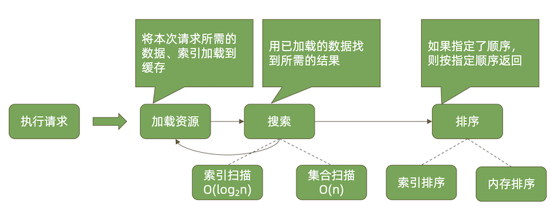

# **13 MongoDB 性能**

## **1 MongoDB 性能机制**

一次数据库请求过程中发生了什么?


### **应用端**


### **应用端-选择节点**

对于复制集读操作，选择哪个节点是由 `readPreference` 决定的:

* primary/primaryPreferred
* secondary/secondaryPreferred 
* nearest

如果不希望一个远距离节点被选择，应做到以下之一:

* 将它设置为隐藏节点;
* 通过标签(Tag)控制可选的节点;
* 使用 nearest 方式;


### **应用端-排队等待**

* 排队等待连接是如何发生的?
	* 总连接数大于允许的最大连接数maxPoolSize;
* 如何解决这个问题?
	* 加大最大连接数(不一定有用); 
	* 优化查询性能;

### **应用端-连接与认证**

* 如果一个请求需要等待创建新连接和进行认证，相比直接从连接池获取连接，它将耗费更长时间。
* 可能解决方案:
	* **设置 minPoolSize(最小连接数)一次性创建足够的连接;**
	* 避免突发的大量请求;

### **数据库端**


**数据库端-排队等待**

* **由 ticket 不足引起的排队等待，问题往往不在 ticket 本身，而在于为什么正在执行 的操作会长时间占用 ticket**。
* 可能解决方案:
	* 优化 CRUD 性能可以减少 ticket 占用时间;
	* zlib 压缩方式也可能引起 ticket 不足，因为 zlib 算法本身在进行压缩、解压时需要的时 间比较长，从而造成长时间的 ticket 占用;


### **数据库端-执行请求(读)**
	
不能命中索引的搜索和内存排序是导致性能问题的最主要原因



**不能命中索引的搜索和内存排序是导致性能问题的最主要原因**

### **数据库端-执行请求(写)**


磁盘速度必须比写入速度要快才能保持缓存水位


### **数据库端-合并结果**


* 如果顺序不重要则不要排序
* **尽可能使用带片键的查询条件以减少参与查询的分片数**

### **网络的考量**


### **性能瓶颈总结**

应用端        |  服务端          |  网络    |
--------------------|------------------|-----------------------|
选择访问入口节点 |  排队等待ticket  | 应用/驱动 - mongos   |
等待数据库连接     |  执行请求   |  mongos - 片   |
创建连接和完成认证    |  合并执行结果   |   |

## **2 性能排查工具**

### **问题诊断工具 - mongostat**


mongostat: 用于了解 MongoDB 运行状态的工具

### **问题诊断工具 - mongotop**


mongotop: 用于了解集合压力状态的工具

### **问题诊断 – mongod 日志**

日志中会记录执行超过 100ms 的查询及其执行计划(关于执行计划的更详细解释 请参考[文档](https://www.mongodb.com/docs/manual/reference/explain-results/)):


```
2019-10-25T11:20:30.775+0800 I COMMAND [conn12] command test.test appName: "MongoDB Shell" command: find { find: "test", filter: { i: 10000.0 }, $db: "test" } planSummary: COLLSCAN keysExamined:0 docsExamined:27108 cursorExhausted:1 numYields:211 nreturned:1 reslen:243 locks:{ Global: { acquireCount: { r: 424 } }, Database: { acquireCount: { r: 212 } }, Collection: { acquireCount: { r: 212 } } } protocol:op_command 19ms
```

### **问题诊断 - mtools**

* 安装:pip install mtools
* 常用指令:
	* mplotqueries 日志文件:将所有慢查询 通过图表形式展现;
	* `mloginfo --queries` 日志文件:总结出 所有慢查询的模式和出现次数、消耗时 间等;

更多指令及用法参考:
	 
https://github.com/rueckstiess/mtools

