# **14 高级集群设计**

## **1 高级集群设计:两地三中心**

### **容灾级别**

> RPO represents how fresh recovered data will be. In practice, the RPO indicates the amount of data (updated or created) that will be lost or need to be reentered after an outage. 
> 
> Recovery Time Objective (RTO) is the amount of downtime a business can tolerate.

* **L0 无备源中心**
	* 没有灾难恢复能力，只在本地进行数据备份
	* RPO  24小时
	* RTO  4小时
* **L1 本地备份+异地保存**
	*  本地将关键数据备份，然后送到异地保存。 
	*  灾难发生后，按预定数据恢复程序恢复系统和数据
	*  RPO 24小时
	*  RTO  8小时
* **L2 双中心主备模式**
	* 在异地建立一个热备份点，通过网络进行数据备份
	* **当出现灾难时，备份站点接替主站点的业务，维护业务连续性**
	* RPO 秒级
	* RTO 数分钟到半小时
* **L3 双中心双活**
	* 在相隔较远的地方分别建立两个数据中心，进行相互数据备份。
	* 当某个数据中心发生灾难时，另一个数据中心接替其工作任务。
	*  RPO 秒级
	*  RTO 秒级
* **双中心双活 + 异地热备 = 两地三中心**
	* 在同城分别建立两个数据中心，进行相互数据备份
	* 当该城市的2个中心同时不可用(地震/大面积停电/网络等)，快速切换到异地
	* RPO 秒级
	* RTO 数分钟

	
### **双活的技术组件**

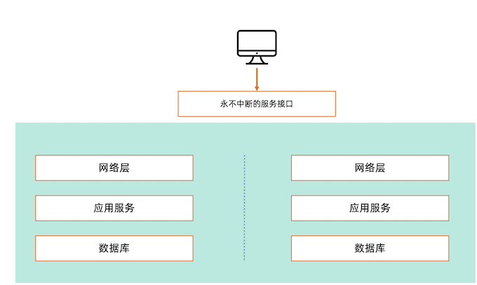

### **网络层解决方案**

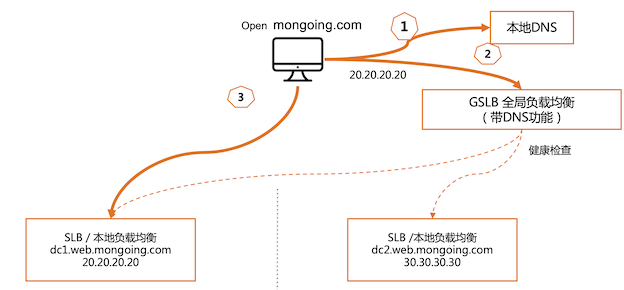

* Server load balancing (SLB)
* Global Server load balancing (GSLB)

### **应用层解决方案**

* 使用负载均衡、虚拟IP
* 使用同一个Session
* 使用同一套数据

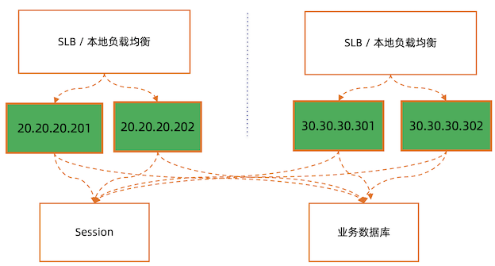

### **数据库解决方案 – 数据跨中心同步**

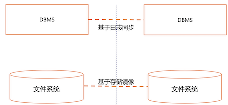

### **MongoDB 三中心方案**

**复制集跨中心部署:**

正常运行状态集群内一个主节点接受写，**其他节点只读**

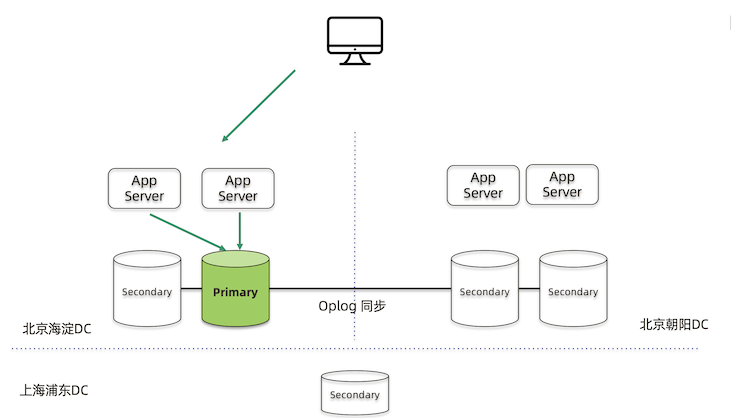

**Failover**

主节点故障主数据中心内自动切主切换时间5-10秒

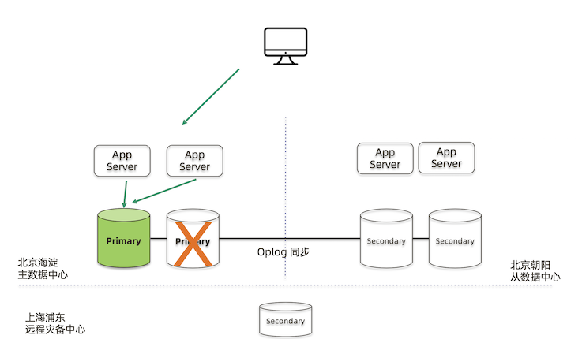

**双中心双活，分流模式朝阳中心需要跨中心写到海淀中心同城双中心需要低延迟专线**

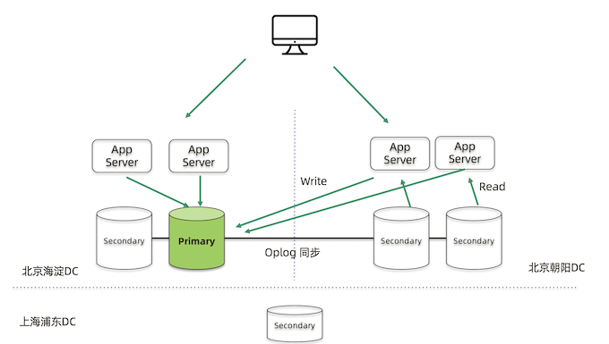

* Write: 写入同一个primary node
* 读：可以从多地的secondary node 读

**正常运行 `writeConcern: majority` 需要等待朝阳中心返回**

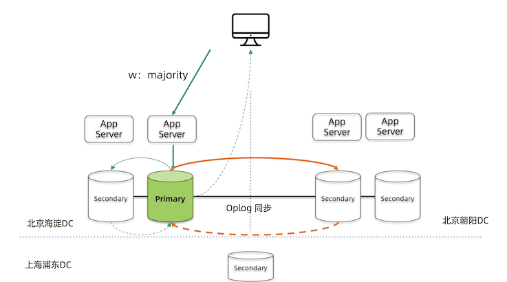

需要oplog同步到多个shard，才能完成统一的写盘落地

### **MongoDB 集群两地三中心部署的考量点**

*  节点数量建议要5个，2+2+1模式
*  主数据中心的两个节点要设置高一点的优先级，减少跨中心换主节点
*  同城双中心之间的网络要保证低延迟和频宽，满足 `writeConcern: Majority` 的双中心写需求
*  **使用 Retryable Writes and Retryable Reads 来保证零下线时间**
*  **用户需要自行处理好业务层的双中心切换**

## **实验:搭建两地三中心集群**

### **实验目标及流程**

* 目标:学习如何搭建一个3中心部署的 MongoDB 复制集
* 环境:3台 Linux 虚拟机， 2 Core 4GB
* 步骤:
	* 配置域名解析
	* 安装 MongoDB
	* 配置复制集
	* 配置优先级
	* 启动持续写脚本
	* 模拟从数据中心故障
	* 模拟主数据中心故障

### **启动5个 MongoDB 实例**

在虚拟机1上执行以下命令 (mem1, mem2)

```
mkdir -p member1 member2
mongod --dbpath ~/member1 --replSet demo --bind_ip 0.0.0.0 --port 10001 --fork --logpath member1.log 
mongod --dbpath ~/member2 --replSet demo --bind_ip 0.0.0.0 --port 10002 --fork --logpath member2.log
```

在虚拟机2上执行以下命令(mem3, mem4)

```
mkdir -p member3 member4
mongod --dbpath ~/member3 --replSet demo --bind_ip 0.0.0.0 --port 10003 --fork --logpath member3.log
mongod --dbpath ~/member4 --replSet demo --bind_ip 0.0.0.0 --port 10004 --fork --logpath member4.log
```

在虚拟机3上执行以下命令(mem5)

```
mkdir -p member5
mongod --dbpath ~/member5 --replSet demo --bind_ip 0.0.0.0 --port 10005 --fork --logpath member5.log
```

### **初始化复制集**

在虚拟机3上执行以下命令测试所有实例正常工作

```
mongo member1.example.com:10001 
mongo member2.example.com:10002 
mongo member3.example.com:10003
mongo member2.example.com:10004 
mongo member3.example.com:10005
```

初始化复制集

```
mongo member1.example.com:10001 
rs.initiate(
		{
		"_id" : "demo", 
		"version" : 1, 
		"members" : [
			{ "_id" : 0, "host" : "member1.example.com:10001" }, 
			{ "_id" : 1, "host" : "member2.example.com:10002" }, 
			{ "_id" : 2, "host" : "member3.example.com:10003" },
			{ "_id" : 3, "host" : "member4.example.com:10004" }, 
			{ "_id" : 4, "host" : "member5.example.com:10005" }
			] 
		}
	)
```

### **配置选举优先级**

**把第一台机器上的2个实例的选举优先级调高为5和10(默认为1)**

```
mongo member1.example.com:10001

cfg = rs.conf() 
cfg.members[0].priority = 5 
cfg.members[1].priority = 10 
rs.reconfig(cfg)
```

> 通常都有主备数据中心之分，我们希望给主数据中心更高的优先级

### **启动持续写脚本(每2秒写一条记录)**

```
# mongo --retryWrites mongodb://member1.example.com:10001,member2.example.com:10002,member3.example.com:10003,member4. example.com:10004,member5.example.com:10005/test?replicaSet=demo ingest-script
```

**`ingest-script`**

```
db.test.drop()
for(var i=1;i<1000;i++){
	db.test.insert({item: i});
	inserted = db.test.findOne({item: i});
	if(inserted)
		print(" Item "+ i +" was inserted ” + new Date().getTime()/1000 + );
	else
		print("Unexpected "+ inserted)
	sleep(2000);
}
```

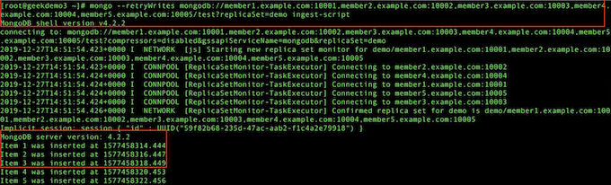

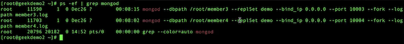

### **模拟从数据中心(第2台机器)故障**

停止第2台虚拟机上所有 mongodb 进程

```
pkill mongod
```


**观察第3台虚拟机上的写入未受中断**

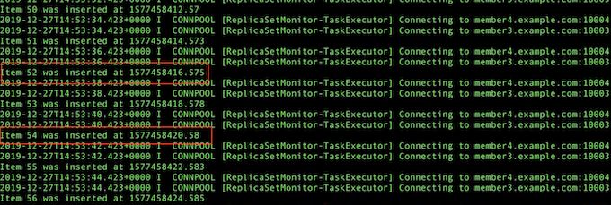

恢复第2台虚拟机上所有 mongodb 进程

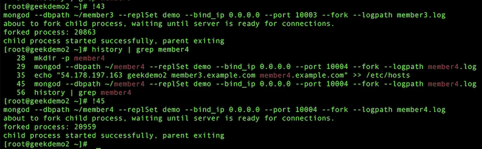

### **模拟主数据中心(第1台机器)故障**

停止第1台虚拟机上所有 mongodb 进程

```
pkill mongod
```

观察第3台虚拟机上的写入未受中断

### **MongoDB 集群两地三中心部署**

* 搭建简单，使用复制集机制，无需第三方软件
* 使用Retryable Writes以后，即使出现数据中心故障，对前端业务没有任何中断 (Retryable Writes 在4.2以后就是默认设置)


## **高级集群设计:全球多写**

MongoDB 多中心部署的三种模式

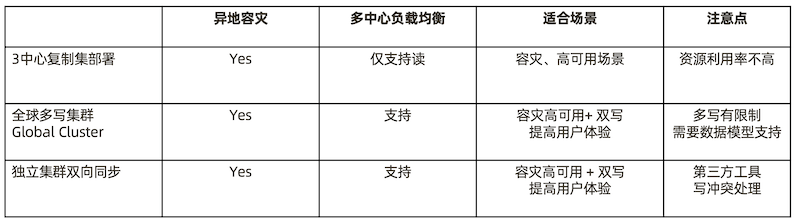

### **全球化业务需求**


* 某奢侈品牌厂商业务集中在大中华地区
* 2020年的目标是要进入美国市场
* 他们的主要业务系统都集中在香港
* 如何设计我们的业务系统来保证海外用户的最佳体验?

### **远距离访问无法保证用户体验**

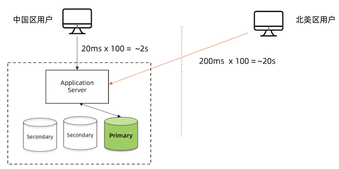

### **MongoDB 复制集 – 只解决了读的问题**

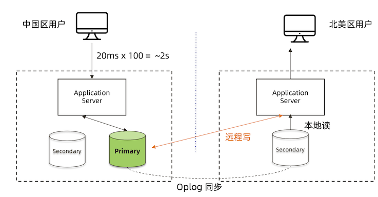

**MongoDB Zone Sharding – 全球集群**

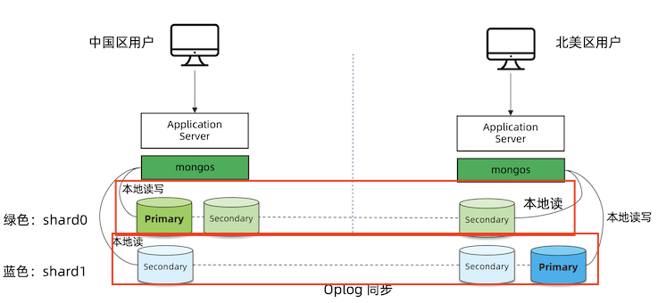

### **Zone Sharding 设置步骤**

* 针对每个要分片的数据集合，模型中增加一个区域字段
* 给集群的每个分片加区域标签
* 给每个区域指定属于这个区域的分片块范围(chunk range)

**1. 数据模型:增加区域字段**

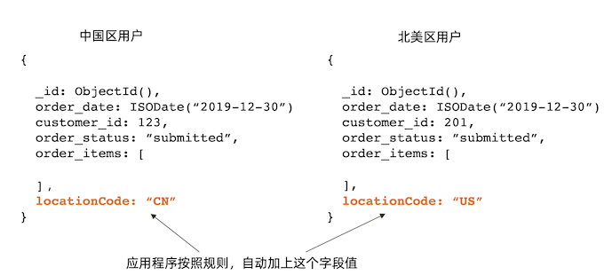

**2. 给分片添加标签**

```
# mongo
> sh.addShardTag(“shard0”, ”ASIA")

> sh.addShardTag(“shard1”, ”AMERICA")
```

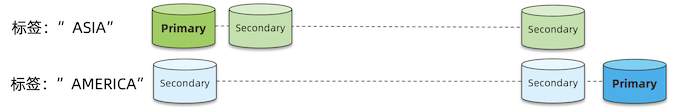

**3. 标签指定数据块范围**

```

# mongo
> sh.addTagRange( ”crm.orders",
	{ "locationCode" : "CN", "order_id" : MinKey },
	{ "locationCode" : "CN", "order_id" : MaxKey } , "ASIA" )

> sh.addTagRange( "crm.orders",
	{ "locationCode" : "US", ”order_id" : MinKey },
	{ "locationCode" : "US", ”order_id" : MaxKey } , "AMERICA" )

> sh.addTagRange( "crm.orders",
	{ "locationCode" : "CA", "order_id" : MinKey },
	{ "locationCode" : "CA", "order_id" : MaxKey } , "AMERICA"  )
```

**MongoDB Zone Sharding 工作原理**

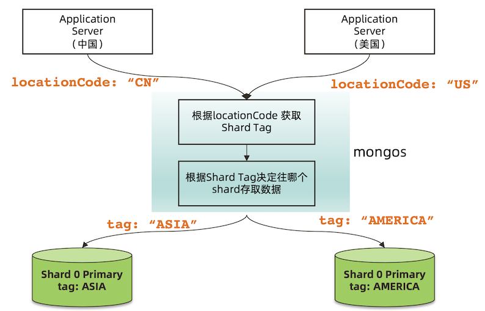

**读写场景分析**

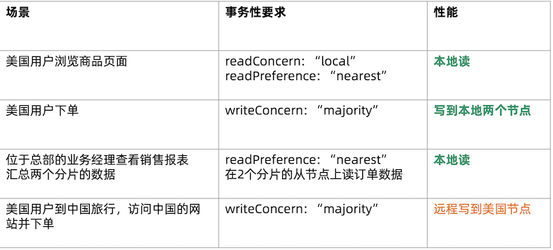

### **独立集群模式 – 需要外部工具双向同步**

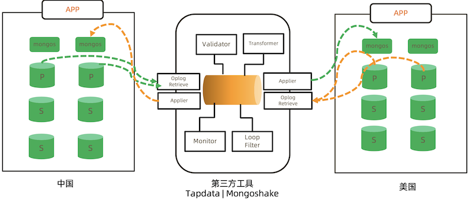