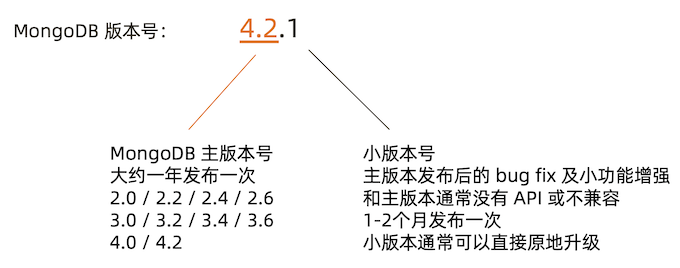
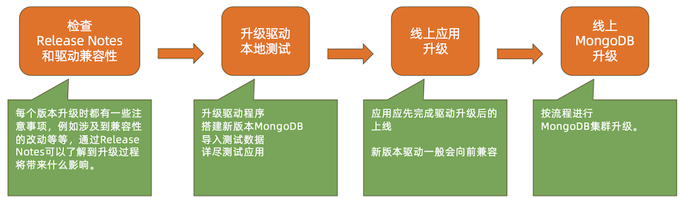
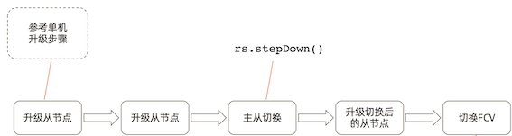
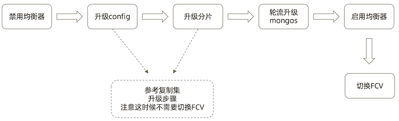

# **15 MongoDB上线及升级**

## **MongoDB上线发布**

### **上线前:性能测试**

* 模拟真实压力，对集群完成充分的性能测试，了解集群概况。
* 性能测试的输出
	*  压测过程中各项指标表现，例如 CRUD 达到多少，连接数达到多少等。 
	*  根据正常指标范围配置监控阈值;
	*  根据压测结果按需调整硬件资源;

### **上线前:环境检查**

按照最佳实践要求对生产环境所使用的操作系统进行检查和调整。最常见的需要调整的参数包括:

* 禁用 NUMA，否则在某些情况下会引起突发大量swap交换;
* **禁用 Transparent Huge Page，否则会影响数据库效率**;
* **`tcp_keepalive_time` 调整为120秒，避免一些网络问题**;
* `ulimit -n`，避免打开文件句柄不足的情况;
* 关闭 atime，提高数据文件访问效率;

更多检查项，请参考文档:[Production Notes](https://www.mongodb.com/docs/manual/administration/production-notes/)

### **上线后**

* **性能监控**

为防止突发状况，应对常见性能指标进行监控以及时发现问题。 性能监控请参考前述章节的内容

* **定期健康检查**

	* mongod 日志;
	* 环境设置是否有变动;
	* MongoDB 配置是否有变动;

## **MongoDB 线上升级**

### **MongoDB 版本发布规律**



### **主版本升级流程**




[https://docs.mongodb.com/ecosystem/drivers/driver-compatibility-reference/](https://docs.mongodb.com/ecosystem/drivers/driver-compatibility-reference/)

### **MongoDB 单机升级流程**


### **MongoDB 复制集升级流程**



```
db.adminCommand( { setFeatureCompatibilityVersion: ”4.2" } 
```

**FCV: FeatureCompatibilityVersion**

### **MongoDB 分片集群升级流程**



### **版本升级:在线升级**

* MongoDB支持在线升级，即升级过程中不需要间断服务;
* 升级过程中虽然会发生主从节点切换，存在短时间不可用，但是:
	* 3.6版本**开始支持自动写重试**可以自动恢复主从切换引起的集群暂时不可写
	* 4.2开始支持的**自动读重试**则提供了包括**主从切换在内的读问题的自动恢复;**

**升级需要逐版本完成，不可以跳版本:**

* 正确: `3.2->3.4->3.6->4.0->4.2`
* 错误: `3.2->4.2`
* 原因:
	* MongoDB复制集仅仅允许相邻版本共存
	* 有一些升级内部数据格式如密码加密字段，需要在升级过程中由mongo进行转换

### **升级流程:降级**

如果升级无论因何种原因失败，则需要降级到原有旧版本。在降级过程中:

*  滚动降级过程中集群可以保持在线，仅在切换节点时会产生一定的不可写时间;
* 降级前应先去除已经用到的新版本特性。例如用到了 NumberDecimal 则应把所有使用 `NumberDecimal` 的文档先去除该字段;
* 通过设置 `FCV(Feature Compatibility Version)` 可以在功能上降到与旧版本兼容;
* FCV 设置完成后再滚动替换为旧版本。