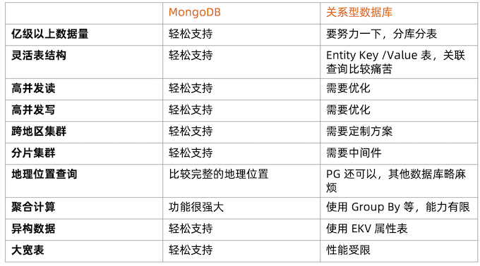
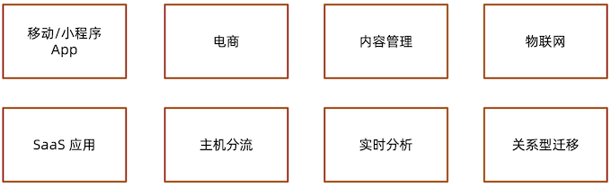
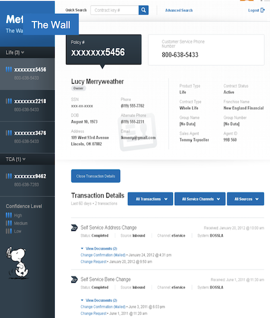
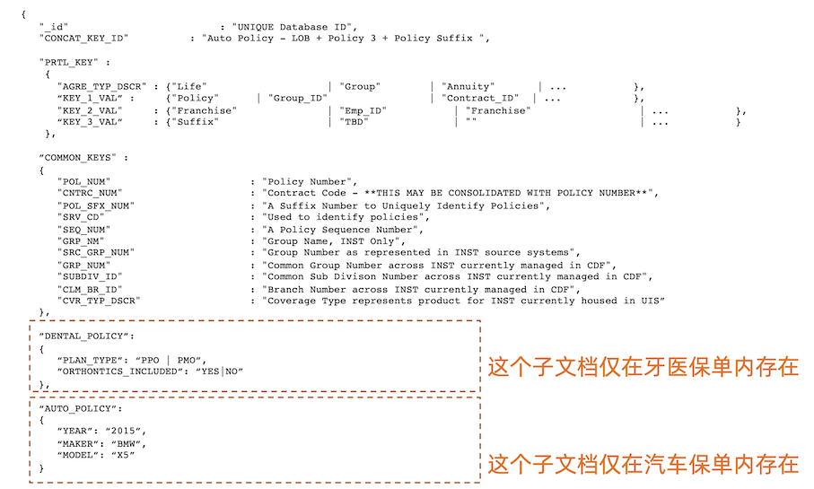
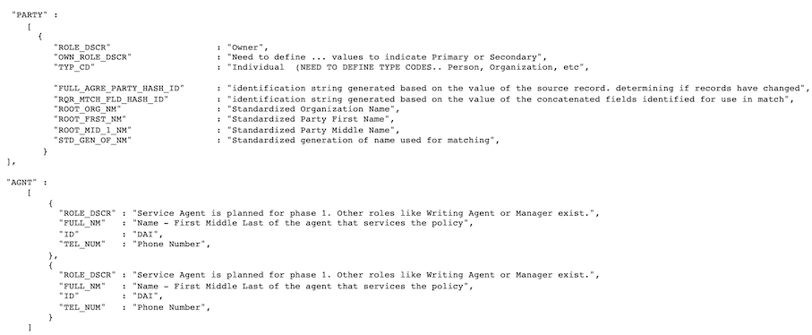
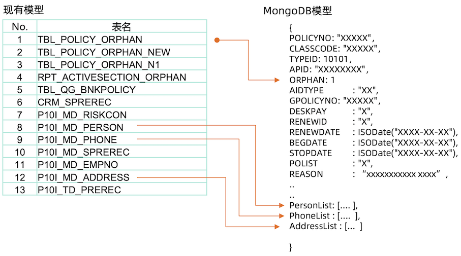
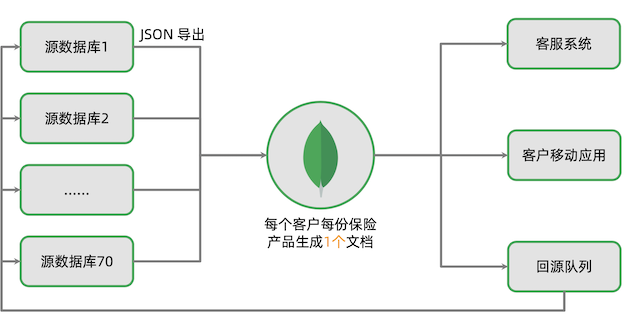
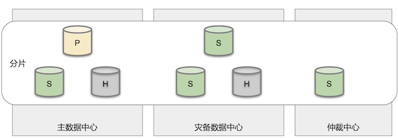
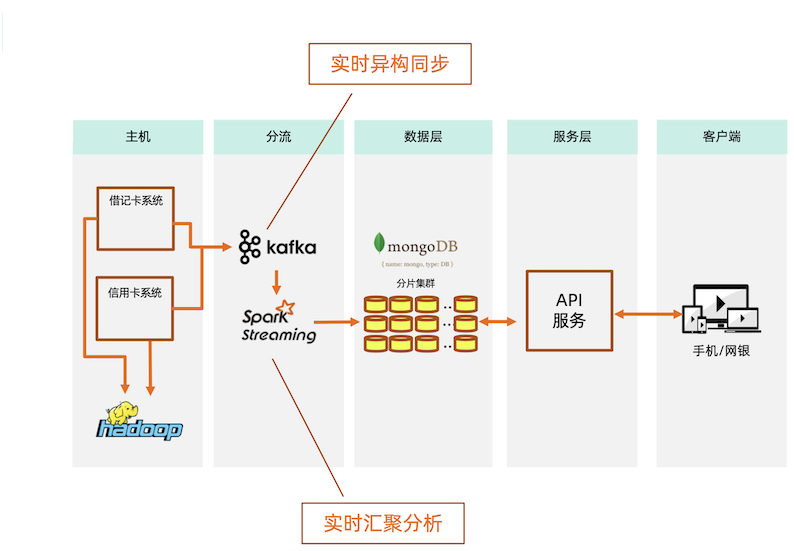
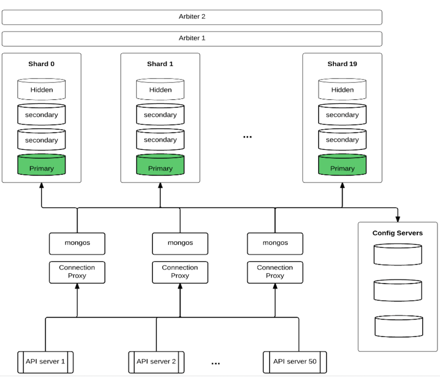

# **16 MongoDB 应用实例和场景**

## **1 MongoDB 应用场景及选型**

### **1-1 MongoDB 数据库定位**

* OLTP 数据库
* 原则上 Oracle 和 MySQL 能做的事情，MongoDB 都能做(包括 ACID 事务)
* **优点:横向扩展能力，数据量或并发量增加时候架构可以自动扩展**
* **优点:灵活模型，适合迭代开发，数据模型多变场景**
* **优点: JSON 数据结构，适合微服务/REST API**

### **基于功能选择 MongoDB**

**基于场景选择 MongoDB**

### **移动应用**

**场景特点**

- 基于 REST API / JSON
- 快速迭代，数据结构变化频繁
- 地理位置功能
- 爆发增长可能性
- 高可用

**MongoDB 选型考量**

- 文档模型可以支持不同的结构
- 原生地理位置功能
- 横向扩展能力支撑爆发增长
- 复制集机制快速提供高可用
- 摩拜单车 / Keep / ADP

### **商品信息**

**场景特点**

- 商品信息包罗万象
- 商品的属性不同品类差异很大 
- 数据库模式设计困难

**MongoDB 选型考量**

- 文档模型可以集成不同商品属性 
- 可变模型适合迭代
- 京东商城 /小红书/ GAP

### **内容管理**

**场景特点**

- 内容数据多样，文本，图片，视频 
- 扩展困难，数据量爆发增长

**MongoDB 选型考量**

- JSON 结构可以支持非结构化数据 
- 分片架构可以解决扩展问题
- Adobe AEM / Sitecore

### **物联网**

**场景特点**

- 传感器的数据结构往往是半结构化 
- 传感器数量很大，采集频繁
- 数据量很容易增长到数亿到百亿

**MongoDB 选型考量**

- JSON 结构可以支持半结构化数据
- 使用分片能力支撑海量数据
- JSON 数据更加容易和其他系统通 过 REST API 进行集成
- 华为 / Bosch / Mindsphere

### **SaaS应用**

**场景特点**

- 多租户模式， 需要服务很多客户 
- 需求多变，迭代压力大
- 数据量增长快

**MongoDB 选型考量**

- 无模式数据库，适合快速迭代
- 水平扩展能力可以支撑大量用户增长
- ADP / Teambition

### **主机分流**

**场景特点**

- 金融行业传统采用 IBM 或者小机
- 传统瀑布开发模式流程长成本高
- 结构不易改变，难于适应新需求
- 根据某银行的统计，99%的数据库 操作为读流量
- 基于 MIPS 付费，读流量成本

**MongoDB 选型考量**

- 使用实时同步机制，将数据同步出 来到 MongoDB
- 使用 MongoDB 的高性能查询能力 来支撑业务的读操作
- 相比于关系模型数据库，更加容易 迁入数据并构建成 JSON 模型进行 API 服务

### **实时分析**

**场景特点**

- 流数据计算
- 快速计算，秒级返回

**MongoDB 选型考量**

- 使用 MongoDB 缓存机制，可以利 用内存计算加速
- 使用 MongoDB 聚合框架，实现分 析功能
- 使用微分片架构的并发计算来大量 缩减计算时间

### **关系型数据库替换**

**场景特点**

- 基于 Oracle / MySQL/ SQLServer 的历史应用
- 数据量增长或者使用者变多以后性 能变慢
- 分库分表需要应用配合
- 结构死板，增加新需求复杂困难

**MongoDB 选型考量**

- 高性能高并发的数据库性能
- 无需应用分库分表，集群自动解决 扩容问题
- 动态模型适合快速开发
- 头条/网易/百度/东航/中国银行

## **MongoDB 典型案例**

### **案例一:客户360 世界500强保险公司**

**业务需求**

跨国保险公司，来自60多个国家的 9000多万用户，70多套业务系统。客 户信息分散在多套系统里，希望构建 一个客户360视图。

第一阶段支撑客服部门更好服务客户，减少客户等待时间。

第二阶段构建客户管理手机 App，自 助管理所有保单。

为了达到这些目的，需要整个70+历 史系统中的客户信息，通过唯一入口查询。

**业务难点**

* 来自60多个国家的9000多万用户，数据量大。
* 70多套不同的保险业务系统的数据需要汇集到一起。
* 已有系统在不断迭代，导致最终数据模型不断变化。
* 关系数据库的结构变化复杂性高，流程长，往往一个迭代未完成，源头系统又变化了。

**关系型 vs MongoDB**

* 使用关系数据库的尝试:
	* 历时2年
	* 前后分别使用2个不同的关系型数据库，
	* 两个不同的厂商/团队 
	* 花费 $2500万美元

> **结果:失败，schema 太复杂，无法有效的 把70套系统的 schema 融合成一套。**

使用 MongoDB 的尝试:

* 动态数据模型轻松接收不同数据 
* 7x24小时高可用

> **结果:2个星期做原型，3个月上线**。

**MongoDB 的数据模型**

保单: 13张关联表 => 1张保单表:让存储、查询变得更简单和灵活。

**系统架构**

**系统架构**

**案例小结**

此案例利用了 MongoDB 的以下特性:

* 反范式的数据模型使得复杂数据整合成为可能
* 高可用(本地和跨机房)
	* 故障发生时应用可以自动切换到正常的节点上
	* 可以在秒级时间内完成故障转移，使得用户体验得到保证

因为这些特性的存在，使得项目成功。

### **案例二:主机分流(主机下行)国内四大行之一**

**业务需求**

为提升用户体验，该银行要在手机银行APP中支持实时账户交易历史查询。涉及的数据包括:

* 借记卡交易历史。
* 信用卡交易历史。
* 后续还将支持股票、基金账户等。

对这些交易历史进行整合，使用户可以看到自己账户的交易历史全貌。涉及的交易数据
量:

* 约6000万交易数据/天，结息日达到~5亿/天。
* 历史存量数据3年，超过600亿。
* 核心系统(主机)支持这样的流量非常困难，成本太高。

**方案选择:主机分流**

关系型数据库:

* 超大量数据需要巨大数量的 DB 实例。 
* 考虑高可用，成本极高。
* 分库分表造成开发难度大幅上升。
* 整合不同账户数据时表结构差异大，合并困难。

> 结果:评审期被否定

使用 MongoDB 的尝试:

* 动态数据模型轻松接收不同数据。 
* 水平扩展解决大数据量问题。
* 7x24小时可用

> 结果:成功上线

**系统架构**

**案例小结**

主机分流架构特点:

* 处理接近每秒1万的交易数据 
* 总量数百亿
* 查询平均性能数毫秒

本案例中利用了 MongoDB 的以下特性:

* 灵活数据模型:使数据整合更为容易
* 弹性扩展:使得海量数据 + 低延迟查询成为可能

### **案例三:MySQL 迁移顶级互联网公司**

**业务场景**

* 旗下多个 App
* DAU7亿
* 42万+服务器
* 每天新增30PB数据(包含非结构化)
* 每日线上变更 6000+
* 标准数据方案
	* MySQL + Redis + 对象存储
* 结构化和半结构化在MySQL 
* MySQL: 数万台服务器

**痛点**

* 数据库变更需要团队配合，对6000+/天的频繁变更造成很大阻碍 
* MySQL 集群本身扩容比较困难
* 中间件的约束较多
* 迭代速度受影响

**新的方向**

* MongoDB 无须中间件，改善变更效率 
* 集群扩容容易
* 结构灵活，迭代快

**MongoDB 业务场景**

* **在线 TP 业务**
	* 数据模型多变，新增 collection 比较常见
	* 低时延和少毛刺
	* 请求量大

* **中台元数据管理**

	* 中台系统，schema 需要很多嵌 入式文档
	* 数据量大，点查为主

* **LBS 地理位置**

	* 计算密集，数据点小，但是量大 
	* 写入更新异常频繁

* **游戏**

	* 游戏日志写入量大，查询量一般 
	* 在线分析需求
 
### **案例四:海量数据存储顶级互联网公司**

亿级用户网盘应用
 
* **挑战**

	* 网盘通讯录，短信存储管理 
	* 网盘文件元数据管理 
	* 用户操作日志
	* 数亿用户体量 
	* MySQL集群无法支撑性能的诉求

* **解决方案**

	* 迁移到MongoDB分片集群 
	* 快速增长时期每三个月扩容一次
	* 系统2012年上线运行至今 
	* 有力支撑业务的持续发展，目前支撑100多个业务 
	* 2PB+ 的数据存储量
	* 100多个分片

**技术架构**

**架构特点**

- 分片集群
- 片键:userid
- 并发5000/s/节点
- 通过自建proxy限流

**硬件规范:**

- CPU: 8 Core
- RAM: 48G
- Storage: 2T SSD, RAID 0