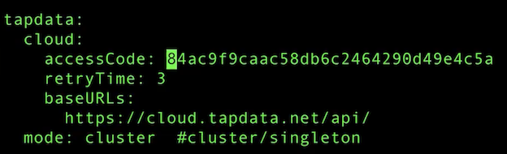

# **17 数据迁移**

## **1 关系型数据库迁移**

### **从基于关系型数据库应用迁移到 MongoDB 的理由**
 
* **高并发需求 (数千 – 数十万 ops) ，关系型数据库不容易扩展**
* **快速迭代 – 关系型模式太严谨**
* **灵活的 JSON 模式**
* **大数据量需求**
* **地理位置查询**
* **多数据中心跨地域部署**

### **应用迁移难度**

关系型到关系型 – 相对简单

* Oracle -> MySQL, Oracle – PostgreSQL

关系型到文档型 – 相对复杂

* Oracle -> MongoDB

需要考虑:

* 总体架构 (从单体式到分布式)
* 模式设计(从关系模型到文档模型)
* SQL语句/存储过程/JDBC/ORM
* 数据迁移 (如何处理已有数据?)

### **总体架构**

从单体到分布式，需要考虑:

- 3x 的计算资源
- 3x 的存储资源 
- 网络


**模式设计**

针对已有关系模型，考虑如何用文档模型进行设计


### **迁移的主战场**


* **RDBMS**
	* 存储过程
	* 运维工具、脚本
	* 权限设置
	* 数据库监控备份及恢复

* **Storage Layer**
	* 典型的关系型数据库部署在 SAN 上 MongoDB支持 SAN, 但是使用本地存储 
	* 可以最大化的提高性能

* **JDBC**
	* MongoDB 没有原生态 JDBC, 而 是采用自带的驱动程序:
		* 自带连接池管理
		* 事务支持

* **SQL**
	* MongoDB 不支持SQL的增删改，结果集也不是 ResultSet

* **ORM**
	* ORM: Object Relational Mapping 转换关系型到POJO对象模型
	* 不需要，但是可以有ODM
	* ODM:Object Document Model
		* Spring Data
		* mongoose

### **数据迁移**

迁移时应用往往已经上线相当长一段时间，如何迁移这些数据到 MongoDB?

* 数据库导出+导入
* 批量迁移工具
* 实时同步工具
* 应用主导迁移


## **2 数据迁移方式及工具**

### **数据迁移**

**如何迁移已有数据到 MongoDB?**


**1. 数据库导出导入**

步骤:

- **停止现有的基于 RDBMS 的应用**
- **使用 RDBMS 的数据库导出工具，将数据库表导出到 CSV 或者 JSON(如 mysqldump)**
- 使用 mongoimport 将 CSV 或者 JSON 文件导入 MongoDB 数据库
- 启动新的 MongoDB 应用

备注:

- 适用于一次性数据迁移
- 需要应用/数据库下线，较长的下线时间

数据库导出导入: `mysql - mongo`


`mysqldump`

```
mysqldump -hdemodb.tapdata.net -uroot -p inventory -T /var/lib/mysql-files
```

`-T`  excel :


```
# cat customers.txt

"1001","Sally","Thomas","sally.thomas@acme.com" 
"1002","George","Bailey",gbailey@foobar.com
...
```


```
# mongoimport -d xxx -c customers --type=csv --headerline customers.txt 
# mongoimport -d xxx -c products --type=csv --headerline products.txt 
# mongoimport -d xxx -c orders --type=csv --headerline orders.txt
```

* `mongoimport -d SparkDemo -c customers --type=csv --headerline customers.txt `
* `mongoimport -d SparkDemo -c orders --type=csv --headerline orders.txt `
* `mongoimport -d SparkDemo -c products --type=csv --headerline products.txt `

###**2. 批量同步**


**步骤:**

- 安装同步工具(如 Kettle / Talend)
- 创建输入源(关系型数据库)
- 创建输出源(MongoDB)
- 编辑数据同步任务
- 执行

**备注:**

- 适用批量同步，定期更新, 特别是每晚跑批的场景
- 支持基于时间戳的增量同步，需要源表有合适的时间戳支持
- 对源库有较明显的性能影响，不宜频繁查询
- 不支持实时同步


### **3. 实时同步**

**步骤**

- 安装实时同步工具(如Informatica / Tapdata)
- 创建输入源(关系型数据库)
- 创建输出源(MongoDB)
- 编辑实时数据同步任务
- 执行

**备注:**

- 基于源库的日志文件解析机制，可以实现秒级数据的同步 
- 对源库性能影响较小
- 可以支持应用的无缝迁移


### **4. 应用主导迁移**

**步骤**

1. 升级已有应用支持 MongoDB
2. 数据插入请求直接进入 MongoDB
3. 数据查询和更新请求首先定向到 MongoDB
4. 如果记录不存在，从 RDBMS 读出来并写入到 MongoDB
5. 重复步骤3
6. 当步骤4在限定时间段(一星期、一个月)没有被调用，认为迁移完成

备注:

- 需要研发团队配合 ，有一定开发和测试量
- 为保证不遗漏数据，仍然先要执行一次批量同步


### **5 数据迁移方式比较**


## **3 Oracle 迁移实战**

### **测试环境**


### **步骤**


1. 比较 Oracle 关系模型和目标 JSON 数据模型
2. 注册&下载 Tapdata Agent
3. 创建 Oracle 连接 和 MongoDB 连接
4. 模型转换设计和同步任务编辑
5. 运行任务
6. 检查结果

### **1. Oracle 关系模型 -> 目标 JSON 模型**


### **2. 注册下载 Tapdata Agent**


* [http://cloud.tapdata.net]()
* 注册免费账号
* 下载客户端
* 支持数据库:MongoDB, Oracle, MySQL , SQLServer, DB2, PostgreSQL, GaussDB, GBase
* 秒级同步，多表合一能力

### **3. DEMO**

* 创建 Oracle 连接 和 MongoDB 连接 
* 模型转换设计和同步任务编辑
* 运行任务
* 检查结果


`cat application.yml`





**Make sure agent is running**


**Make sure transform and connector is running**


**Add source and destination**


**Start Transformation**

