# **18 MongoDB + Spark实战**


## **1 MongoDB + Spark**

### **什么是 Spark ?**

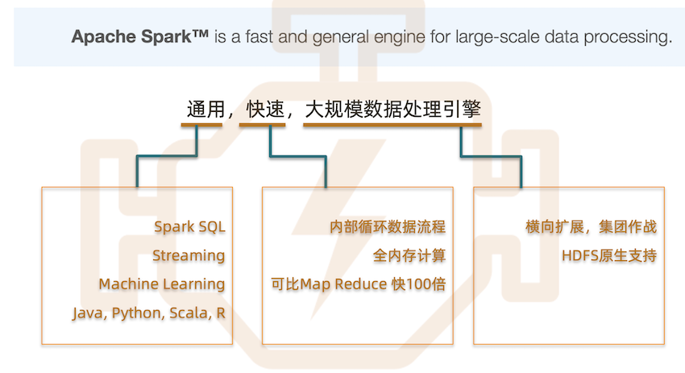

**我能用它做什么?**
 
 
**个性化    产品推荐   流处理   商业智能**

### **Spark 生态系统**

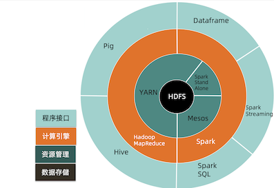

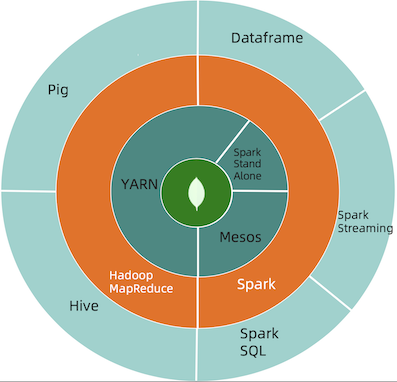

### **HDFS vs. MongoDB**

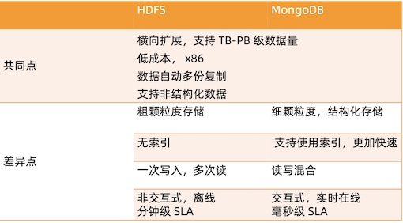

**一个日志的例子**

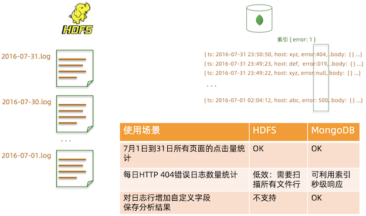

### **Spark Connector**

让 Spark 连接 MongoDB 非常简单，使用 Spark Connector。 开发者:MongoDB 公司

[https://github.com/mongodb/mongo-spark](https://github.com/mongodb/mongo-spark)

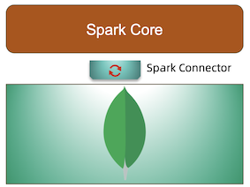

### **Spark + MongoDB 架构**

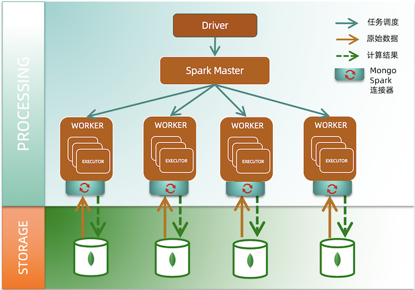

### **Spark + MongoDB 运价计算及查询案例**

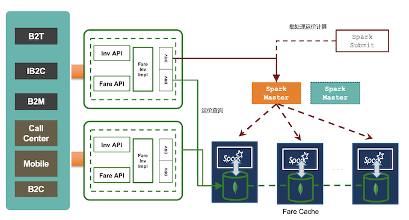

### **处理能力和响应时间比较**

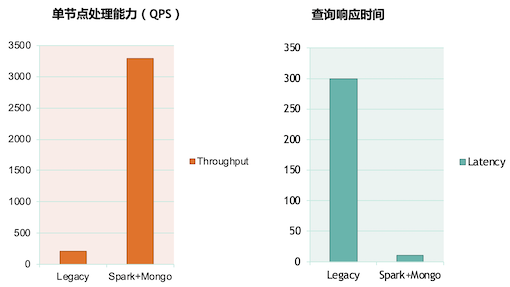

## **2 MongoDB + Spark 连接实战**

**场景**

假设我们有以下数据:

* name: 用户名;
* address: 住址;
* birthday: 出生日期;
* favouriteColor: 最喜欢的颜色;

我们想按照月份统计每个月出生的人中，喜欢的人数最多的颜色是什么。

**选择合适的版本**

Spark Connector 要求使用的 MongoDB为2.6 以上。为了在使用过程中不出现兼容性 问题，请按照以下版本对应关系使用(更多详情请参考[文档](https://docs.mongodb.com/spark-connector/master/java-api/))


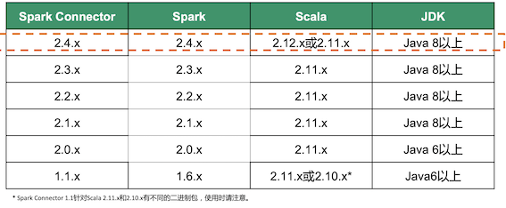

### **环境配置**


* JDK8: https://www.oracle.com/technetwork/java/javase/downloads/jdk8- downloads-2133151.html
* Maven3: http://maven.apache.org/install.html

**环境配置**

配置文件: `/src/main/resources/config.properties`

* input: 用于计算的源 MongoDB 集合;
* output: 计算后用于存储输出结果的集合;

**编译运行:**

```
mvn install
mvn package
java -jar target/SparkConnectorDemo-1.0-SNAPSHOT-jar-with-dependencies.jar
```

### **基本配置**

[https://github.com/geektime-geekbang/geektime-mongodb-course/tree/master/spark-demo](https://github.com/geektime-geekbang/geektime-mongodb-course/tree/master/spark-demo)

* https://github.com/geektime-geekbang/geektime-mongodb-course/blob/master/spark-demo/src/main/resources/config.properties


```
input=mongodb://127.0.0.1/SparkDemo.User
output=mongodb://127.0.0.1/SparkDemo.FavouriteColorStat
```

* https://github.com/geektime-geekbang/geektime-mongodb-course/blob/master/spark-demo/src/main/java/org/geekbang/time/spark/SparkDemo.java

### **基本配置**

```
SparkSession spark = SparkSession.builder() 
	.master("local")
	.appName("MongoSparkConnectorIntro") 
	.config("spark.mongodb.input.uri", "mongodb://127.0.0.1/demo.Person") 
	.config("spark.mongodb.output.uri", "mongodb://127.0.0.1/demo.Output") 
	.getOrCreate();
JavaSparkContext jsc = new JavaSparkContext(spark.sparkContext());
```

* master: 指定 Spark 的 Master 节点地址。没有独立 Spark 集群的时候可以指定为 local(仅用 于测试目的);
*  `spark.mongodb.input.uri`: 来源 MongoDB 连接字符串
	* demo: 来源数据库名;
	* Persion: 来源集合名;
* `spark.mongodb.output.uri`: 目标 MongoDB 连接字符串
	* `demo`: 输出数据库名;
	* `Output`: 输出集合名;

更多配置选项请参考文档:  [https://docs.mongodb.com/spark-connector/master/configuration/](https://docs.mongodb.com/spark-connector/master/configuration/)


### **ReadConfig 和 WriteConfig**

**在使用 Spark Connector 的时候，很多 API 中会出现可选的 ReadConfig 和 WriteConfig，它们可以提供读和写方面的定制化修改。例如对于读操作:**

* 配置一个不同于 `spark.mongodb.input.uri` 中指定的数据库和集合;
* 配置读取操作的 `ReadConcern`;
* 配置读取要使用的 `ReadPreference`;
* 更多选项请参考: [ReadConfig](https://www.javadoc.io/doc/org.mongodb.spark/mongo-spark-connector_2.11/latest/index.html);

同理，对于写操作也有一些可定制选项，例如:


* 配置一个不同于 spark.mongodb.output.uri 中指定的数据库和集合;
* 配置写操作的 WriteConcern;
* 批量写时是否保证顺序;
* 更多选项请参考: [WriteConfig](https://www.javadoc.io/doc/org.mongodb.spark/mongo-spark-connector_2.11/latest/index.html);

### **数据加载和输出**

```
List pipeline = Arrays.asList(
	addFields(new Field("month", new Document("$month", "$birthday")))
);
JavaMongoRDD<Document> mgoRdd = MongoSpark.load(jsc, rc)
	.withPipeline( pipeline ); 
	
// 各种Spark运算
MongoSpark.save(rdd, writeConfig);
```

* `MongoSpark.load`: 从来源 MongoDB 中加载数据;
* `withPipeline`: 使用指定的 Aggregation 管道对集合中的数据进行预处理。所有 Aggregation
* 运算符都支持;
* `MongoSpark.save`: 将结果集输出到配置的 MongoDB 中;

### **条件输出**

上面讲到的 `MongoSpark.save` 使用了最简单的方式将结果输出到目标集合中

* 如果 rdd中的 `_id` 在目标集合中存在，则替换那条记录;
* 如果 rdd中的 `_id` 在目标集合中不存在，则新增一条记录;

如果想根据其他字段更新数据怎么办?

### **条件输出**

```
final WriteConfig writeConfig = WriteConfig.create(jsc).withOptions(new HashMap<String, String>()); 
final ReadConfig readConfig = ReadConfig.create(jsc).withOptions(new HashMap<String, String>()); 

mgoRdd.foreachPartition(iterator -> {
	MongoConnector mc = MongoConnector.create(writeConfig.asJavaOptions()); 	
	mc.withCollectionDo(readConfig, Document.class, collection -> {
		while(iterator.hasNext()) {
			Document doc = iterator.next(); 
			collection.replaceOne(eq(”user_id", ”12345678"), doc);
}
       return null;
   });
});
```

* **readConfig/writeConfig:** 定义一些读写配置，例如 readConcern, writeConcern, 或重定义输入输出集合等;
* **foreachPartition**: 在各个分区遍历 rdd 中的内容，iterator 中即为每条数据;
* **withCollectionDo**: 从 Spark Connector 获得 MongoCollection;

### **Spark Demo 代码**

`mvn install package`

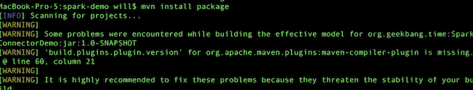

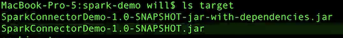

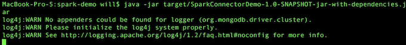

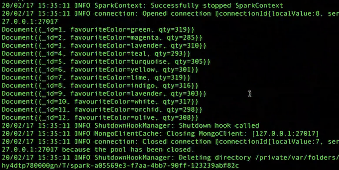

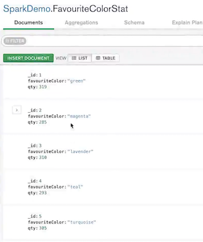

### **小结**

* MongoDB 只是一个存储，Spark 里面的计算操作基本不变，只有数据输入输出要 使用特定 API。
*  MongoDB 的优势是可以更加快速，更加大量的为 Spark 提供原始数据。