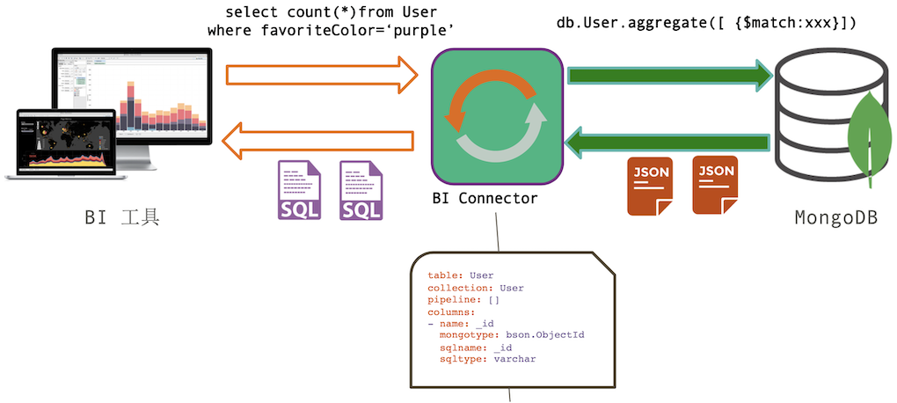

# **19 MongoDB SQL 套接件**

### **MongoDB 支持 SQL 方式查询吗?**

Yes, 通过一个转换套件



* 文档型到关系型映射定义
* 由工具自动生成
* 可以手工修改


### **关于 BI 套接件**

*  独立于 MongoDB 运行的服务
*  MongoDB 企业版组件
*  (免费仅限开发环境)
* MySQL 协议兼容，可以使用 MySQL 客户端连接

### **DEMO**


下载并安装MongoDB BI Connector

* https://www.mongodb.com/docs/bi-connector/current/
* https://www.mongodb.com/try/download/bi-connector

```
$ wget https://info-mongodb-com.s3.amazonaws.com/mongodb-bi/v2/mongodb-bi-linux-x86_64-rhel70-v2.14.4.tgz

$ tar -xvf mongodb-bi-linux-x86_64-rhel70-v2.14.4.tgz
mongodb-bi-linux-x86_64-rhel70-v2.14.4/LICENSE
mongodb-bi-linux-x86_64-rhel70-v2.14.4/README
mongodb-bi-linux-x86_64-rhel70-v2.14.4/THIRD-PARTY-NOTICES
mongodb-bi-linux-x86_64-rhel70-v2.14.4/example-mongosqld-config.yml
mongodb-bi-linux-x86_64-rhel70-v2.14.4/bin/mongosqld
mongodb-bi-linux-x86_64-rhel70-v2.14.4/bin/mongodrdl
mongodb-bi-linux-x86_64-rhel70-v2.14.4/bin/mongotranslate

$ cd tmp/mongodb-bi-linux-x86_64-rhel70-v2.14.4/bin

$ ls
mongodrdl  mongosqld  mongotranslate
```

启动 mongosqld 进程

```
mongosqld --addr localhost:3306 --mongo-uri mongodb://localhost:27017 
```	

```
$ ./mongosqld --addr localhost:3306 --mongo-uri mongodb://localhost:27017
2022-05-08T08:23:19.329+0000 I CONTROL    [initandlisten] mongosqld starting: version=v2.14.4 pid=23141 host=jabox
2022-05-08T08:23:19.329+0000 I CONTROL    [initandlisten] git version: df0cf0b57e9aac0ab6d545eee0d4451d11d0c6e9
2022-05-08T08:23:19.329+0000 I CONTROL    [initandlisten] OpenSSL version OpenSSL 1.0.1e-fips 11 Feb 2013 (built with OpenSSL 1.0.1e 11 Feb 2013)
2022-05-08T08:23:19.330+0000 I CONTROL    [initandlisten] options: {net: {bindIp: [localhost], port: 3306}}
2022-05-08T08:23:19.330+0000 I CONTROL    [initandlisten] ** WARNING: Access control is not enabled for mongosqld.
2022-05-08T08:23:19.330+0000 I CONTROL    [initandlisten]
2022-05-08T08:23:19.390+0000 I NETWORK    [initandlisten] waiting for connections at 127.0.0.1:3306
2022-05-08T08:23:19.390+0000 I NETWORK    [initandlisten] waiting for connections at /tmp/mysql.sock
2022-05-08T08:23:19.422+0000 I SCHEMA     [sampler] sampling MongoDB for schema...
2022-05-08T08:23:20.804+0000 I SCHEMA     [sampler] mapped schema for 24 namespaces: "eshop" (2): ["students", "users"]; "mock" (1): ["orders"]; "test" (4): ["movies", "scores", "users", "zips"]; "viewdemo" (2): ["shipping", "order"]; "aggdemo" (5): ["orderItem", "orderitem", "customer", "books", "order"]; "appdb" (10): ["restaurants", "restaurant", "inventory", "products", "stores", "values", "books", "users", "emps", "user"]
```
	
使用mysql 客户端去连接 3306 端口

```
# netstat -alntp | grep 3306
tcp        0      0 127.0.0.1:3306          0.0.0.0:*               LISTEN      23141/./mongosqld
```

```
select * from orders;

select first_name,product_id, quantity from orders o left join customers c on o.customer_id = c.customer_id;

select count(*), customer_id from orders group by customer_id;
```

