# **1 认识文档数据库 MongoDB & 及数据安装**

## **关于 MongoDB**

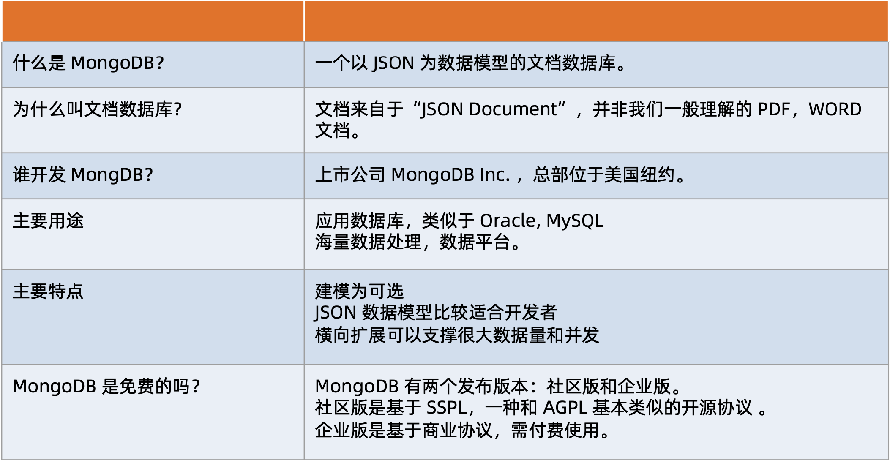

### **MongoDB vs. 关系型数据库**

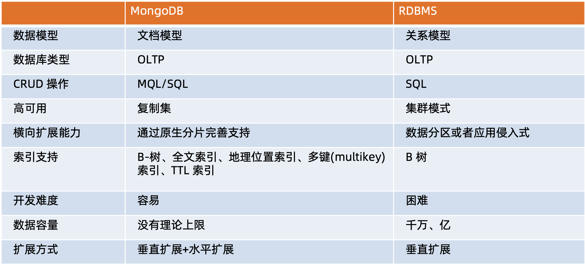

## **MongoDB 特色及优势**

> 开发效率 | 自然模型 | 横向扩展

### **MongoDB 优势:面向开发者的易用+高效数据库**

* 简单直观: 

以自然的方式来建模，以直观的方式来与数据库交互

* 结构灵活:

弹性模式从容响应需求的频繁变化

* 快速开发:

做更多的事，写更少的代码

### **从错综复杂的关系模型到一目了然的对象模型**

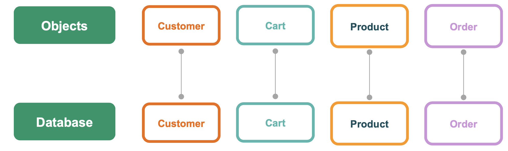

### **灵活: 快速响应业务变化**

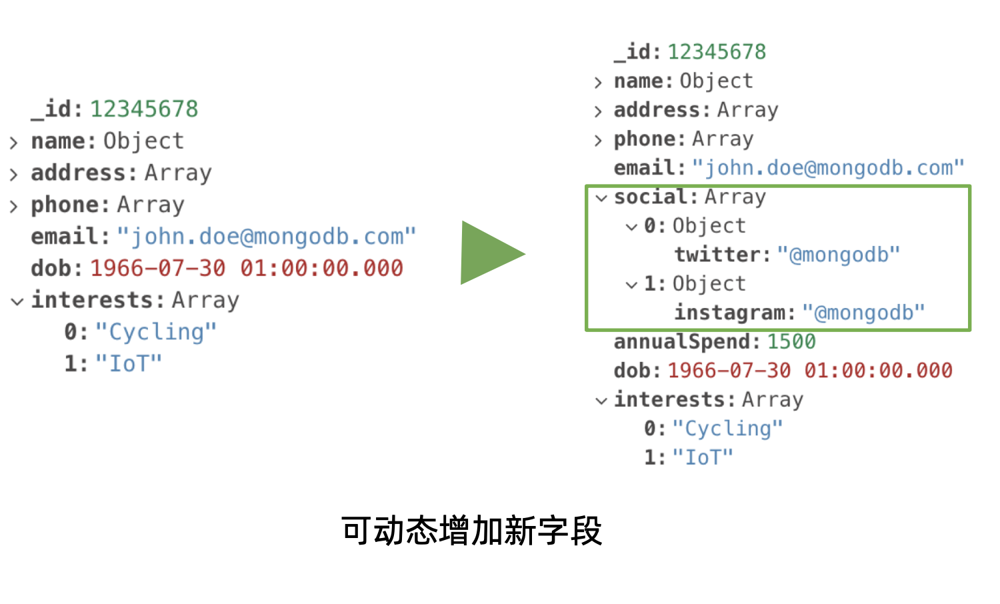

* **多形性**: **同一个集合中可以包含不同字段(类型)的文档对象**
* **动态性**: 线上修改数据模式，**修改是应用与数据库均无须下线**
* **数据治理**: 支持使用`JSON Schema` 来规范数据模式。**在保证模式灵活动态的前提下，提供 数据治理能力**

### **快速: 最简单快速的开发方式**

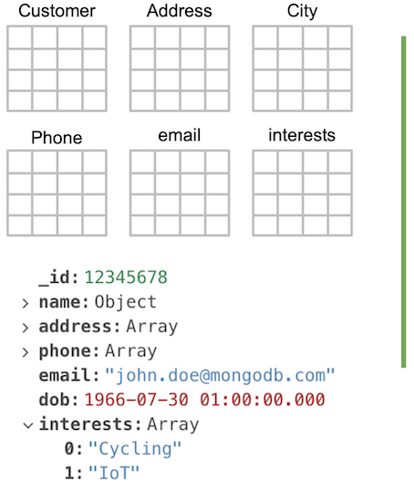

JSON 模型之快速特性:

* 数据库引擎只需要在一个存储区读写
* 反范式、无关联的组织极大优化查询 速度
* 程序 API 自然，开发快速

**SQL:插入一个客户相关数据**

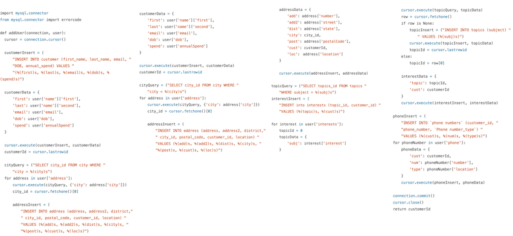

快速: MongoDB 只需要两行代码

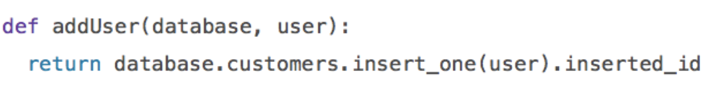

### **MongoDB 优势:原生的高可用和横向扩展能力**

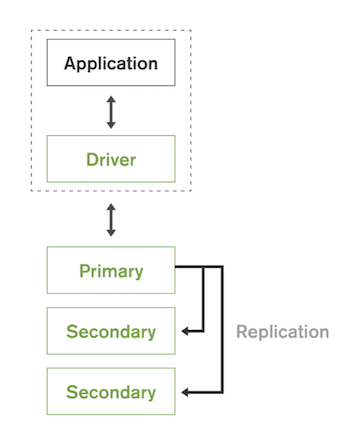

* Replica Set – 2 to 50 个成员
* 自恢复
* 多中心容灾能力
* 滚动服务 – 最小化服务终端
 
### **MongoDB 优势:横向扩展能力**

* 需要的时候无缝扩展
* 应用全透明
* 多种数据分布策略
* 轻松支持TB–PB数量级

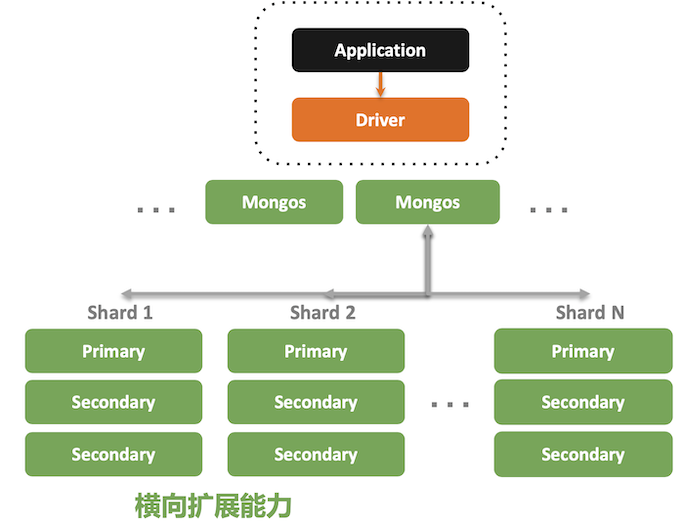

### **MongoDB 技术优势总结**

* JSON 结构和对象模型接近，开发代码量低
* JSON 的动态模型意味着更容易响应新的业务需求 
* 复制集提供 99.999% 高可用
* 分片架构支持海量数据和无缝扩容

## **安装 MongoDB**

> 下载安装 MongoDB | Compass

### **下载 MongoDB**

* mongodb.com/download-center
* 企业版 - 开发环境免费使用
* 社区版 - 所有环境免费使用
* 选择合适的 OS 版本
* GZ 版本包含 server mongos tools 和 shell

### **Linux 上安装 MongoDB**

具体：[linux系统：centos7 安装MongoDB社区版](https://chao-xi.github.io/jxdatabasebook/mongo1/2mongodb_install/#21-linuxmongodb)

```
$ mkdir -p /data /data/db

$ cd /data
$ curl -O https://fastdl.mongodb.org/linux/mongodb-linux-x86_64-rhel70-4.2.1.tgz $ tar -xvf mongodb-linux-x86_64-rhel70-4.2.1.tgz

$ export PATH=$PATH:/data/mongodb-linux-x86_64-rhel70-4.2.1/bin

$ mongod --dbpath /data/db --port 27017 --logpath /data/db/mongod.log --fork –bind_ip 0.0.0.0
```

### **使用 Atlas 免费账号**

* 官方提供的云托管 MongoDB 
* 提供一个终身免费测试账号
* 步骤:
	* 注册账号
	* 创建免费集群
	* 按照提示完成创建并获得连接串 
	* 使用 mongo 命令行连接集群

https://account.mongodb.com/account/login

> QQ cy

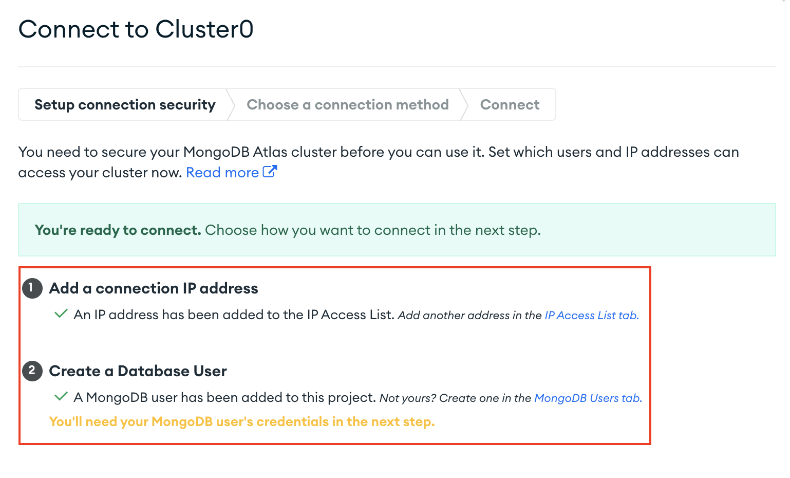

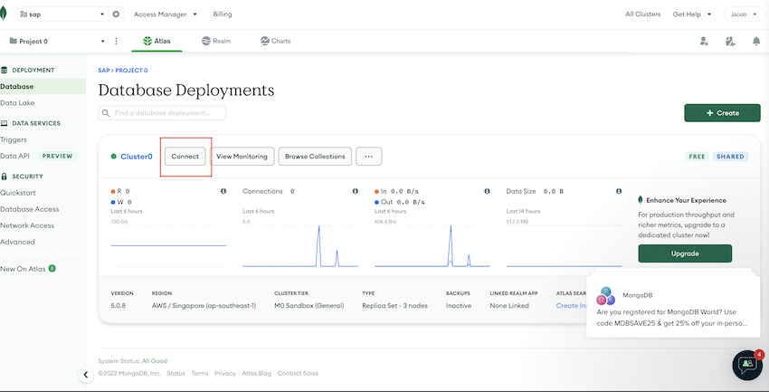

* **Connect with the MongoDB Schell**

```
brew install mongosh

$ mongosh "mongodb+srv://cluster0.hyst4.mongodb.net/myFirstDatabase" --apiVersion 1 --username admin

Enter password: ********* (cy)

...

Atlas atlas-hy8mcw-shard-0 [primary] myFirstDatabase> show dbs
admin   348 kB
local  1.26 GB
Atlas atlas-hy8mcw-shard-0 [primary] myFirstDatabase>
---
>
```

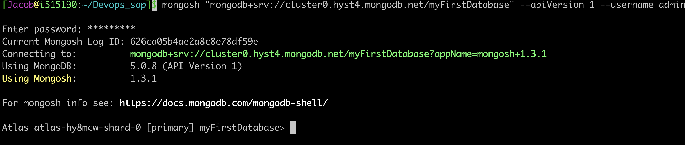

* **Connect with the MongoDB Compass**

```
mongodb+srv://admin:<password>@cluster0.hyst4.mongodb.net/test
```


**导入样本数据**

* curl -O -k https://raw.githubusercontent.com/tapdata/geektime-mongodb-course/master/aggregation/dump.tar.gz
* `tar -xvf dump.tar.gz`
* `mongorestore -h localhost:27017`

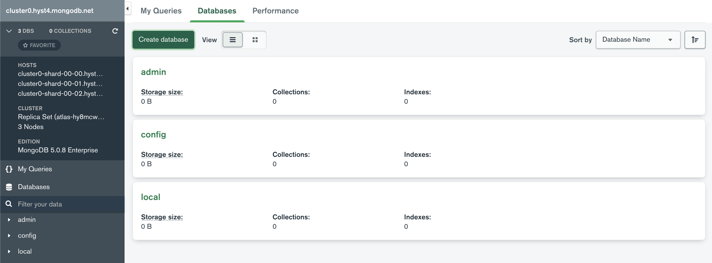

```
curl -O -k https://raw.githubusercontent.com/tapdata/geektime-mongodb-course/master/aggregation/dump.tar.gz
cp dump.tar.gz  /mongodb/data/
tar -xvf dump.tar.gz

# ll | grep dump
drwxr-xr-x. 3 root root       18 Apr 30 03:57 dump

# mongorestore

2022-04-30T04:22:13.866+0000	using default 'dump' directory
2022-04-30T04:22:13.866+0000	preparing collections to restore from
2022-04-30T04:22:13.866+0000	reading metadata for mock.orders from dump/mock/orders.metadata.json
2022-04-30T04:22:13.874+0000	restoring mock.orders from dump/mock/orders.bson
2022-04-30T04:22:15.935+0000	finished restoring mock.orders (100000 documents, 0 failures)
2022-04-30T04:22:15.935+0000	no indexes to restore for collection mock.orders
2022-04-30T04:22:15.935+0000	100000 document(s) restored successfully. 0 document(s) failed to restore.

# mongo

---
> show dbs
admin     0.000GB
aggdemo   0.000GB
appdb     0.001GB
config    0.000GB
local     0.000GB
mock      0.048GB
test      0.002GB
viewdemo  0.001GB
```

```
> use mock
switched to db mock

> show collections
orders

> db.orders.find()
{ "_id" : ObjectId("5dbe7a545368f69de2b4d36e"), "street" : "493 Hilll Curve", "city" : "Champlinberg", "state" : "Texas", "country" : "Malaysia", "zip" : "24344-1715", "phone" : "425.956.7743 x4621", "name" : "Destinee Schneider", "userId" : 3573, "orderDate" : ISODate("2019-03-26T03:20:08.805Z"), "status" : "created", "shippingFee" : NumberDecimal("8.00"), "orderLines" : [ { "product" : "Refined Fresh Tuna", "sku" : "2057", "qty" : 25, "price" : NumberDecimal("56.00"), "cost" : NumberDecimal("46.48") }, { "product" : "Refined Concrete Ball", "sku" : "1738", "qty" : 61, "price" : NumberDecimal("47.00"), "cost" : NumberDecimal("47") }, { "product" : "Rustic Granite Towels", "sku" : "500", "qty" : 62, "price" : NumberDecimal("74.00"), "cost" : NumberDecimal("62.16") }, { "product" : "Refined Rubber Salad", "sku" : "1400", "qty" : 73, "price" : NumberDecimal("93.00"), "cost" : NumberDecimal("87.42") }, { "product" : "Intelligent Wooden Towels", "sku" : "5674", "qty" : 72, "price" : NumberDecimal("84.00"), "cost" : NumberDecimal("68.88") }, { "product" : "Refined Steel Bacon", "sku" : "5009", "qty" : 8, "price" : NumberDecimal("53.00"), "cost" : NumberDecimal("50.35") } ], "total" : NumberDecimal("407") }
...
```

### **下载并安装 MongoDB Compass**

* 官方提供的免费 GUI 管理工具
* 数据管理(增删改查)
* Schema 管理
* 索引管理
* 性能排查
* 实时性能监控

**使用 MongoDB Compass(demo)**

**`mongodb://192.168.1.44:27017/`**

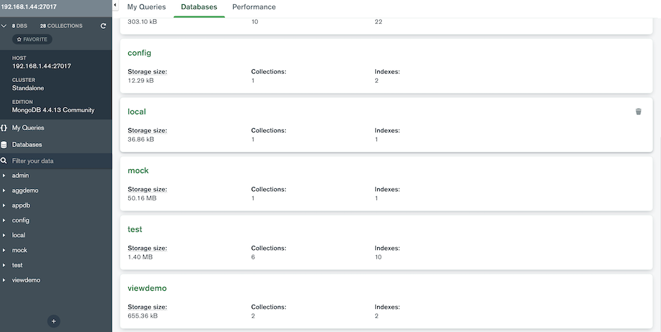

* 连接
* 数据库/集合列表 
* 集合统计
* 数据模式
* 查询解释器
* 索引
* 实时性能监控

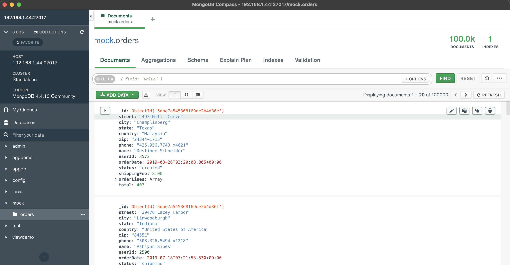

```
/** 
* Paste one or more documents here
*/
{
  "street": "493 Hilll Curve",
  "city": "Champlinberg",
  "state": "Texas",
  "country": "Malaysia",
  "zip": "24344-1715",
  "phone": "425.956.7743 x4621",
  "name": "Destinee Schneider",
  "userId": 3573,
  "orderDate": {
    "$date": {
      "$numberLong": "1553570408805"
    }
  },
  "status": "created",
  "shippingFee": {
    "$numberDecimal": "8.00"
  },
  "orderLines": [
    ...
    {
      "product": "Rustic Granite Towels",
      "sku": "500",
      "qty": 62,
      "price": {
        "$numberDecimal": "74.00"
      },
      "cost": {
        "$numberDecimal": "62.16"
      }
    },
    ...    }
  ],
  "total": {
    "$numberDecimal": "407"
  }
}
```

**Schema**

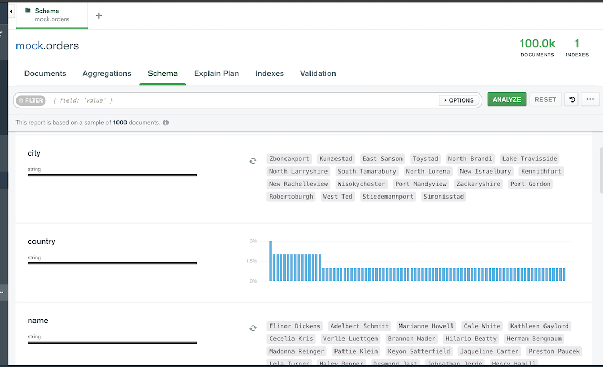

**Rules:**

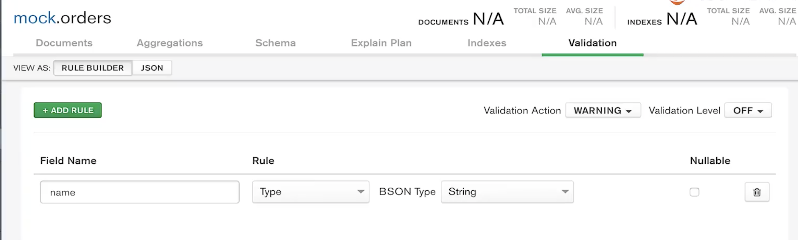