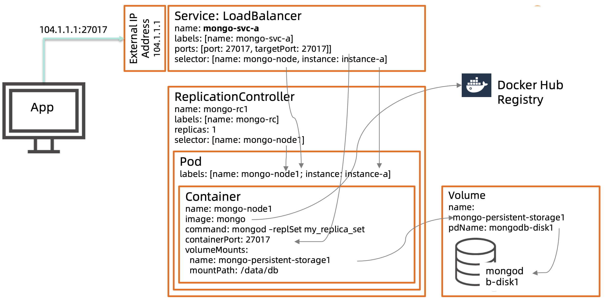

# **20 MongoDB 与微服务 & 数据中台**

## **1 MongoDB 与微服务**

### **微服务 vs SOA vs 单体应用**

The microservices architectural style is an approach to develop a single application as a suite of **small services**, each running in its **own process** and communicating with lightweight mechanisms, often **an HTTP resource API**. These services are built around **business capabilities and independently deployable by fully automated deployment machinery**...

**微服务的优势**

> 开发速度快 变化响应快 易维护 扩容简单

**微服务架构设计要素**

**微服务的数据架构设计考量点**

* 一服一库还是多服一库
* 混合持久化还是多模数据库 
* 扩容便捷性

### **多个微服务共享一个数据库**

- 单点故障，一个性能问题可能拖垮 整个服务集群
- 容易引起强关联，不利解耦
- 难以为某一个微服务单独扩容

反范式 一个(逻辑)数据库为所有微服务使用

### **关键微服务使用自己专用的数据库**

- 每个微服务使用一个逻辑库
- 数据库变动时候不影响其他服务

混合持久化

> 学习，管理和硬件成本

* 一种数据库，多种模式
* 一种技术，学习及管理简单
* 可以单独优化
       
**是否可以快速扩容**

- X-axis水平扩展应用 
- Y-axis微服务化
- Z-axis数据扩容

**MongoDB 的扩容能力**

> Elastic scalability 弹性伸缩   /  Auto Balancing 自动均衡

**MongoDB 容器化部署**

MongoDB 是一个有状态的服务，在容器化部署 时候要特别注意

* 复制集节点要能够互相通讯:配置的时候要使用服 务名，或者固定的服务 IP 地址
* 使用 Persistent Volume 或类似的长久存储
* 使用Ops Manager进行集群管理(而不是 K8S/Openshift)

### **为何 MongoDB 适合微服务**

* 易扩展，符合微服务的易扩展特性
* 模式灵活，迭代快，符合微服务架构的理念 
* 多模数据库， 可以为不同的微服务提供业务

## **MongoDB 与数据中台**

我们处于一个数据时代

数据即价值

### **现代企业的数据痛点**

* 数据孤岛

某航空公司的乘客相关系统: 门户，电商，常旅客，地勤， 柜服，客服，营销等十来套。 这些相互隔离的系统都和客户 信息相关，但是相互隔离。

* 系统重复

某半导体制造企业一套软 件重复部署了52套，因 为关系型数据库库不能支 撑性能要求，所以每上一 个新的业务就需要重复部 署一套系统

* 业务开发低效

某教育系统不断需要构建 一些基于教师和学生的业 务场景，但是每个业务都 需要大量的前后端开发， 不仅成本难以控制，周期 也难以控制。

**数据孤岛:高成本，低效率**

* 数据孤岛的形成根因
	* 基于部门业务特性构建IT系统
	* 80年代数据库技术无法扩展
* 影响
	* 业务系统落地困难，需要花很多时 间进行数据适配
	* 数据不完整，影响客户体验
	* 资源浪费严重，重复建设成本高

### **已有数仓及大数据方案之不足**

* 并非为打通系统为主要 目标，仍然以某个数据 业务为核心
* 无数据资产管理，难以 起到企业内有效共享
* 数据不及时，多为批量导入，价值受限
* 交付方式多为批量，难 以满足API式交互需求

### **数据中台的一个定义**

 * 以打通部门或数据孤岛的**统一数据平台为基础，构建统一**
 * **数据资产体系，并以 API 服务方式为全渠道业务(分析+应用)** 提供即时交付能力的 企业级数据架构

### **数据中台技术需求**

### **数据中台技术模块**

**数据平台选型 – Gartner 3V 标准**

### **MongoDB 作为中台内数据平台方案的技术优势**

## **3 MongoDB 数据中台案例**

### **数据孤岛及重复的系统**

* 每个地区有自己的销售和库存系统，产品和销 售数据在很多套 Oracle 系统。数据通过队列 系统交互，易错难追踪
* 难以快速提供一个准确的库存及销售， 影响业务部门决策
* 构建一些数据 API 为前端业务提供支持的时候， 需要进行繁琐的数据对接和整合，然后再开发

###  **MongoDB: 开始只是一两个孤立的应用**

### **用 MongoDB 来搭建中台第一步:读写分离模式支撑查询业务**

**传统关系模型 vs 中台业务模型:**

* Oracle Schema: 40+ 张表
* MongoDB中台: 4个业务模型

### **MongoDB 中台建设第二步:支撑写入**

说明

- 使用实时同步技术，将 Oracle 内所有主数 据(产品，会员等)和交易(订单，库存， 日志)数据复制到 MongoDB。
- 利用的 MongoDB 的灵活模型快速构建新 业务需要的业务模型。
- 通过中台提供的 REST API 为微服务提供商 品查询，检索及订单处理能力
- 订单微服务接受订单，直接调用中台 API 修改库存。
- 中台将库存修改信息通过反向 CDC 发送到 需要的原业务库，比如报表系统或者订单 通知系统

### **第三阶段:作为 System of Records 的主数据平台**

* 连接企业数据孤岛
* 构建统一数据资产体系:商品，会员，订单等
* 企业主数据的更新统一在 中台发生，保证中台数据 的权威性，一致性和可靠性

### **技术架构图**

* 同时支持中港美三地
* 未来更多地区支持

