# **2 MongoDB 基本操作及聚合操作实战**

> 增删改查操作

## **1 使用 insert 完成插入操作**

操作格式:

```
db.<集合>.insertOne(<JSON对象>) 

db.<集合>.insertMany([<JSON 1>, <JSON 2>, ...<JSON n>])
```

示例:

```
db.fruit.insertOne({name: "apple"})
```

```
db.fruit.insertMany([
	{name: "apple"},
	{name: "pear"},
	{name: "orange"}
])
```

## **使用 find 查询文档**

### **关于 find:**

* find 是 MongoDB 中查询数据的基本指令，相当于 SQL 中的 SELECT 。
* find 返回的是游标。

find 示例:

```
db.movies.find( { "year" : 1975 } ) //单条件查询

db.movies.find( { "year" : 1989, "title" : "Batman" } ) //多条件and查询

db.movies.find( { $and : [ {"title" : "Batman"}, { "category" : "action" }] } ) // and的另一种形式 

db.movies.find( { $or: [{"year" : 1989}, {"title" : "Batman"}] } ) //多条件or查询 

db.movies.find( { "title" : /^B/} ) //按正则表达式查找
```

**查询条件对照表**

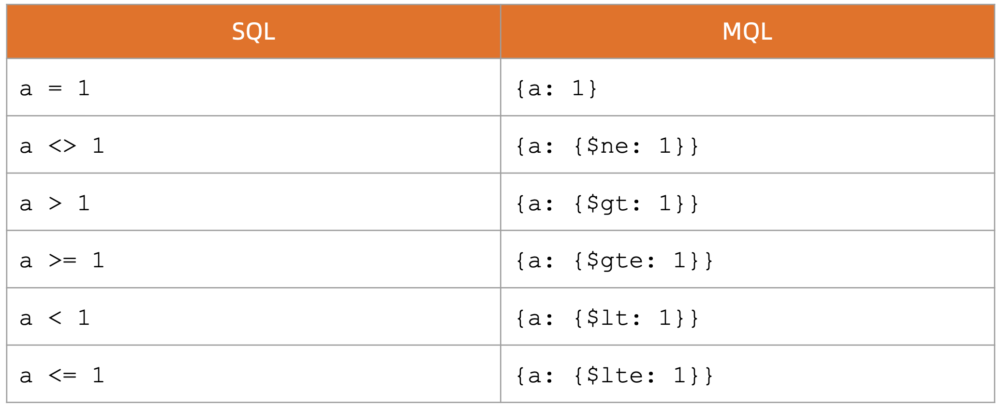

**查询逻辑对照表**

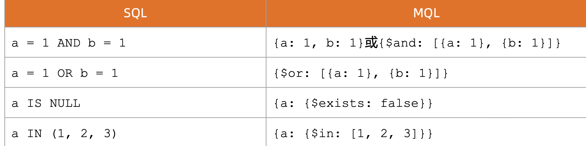

**查询逻辑运算符**

*  `$lt`: 存在并小于
* `$lte`: 存在并小于等于
* `$gt`: 存在并大于
* `$gte`: 存在并大于等于
* `$ne`: 不存在或存在但不等于
* `$in`: 存在并在指定数组中
* `$nin`: 不存在或不在指定数组中
* `$or`: 匹配两个或多个条件中的一个
* `$and`: 匹配全部条件

**使用 find 搜索子文档**

* find 支持使用 `field.sub_field` 的形式查询子文档。假设有一个文档:

```
 db.fruit.insertOne({
        name: "apple",
        from: {
            country: "China",
            province: "Guangdon"
} })
```

考虑以下查询的意义:

```
db.fruit.find( { "from.country" : "China" } )
```

```
> db.fruit.find( { "from.country" : "China" } )
{ "_id" : ObjectId("626d0d3c23c7ad7cc7cb0e40"), "name" : "apple", "from" : { "country" : "China", "province" : "Guangdon" } }
```

```
db.fruit.find( { "from" : {country: "China"} } )
>
```

**Nothing**

### **使用 find 搜索数组**

find 支持对数组中的元素进行搜索。假设有一个文档:

```
 db.fruit.insert([
      { "name" : "Apple", color: ["red", "green" ] },
      { "name" : "Mango", color: ["yellow", "green"] }
])
```


**考虑以下查询的意义:**

```
> db.fruit.find({color: "red"})
{ "_id" : ObjectId("626d19c123c7ad7cc7cb0e41"), "name" : "Apple", "color" : [ "red", "green" ] }
```

```
db.fruit.find({$or: [{color: "red"}, {color: "yellow"}]} )
```
```
{ "_id" : ObjectId("626d19c123c7ad7cc7cb0e41"), "name" : "Apple", "color" : [ "red", "green" ] }
{ "_id" : ObjectId("626d19c123c7ad7cc7cb0e42"), "name" : "Mango", "color" : [ "yellow", "green" ] }
```

### **使用 find 搜索数组中的对象**

考虑以下文档，在其中搜索

```
db.movies.insertOne( {
          "title" : "Raiders of the Lost Ark",
          "filming_locations" : [
              { "city" : "Los Angeles", "state" : "CA", "country" : "USA" },  
              { "city" : "Rome", "state" : "Lazio", "country" : "Italy" },
              { "city" : "Florence", "state" : "SC", "country" : "USA" }
          ]
})
```

```
// 查找城市是 Rome 的记录
db.movies.find({"filming_locations.city": "Rome"})
```
```
{ "_id" : ObjectId("626d1f1323c7ad7cc7cb0e43"), "title" : "Raiders of the Lost Ark", "filming_locations" : [ { "city" : "Los Angeles", "state" : "CA", "country" : "USA" }, { "city" : "Rome", "state" : "Lazio", "country" : "Italy" }, { "city" : "Florence", "state" : "SC", "country" : "USA" } ] }
```


### **使用 find 搜索数组中的对象**

在数组中搜索子对象的多个字段时，如果使用 `$elemMatch`，它表示必须是同一个 子对象满足多个条件。考虑以下两个查询:

```
 db.getCollection('movies').find({
       "filming_locations.city": "Rome",
       "filming_locations.country": "USA"
      })
```

```
{ "_id" : ObjectId("626d1f1323c7ad7cc7cb0e43"), "title" : "Raiders of the Lost Ark", "filming_locations" : [ { "city" : "Los Angeles", "state" : "CA", "country" : "USA" }, { "city" : "Rome", "state" : "Lazio", "country" : "Italy" }, { "city" : "Florence", "state" : "SC", "country" : "USA" } ] }
```


```
 db.getCollection('movies').find({
       "filming_locations": {
       $elemMatch:{"city":"Rome", "country": "USA"}
} })
```

### **控制 find 返回的字段**

* `find `可以指定只返回指定的字段;
* `_id`字段必须明确指明不返回，否则默认返回;
* 在 MongoDB 中我们称这为投影(projection);
* `db.movies.find({"category": "action"},{"_id":0, title:1})`
	*  **`"_id":0` :  不返回`_id`**
	*  **`title:1`: 返回title** 

### **使用 remove 删除文档**

* remove 命令需要配合查询条件使用;
* 匹配查询条件的的文档会被删除;
* 指定一个空文档条件会删除所有文档;
* 以下示例:

```
db.testcol.remove( { a : 1 } ) // 删除a 等于1的记录 

db.testcol.remove( { a : { $lt : 5 } } ) // 删除a 小于5的记录 

db.testcol.remove( { } ) // 删除所有记录 db.testcol.remove() //报错

db.testcol.remove() //报错
```

### **使用 update 更新文档**

Update 操作执行格式:`db.<集合>.update(<查询条件>, <更新字段>)`

以以下数据为例:

```
  db.fruit.insertMany([
        {name: "apple"},
        {name: "pear"},
        {name: "orange"}
])
```

```
db.fruit.updateOne({name: "apple"}, {$set: {from: "China"}})
```

* 查询 name 为 apple 的记录
* 将找到记录的 from 设置为 China

```
> db.fruit.updateOne({name: "apple"}, {$set: {from: "China"}})
{ "acknowledged" : true, "matchedCount" : 1, "modifiedCount" : 1 }
```

```
> db.fruit.find({name: "apple"}).pretty()
{
	"_id" : ObjectId("626d26f023c7ad7cc7cb0e44"),
	"name" : "apple",
	"from" : "China"
}
```

### **使用 update 更新文档**

* 使用 updateOne 表示无论条件匹配多少条记录，始终只更新第一条;
* 使用 updateMany 表示条件匹配多少条就更新多少条;
* `updateOne/updateMany` 方法要求更新条件部分必须具有以下之一，否则将报错:
	* `$set/$unset`
	*  `$push/$pushAll/$pop`
	*  `$pull/$pullAll`
	*  `$addToSet`


```
db.fruit.updateOne({name: "apple"}, {from: "China"})
```

```
// 报错
uncaught exception: Error: the update operation document must contain atomic operators :
DBCollection.prototype.updateOne@src/mongo/shell/crud_api.js:565:19
@(shell):1:1
```

### **使用 update 更新数组**

* `$push`: 增加一个对象到数组底部
* `$pushAll`: 增加多个对象到数组底部
* `$pop`: 从数组底部删除一个对象
* `$pull`: 如果匹配指定的值，从数组中删除相应的对象
* `$pullAll`: 如果匹配任意的值，从数据中删除相应的对象
* `$addToSet`: 如果不存在则增加一个值到数组

### **使用 drop 删除集合**

* 使用 `db.<集合>.drop()` 来删除一个集合
*  集合中的全部文档都会被删除
*  集合相关的索引也会被删除

```
db.colToBeDropped.drop()
```

```
> db.fruit.drop()
true
```

### **使用 dropDatabase 删除数据库**

* 使用 `db.dropDatabase()` 来删除数据库
*  数据库相应文件也会被删除，磁盘空间将被释放

```
use tempDB
 
db.dropDatabase()
 
show collections // No collections
show dbs // The db is gone
```

## **2 Hello World 程序开发（Python)**

### **2-1 安装 Python MongoDB 驱动程序**

**安装 MongoDB 驱动**

在 Python 中使用 MongoDB 之前必须先安装用于访问数据库的驱动程序:

`pip install pymongo`

**检查驱动程序**

在 python 交互模式下导入 pymongo，检查驱动是否已正确安装:

```
import pymongo 

pymongo.version
```

### **2-2 创建连接**

**确定 MongoDB 连接串**

使用驱动连接到 MongoDB 集群只需要指定 MongoDB 连接字符串即可。其基本格式可
以参考文档: [Connection String URI Format](https://www.mongodb.com/docs/manual/reference/connection-string/) 最简单的形式是

*  `mongodb://数据库服务器主机地址:端口号`
*  如:`mongodb://127.0.0.1:27017`

**初始化数据库连接**

```
from pymongo import MongoClient
uri = "mongodb://192.168.1.44:27017"
client = MongoClient(uri)
print(client)
```

```
$ python3 mongo.py 
MongoClient(host=['192.168.1.44:27017'], document_class=dict, tz_aware=False, connect=True)
```

### **2-3 数据库操作:插入用户**

**初始化数据库和集合**

```
db = client["eshop"] 
user_coll = db["users"]
```

**插入一条新的用户数据**

```
new_user = {"username": "nina", "password": "xxxx", "email":
      "123456@qq.com "}
result = user_coll.insert_one(new_user)
print result
```


```
from pymongo import MongoClient
uri = "mongodb://192.168.1.44:27017"
client = MongoClient(uri)
db = client["eshop"]
user_coll = db["users"]
new_user = {"username":"nina", "password":"xxxx", "email": "123456@qq.com"}
result = user_coll.insert_one(new_user)

result
```

```
show dbs;
admin     0.000GB
aggdemo   0.000GB
appdb     0.001GB
config    0.000GB
eshop     0.000GB
...

> use eshop;
switched to db eshop

> show collections;
users
> db.users.find()
{ "_id" : ObjectId("626d3ec17157426c6e22abcf"), "username" : "nina", "password" : "xxxx", "email" : "123456@qq.com" }
```


> 注意:我们并没有提前创建数据库和表/集合

### **2-4 更新用户**

需求变化，要求修改用户属性，增加字段phone

```
result = user_coll.update_one({ "username": "nina"}, 
		 { "$set": { "phone": "123456789"} }
   		)
      print result
```

> 注意:我们并没有去数据库修改表结构

```
from pymongo import MongoClient
uri = "mongodb://192.168.1.44:27017"
client = MongoClient(uri)

db = client["eshop"]
user_coll = db["users"]
# new_user = {"username":"nina", "password":"xxxx", "email": "123456@qq.com"}
# result = user_coll.insert_one(new_user)

result = user_coll.update_one({"username": "nina"},
    { "$set": { "phone": "123456789"} }
)
result
```

```
> db.users.find()
{ "_id" : ObjectId("626d3ec17157426c6e22abcf"), "username" : "nina", "password" : "xxxx", "email" : "123456@qq.com", "phone" : "123456789" }
```

### **2-5 总结**

* 使用 MongoDB 驱动程序操作 MongoDB 的 API 简单易行。
* 尽管大家使用的编程语言可能各不相同，但 MongoDB 驱动的设计是依照统一的规 范制定，无论使用哪种语言，其原理和 API 方法都非常相似。因此只要掌握一种语 言的驱动，切换到其他语言将十分容易。


## **3 聚合查詢**

### **3-1 什么是 MongoDB 聚合框架**

MongoDB 聚合框架(Aggregation Framework)是一个计算框架，它可以:

* 作用在一个或几个集合上;
* 对集合中的数据进行的一系列运算;
* 将这些数据转化为期望的形式;

从效果而言，聚合框架相当于 SQL 查询中的:


* GROUP BY
* LEFT OUTER JOIN
* AS等

### **3-2 管道(Pipeline)和步骤(Stage)**

整个聚合运算过程称为管道(Pipeline)，它是由多个步骤(Stage)组成的， 每个管道:

* 接受一系列文档(原始数据);
* 每个步骤对这些文档进行一系列运算;
* 结果文档输出给下一个步骤


**聚合运算的基本格式**

```
pipeline = [$stage1, $stage2, ...$stageN];

db.<COLLECTION>.aggregate(
       pipeline,
{ options } );
```

**常见步骤**

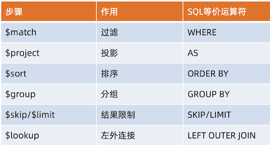

**常见步骤中的运算符**

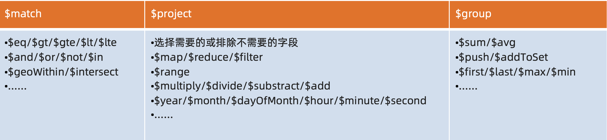

**常见步骤**

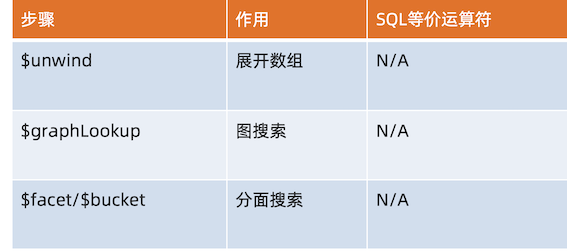

### **3-3 聚合运算的使用场景**

聚合查询可以用于OLAP和OLTP场景。例如:

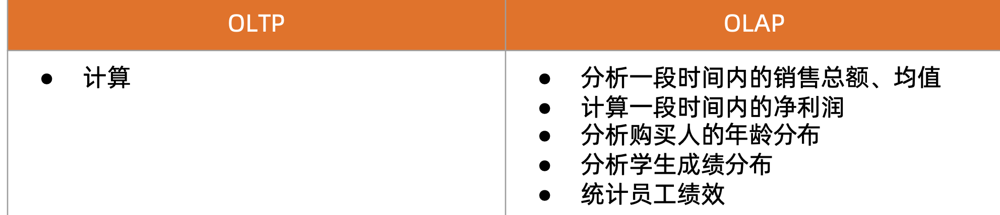

### **3-4 MQL 常用步骤与 SQL 对比**

```
SELECT
FIRST_NAME AS `名`, LAST_NAME AS `姓`
FROM Users
WHERE GENDER = '男'
SKIP 100 LIMIT 20
```


```
db.users.aggregate([
			{$match: {gender: ’’男”}},
			{$skip: 100}, 
			{$limit: 20}, 
			{$project: {
                 	'名': '$first_name', 
                 	'姓': '$last_name'
       }} 
 ]);
```

***

```
SELECT DEPARTMENT, 
	COUNT(NULL) AS EMP_QTY
FROM Users
WHERE GENDER = '女'
GROUP BY DEPARTMENT 
HAVING COUNT(*) < 10
```

```
db.users.aggregate([
	{$match: {gender: '女'}},
	{$group: {
		_id: '$DEPARTMENT’, 
		emp_qty: {$sum: 1}
	}},
	{$match: {emp_qty: {$lt: 10}}}
 ]);
```

### **MQL 特有步骤 `$unwind`**

```
db.students.insertOne(
{
	name:'张三', 
	score:[
		{subject:'语文',score:84},
		{subject:'数学',score:90}, 
		{subject:'外语',score:69}
]
})
```

```
> db.students.findOne()
{
	"_id" : ObjectId("626dead023c7ad7cc7cb0e47"),
	"name" : "张三",
	"score" : [
		{
			"subject" : "语文",
			"score" : 84
		},
		{
			"subject" : "数学",
			"score" : 90
		},
		{
			"subject" : "外语",
			"score" : 69
		}
	]
}
```

```
db.students.aggregate([{$unwind: '$score'}]) 
	
{ "_id" : ObjectId("626dead023c7ad7cc7cb0e47"), "name" : "张三", "score" : { "subject" : "语文", "score" : 84 } }
{ "_id" : ObjectId("626dead023c7ad7cc7cb0e47"), "name" : "张三", "score" : { "subject" : "数学", "score" : 90 } }
{ "_id" : ObjectId("626dead023c7ad7cc7cb0e47"), "name" : "张三", "score" : { "subject" : "外语", "score" : 69 } }
```

### **MQL 特有步骤 `$bucket`**

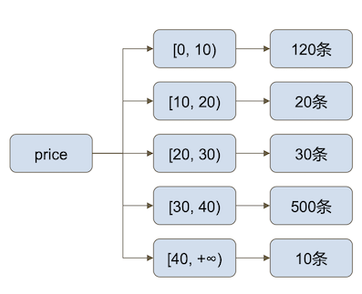

```
db.products.aggregate([{ 
	$bucket:{
		groupBy: "$price", 
		boundaries: [0,10,20,30,40], 
		default: "Other", 
		output:{"count":{$sum:1}}
} 
}])
```

### **MQL 特有步骤 `$facet`**

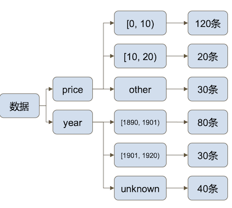

```
db.products.aggregate([{ 
	$facet:{
		price:{ 
			$bucket:{...}
		}, year:{
			$bucket:{...} 
		}
	} 
}])
```

## **3 聚合查询实验**

**聚合实验数据模型**

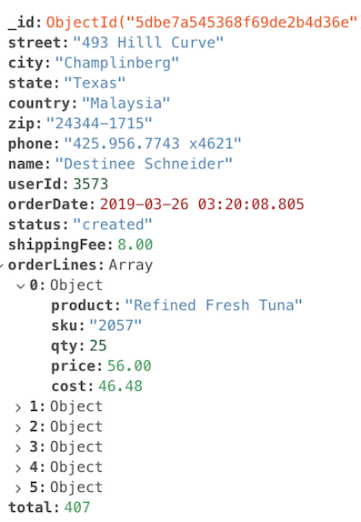

### **3-1 聚合实验一:总销量**

计算到目前为止的所有订单的总销售额

```
db.orders.aggregate([
	{ $group: 
		{
            _id: null,
            total: { $sum: "$total" }
          }
	} 
])
```

```
{ "_id" : null, "total" : NumberDecimal("44019609") }
```

### **3-2 聚合实验二:订单金额汇总**

查询2019年第一季度(1月1日~3月31日)已完成订单(completed)的订单总金 额和订单总数

```
db.orders.aggregate([ 
			// 步骤1:匹配条件
            { $match: { status: "completed", orderDate: {
                                           	$gte: ISODate("2019-01-01"),
										$lt: ISODate("2019-04-01") } } }, 
		 // 步骤二:聚合订单总金额、总运费、总数量
            { $group: {
                       _id: null,
                      total: { $sum: "$total" },
                      shippingFee: { $sum: "$shippingFee" },
                      count: { $sum: 1 }  } },
		{ $project: {
		// 计算总金额
		grandTotal: { $add: ["$total", "$shippingFee"] }, 
		count: 1,
		_id: 0 } }
])
```

```
{ "count" : 5875, "grandTotal" : NumberDecimal("2636376.00") }
```

### **3-3 Run with compass Aggregation** 

**`$match`**

```
{status: "completed", 
orderDate: {
    $gte: ISODate("2019-01-01"),
		$lt: ISODate("2019-04-01") 
  } 
} 
```

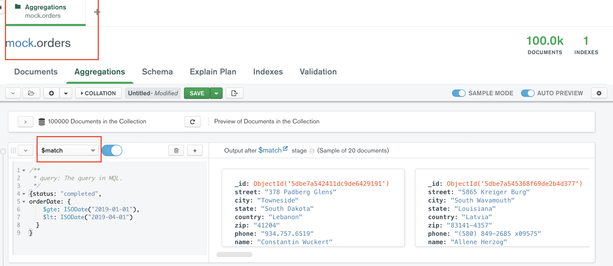

**`$group`**

```
{
   _id: null,
  total: { $sum: "$total" },
  shippingFee: { $sum: "$shippingFee" },
  count: { $sum: 1 }  
} 
```

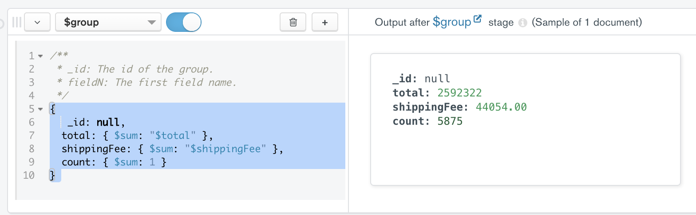

**`$group`**

```
 {
	// 计算总金额
	grandTotal: { $add: ["$total", "$shippingFee"] }, 
	count: 1,
	_id: 0 
}
```

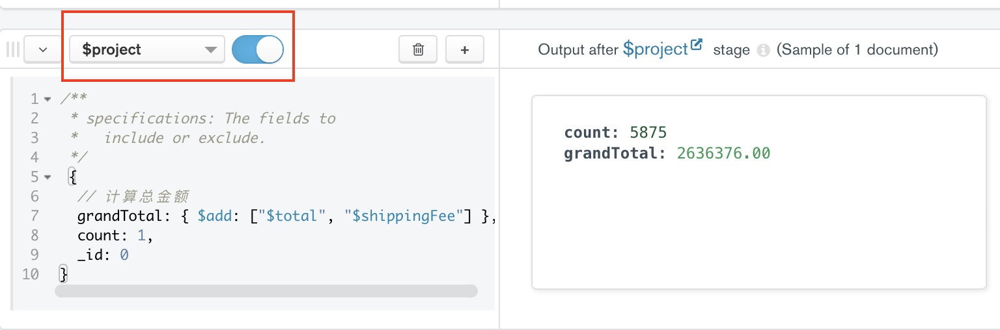

**Export: python3 and ....**

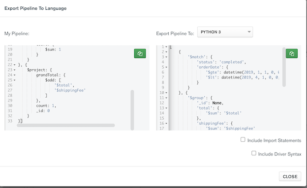