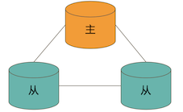
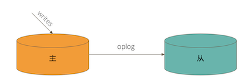
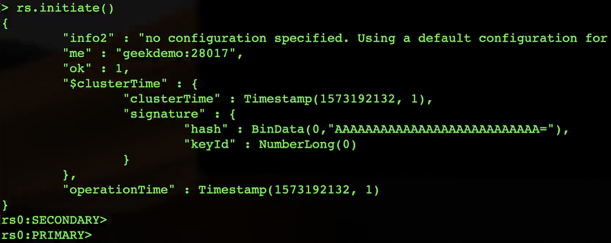
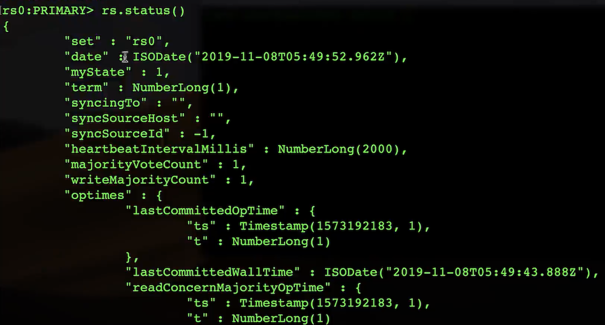
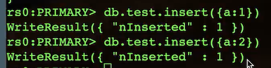
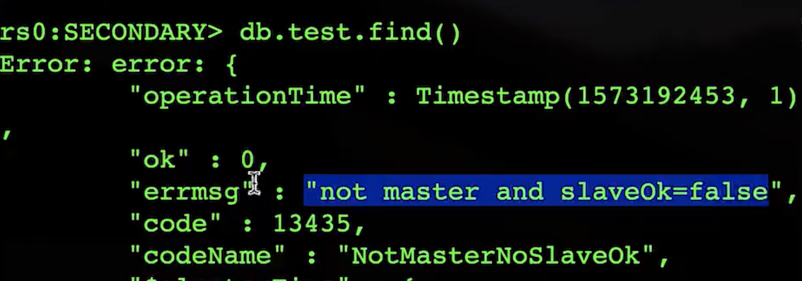
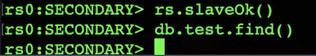
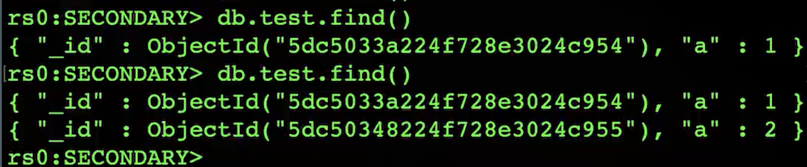

# **3 复制集机制及原理 & 实现**

## **1 复制集的作用**

* MongoDB 复制集的主要意义在于**实现服务高可用**
* 它的现实依赖于两个方面的功能:
	*  数据写入时将数据迅速复制到另一个独立节点上
	*  **在接受写入的节点发生故障时自动选举出一个新的替代节点**


### **复制集的作用**

在实现高可用的同时，复制集实现了其他几个附加作用:

* 数据分发: 将数据从一个区域复制到另一个区域，**减少另一个区域的读延迟**
* 读写分离:**不同类型的压力分别在不同的节点上执行**
* 异地容灾:在数据中心故障时候快速切换到异地

**典型复制集结构**

一个典型的复制集由3个以上具有投票权的节点组成，包括:

*  一个主节点(PRIMARY): **接受写入操作和选举时投票**
*  两个(或多个)从节点(SECONDARY): **复制主节点上的新数据和选举时投票** 
*  **不推荐使用 Arbiter(投票节点)**



### **数据是如何复制的?**

* 当一个修改操作，无论是插入、更新或删除，到达主节点时，**它对数据的操作将被记录下来(经过一些必要的转换)，这些记录称为 oplog**。
* **从节点通过在主节点上打开一个 tailable 游标不断获取新进入主节点的 oplog**，**并在自己的数据上回放**，以此保持跟主节点的数据一致。




### **通过选举完成故障恢复**

* 具有投票权的节点之间**两两互相发送心跳**;
*  当5次心跳未收到时判断为节点失联;
* 如果失联的是主节点，**从节点会发起选举，选出新的主节点**;
* **如果失联的是从节点则不会产生新的选举;**
* 选举基于 RAFT一致性算法 实现，选举成功的必要条件是大多数投票节点存活;
* **复制集中最多可以有50个节点，但具有投票权的节点最多7个**。

**影响选举的因素**

* **整个集群必须有大多数节点存活**;
* 被选举为主节点的节点必须
	* 能够与多数节点建立连接
	* 具有较新的 oplog
	* 具有较高的优先级(如果有配置)

### **常见选项**

复制集节点有以下常见的选配项:

* **是否具有投票权(v 参数):有则参与投票;**
* **优先级(priority 参数):优先级越高的节点越优先成为主节点**。**优先级为0的节点无法成 为主节点;**
* **隐藏(hidden 参数):复制数据，但对应用不可见**。隐藏节点可以具有投票仅，但优先级必须为0;
* **延迟(slaveDelay 参数):复制 n 秒之前的数据，保持与主节点的时间差**。


### **复制集注意事项**

**关于硬件:**

* 因为正常的复制集节点都有可能成为主节点，它们的地位是一样的，因此硬件配置上必须一致;
* 为了保证节点不会同时宕机，各节点使用的硬件必须具有独立

**关于软件:**

复制集各节点软件版本必须一致，以避免出现不可预知的问题。

**<mark>增加节点不会增加系统写性能!</mark>**

## **2 实验:搭建 MongoDB 复制集**

### **1. 准备**

* 安装最新的 MongoDB 版本
* Windows 系统请事先配置好 MongoDB 可执行文件的环境变量
* Linux 和 Mac 系统请配置 PATH 变量
* 确保有 10GB 以上的硬盘空间

### **2.创建数据目录**

MongoDB 启动时将使用一个数据目录存放所有数据文件。我们将为3个复制集节 点创建各自的数据目录。

* Linux/MacOS:

`mkdir -p /data/db{1,2,3}`

*  Windows:

```
md c:\data\db1 
md c:\data\db2 
md c:\data\db3
```

### **3. 准备配置文件**

复制集的每个mongod进程应该位于不同的服务器。我们现在在一台机器上运行3个进程，因此要 为它们各自配置

不同的端口。示例中将使用`28017/28018/28019`

不同的数据目录。示例中将使用

```
/data/db1或c:\data\db1 
/data/db2或c:\data\db2 
/data/db3或c:\data\db3
```

不同日志文件路径。示例中将使用:

```
/data/db1/mongod.log或c:\data\db1\mongod.log 
/data/db2/mongod.log或c:\data\db2\mongod.log 
/data/db3/mongod.log或c:\data\db3\mongod.log
```

### **4 准备配置文件(续)**

**Linux/MacOS**

```
# /data/db1/mongod.conf
systemLog:
  destination: file
  path: /data/db1/mongod.log    # log path
  logAppend: true
storage:
  dbPath: /data/db1                 # data directory
net:
  bindIp: 0.0.0.0
  port: 28017                           # port
replication:
  replSetName: rs0
processManagement:
  fork: true
```

**Windows**

```
# c:\data\db1\mongod.conf
systemLog:
	destination: file
     path: c:\data1\mongod.log    # 日志文件路径
     logAppend: true
storage:
	dbPath: c:\data1                  # 数据目录
net:
	bindIp: 0.0.0.0 
	port: 28017                         # 端口
replication: 
	replSetName: rs0
```

### **启动 MongoDB 进程**

**Linux/Mac:**

```
mongod -f /data/db1/mongod.conf 
mongod -f /data/db2/mongod.conf 
mongod -f /data/db3/mongod.conf
```

注意:如果启用了 SELinux，可能阻止上述进程启动。简单起见请关闭 SELinux。

**Windows:**

```
mongod -f c:\data1\mongod.conf 
mongod -f c:\data2\mongod.conf 
mongod -f c:\data3\mongod.conf
```


因为 Windows 不支持 fork，以上命令需要在3个不同的窗口执行，执行后不可关闭窗口否则 进程将直接结束。


### **配置复制集**

**方法1**

```
# mongo --port 28017
 > rs.initiate()
```


**`SECONDARY -> PRIMARY`**:  in 1S

**查看rs state**



```
> rs.add("HOSTNAME:28018") 
> rs.add("HOSTNAME:28019")
```

注意:此方式`hostname `需要能被解析


**方法2**

```
# mongo --port 28017
> rs.initiate({
    _id: "rs0",
    members: [{
       _id: 0,
	  host: "localhost:28017" 
},{
	  _id: 1,
       host: "localhost:28018" 
},{
		_id: 2,
		host: "localhost:28019" 
	}]
})
```

### **验证**

**MongoDB 主节点进行写入** & **MongoDB 从节点进行读**

**主节点**

```
 # mongo localhost:28017
 > db.test.insert({ a:1 })
```
 
```
 > db.test.insert({ a:2 });
```



**从节点**



```
# mongo localhost:28018
> rs.slaveOk()
> db.test.find()
```




```
> db.test.find()
```




