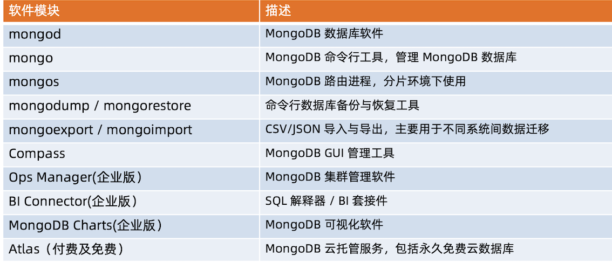
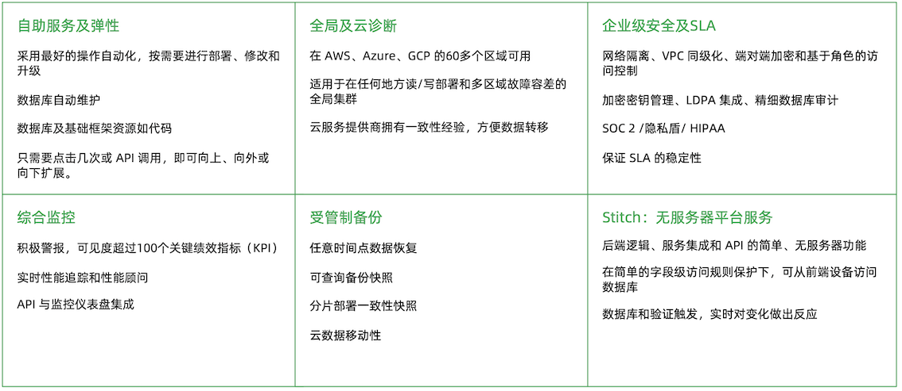
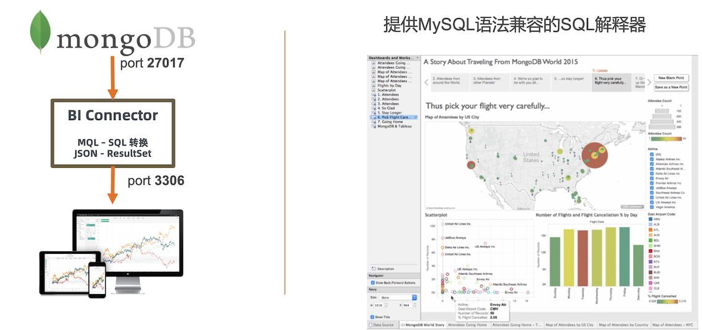

# **4 MongoDB 全家桶**

> MongoDB 系列软件及工具

## **MongoDB 全家桶**



**mongodump / mongorestore**

* 类似于 MySQL 的 dump/restore 工具
* 可以完成全库 dump:不加条件
* 也可以根据条件 dump 部分数据:-q 参数
* Dump 的同时跟踪数据就更: `--oplog`

Restore 是反操作，把 mongodump 的输出导入到 mongodb

```
mongodump -h 127.0.0.1:27017 -d test -c test 

mongorestore -h 127.0.0.1:27017 -d test -c test xxx.bson
```

### **Atlas – MongoDB 公有云托管服务**



### **MongoDB BI Connector**



### **MongoDB Ops Manager - 集群管理平台**

主要功能

* 自动化管理:补丁、升级、在线扩容 
* 监控及报警
* 持续备份及任意时间点恢复
* Kubernetes 集成

### **MongoDB Charts**

* 托拉拽创建 MongoDB 图表
* 创建、分享和嵌入 MongoDB 数据可视化的最快、最便捷方式
* 专为 MongoDB 文档模型设计
* 一行代码在你网页应用程序中嵌入图表
