# **5 Mongo 模型设计**


## **1 模型设计基础**

### **数据模型**

什么是数据模型?

数据模型是一组由符号、文本组成的集合，用以准确表达信息，达到有效交流、沟通的目的。

> Steve Hoberman 霍伯曼. 数据建模经典教程

### **数据模型设计的元素**

**实体 Entity**

* 描述业务的主要数据集合
* 谁，什么，何时，何地，为何，如何

**属性 Attribute**

* 描述实体里面的单个信息

**关系 Relationship**

* 描述实体与实体之间的数据规则
* 结构规则:1-N， N-1, N-N
* 引用规则:电话号码不能单独存在


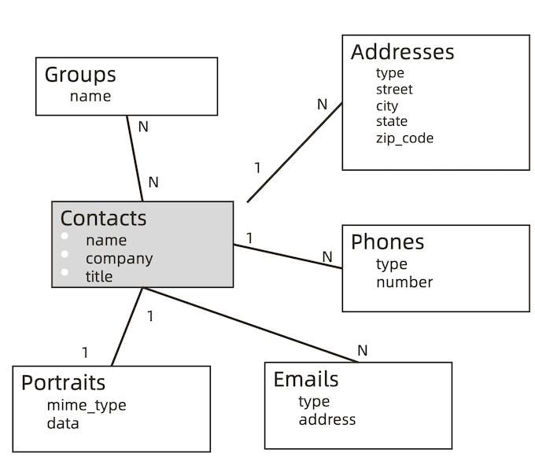

### **传统模型设计:从概念到逻辑到物理**

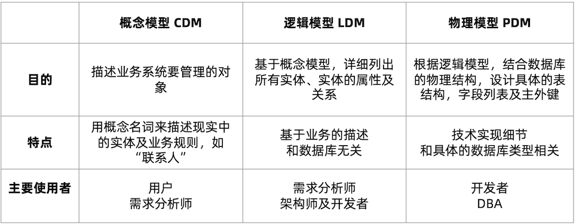

**从开发者的视角:概念模型**

**Contact -> Group**

**从开发者的视角:逻辑模型**

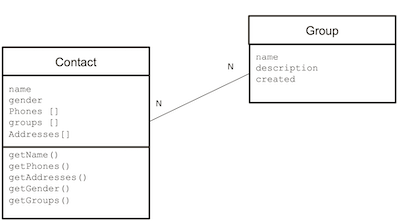

**从开发者的视角:第三范式下的物理模型**

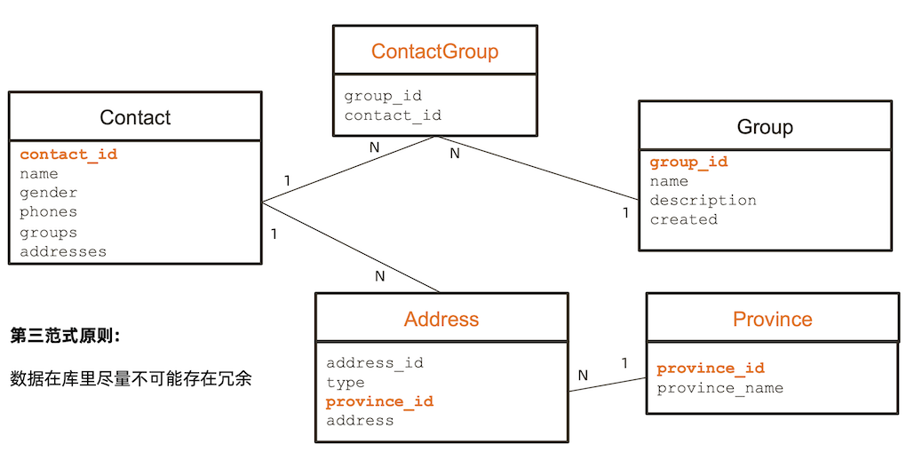

### **模型设计小结**

数据模型的三要素:

**实体 /属性 / 关系**

数据模型的三层深度:

* 概念模型，逻辑模型，物理模型
* 一个模型逐步细化的过程

## **2 JSON 文档模型设计特点**

### **MongoDB 文档模型设计的三个误区**

* 不需要模型设计
* MongoDB 应该用一个超级大文档来组织所有数据 
* MongoDB 不支持关联或者事务

**<mark>上述均为错</mark>**

### **关于 JSON 文档模型设计**

* 文档模型设计处于是物理模型设计阶段 (PDM) 
* JSON 文档模型通过内嵌数组或引用字段来表示关系 
* 文档模型设计不遵从第三范式，允许冗余。

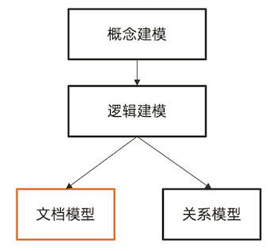

### **为什么人们都说 MongoDB 是无模式?**

* 严格来说，MongoDB 同样需要概念/逻辑建模 
* 文档模型设计的物理层结构可以和逻辑层类似 

**<mark>MongoDB 无模式由来: 可以省略物理建模的具体过程</mark>**

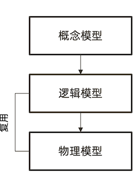

### **逻辑模型 – JSON 模型**

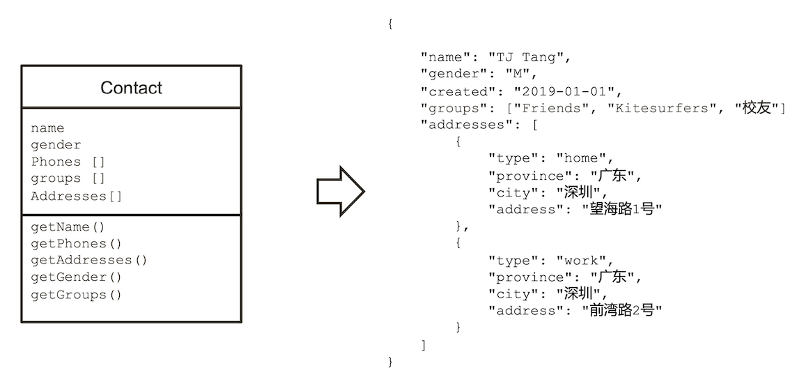

**文档模型的设计原则:性能和易用**


### **关系模型 vs 文档模型**

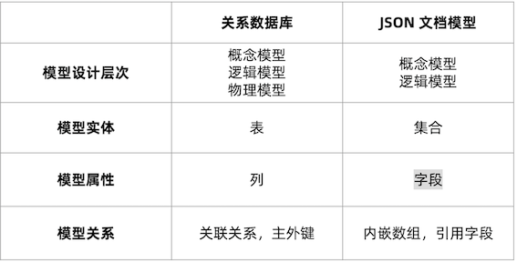

## **3 文档模型设计之一:基础设计**

### **3-1 MongoDB 文档模型设计三步曲**

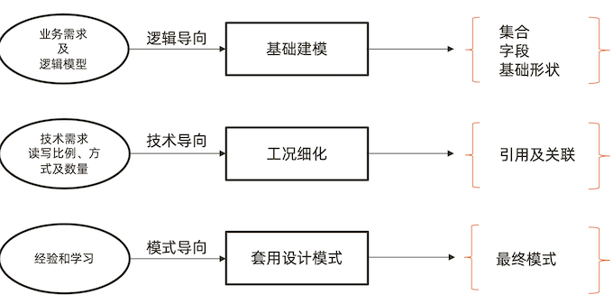

**第一步:建立基础文档模型**

1. 根据概念模型或者业务需求推导出逻辑模型 – 找到对象 
2. 列出实体之间的关系(及基数) - 明确关系
3. 套用逻辑设计原则来决定内嵌方式 – 进行建模
4. 完成基础模型构建


### **一个联系人管理应用的例子**

**1. 找到对象**
	
- Contacts
- Groups
- Address
- Portraits

**2. 明确关系**

- 一个联系人有一个头像 (1-1)
- 一个联系人可以有多个地址(1-N )
- 一个联系人可以属于多个组，一个组可以有多个联系人 (N – N)

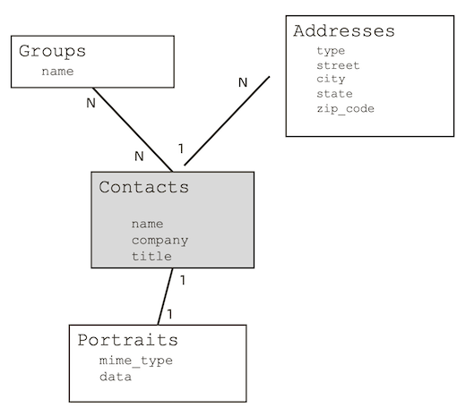

**1-1 关系建模: portraits**

* 基本原则：
	* 一对一关系以内嵌为主 
	* 作为子文档形式 或者直接在顶级 
	* 不涉及到数据冗余
* 例外情况
	* **如果内嵌后导致文档大小超过16MB**

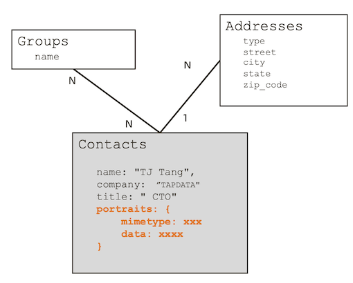

**1-N 关系建模: Addresses**

* 基本原则
	* 一对多关系同样以内嵌为主
	* 用数组来表示一对多
	* 不涉及到数据冗余
* 例外情况
	* 内嵌后导致文档大小超过16MB 
	* 数组长度太大(数万或更多) 
	* 数组长度不确定

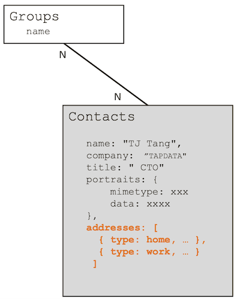

**N-N 关系建模:内嵌数组模式**

* 基本原则
	* 不需要映射表 
	* 一般用内嵌数组来表示一对多 
	* 通过冗余来实现N-N
* 例外情况
	* 内嵌后导致文档大小超过16MB 
	* 数组长度太大(数万或更多) 
	* 数组长度不确定

```
Contacts
	name: "TJ Tang", 
	company: ”TAPDATA" 
	title: " CTO"
	portraits: {
       mimetype: xxx
	  data: xxxx 
	 }，
   addresses: [
     { type: home, ... },
     { type: work, ... }
	]， 
   groups: [
      {name:  ”Friends” },
      {name:  ”Surfers” },
   ]
```

### **小结**

* 90:10 规则: 大部分时候你会使用内嵌来表示 1-1，1-N，N-N 
* 内嵌类似于预先聚合(关联) 
* 内嵌后对读操作通常有优势(减少关联)

## **4 文档模型设计之二:工况细化**

### **第二步:根据读写工况细化**


* 最频繁的数据查询模式 
* 最常用的查询参数
* 最频繁的数据写入模式 
* 读写操作的比例
* 数据量的大小
* 基于内嵌的文档模型
* 根据业务需求，
	*  使用引用来避免性能瓶颈
	*  使用冗余来优化访问性能

### **联系人管理应用的分组需求**

1. 用于客户营销
2. 有千万级联系人
3. 需要频繁变动分组(group) 的信息，如增加分组及修改名称及描述以及营销状态
4. 一个分组可以有百万级联系人

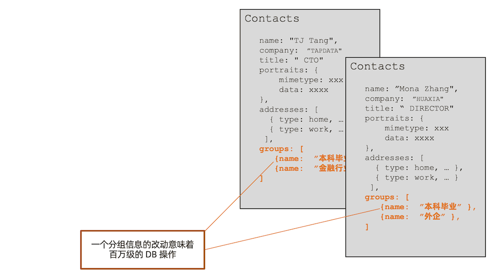


### **解决方案: Group 使用单独的集合**

1. 类似于关系型设计
2. 用 id 或者唯一键关联
3. 使用 `$lookup` 来提供一次查询多表 的能力(类似关联）

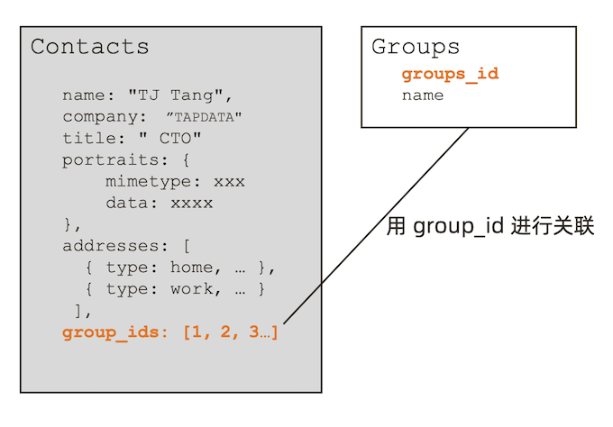

### **引用模式下的关联查询**

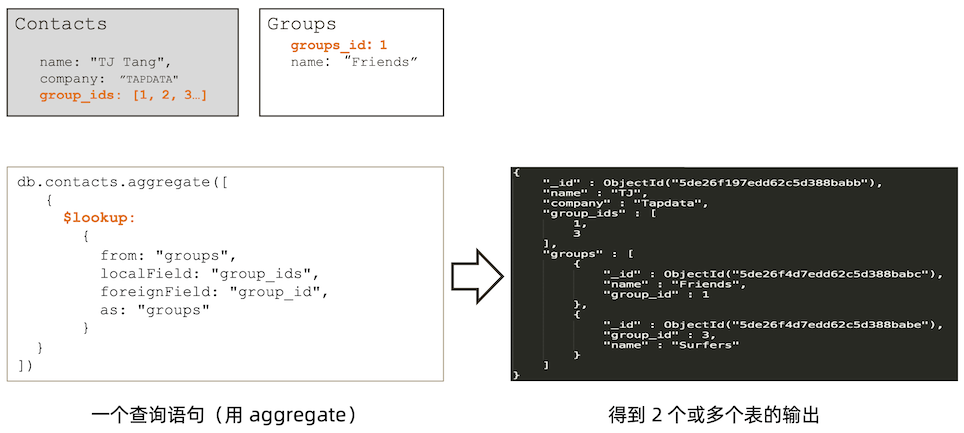

https://www.mongodb.com/docs/manual/reference/operator/aggregation/lookup/

```
db.contacts.aggregate([
   {
$lookup:
       {
         from: "groups",
         localField: "group_ids",
         foreignField: "group_id",
         as: "groups"
} }
])
```


* `from: <collection to join>,`
*  `localField: <field from the input documents>,`
*  `foreignField: <field from the documents of the "from" collection>,`
*  `as: <output array field>`

**联系人的头像: 引用模式**

1. 头像使用高保真，大小在 5MB- 10MB
2. 头像一旦上传，一个月不可更换
3. 基础信息查询(不含头像)和 头 像查询的比例为 9 :1
4. 建议: 使用引用方式，把头像数 据放到另外一个集合，可以显著提 升 90% 的查询效率

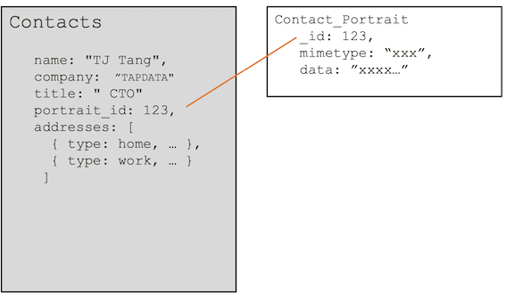


### **什么时候该使用引用方式?**


* **内嵌文档太大，数 MB 或者超过 16MB** 
* **内嵌文档或数组元素会频繁修改** 
* **内嵌数组元素会持续增长并且没有封顶**

### **MongoDB 引用设计的限制**


* MongoDB 对使用引用的集合之间并无主外键检查 
* **MongoDB 使用聚合框架的** 
* **`$lookup` 来模仿关联查询 `$lookup` 只支持 left outer join**
* **`$lookup` 的关联目标(from)不能是分片表**

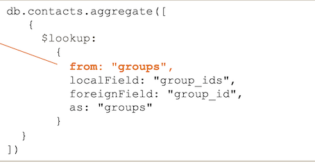


## **5 文档模型设计之三:模式套用**

### **第三步:套用设计模式**

* 文档模型: 无范式，无思维定式，充分发挥想象力 
* 设计模式:实战过屡试不爽的设计技巧，快速应用
* 举例:一个 IoT 场景的分桶设计模式，可以帮助把存储空间降低 10 倍并且查询效率提 升数十倍.


**问题: 物联网场景下的海量数据处理 – 飞机监控数据**

```
{
"_id" : "20160101050000:CA2790",
"icao" : "CA2790",
"callsign" : "CA2790",
"ts" : ISODate("2016-01-01T05:00:00.000+0000"), 
"events" : {
        "a" : 31418,
        "b" : 173,
        "p" : [115, -134],
        "s" : 91,
        "v" : 80
  } 
}
```

### **520亿条，10TB – 海量数据**

*  10万架飞机 
*  1年的数据 
*  每分钟一条

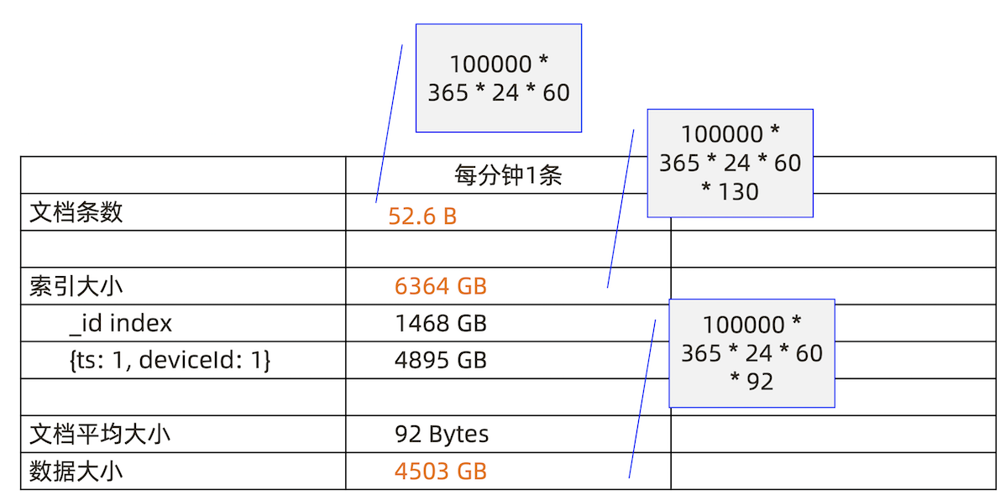

解决方案: 分桶设计

**一个文档:一架飞机一个小时的数据**

**60 Events == 1 小时数据**

```
{
	"_id" : "20160101050000:WG9943",
	"icao" : "WG9943",
	"ts" : ISODate("2016-01-01T05:00:00.000+0000"), 
	"events" : [
        {
            "a" : 24293, "b" : 319, "p" : [41, 70], "s" : 56,
            "t" : ISODate("2016-01-01T05:00:00.000+0000“)
            }, {
            "a" : 33663, "b" : 134, "p" : [-38, -30], "s" : 385,
            "t" : ISODate("2016-01-01T05:00:01.000+0000“)
        },
	... 
	]
}
```	


### **520亿条，10TB – 海量数据**

可视化表现 24 小时的飞行数据   1440 次读 


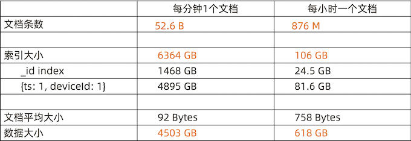

### **模式小结:分桶**

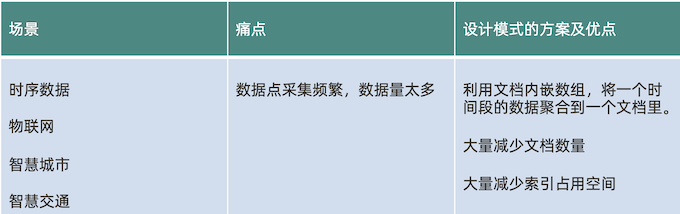

**本讲小结**

一个好的设计模式可以显著地: 

* 提升数据读写的效率
* 降低资源的需求

更多的 MongoDB 设计模式:


## **6 设计模式集锦**

## **问题1 : 大文档，很多字段，很多索引**

```
{
	title: "Dunkirk",
	...
	release_USA: "2017/07/23",
	release_UK: "2017/08/01",
	release_France: "2017/08/01",
	release_Festival_San_Jose:
	  "2017/07/22"
}
```

**需要很多索引**

```
{ release_USA: 1 }
{ release_UK: 1 }
{ release_France: 1 }
...
{ release_Festival_San_Jose: 1 }
...
```

### **解决方案: 列转行**

```
{
  title: "Dunkirk",
  ...
  releases: [
  	{ country: “USA”, date:”2017/07/23”},
    { country: “UK”, date:”2017/08/01”}
 ]
}
```

```
db.movies.createIndex({“releases.country”:1, “releases.date”:1})
```

### **模式小结: 列转行**

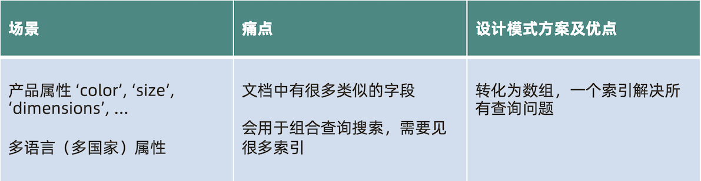

***

## **问题2: 模型灵活了，如何管理文档不同版本?**

2019.01 版本1.0

```
{
	"_id" : ObjectId("5de26f197edd62c5d388babb"), 
	"name" : "TJ",
	"company" : "Tapdata",
}
```

2019.03 版本2.0

```
{
	"_id" : ObjectId("5de26f197edd62c5d388babb"), "name" : "TJ",
	"company" : "Tapdata",
	"wechat": "tjtang826"
}
```

### **解决方案: 增加一个版本字段**

```
{
	"_id" : ObjectId("5de26f197edd62c5d388babb"), "name" : "TJ",
	"company" : "Tapdata",
	"wechat": "tjtang826”，
	"schema_version": "2.0"
}
```

**`"schema_version": "2.0"`**

### **模式小结: 版本字段**


## **问题3: 统计网页点击流量**

* 每访问一个页面都会产生一次数据库计数更新操作
* 统计数字准确性并不十分重要

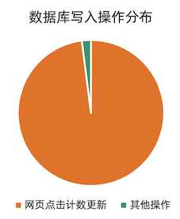

### **解决方案: 用近似计算**

每隔10 (X)次写一次  `Increment by 10(X)`

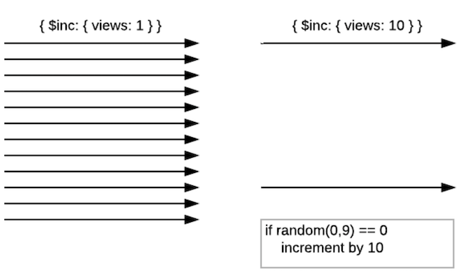

### **模式小结:近似计算**


## **问题4: 业绩排名，游戏排名，商品统计等精确统计**

*  热销榜:某个商品今天卖了多少，这个星期卖了多少，这个月卖了多少?
*  电影排行:观影者，场次统计
*  传统解决方案:通过聚合计算
*  痛点:消耗资源多，聚合计算时间长

**解决方案: 用预聚合字段**

```
{
  product: ”Bike",
  sku: “abc123456”,
  quantitiy: 20394,
  daily_sales: 40,
  weekly_sales: 302,
  monthly_sales: 1419
}
```

```
db.inventory.update({_id:123},
{$inc: {
	quantity: -1, 
	daily_sales: 1, 
	weekly_sales: 1， 
	monthly_sales: 1，
	}
)
```

### **模式小结:预聚合**


