# **6 MongoDB 事务开发**

## **1 事务开发:写操作事务**

### **什么是 writeConcern ?**

**writeConcern 决定一个写操作落到多少个节点上才算成功**。writeConcern 的取值包括:

* **0: 发起写操作，不关心是否成功;**
* **1~集群最大数据节点数:** 写操作需要被复制到指定节点数才算成功;
* **majority**: 写操作需要被复制到大多数节点上才算成功。

发起写操作的程序将阻塞到写操作到达指定的节点数为止

### **默认行为**

3 节点复制集不作任何特别设定(默认值):

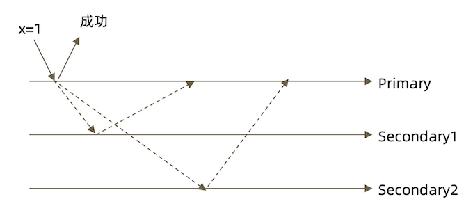

### **`w: "majority"`**

大多数节点确认模式

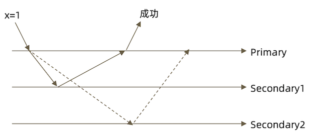

### **`w: "all"`**

全部节点确认模式

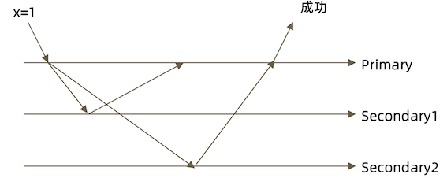

### **`j:true`**

`writeConcern` 可以决定写操作到达多少个节点才算成功，journal 则定义如何才算成功。取值包括:

* **true:写操作落到`journal`文件中才算成功;**
* **false:写操作到达内存即算作成功**。

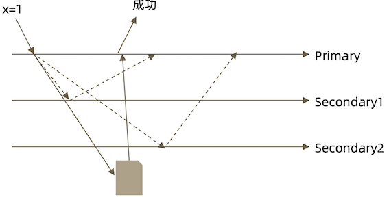

### **writeConcern 的意义**

对于5个节点的复制集来说，写操作落到多少个节点上才算是安全的?

* 1
* 2 
* 3✓
* 4✓
* 5✓
* majority ✓

### **writeConcern 实验**

**在复制集测试writeConcern参数**


```
db.test.insert( {count: 1}, {writeConcern: {w: "majority"}}) 

db.test.insert( {count: 1}, {writeConcern: {w: 3 }}) 

db.test.insert( {count: 1}, {writeConcern: {w: 4 }})
```

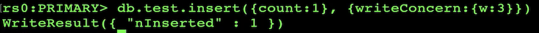

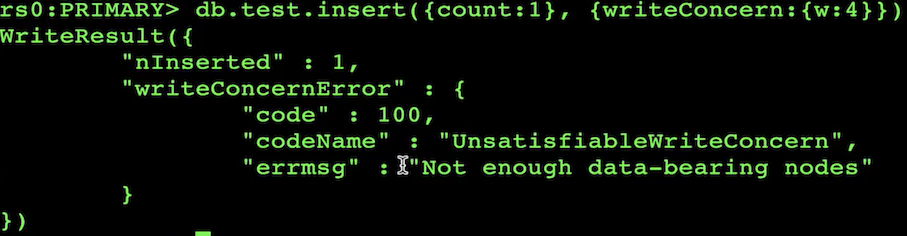

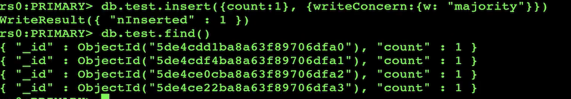

**查看集群成员**

**`conf.members`**

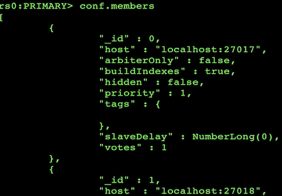

**配置延迟节点，模拟网络延迟(复制延迟)**

```
conf=rs.conf() 

conf.members[2].slaveDelay = 5 
conf.members[2].priority = 0 

rs.reconfig(conf)
```

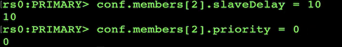

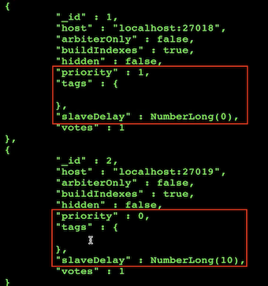

**10s 后延迟插入**

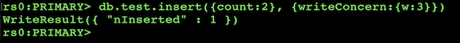

**观察复制延迟下的写入，以及timeout参数**

```
db.test.insert( {count: 1}, {writeConcern: {w: 3}})

db.test.insert( {count: 1}, {writeConcern: {w: 3, wtimeout:3000 }})
```

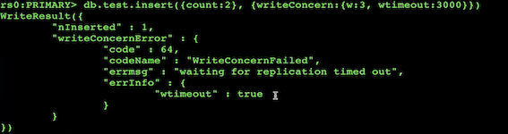

### **注意事项**


* **虽然多于半数的`writeConcern`都是安全的，但通常只会设置`majority`，因为这是等待写入延迟时间最短的选择;**
*  不要设置`writeConcern`等于总节点数，因为一旦有一个节点故障，所有写操作都将失败;
*  **`writeConcern`虽然会增加写操作延迟时间，但并不会显著增加集群压力，因此无论是否等待，写操作最终都会复制到所有节点上。设置 `writeConcern` 只是让写操作 等待复制后再返回而已;**
*  **应对重要数据应用`{w:“majority”}`，普通数据可以应用`{w:1}`以确保最佳性能**。

## **2 事务开发:读操作事务之一 `readPreference`**

### **综述**

在读取数据的过程中我们需要关注以下两个问题: 

* 从哪里读?
* 什么样的数据可以读?

* 第一个问题是是由 readPreference 来解决 
* 第二个问题则是由 readConcern 来解决

### **什么是 readPreference?**

`readPreference` 决定使用哪一个节点来满足 正在发起的读请求。可选值包括:

* **primary:只选择主节点;**
* **primaryPreferred:优先选择主节点，如果不可用则选择从节点;**
* **secondary:只选择从节点;**
* **`secondaryPreferred:`优先选择从节点， 如果从节点不可用则选择主节点;**
* **nearest:选择最近的节点;**

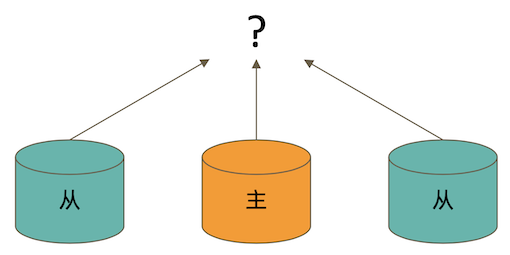


### **readPreference 场景举例**

* **用户下订单后马上将用户转到订单详情页——primary/primaryPreferred**。因为此时从节点可能还没复制到新订单;
* **用户查询自己下过的订单——secondary/secondaryPreferred**。查询历史订单对 时效性通常没有太高要求;
* **生成报表——secondary**。报表对时效性要求不高，但资源需求大，可以在从节点 单独处理，避免对线上用户造成影响;
* **将用户上传的图片分发到全世界，让各地用户能够就近读取——nearest**。每个地区 的应用选择最近的节点读取数据。

### **readPreference 与 Tag**

readPreference 只能控制使用一类节点。Tag 则可以将节点选择控制 到一个或几个节点。考虑以下场景:

* 一个5个节点的复制集;
* 3个节点硬件较好，专用于服务线上客户;
* 2个节点硬件较差，专用于生成报表

**可以使用 Tag 来达到这样的控制目的:**

* 为3个较好的节点打上`{purpose:"online"}`;
* 为2个较差的节点打上`{purpose:"analyse"}`;
* 在线应用读取时指定online，报表读取时指定reporting。

更多信息请参考文档: [readPreference](https://docs.mongodb.com/manual/core/read-preference/)

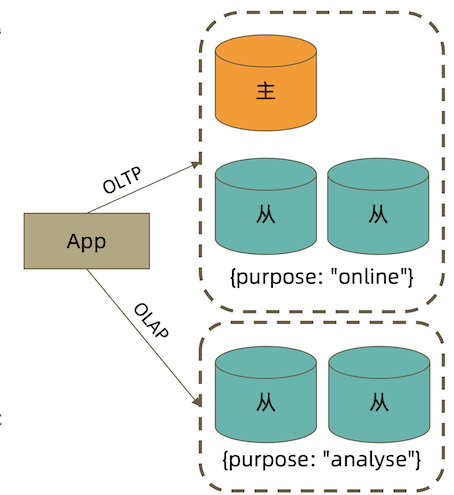

### **readPreference 配置**

**通过 MongoDB 的连接串参数:**

`mongodb://host1:27107,host2:27107,host3:27017/?replicaSet=rs&readPreference=secondary`


**通过 MongoDB 驱动程序 API:**

```
MongoCollection.withReadPreference(ReadPreferencereadPref)
```

Mongo Shell:

```
db.collection.find({}).readPref("secondary")
```


### **readPreference 实验: 从节点读**


* 主节点写入`{x:1}`,观察该条数据在各个节点均可见

On primary to read secondary: Okay


* 在**两个从节点**分别执行 `db.fsyncLock()` 来锁定写入(同步)


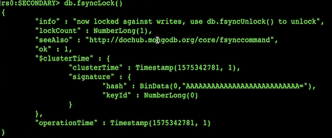

* 主节点写入`{x:2}`

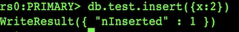

* 次节点无法**读**到新的新插入的数据， 但是**主节点可以读到**


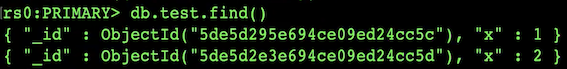

* `db.test.find({a:123})`
* `db.test.find({a:123}).readPref("secondary")` 

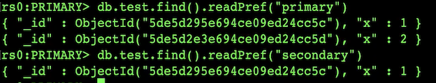

* 解除从节点锁定`db.fsyncUnlock()`

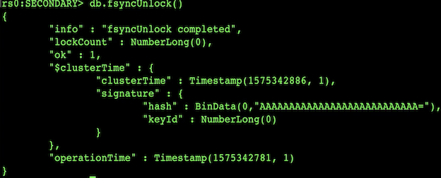

* `db.test.find({a:123}).readPref("secondary”)`

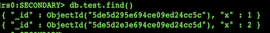

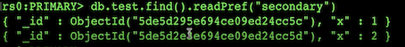

### **注意事项**


*  指定readPreference时也应注意高可用问题。例如将readPreference指定primary，则发生故障转移不存在 primary 期间将没有节点可读。**如果业务允许，则应选择 primaryPreferred**;
* 使用Tag时也会遇到同样的问题，如果只有一个节点拥有一个特定Tag，则在这个节点失效时 将无节点可读。这在有时候是期望的结果，有时候不是。例如:
	* 如果报表使用的节点失效，即使不生成报表，通常也不希望将报表负载转移到其他节点上，此时只有一个 节点有报表 Tag 是合理的选择;
	* 如果线上节点失效，通常希望有替代节点，所以应该保持多个节点有同样的Tag;
* **Tag有时需要与优先级、选举权综合考虑。例如做报表的节点通常不会希望它成为主节点，则 优先级应为 0**

##  **3 事务开发:读操作事务之二**

### **什么是 readConcern?**

在 readPreference 选择了指定的节点后，readConcern 决定这个节点上的数据哪些 是可读的，类似于关系数据库的隔离级别。可选值包括:

* **available:读取所有可用的数据;**
* local:读取所有可用且属于当前分片的数据;
* **majority:读取在大多数节点上提交完成的数据;** 
* linearizable:可线性化读取文档;
* **snapshot:读取最近快照中的数据;**

### **readConcern: local 和 available**

**在复制集中 local 和 available 是没有区别的**。两者的区别主要体现在分片集上。考虑以下场景:

* 一个`chunkx`正在从`shard1`向`shard2`迁移;
* 整个迁移过程中`chunkx`中的部分数据会在`shard1`和`shard2`中同时存在，但源分片`shard1`仍然是 chunk x 的负责方:
	* 所有对`chunkx`的读写操作仍然进入`shard1`;
	* `config`中记录的信息chunkx仍然属于`shard1`;
* 此时如果读shard2，则会体现出local和available的区别:
	*  **`local` :只取应该由shard2负责的数据(不包括x);**
	*  **`available:shard2`上有什么就读什么(包括x);**

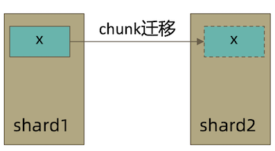

注意事项:

* **虽然看上去总是应该选择local，但毕竟对结果集进行过滤会造成额外消耗。在一些无关紧要的场景(例如统计)下，也可以考虑 available**;
* `MongoDB<=3.6`不支持对从节点使用`{readConcern:"local"}`;
* **从主节点读取数据时默认`readConcern`是`local`，从从节点读取数据时默认` readConcern` 是 `available`(向前兼容原因)**。

### **`readConcern: majority`**

**<mark>只读取大多数据节点上都提交了的数据</mark>**。考虑如下场景:

* **集合中原有文档 `{x: 0}`;**
* 将x值更新为 1;

如果在各节点上应用`{readConcern: "majority"} `来读取数据:

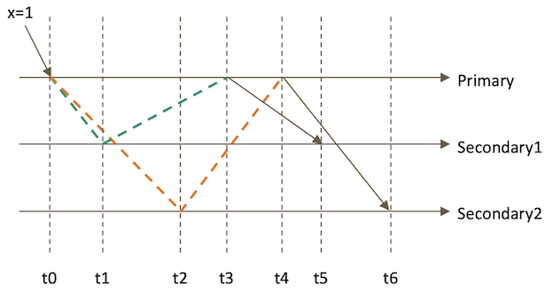

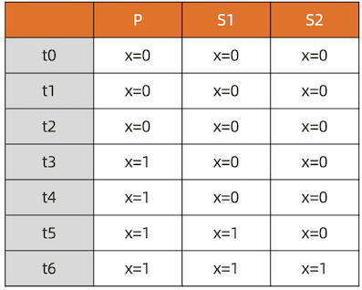

### **`readConcern: majority` 的实现方式**

考虑 t3 时刻的 `Secondary1`，此时:

* 对于要求`majority`的读操作，它将返回`x=0`;
* 对于不要求`majority`的读操作，它将返回`x=1`;

**如何实现?**

* 节点上维护多个 x 版本，MVCC 机制
* MongoDB 通过维护多个快照来链接不同的版本:
	* 每个被大多数节点确认过的版本都将是一个快照
	* 快照持续到没有人使用为止才被删除;

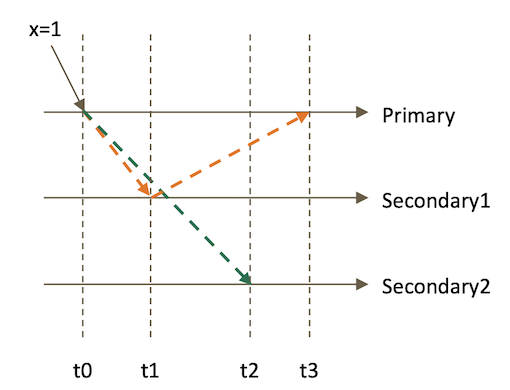

### **实验: `readConcern : "majority" vs "local"`**
	
* 安装3节点复制集。
* 注意配置文件内server参数`enableMajorityReadConcern`

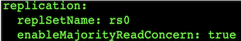

* **将复制集中的两个从节点使用`db.fsyncLock()`锁住写入(模拟同步延迟)**


### **readConcern 验证**

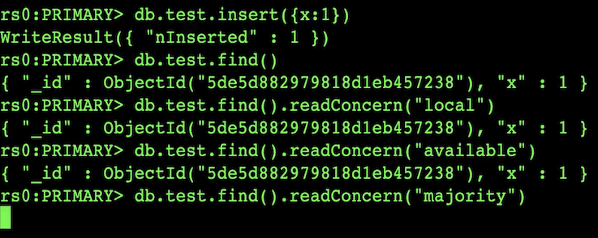

**因为从节点被锁的原因， findConcern("majority") 会卡住**

* 在某一个从节点上执行`db.fsyncUnlock()`

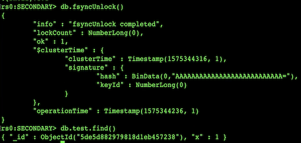

**结论:**

* 使用local参数，则可以直接查询到写入数据
*  **使用majority，只能查询到已经被多数节点确认过的数据** 
*  update与remove与上同理。

### **readConcern: majority 与脏读**

MongoDB 中的回滚:

* 写操作到达大多数节点之前都是不安全的，一旦主节点崩溃，而从节还没复制到该 次操作，刚才的写操作就丢失了;
*  把一次写操作视为一个事务，从事务的角度，可以认为事务被回滚了。

所以从分布式系统的角度来看，事务的提交被提升到了分布式集群的多个节点级别的“提交”，而不再是单个节点上的“提交”。
 
在可能发生回滚的前提下考虑脏读问题:

* 如果在一次写操作到达大多数节点前读取了这个写操作，然后因为系统故障该操作 回滚了，则发生了脏读问题;

**使用 `{readConcern: "majority"} `可以有效避免脏读**

### **readConcern: 如何实现安全的读写分离**
 
 考虑如下场景:
 
*  向主节点写入一条数据;
*  立即从从节点读取这条数据。

如何保证自己能够读到刚刚写入的数据?

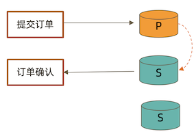

**下述方式有可能读不到刚写入的订单**

```
db.orders.insert({ oid: 101, sku: "kite", q: 1}) 

db.orders.find({oid:101}).readPref("secondary")
```

**使用 `writeConcern + readConcern majority` 来解决**

```
db.orders.insert({ oid: 101, sku: "kiteboar", q: 1}, {writeConcern:{w: "majority"}}) 

db.orders.find({oid:101}).readPref("secondary").readConcern("majority")
```

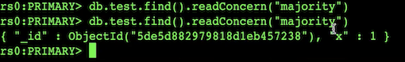

```
> db.tx.insert([{x:1},{x:2}])
BulkWriteResult({
	"writeErrors" : [ ],
	"writeConcernErrors" : [ ],
	"nInserted" : 2,
	"nUpserted" : 0,
	"nMatched" : 0,
	"nModified" : 0,
	"nRemoved" : 0,
	"upserted" : [ ]
})
```

```
> db.tx.find()
{ "_id" : ObjectId("6270754123c7ad7cc7cb0e48"), "x" : 1 }
{ "_id" : ObjectId("6270754123c7ad7cc7cb0e49"), "x" : 2 }
```
```
> var session = db.getMongo().startSession()
> session.startTransaction()
> var coll = session.getDatabase("test").getCollection("txt")
> coll.update({x:1}, {$set: {y:1}})
WriteCommandError({
	"ok" : 0,
	"errmsg" : "Transaction numbers are only allowed on a replica set member or mongos",
	"code" : 20,
	"codeName" : "IllegalOperation"
})
```

**Transaction numbers are only allowed on a replica set member or mongos**

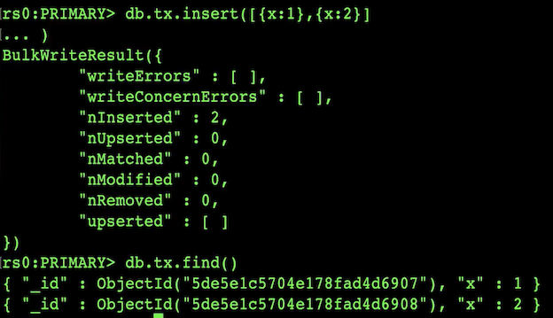

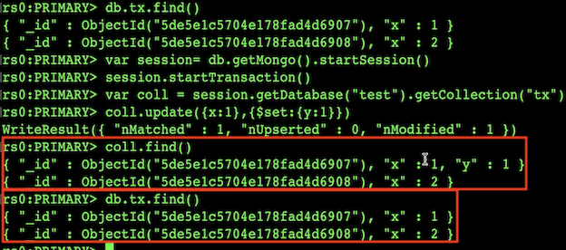

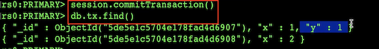

### **小测试**

readConcern 主要关注读的隔离性， ACID 中的 Isolation， 但是是分布式数据库里特有的概念

readCocnern: majority 对应于事务中隔离级别中的哪一级?

* Read Uncommited 
* **Read Committed** 
* Repeatable 
* Read Seriazable

### **readConcern: linearizable**

只读取大多数节点确认过的数据。和 majority 最大差别是保证绝对的操作线性顺序 – 在写操作自然时间后面的发生的读，一定可以读到之前的写

- 只对读取单个文档时有效;
- 可能导致非常慢的读，因此总是建议配合使用 maxTimeMS;

只读取大多数节点确认过的数据。和 majority 最大差别是保证绝对的操作线性顺序 – 在写操作自然时间后面的发生的读，一定可以读到之前的写

- 只对读取单个文档时有效;
- 可能导致非常慢的读，因此总是建议配合使用 maxTimeMS;

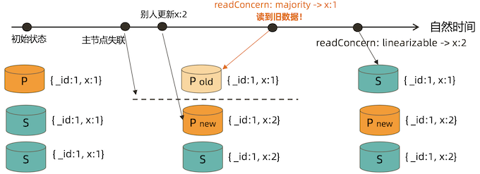

### **readConcern: snapshot**

`{readConcern: “snapshot”} `只在多文档事务中生效。将一个事务的 readConcern 设置为 snapshot，将保证在事务中的读:

* 不出现脏读;
* 不出现不可重复读;
* 不出现幻读。

因为所有的读都将使用同一个快照，直到事务提交为止该快照才被释放。

### **readConcern: 小结**


* available:读取所有可用的数据
* local:读取所有可用且属于当前分片的数据，默认设置
* **<mark>majority:数据读一致性的充分保证，可能你最需要关注的</mark>**
* linearizable:增强处理majority情况下主节点失联时候的例外情况 
* **snapshot:最高隔离级别，接近于Seriazable**

## **4 事务开发:多文档事务**

开始之前......


MongoDB 虽然已经在 4.2 开始全面支持了多文档事务，但并不代表大家应该毫无节制 地使用它。相反，对事务的使用原则应该是:能不用尽量不用。

通过合理地设计文档模型，可以规避绝大部分使用事务的必要性 

为什么?事务 = 锁，节点协调，额外开销，性能影响

### **MongoDB ACID 多文档事务支持**

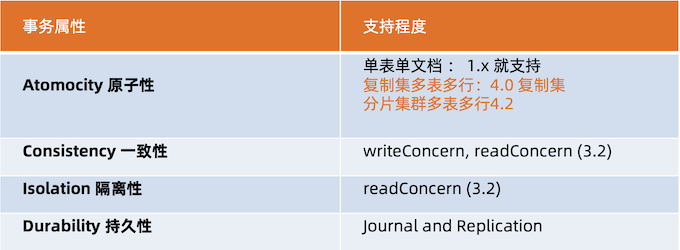

**使用方法**

MongoDB 多文档事务的使用方式与关系数据库非常相似:

```
try (ClientSession clientSession = client.startSession()) { 
	clientSession.startTransaction(); 
	collection.insertOne(clientSession, docOne); 
	collection.insertOne(clientSession, docTwo); 
	clientSession.commitTransaction();
}
```

### **事务的隔离级别**

* 事务完成前，**事务外的操作**对该事务所做的修改不可访问
* 如果事务内使用 `{readConcern: "snapshot"}`，则可以达到可重复读 `Repeatable Read`

### **实验:启用事务后的隔离性**

```
db.tx.insertMany([{ x: 1 }, { x: 2 }]);

var session = db.getMongo().startSession(); 

session.startTransaction();

var coll = session.getDatabase('test').getCollection("tx");
```

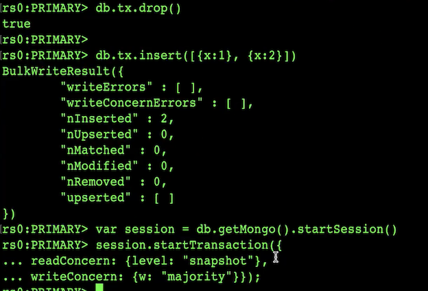

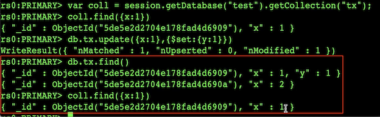

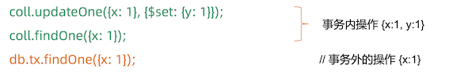


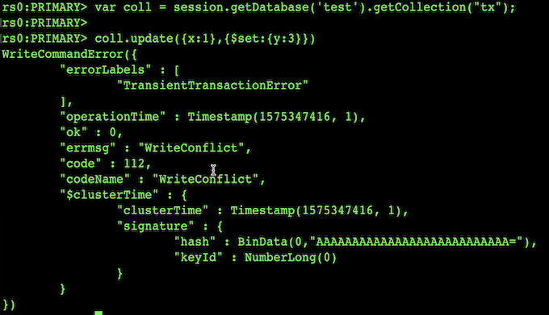

```
session.abortTransaction();
```

### **实验:可重复读 Repeatable Read**

MongoDB 的事务错误处理机制不同于关系数据库:


* 当一个事务开始后，如果事务要修改的文档在事务外部被修改过，则事务修改这个 文档时会触发 Abort 错误，因为此时的修改冲突了;
* 这种情况下，只需要简单地重做事务就可以了;
* 如果一个事务已经开始修改一个文档，在事务以外尝试修改同一个文档，则事务以 外的修改会等待事务完成才能继续进行。

### **实验:写冲突**

继续使用上个实验的tx集合

**开两个 mongo shell 均执行下述语句**

```
var session = db.getMongo().startSession(); 

session.startTransaction({ readConcern: {level: "snapshot"},
	writeConcern: {w: "majority"}});

var coll = session.getDatabase('test').getCollection("tx");
```

**窗口1:**

```
coll.updateOne({x: 1}, {$set: {y: 1}});  // 正常结束
```

**窗口2:**

```
coll.updateOne({x: 1}, {$set: {y: 2}}); // 异常 – 解决方案:重启事务
```

**窗口1:第一个事务，正常提交**

```
coll.updateOne({x: 1}, {$set: {y: 1}});
```

**窗口2:另一个事务更新同一条数据，异常**

```
coll.updateOne({x: 1}, {$set: {y: 2}});
```

**窗口3:事务外更新，需等待**


```
db.tx.updateOne({x: 1}, {$set: {y: 3}});
```

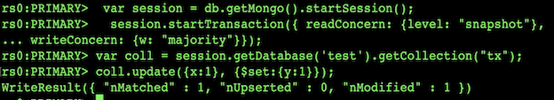

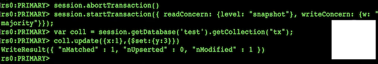

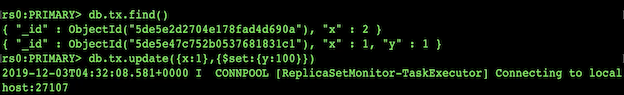

### **注意事项**

* 可以实现和关系型数据库类似的事务场景
* 必须使用与MongoDB4.2兼容的驱动;
* 事务默认必须在60秒(可调)内完成，否则将被取消;
* 涉及事务的分片不能使用仲裁节点;
* 事务会影响chunk迁移效率。正在迁移的chunk也可能造成事务提交失败(重试 即可);
* 多文档事务中的读操作必须使用主节点读;
* readConcern只应该在事务级别设置，不能设置在每次读写操作上。