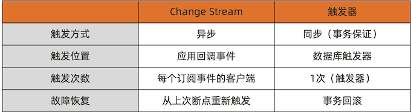
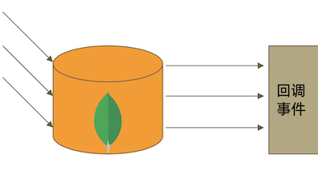
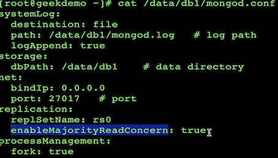
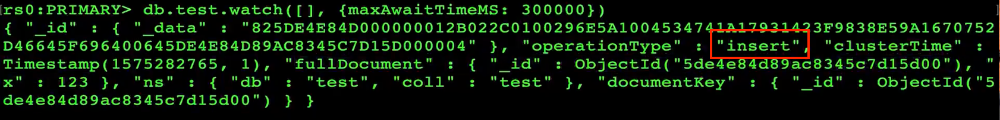
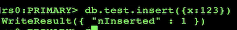
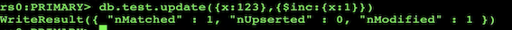
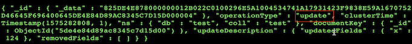
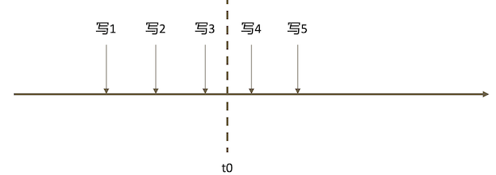

# **7 MongoDB Change Stream & 开发最佳实践**

## **1 Change Stream**

### **什么是 Change Stream**

Change Stream 是 MongoDB 用于实现变更追踪的解决方案，类似于关系数据库的触发器，但原理不完全相同:




### **Change Stream 的实现原理**

**Change Stream 是基于 oplog 实现的**。它在 oplog 上开启一个 `tailable cursor` 来追踪所有复制集上的变更操作，最终调用应用中定义的回调函数。

被追踪的变更事件主要包括:

* insert/update/delete:	插入、更新、删除;
* drop:	集合被删除;
* rename:		集合被重命名;
* dropDatabase:	数据库被删除;
* invalidate: `drop/rename/dropDatabase`将导致invalidate被触发， 并关闭 `change stream`;



### **Change Stream 与可重复读**

Change Stream 只推送已经在大多数节点上提交的变更操作。即“可重复读”的变更。 这个验证是通过 `{readConcern: "majority"}` 实现的。因此:

* **未开启 majorityreadConcern 的集群无法使用ChangeStream;**
* 当集群无法满足`{w:"majority"}`时，**不会触发ChangeStream(例如PSA架构 中的 S 因故障宕机**)。



### **Change Stream 变更过滤**

如果只对某些类型的变更事件感兴趣，可以使用使用聚合管道的过滤步骤过滤事件。
 
例如:
 
```
var cs = db.collection.watch([{
    $match: {
        operationType: {
            $in: ['insert', 'delete']
	} 
   }
}])
```
 
### **Change Stream 示例**
 
**Console 1**

```
> db.collection.watch([],
{maxAwaitTimeMS: 30000}).pretty()
```

**Console 2**

```
> db.collection.insert({
    _id: 1,
    text: "hello"
  })
```

```
{
	_id : (resumeToken), 
	operationType : "insert", 
	...
	fullDocument : {
		_id : 1,
		text: "hello" 
	}
}
```









### **Change Stream 故障恢复**

假设在一系列写入操作的过程中，订阅 Change Stream 的应用在接收到“写3”之后 于 t0 时刻崩溃，重启后后续的变更怎么办?



想要从上次中断的地方继续获取变更流，只需要保留上次 变更通知中的 `_id` 即可。

**所示是一次 Change Stream 回调所返回的数据。每 条这样的数据都带有一个 `_id`，这个 `_id` 可以用于断点恢 复。例如**

```
var cs = db.collection.watch([], {resumeAfter: <_id>})
```

即可从上一条通知中断处继续获取后续的变更通知。

```
{
	id : { "_data" : BinData(0,"gl3dBycAAAABRmRfaWQAZF3dB ycMPJGagxioigBaEASFV+UNaJtBdbJ2j5fOD+3 GBA==") },
	
	operationType : "insert", 
	ns : {
		db : "test",
		coll : "collection"
	}, 
	documentKey : { 
		_id:1
	},
	fullDocument : 
	{ 
		_id : 1,
		text: "hello"
	} 
}
```

### **Change Stream 使用场景**

* 跨集群的变更复制——在源集群中订阅ChangeStream，一旦得到任何变更立即写入目标集群。
* 微服务联动——当一个微服务变更数据库时，其他微服务得到通知并做出相应的变更。
* 其他任何需要系统联动的场景。

### **注意事项**

* `ChangeStream`依赖于`oplog`，因此中断时间不可超过`oplog`回收的最大时间窗; 
* 在执行`update`操作时，如果只更新了部分数据，那么`ChangeStream`通知的也
是增量部分;
* 同理，删除数据时通知的仅是删除数据的`_id`。

## **2 MongoDB 开发最佳实践**

### **连接到 MongoDB**

关于驱动程序:总是选择与所用之MongoDB相兼容的驱动程序。这可以很容易地从驱动 兼容对照表中查到;

* 如果使用第三方框架(如SpringData)，则还需要考虑框架版本与驱动的兼容性;

 关于连接对象MongoClient:使用MongoClient对象连接到MongoDB实例时总是应该
 保证它单例，并且在整个生命周期中都从它获取其他操作对象
 
* 关于连接字符串:连接字符串中可以配置大部分连接选项，建议总是在连接字符串中配置 这些选项;

```
// 连接到复制集 
mongodb://节点1,节点2,节点3.../database?[options]

// 连接到分片集
 mongodb://mongos1,mongos2,mongos3.../database?[options]
```

**常见连接字符串参数**

* maxPoolSize:  连接池大小
* MaxWaitTime: 建议设置，自动杀掉太慢的查询
* WriteConcern:  建议majority保证数据安全
* ReadConcern: 对于数据一致性要求高的场景适当使用

**连接字符串节点和地址**

* 无论对于复制集或分片集，连接字符串中都应尽可能多地提供节点地址，建议全部列出;
	* 复制集利用这些地址可以更有效地发现集群成员;
	* 分片集利用这些地址可以更有效地分散负载;

* 连接字符串中尽可能使用与复制集内部配置相同的域名或IP;

### **使用域名连接集群**

在配置集群时使用域名可以为集群变更时提供一层额外的保护。例如需要将集群整体 迁移到新网段，直接修改域名解析即可。

**另外，MongoDB 提供的 `mongodb+srv://` 协议可以提供额外一层的保护。该协议允许通过域名解析得到所有 mongos 或节点的地址，而不是写在连接字符串中。**

```
mongodb+srv://server.example.com/
Record TTL Class Priority Weight Port Target _mongodb._tcp.server.example.com. 86400 IN SRV 0 5 27317 mongodb1.example.com.
_mongodb._tcp.server.example.com. 86400 IN SRV 0 5 27017 mongodb2.example.com.
```

### **不要在 mongos 前面使用负载均衡**

基于前面提到的原因，**驱动已经知晓在不同的 mongos 之间实现负载均衡，而复制集 则需要根据节点的角色来选择发送请求的目标**。如果在 mongos 或复制集上层部署负 载均衡:

* 驱动会无法探测具体哪个节点存活，从而无法完成自动故障恢复; 
* 驱动会无法判断游标是在哪个节点创建的，从而遍历游标时出错;

结论**:不要在 mongos 或复制集上层放置负载均衡器，让驱动处理负载均衡和自动故障恢复**。


### **游标使用**

**如果一个游标已经遍历完，则会自动关闭;如果没有遍历完，则需要手动调用 `close() `方法，否则该游标将在服务器上存在 10 分钟(默认值)后超时释放，造成不必要的资源浪费**。

 但是，如果不能遍历完一个游标，通常意味着查询条件太宽泛，更应该考虑的问题是 如何将条件收紧。
 
### **关于查询及索引**

* 每一个查询都必须要有对应的索引
* **尽量使用覆盖索引 Covered Indexes (可以避免读数据文件)**
* **使用 projection 来减少返回到客户端的的文档的内容**

### **关于写入**

* 在 update 语句里只包括需要更新的字段 
* 尽可能使用批量插入来提升写入性能
* 使用TTL自动过期日志类型的数据

### **关于文档结构**

* 防止使用太长的字段名(浪费空间)
* 防止使用太深的数组嵌套(超过2层操作比较复杂) 
* 不使用中文，标点符号等非拉丁字母作为字段名


### **处理分页问题 – 避免使用 count**

**尽可能不要计算总页数，特别是数据量大和查询条件不能完整命中索引时**。 考虑以下场景:假设集合总共有 1000w 条数据，在没有索引的情况下考虑以下查询:

```
db.coll.find({x: 100}).limit(50);

db.coll.count({x: 100});
```

* 前者只需要遍历前n条，直到找到50条队伍x=100的文档即可结束; 
* 后者需要遍历完1000w条找到所有符合要求的文档才能得到结果。

### **处理分页问题 – 巧分页**

避免使用skip/limit形式的分页，特别是数据量大的时候; 

替代方案:使用查询条件+唯一排序条件;

例如:

* 第一页:	`db.posts.find({}).sort({_id: 1}).limit(20)`;
* 第二页:	`db.posts.find({_id: {$gt: <第一页最后一个_id>}}).sort({_id: 1}).limit(20)`; 
* 第三页:	`db.posts.find({_id: {$gt: <第二页最后一个_id>}}).sort({_id: 1}).limit(20)`;

 ......
 
### **关于事务**

使用事务的原则:

* 无论何时，事务的使用总是能避免则避免;
* 模型设计先于事务，尽可能用模型设计规避事务;
* 不要使用过大的事务(尽量控制在1000个文档更新以内);
* 当必须使用事务时，尽可能让涉及事务的文档分布在同一个分片上，这 将有效地提高效率;