# **8 Mongo Shards**

## **1 分片集群机制及原理**

### **MongoDB 常见部署架构**

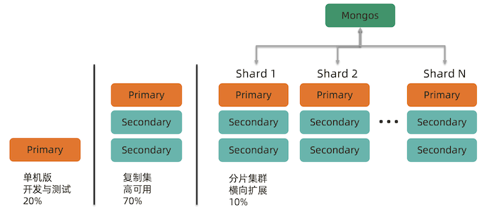

**为什么要使用分片集群?**

* 数据容量日益增大，访问性能日渐降低，怎么破? 
* 新品上线异常火爆，如何支撑更多的并发用户?
* 单库已有 10TB 数据，恢复需要1-2天，如何加速? 
* 地理分布数据

### **分片如何解决?**


**把数据分成两半，放到2个库物理里**


**把数据分成4部分，放到4个物理库里**

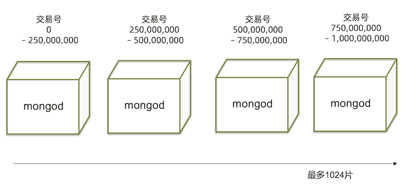

**完整的分片集群**

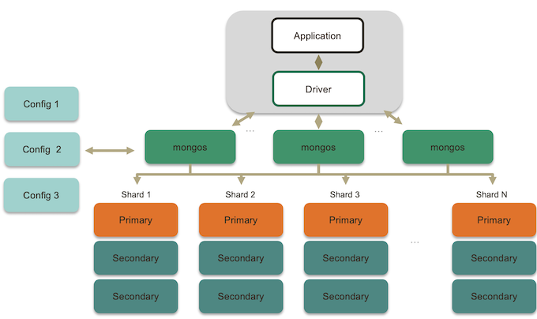

### **分片集群解剖:路由节点 mongos**

路由节点

* 提供集群单一入口
* 转发应用端请求
* 选择合适数据节点进行读写
* 合并多个数据节点的返回

**无状态 建议至少2个**

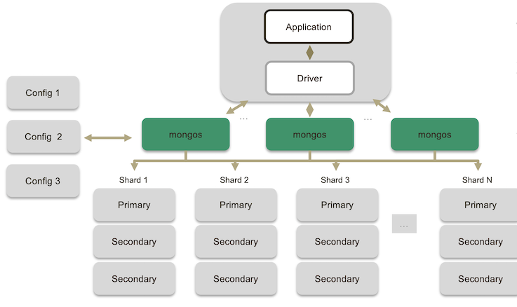

### **分片集群解剖:配置节点 mongod**

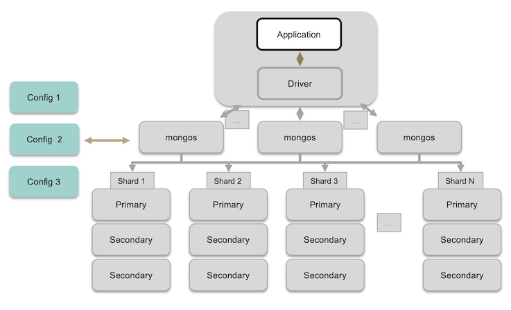

* 配置(目录)节点
* 提供集群元数据存储分片数据分布的映射
* 普通复制集架构

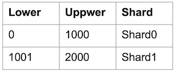

### **分片集群解剖:数据节点 mongod**

**数据节点**

* 以复制集为单位横向扩展 
* **最大1024分片** 
* **分片之间数据不重复** 
* **所有分片在一起才可完整工作**

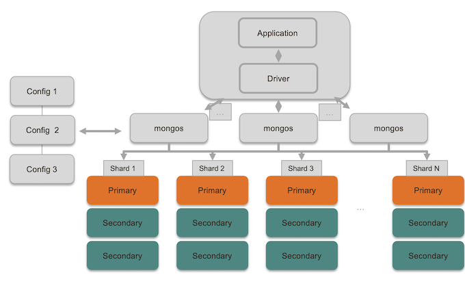

### **MongoDB 分片集群特点**

* 应用全透明，无特殊处理 
* 数据自动均衡
* 动态扩容，无须下线
* 提供三种分片方式

**分片集群数据分布方式**

* 基于范围
* 基于 Hash
* 基于 zone / tag


**分片集群数据分布方式 – 基于范围**

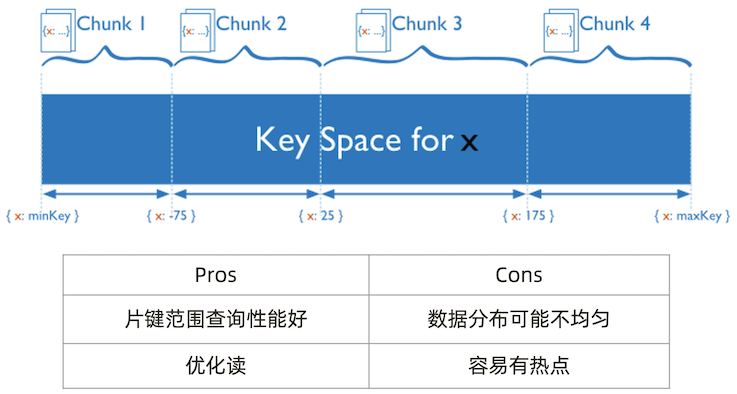

**分片集群数据分布方式 – 基于哈希**

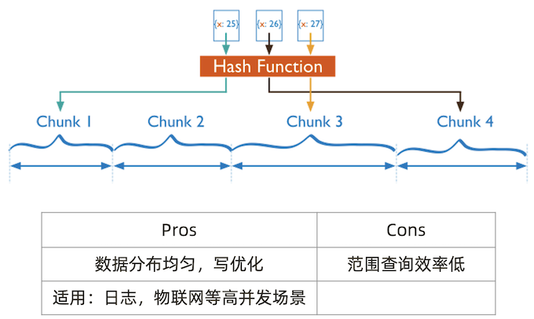

**分片集群数据分布方式 – 自定义Zone**

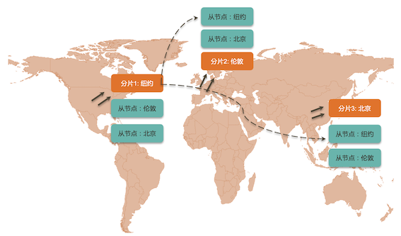

**小结**

* 分片集群可以有效解决性能瓶颈及系统扩容问题
* 分片额外消耗较多，管理复杂，能不分片尽量不要分片 
* 如果实在要用，请仔细学习下一讲

## **2 分片集群设计**

### **如何用好分片集群**

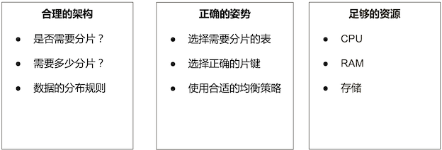

### **合理的架构 – 分片大小**

分片的基本标准:

* 关于数据:数据量不超过3TB，尽可能保持在2TB一个片; 
* 关于索引:常用索引必须容纳进内存;


按照以上标准初步确定分片后，还需要考虑业务压力，随着压力增大，CPU、RAM、 磁盘中的任何一项出现瓶颈时，都可以通过添加更多分片来解决。

### **合理的架构 – 需要多少个分片**


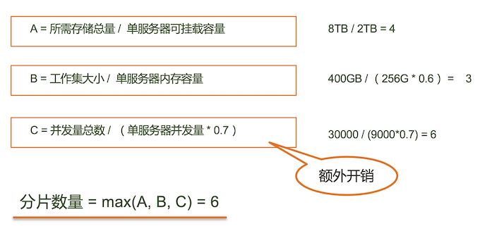

* `A = 所需存储总量 / 单服务器可挂载容量`  （8TB / 2TB = 4）
* `B = 工作集大小 / 单服务器内存容量`   **(400GB / (256G * 0.6) = 3)**
* `C = 并发量总数 / (单服务器并发量 * 0.7)`   **`30000 / (9000*0.7) = 6`**

**`分片数量 = max(A, B, C) = 6`**

### **合理的架构 – 其他需求**

**考虑分片的分布:**

* 是否需要跨机房分布分片? 
* 是否需要容灾?
* 高可用的要求如何?

### **正确的姿势 各种概念由小到大:**

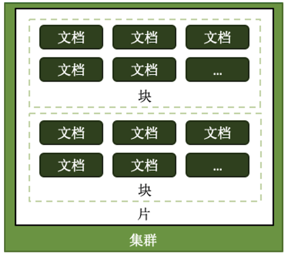

* **片键 shard key:文档中的一个字段**
* **文档 doc :包含 shard key 的一行数据**
* **块 Chunk :包含 n 个文档**
* **分片 Shard:包含 n 个 chunk**
* **集群 Cluster: 包含 n 个分片**

### **选择合适片键**

影响片键效率的主要因素:

* 取值基数(Cardinality);
* 取值分布;
* 分散写，集中读;
* 被尽可能多的业务场景用到; 
* 避免单调递增或递减的片键;

### **正确的姿势 - 选择基数大的片键**

**对于小基数的片键:**

* 因为备选值有限，那么块的总数量就有限; 
* 随着数据增多，块的大小会越来越大;
* 水平扩展时移动块会非常困难;

**例如:存储一个高中的师生数据，以年龄(假设年龄范围为15~65岁)作为片键， 那么:**

* 15<=年龄<=65，且只为整数 
* 最多只会有51个 chunk

**<mark>结论:取值基数要大!</mark>**

### **正确的姿势 – 选择分布均匀的片键**

**对于分布不均匀的片键:**

* 造成某些块的数据量急剧增大
* 这些块压力随之增大
* 数据均衡以 chunk 为单位，所以系统无能为力

**例如:存储一个学校的师生数据，以年龄(假设年龄范围为15~65岁)作为片键，**

* 15<=年龄<=65，且只为整数
* 大部分人的年龄范围为15~18岁(学生)
* 15、16、17、18四个 chunk 的数据量、访问压力远大于其他 chunk

结论:取值分布应尽可能均匀

### **一个 email 系统的片键例子**

```
{
	 _id: ObjectId(),
	user: 123,
	time: Date(),
	subject: "...",
	recipients: [],
	body: "...",
	attachments: []
}
```

**片键: `{ _id: 1}`**

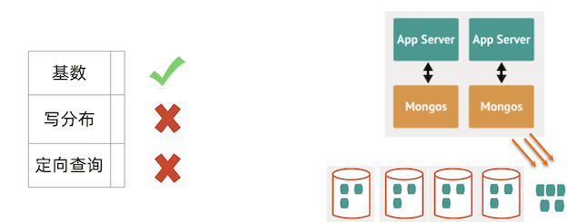

**读写会根据id 集中在某个shard,导致压力过大**

**片键: `{ user_id: 1 }`**

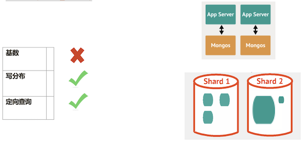

某个chunck 过大

**片键: `{ user_id: 1, time:1 }`**

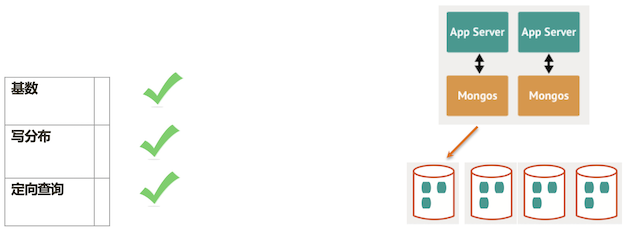

**<mark>复合键是最好的选择</mark>**

### **足够的资源**

* **mongos 与 config 通常消耗很少的资源，可以选择低规格虚拟机;**
* **资源的重点在于 shard 服务器:**
	* 需要足以容纳热数据索引的内存;
	* 正确创建索引后 CPU 通常不会成为瓶颈，除非涉及非常多的计算;
	* 磁盘尽量选用 SSD;
* 最后，实际测试是最好的检验，来看你的资源配置是否完备。
* **即使项目初期已经具备了足够的资源，仍然需要考虑在合适的时候扩展。建议监控 各项资源使用情况，无论哪一项达到60%以上，则开始考虑扩展，因为**:
	*  扩展需要新的资源，申请新资源需要时间;
	*  扩展后数据需要均衡，均衡需要时间。应保证新数据入库速度慢于均衡速度 
	*  均衡需要资源，如果资源即将或已经耗尽，均衡也是会很低效的。

### **小结**

* 合理的架构 – 选择合适的分片大小与数量
* 正确的姿势 – 选择合适的片键
* 足够的资源 – 给足够的存储和内存资源个分片服务器

## **3 实验:分片集群搭建及扩容**

### **实验目标及流程**

* 目标:学习如何搭建一个2分片的分片集群
* 环境:3台 Linux 虚拟机， 4 Core 8 GB
* 步骤

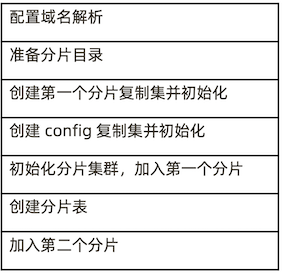

**实验架构**

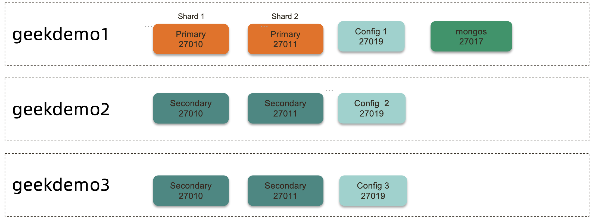

* 6 MongoD (SHARD)
* 3 Config Server
* 1~3 MongoS (Routing node)

**实验架构**

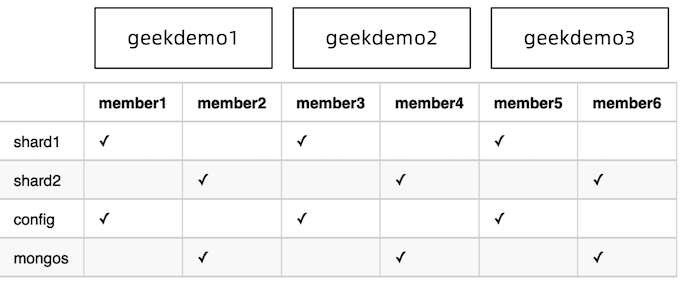

* geekdemo1
	* member1.example.com 
	* member2.example.com
	
* geekdemo2 
	* member3.example.com 
	* member4.example.com

* geekdemo3 
	* member5.example.com 
	* member6.example.com

### **1. 配置域名解析**

**在3台虚拟机上分别执行以下3条命令**，注意替换实际 IP 地址

```
echo "192.168.1.1 geekdemo1 member1.example.com member2.example.com" >> /etc/hosts 

echo "192.168.1.2 geekdemo2 member3.example.com member4.example.com" >> /etc/hosts 

echo "192.168.1.3 geekdemo3 member5.example.com member6.example.com" >> /etc/hosts
```

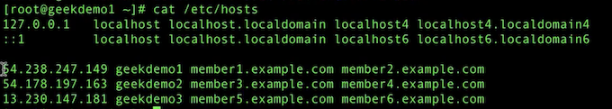

### **2. 准备分片目录**

在各服务器上创建数据目录，我们使用 `/data`，请按自己需要修改为其他目录:

*  在member1 / member3 / member5 上执行以下命令:

```
mkdir -p /data/shard1/ 
mkdir -p /data/config/
```

在member2 / member4 / member6 上执行以下命令:

```
mkdir -p /data/shard2/ 
mkdir -p /data/mongos/
```

**Node1**

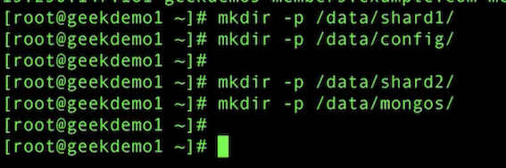

**Node2**

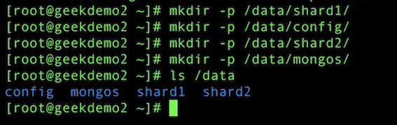

**Node3**

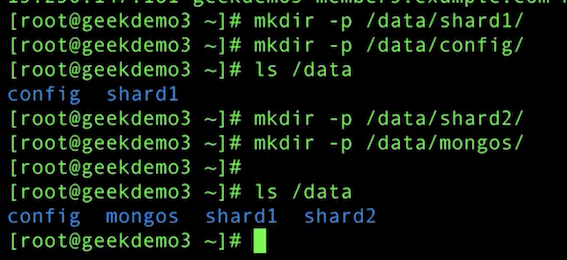

### **3. 创建第一个分片用的复制集**

在 member1 / member3 / member5 上执行以下命令。

```
mongod --bind_ip 0.0.0.0 --replSet shard1 --dbpath /data/shard1 --logpath /data/shard1/mongod.log --port 27010 --fork --shardsvr --wiredTigerCacheSizeGB 1
```

* `--shardsvr`  is required to configure an instance as a shard
* `--wiredTigerCacheSizeGB`： **Defines the maximum size of the internal cache** that WiredTiger will use for all data. The memory consumed by an index build is separate from the WiredTiger cache memory. Values can range from 0.25 GB to 10000 GB.

**Node1, Node2, node3 all run the same mongod command**

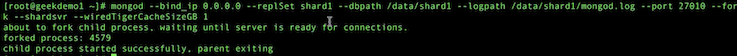

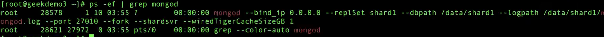

### **4. 初始化第一个分片复制集**

**Node1**

`mongo --host member1.example.com:27010`


```
rs.initiate({
	_id: "shard1",
	"members" : [
	{ 
		"_id": 0,
		 "host" : "member1.example.com:27010"
	},
	{
		 "_id": 1,
		 "host" : "member3.example.com:27010"
	}, 
	{ 
		"_id": 2,
		"host" : "member5.example.com:27010"
	}
   ]	
});
```

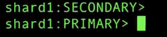

### **5. 创建 config server 复制集**

在 member1 / member3 / member5 上执行以下命令。

**Node1 / Node2 / Node3**

```
mongod --bind_ip 0.0.0.0 --replSet config --dbpath /data/config --logpath /data/config/mongod.log --port 27019 --fork --configsvr --wiredTigerCacheSizeGB 1
```

* config
* `--configsvr`  is required to configure an instance as a config server 

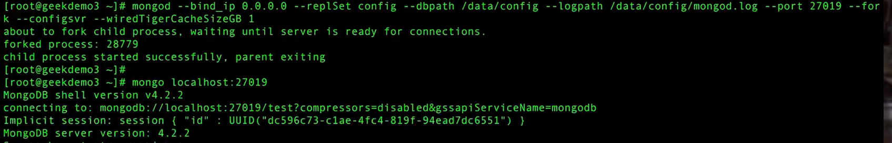

**可以用`rs.status()`**查看谁抢到了primary 在 config servers中

### **7. 在第三台机器上搭建 mongos**

一般至少起两台做高可用

**Node1**

```
# mongos --bind_ip 0.0.0.0 --logpath /data/mongos/mongos.log --port 27017 --fork
--configdb config/member1.example.com:27019,member3.example.com:27019,member5.example.com:27019
```

**Node2**

```
# mongos --bind_ip 0.0.0.0 --logpath /data/mongos/mongos.log --port 27017 --fork
--configdb config/member1.example.com:27019,member3.example.com:27019,member5.example.com:27019
```

**Node3**

```
# mongos --bind_ip 0.0.0.0 --logpath /data/mongos/mongos.log --port 27017 --fork
--configdb config/member1.example.com:27019,member3.example.com:27019,member5.example.com:27019
```

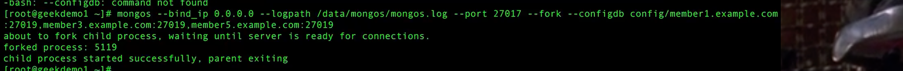

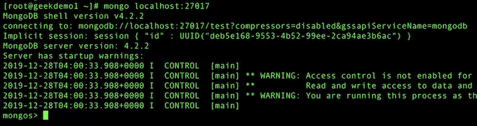

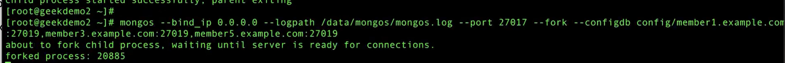

```
# 连接到mongos, 添加分片
# mongo --host member1.example.com:27017
```
```
mongos > sh.addShard("shard1/member1.example.com:27010,member3.example.com:27010,member5 .example.com:27010");
```

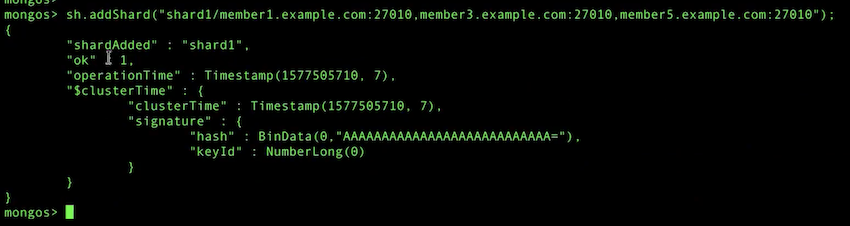

`sh.status()`

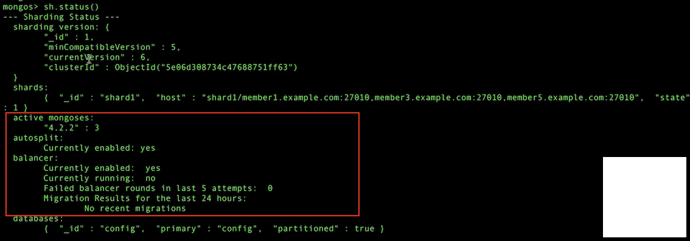

### **8. 创建分片表**

```
# 连接到mongos, 创建分片集合
# mongo --host member1.example.com:27017
mongos > sh.status()
mongos > sh.enableSharding("foo");
mongos > sh.shardCollection("foo.bar", {_id: 'hashed'}); 


mongos > sh.status();
```

```
# 插入测试数据
use foo
for (var i = 0; i < 10000; i++) {
	db.bar.insert({i: i}); 
}
```

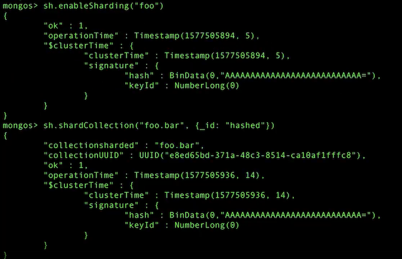

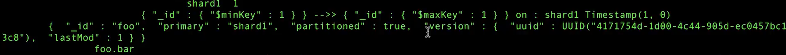

### **9. 创建第2个分片的复制集**

在 member2 / member4 / member6 上执行以下命令。

**Node1, Node2, Node3**

```
mongod --bind_ip 0.0.0.0 --replSet shard2 --dbpath /data/shard2 --logpath /data/shard2/mongod.log --port 27011 --fork --shardsvr --wiredTigerCacheSizeGB 1
```

### **10. 初始化第二个分片的复制集**

**`Node3`**

```
# mongo --host member2.example.com:27011

rs.initiate({
	_id: "shard2",
	"members" : [
	{ 
		"_id": 0,
		 "host" : "member1.example.com:27011"
	},
	{
		 "_id": 1,
		 "host" : "member3.example.com:27011"
	}, 
	{ 
		"_id": 2,
		"host" : "member5.example.com:27011"
	}
   ]	
});
```

### **11. 加入第2个分片**


```
# 连接到mongos, 添加分片
# mongo --host member1.example.com:27017


mongos > sh.addShard("shard2/member2.example.com:27011,member4.example.com:27011, member6.example.com:27011");

mongos > sh.status()
```

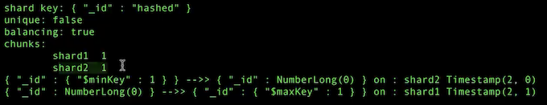