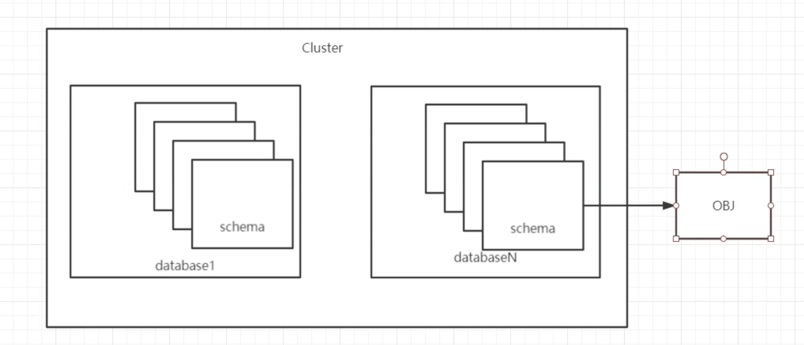

# **1 PostgreSQL介绍&安装&链接管理&用户权限管理**

PostgreSQL，简称PG或PGSQL. c和c+＋开发。开源的关系型数据库系统。 支持多种操作系统平台。 

* 官网：www.postgres.org 
* 中文社区 http://www.postgres.cn 


## **2、源码包安装配置**

### **2.1 系统网络、防火墙配置** 

### **2.2 创建数据库用户和组** 

```
sudo -i
useradd postgres 
passwd postgres 
```

**12345**

```
# passwd postgres
Changing password for user postgres.
New password:
BAD PASSWORD: The password is shorter than 8 characters
Retype new password:
passwd: all authentication tokens updated successfully.
```


### **2.3 安装依赖包** 

```
yum groupinstall -y "Development Tools" "Legacy UNIX Compatibility"
yum install -y bison flex readline* zlib-devel gcc* gmake
```


### **2.4 创建目录并授权** 

```
mkdir -p /usr/local/pg12
mkdir -p /pgdata/12/data
chown -R postgres. /pgdata
chown -R postgres. /usr/local/pg12
chmod 700 /pgdata/12/data -R
```

### **2.5 系统参数优化**

```
# vi /etc/sysctl.conf 

kernel.shmmax = 68719476736 
kernel.shmall = 4294967296 
kernel.shmmni = 4096 
kernel.sem = 50100 64128000 50100 1280 
fs.file-max = 7672460 
net.ipv4.ip_local_port_range = 9000 65000 
net.core.rmem_default = 1048576 
net.core.rmem_max = 4194304 
net.core.wmem_default = 262144 
net.core.wmem_max = 10485761 

# sysctl -p 


# vi /etc/security/limits.conf 
* soft nofile 131072 
* hard nofile 131072 
* soft nproc 131072 
* hard nproc 131072 
* soft core unlimited 
* hard core unlimited 
* soft memlock 50000000 
* hard memlock 50000000 

建议关闭numa 设置。策略为deadline(机械)或者noop(SSD) 
```

```
# sysctl -p
kernel.shmmax = 68719476736
kernel.shmall = 4294967296
kernel.shmmni = 4096
kernel.sem = 50100 64128000 50100 1280
fs.file-max = 7672460
net.ipv4.ip_local_port_range = 9000 65000
net.core.rmem_default = 1048576
net.core.rmem_max = 4194304
net.core.wmem_default = 262144
net.core.wmem_max = 10485761
```

### **2.6 源码安装pg**

**2.6.1 下载软件至/opt，并解压** 

[https://www.postgresql.org/ftp/source/v12.6/](https://www.postgresql.org/ftp/source/v12.6/)

```
cd /opt/
[root@jabox opt]#

wget --no-check-certificate https://ftp.postgresql.org/pub/source/v12.6/postgresql-12.6.tar.gz
 
# ls
postgresql-12.6.tar.gz

[opt]# tar xf postgresql-12.6.tar.gz
[opt]# cd postgresql-12.6/
[postgresql-12.6]# ./configure --prefix=/usr/local/pg12 --with-pgport=1921

[postgresql-12.6]# gmake world
[postgresql-12.6]# gmake install-world
```

### **2.7 设置环境变量**

```
[postgresql-12.6]# su - postgres
# vim .bash_profile

export PGDATA=/pgdata/12/data 
export LANG=en_US.utf8 
export PGHOME=/usr/local/pg12 
export LD_LIBRARY_PATH=$PGHOME/lib:/lib64:/usr/lib64:/usr/local/lib64:/lib:/usr/lib:/usr/local/lib:$LD_LIBRARY_PATH 
export DATE=`date +"%Y%m%d%H%M"` 
export PATH=$PGHOME/bin:$PATH:. 
export MANPATH=$PGHOME/share/man:$MANPATH 
export PGUSER=postgres 

source /etc/profile 
```

```
[~]$ psql --version
psql (PostgreSQL) 12.6
```

### **2.8 初始化数据**

```
# su - postgres
# 简易初始化
initdb -D /pgdata/12/data -W
# 生产建议
initdb -A md5 -D $PGDATA -E utf8 --local=C -W
```

```
$ initdb -D /pgdata/12/data -W
The files belonging to this database system will be owned by user "postgres".
This user must also own the server process.

The database cluster will be initialized with locale "en_US.utf8".
The default database encoding has accordingly been set to "UTF8".
The default text search configuration will be set to "english".

Data page checksums are disabled.

Enter new superuser password:  12345
Enter it again: 12345

fixing permissions on existing directory /pgdata/12/data ... ok
creating subdirectories ... ok
selecting dynamic shared memory implementation ... posix
selecting default max_connections ... 100
selecting default shared_buffers ... 128MB
selecting default time zone ... UTC
creating configuration files ... ok
running bootstrap script ... ok
performing post-bootstrap initialization ... ok
syncing data to disk ... ok

initdb: warning: enabling "trust" authentication for local connections
You can change this by editing pg_hba.conf or using the option -A, or
--auth-local and --auth-host, the next time you run initdb.

Success. You can now start the database server using
```

**` pg_ctl -D /pgdata/12/data -l logfile start`**

```
# pg_ctl start

waiting for server to start....2022-04-24 03:59:25.840 UTC [25554] LOG:  starting PostgreSQL 12.6 on x86_64-pc-linux-gnu, compiled by gcc (GCC) 4.8.5 20150623 (Red Hat 4.8.5-44), 64-bit
2022-04-24 03:59:25.843 UTC [25554] LOG:  listening on IPv6 address "::1", port 1921
2022-04-24 03:59:25.843 UTC [25554] LOG:  listening on IPv4 address "127.0.0.1", port 1921
2022-04-24 03:59:25.845 UTC [25554] LOG:  listening on Unix socket "/tmp/.s.PGSQL.1921"
2022-04-24 03:59:25.858 UTC [25555] LOG:  database system was shut down at 2022-04-24 03:58:27 UTC
2022-04-24 03:59:25.859 UTC [25554] LOG:  database system is ready to accept connections
 done
server started
```

### **2.9 PG初体验**

```
$ psql
psql (12.6)
Type "help" for help.

postgres=#

postgres=# create database pg1;
CREATE DATABASE
postgres=# \c pg1
You are now connected to database "pg1" as user "postgres".
pg1=# create table t1 (id int);
CREATE TABLE
pg1=# insert into t1 values(1);
INSERT 0 1
pg1=# select * from t1;
 id
----
  1
(1 row)

pg1=# \l
                                 List of databases
   Name    |  Owner   | Encoding |  Collate   |   Ctype    |   Access privileges
-----------+----------+----------+------------+------------+-----------------------
 pg1       | postgres | UTF8     | en_US.utf8 | en_US.utf8 |
 postgres  | postgres | UTF8     | en_US.utf8 | en_US.utf8 |
 template0 | postgres | UTF8     | en_US.utf8 | en_US.utf8 | =c/postgres          +
           |          |          |            |            | postgres=CTc/postgres
 template1 | postgres | UTF8     | en_US.utf8 | en_US.utf8 | =c/postgres          +
           |          |          |            |            | postgres=CTc/postgres
(4 rows)

pg1=# \d
        List of relations
 Schema | Name | Type  |  Owner
--------+------+-------+----------
 public | t1   | table | postgres
(1 row)

pg1=# \dt
        List of relations
 Schema | Name | Type  |  Owner
--------+------+-------+----------
 public | t1   | table | postgres
(1 row)
```

## **3、启动关闭**

### **3.1 手工方式** 

```
$ pg_ctl --help
...
Shutdown modes are:
  smart       quit after all clients have disconnected
  fast        quit directly, with proper shutdown (default)
  immediate   quit without complete shutdown; will lead to recovery on restart

Allowed signal names for kill:
  ABRT HUP INT KILL QUIT TERM USR1 USR2
```

```
pg_ctl -D /pgdata/12/data／ -l logfile start pg_ctl -D /pgdata/12/data/ stop -ms 
pg_ctl -D /pgdata/12/data/ stop -mf 
pg_ctl -D /pgdata/12/data/ stop -mi 

pg_ctl restart -mf 
```


### **3.2 脚本方式** 

```
sudo -i
``` 

```
/opt/postgresql-12.6/contrib/start-scripts/linux
```

```
$ pg_ctl restart -mf
waiting for server to shut down....2022-04-24 06:38:03.063 UTC [25554] LOG:  received fast shutdown request
2022-04-24 06:38:03.064 UTC [25554] LOG:  aborting any active transactions
2022-04-24 06:38:03.065 UTC [25554] LOG:  background worker "logical replication launcher" (PID 25561) exited with exit code 1
2022-04-24 06:38:03.066 UTC [25556] LOG:  shutting down
2022-04-24 06:38:03.072 UTC [25554] LOG:  database system is shut down
 done
server stopped
waiting for server to start....2022-04-24 06:38:03.174 UTC [26062] LOG:  starting PostgreSQL 12.6 on x86_64-pc-linux-gnu, compiled by gcc (GCC) 4.8.5 20150623 (Red Hat 4.8.5-44), 64-bit
2022-04-24 06:38:03.175 UTC [26062] LOG:  listening on IPv6 address "::1", port 1921
2022-04-24 06:38:03.175 UTC [26062] LOG:  listening on IPv4 address "127.0.0.1", port 1921
2022-04-24 06:38:03.176 UTC [26062] LOG:  listening on Unix socket "/tmp/.s.PGSQL.1921"
2022-04-24 06:38:03.191 UTC [26063] LOG:  database system was shut down at 2022-04-24 06:38:03 UTC
2022-04-24 06:38:03.193 UTC [26062] LOG:  database system is ready to accept connections
 done
server started
```


## **4、基础管理** 

### **4.1 连接管理**

**4.1.0 连接命令** 

**Socket 链接**

```
[~]$ psql
psql (12.6)
Type "help" for help.

postgres=# exit
```

```
2022-04-24 03:59:25.843 UTC [25554] LOG:  listening on IPv6 address "::1", port 1921
```

**TCP 远程链接**

```
$ ip addr
....
 inet 192.168.1.43/24 brd 192.168.1.255 scope global noprefixroute dynamic eth1
```


**`192.168.1.43/24`** : `192.168.1.0/24`


```
psql -d postgres -h 192.168.1.43 -p 1921 -U postgres
```

```
$ psql -d postgres -h 192.168.1.43 -p 1921 -U postgres
psql: error: could not connect to server: Connection refused
	Is the server running on host "103.109.147.26" and accepting
	TCP/IP connections on port 1921?
```


**4.1.1 pg防火墙介绍** 

**`pg_hba.conf` 文件为PG实例的防火墙配置文件。 配置文件分为5部分：** 

配置示例： 

```
# TYPE DATABASE USER ADDRESS  METHOD
host    all    all  192.168.1.0/24       md5

# TYPE DATABASE USER ADDRESS  METHOD
host    test    pstest  0.0.0.0/0      md5
```

```
$ cd $PGDATA
[postgres]$ pwd
/pgdata/12/data
# vim pg_hba.conf

# TYPE  DATABASE        USER            ADDRESS                 METHOD

# "local" is for Unix domain socket connections only
local   all             all                                     trust
# IPv4 local connections:
host    all             all             127.0.0.1/32            trust
host    all             all             192.168.1.0/24         md5
```

**注意，刚装完PG，默认监听local,如果要远程链接，需要监听对外提供服务的地址**

```
vim postgresql.conf

# - Connection Settings -

listen_addresses = '0.0.0.0'            # what IP address(es) to listen on;
                                        # comma-separated list of addresses;
                                        # defaults to 'localhost'; use '*' for all
                                        # (change requires restart)
```

重启数据库

```
pg_ctl restart -mf
```

```
$ psql -d postgres -h 192.168.1.43 -p 1921 -U postgres
Password for user postgres:
psql (12.6)
Type "help" for help.

postgres=#
```

### **4.2 用户**

**4.2.1 用户作用**

> 用来登录数据库实例， 管理数据库对象

**4.2.1 用户定义的方法**

```
create user
create role
drop user
```

```
postgres=# \help create user;
Command:     CREATE USER
Description: define a new database role
Syntax:
CREATE USER name [ [ WITH ] option [ ... ] ]

where option can be:

      SUPERUSER | NOSUPERUSER
    | CREATEDB | NOCREATEDB
    | CREATEROLE | NOCREATEROLE
    | INHERIT | NOINHERIT
    | LOGIN | NOLOGIN
    | REPLICATION | NOREPLICATION
    | BYPASSRLS | NOBYPASSRLS
    | CONNECTION LIMIT connlimit
    | [ ENCRYPTED ] PASSWORD 'password' | PASSWORD NULL
    | VALID UNTIL 'timestamp'
    | IN ROLE role_name [, ...]
    | IN GROUP role_name [, ...]
    | ROLE role_name [, ...]
    | ADMIN role_name [, ...]
    | USER role_name [, ...]
    | SYSID uid

URL: https://www.postgresql.org/docs/12/sql-createuser.html
```

**例子**

```
CREATE USER admin with SUPERUSER password 'admin';
CREATE ROLE
```

```
$ psql -d postgres -h 192.168.1.43 -p 1921 -U admin
Password for user admin:
psql (12.6)
Type "help" for help.

postgres=#
```

**Create role must with login option**

```
CREATE USER test1 WITH PASSWORD 'test1';
CREATE ROLE test2 WITH  LOGIN PASSWORD 'test2' VALID UNTIL '2022-12-31';
CREATE ROLE admin WITH SUPERUSER LOGIN 'admin';
CREATE USER repl  REPLICATION LOGIN ENCRYPTED PASSWORD 'repl';

drop user username;
alter user username with password '1234';
```

```
$ psql -d postgres -h 192.168.1.43 -p 1921 -U test1
Password for user test1:
psql (12.6)
Type "help" for help.
```

```
$ psql -d postgres -h 192.168.1.43 -p 1921 -U test2
Password for user test2:
psql (12.6)
Type "help" for help.
```

```
[postgres@jabox data]$ psql -d postgres -h 192.168.1.43 -p 1921 -U admin
Password for user admin:
psql (12.6)
Type "help" for help.

postgres=# drop user test2;
DROP ROLE
```

```
postgres=# alter user test1 with password 'test';
ALTER ROLE
```

```
postgres=# CREATE ROLE test2 WITH  PASSWORD 'test2' VALID UNTIL '2022-12-31';
CREATE ROLE
```

```
postgres=# \du
                                   List of roles
 Role name |                         Attributes                         | Member of
-----------+------------------------------------------------------------+-----------
 admin     | Superuser                                                  | {}
 postgres  | Superuser, Create role, Create DB, Replication, Bypass RLS | {}
 repl      | Replication                                                | {}
 test1     |                                                            | {}
 test2     | Cannot login                                              +| {}
           | Password valid until 2022-12-31 00:00:00+00                |
```


### **4.3 权限管理**

**4.3.1 权限级别** 

* cluster权限：实例权限通过`pg_hba.com`配置。 
* database权限：数据库权限通过`grant`和`revoke`操作`schema`配置。 
* TBS权限：表空间权限通过grant和revoke操作表、物化视图、索引、临时表配置。 
* schema权限：模式权限通过grant和revoke操作模式下的对象配置。 
* object权限：对象权限通过grant和revoke配置。 




**4.3.2 权限定义**

* **database权限设置**

```
grant create on database test to test1
```

* **schema权限** 

```
ALTER SCHEMA abc OWNER to abc; 

GRANT select, insert, update, delete ON ALL TABLES IN SCHEMA abc to abc; 
```

* **object权限**

```
grant select, insert, update, delete on a.b to u; 
```

```
postgres=# create database jam;
CREATE DATABASE

postgres=# \c jam
You are now connected to database "jam" as user "admin".

jam=# create schema dwp;
CREATE SCHEMA

jam=# create user jam with password 'jam';
CREATE ROLE

jam=# ALTER SCHEMA dwp OWNER to jam;
ALTER SCHEMA

jam=# GRANT select,insert,update,delete ON ALL TABLES IN SCHEMA dwp to jam;
GRANT
```
