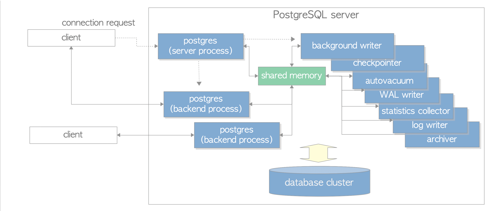
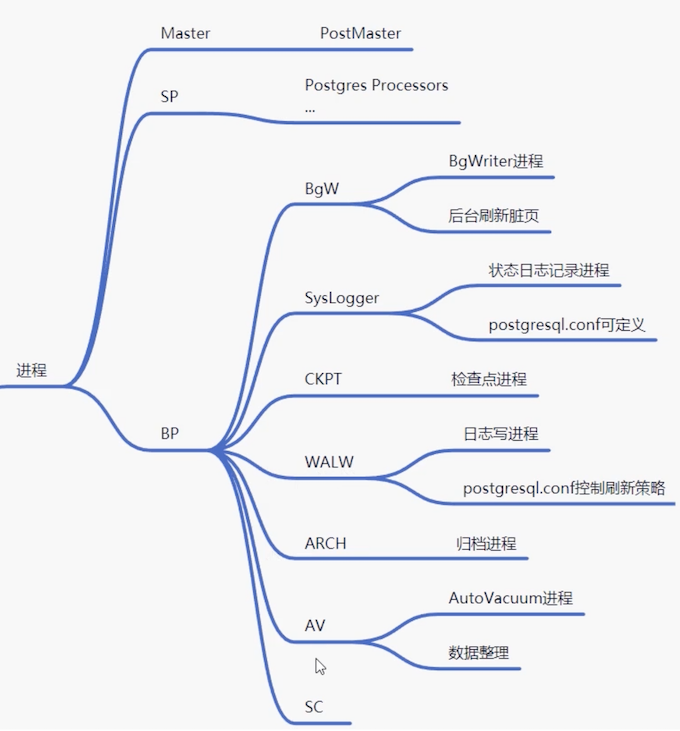
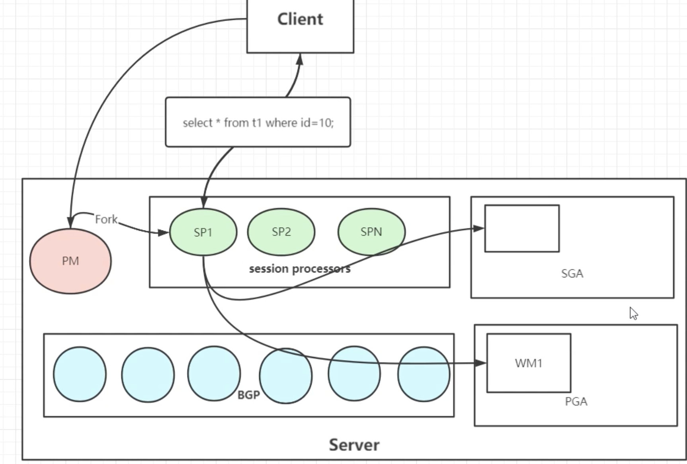
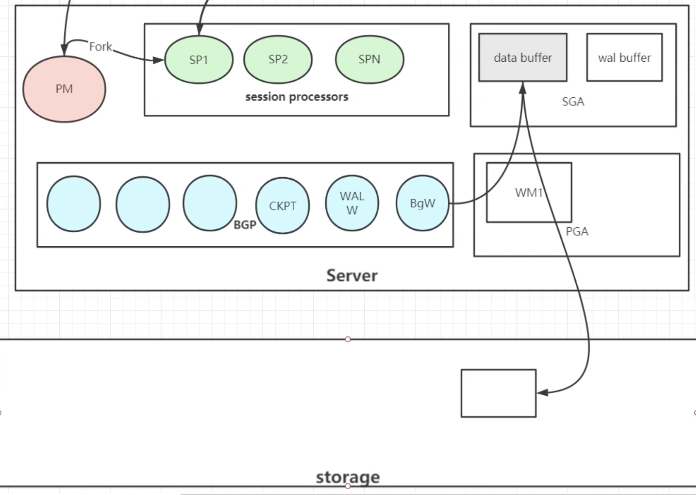
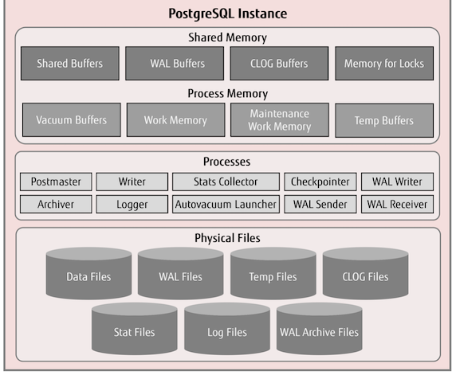
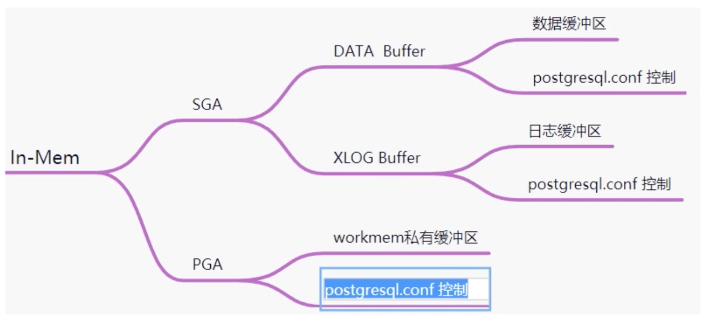
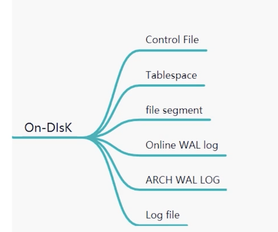
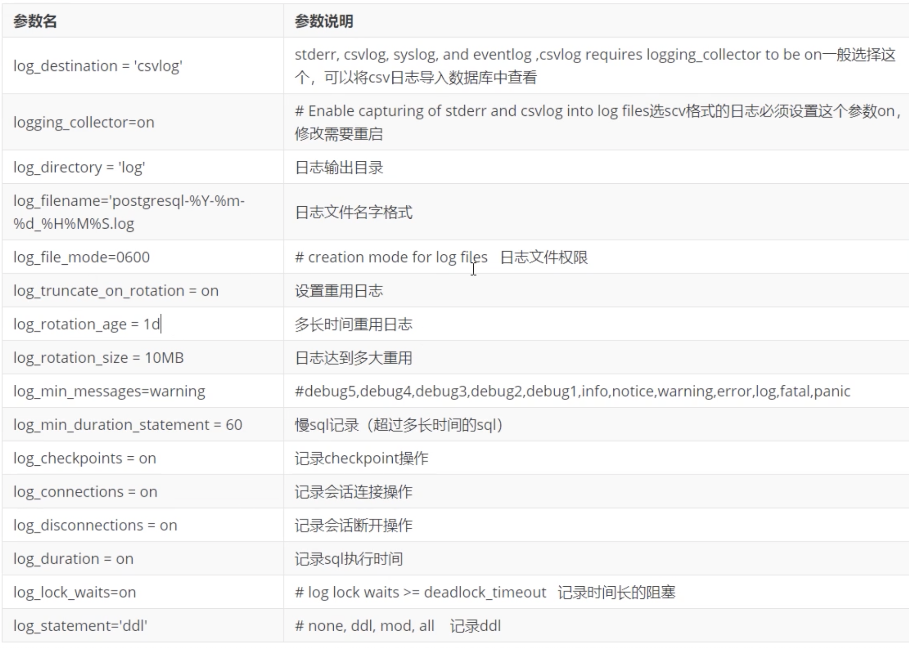

# **4 体系结构介绍** 


## **1 整体结构及进程结构**


### **C/S结构**

```
PG是一个典型的C/S模型。 
```


### **体系结构概览**

**体系结构＝实例＋存储结构** 

**实例＝进程＋内存结构** 


[Process and Memory Architecture](https://www.interdb.jp/pg/pgsql02.html#:~:text=A%20postgres%20server%20process%20is,CHECKPOINT%20processes)


**结构实例** 


* Master process 
* A **postgres server process** is a parent of all processes related to a database cluster management.
* Each **backend process** handles all queries and statements issued by a connected client.
* Various **background processes** perform processes of each feature (e.g., VACUUM and CHECKPOINT processes) for database management.



### **进程结构**



```
$ ps -ef | grep postgres
postgres  3094 26286  0 04:40 pts/0    00:00:00 ps -ef
postgres  3095 26286  0 04:40 pts/0    00:00:00 grep --color=auto postgres
root     26027 25478  0 Apr24 pts/0    00:00:00 su - postgres
postgres 26031 26027  0 Apr24 pts/0    00:00:00 -bash
root     26282 26031  0 Apr24 pts/0    00:00:00 su - postgres
postgres 26286 26282  0 Apr24 pts/0    00:00:00 -bash
postgres 26404     1  0 Apr24 ?        00:00:01 /usr/local/pg12/bin/postgres
postgres 26406 26404  0 Apr24 ?        00:00:00 postgres: checkpointer
postgres 26407 26404  0 Apr24 ?        00:00:02 postgres: background writer
postgres 26408 26404  0 Apr24 ?        00:00:02 postgres: walwriter
postgres 26409 26404  0 Apr24 ?        00:00:02 postgres: autovacuum launcher
postgres 26410 26404  0 Apr24 ?        00:00:03 postgres: stats collector
postgres 26411 26404  0 Apr24 ?        00:00:00 postgres: logical replication launcher
```



* **PM 进程** 

**PostMaster进程，提供监听、连接协议、验证功能，fork其他进程。监听哪个IP是受到postgressql.conf影响的。默认提供socket和TCP/IP方式连接**。 

验证功能，通过`pg_hba.conf`和用户验证模块来提供。 

* **SP进程** 

`Session Processors`，会话进程。用户一旦验证成功就会fork一个新的进程。

* BGW进程 

`background writer` 进程。**主要负责后台刷新脏页**。 

* Sysloger进程 

主要负责数据库状态的信息日志记录。 

* CKPT 

检查点进程

* WALW 

walwriter进程．WAL (Redo)日志刷写进程。 

* ARCH 

WAL日志的归档日志。 




* WM: worker Memory

### **内存结构**

[Architecture and Tuning of Memory in PostgreSQL Databases](https://severalnines.com/database-blog/architecture-and-tuning-memory-postgresql-databases)






Memory in PostgreSQL can be classified into two categories:


* **Local Memory area**: It is allocated by each backend process for its own use.
* **Shared memory area**: It is used by all processes of a PostgreSQL server.

* **Shared buffer pool**
	* **XLOG: WAL(Write HEAD Log) buffer - PostgreSQL loads pages within tables and indexes from persistent storage to a shared buffer pool, and then operates on them directly.**

`cat /pgdata/12/data/postgresql.conf`

```
# - Memory -

shared_buffers = 128MB                  # min 128kB
                                        # (change requires restart)
```
```
# Caution: it is not advisable to set max_prepared_transactions nonzero unless
# you actively intend to use prepared transactions.
#work_mem = 4MB                         # min 64kB
#maintenance_work_mem = 64MB            # min 1MB
```

### **存储结构**



## **2 重点文件介绍**


### **2.1 日志文件种类** 

* **`$PGDATA/log` 运行日志(pg10之前为`$PGDATA/pg_log`)**
* **`$PGDATA/pg_wal` 重做日志（pg10之前为`$PGDATA/pg_xlog`)**
* **`$PGDATA/pg_xact` 事务提交日志（pg10之前为`$PGDATA/pg_clog`)**
* 服务器日志，可以在启动的时指定，比如`pg_ctl start -l ./alert.log` 

### **2.2 运行日志参数** 



### **2.3 CSV日志入库存储** 

```
CREATE TABLE pg_log ( 
	log_time timestamp(3) with time zone, 
	user_name text, 
	database_name text, 
	process_id integer, 
	connection_from text, 
	session_id text, 
	session_line_num bigint, 
	command_tag text, 
	session_start_time timestamp with time zone, 
	virtual_transaction_id text, 
	transaction_id bigint, 
	error_severity text, 
	sql_state_code text, 
	message text, 
	detail text, 
	hint text, 
	internal_query text, 
	internal_query_pos integer, 
	context text, 
	query text, 
	query_pos integer, 
	location text, 
	application_name text, 
	PRIMARY KEY (session_id, session_line_num) 
); 

# copy pg_log from '$PGLOG/postgresql-16.csv' with csv; 
COPY 3 
```

```
# - Where to Log -

log_destination = 'csvlog'              # Valid values are combinations of
                                        # stderr, csvlog, syslog, and eventlog,
                                        # depending on platform.  csvlog
                                        # requires logging_collector to be on.

# This is used when logging to stderr:
logging_collector = on          # Enable capturing of stderr and csvlog
                                        # into log files. Required to be on for
                                        # csvlogs.
                                        # (change requires restart)

# These are only used if logging_collector is on:
log_directory = 'log'                   # directory where log files are written,
                                        # can be absolute or relative to PGDATA
log_filename = 'postgresql-%Y-%m-%d_%H%M%S.log' # log file name pattern,
                                        # can include strftime() escapes
log_file_mode = 0600                    # creation mode for log files,
                                        # begin with 0 to use octal notation
log_truncate_on_rotation = on           # If on, an existing log file with the
                                        # same name as the new log file will be
                                        # truncated rather than appended to.
                                        # But such truncation only occurs on
                                        # time-driven rotation, not on restarts
                                        # or size-driven rotation.  Default is
                                        # off, meaning append to existing files
                                        # in all cases.
log_rotation_age = 1d                   # Automatic rotation of logfiles will
                                        # happen after that time.  0 disables.
log_rotation_size = 100MB               # Automatic rotation of logfiles will
                                        # happen after that much log output.
```


```
[postgres@jabox data]$ pg_ctl restart -mf
waiting for server to shut down....2022-04-25 14:46:01.274 UTC [26404] LOG:  received fast shutdown request
2022-04-25 14:46:01.275 UTC [26404] LOG:  aborting any active transactions
2022-04-25 14:46:01.284 UTC [26404] LOG:  background worker "logical replication launcher" (PID 26411) exited with exit code 1
2022-04-25 14:46:01.284 UTC [26406] LOG:  shutting down
2022-04-25 14:46:01.293 UTC [26404] LOG:  database system is shut down
 done
server stopped
waiting for server to start....2022-04-25 14:46:01.388 UTC [5186] LOG:  starting PostgreSQL 12.6 on x86_64-pc-linux-gnu, compiled by gcc (GCC) 4.8.5 20150623 (Red Hat 4.8.5-44), 64-bit
2022-04-25 14:46:01.389 UTC [5186] LOG:  listening on IPv4 address "0.0.0.0", port 1921
2022-04-25 14:46:01.391 UTC [5186] LOG:  listening on Unix socket "/tmp/.s.PGSQL.1921"
2022-04-25 14:46:01.408 UTC [5186] LOG:  redirecting log output to logging collector process
2022-04-25 14:46:01.408 UTC [5186] HINT:  Future log output will appear in directory "log".
 done                                       # 0 disables.
```
 
```
$ pwd
/pgdata/12/data/log

-rw-------. 1 postgres postgres 499 Apr 25 14:46 postgresql-2022-04-25_144601.csv
-rw-------. 1 postgres postgres 166 Apr 25 14:46 postgresql-2022-04-25_144601.log
-rw-------. 1 postgres postgres   0 Apr 26 00:00 postgresql-2022-04-26_000000.csv
-rw-------. 1 postgres postgres   0 Apr 26 00:00 postgresql-2022-04-26_000000.log
```
         
### **2.4 postgresql.conf**          


### **2.5 `pg_hba.conf`**
 
### **2.6 `pg_ident.conf`**

> `pg_ident.conf` 是用户映射配置文件。结合`pg_ident.conf`中，`method`为`ident`可以用特定的操作系统用户和指定的数据库用户登录数据库。如下：`pg_ident.conf`如下： 

```
# MAPNAME  SYSTEM-USERNAME  PG-USERNAME
mapll      test               sa
```

> `pg_hba.conf`

```
# TYPE DATABASE USER CIDR-ADDRESS METHOD  
local  all       all  ident       map=mapll
```

### **2.7 控制文件**

**`pg_controldata`可以查看控制文件的内容** 

```
$ pg_controldata $PGDATA
pg_control version number:            1201
Catalog version number:               201909212
Database system identifier:           7090014790075388876   #dbid
Database cluster state:               in production    # primary
pg_control last modified:             Mon 25 Apr 2022 02:51:01 PM UTC
Latest checkpoint location:           0/16547F0
Latest checkpoint's REDO location:    0/16547B8          # redo 位置
Latest checkpoint's REDO WAL file:    000000010000000000000001
Latest checkpoint's TimeLineID:       1
Latest checkpoint's PrevTimeLineID:   1
Latest checkpoint's full_page_writes: on
Latest checkpoint's NextXID:          0:501              #下一个事务ID
Latest checkpoint's NextOID:          16396             #下一个OID
Latest checkpoint's NextMultiXactId:  1
Latest checkpoint's NextMultiOffset:  0
Latest checkpoint's oldestXID:        480
Latest checkpoint's oldestXID's DB:   1
Latest checkpoint's oldestActiveXID:  501
Latest checkpoint's oldestMultiXid:   1
Latest checkpoint's oldestMulti's DB: 1
Latest checkpoint's oldestCommitTsXid:0
Latest checkpoint's newestCommitTsXid:0
Time of latest checkpoint:            Mon 25 Apr 2022 02:51:01 PM UTC
Fake LSN counter for unlogged rels:   0/3E8
Minimum recovery ending location:     0/0
Min recovery ending loc's timeline:   0
Backup start location:                0/0
Backup end location:                  0/0
End-of-backup record required:        no
wal_level setting:                    replica         # wal级别
wal_log_hints setting:                off
max_connections setting:              100             #最大连接数
max_worker_processes setting:         8
max_wal_senders setting:              10
max_prepared_xacts setting:           0
max_locks_per_xact setting:           64
track_commit_timestamp setting:       off
Maximum data alignment:               8
Database block size:                  8192            # wal数据块大小
Blocks per segment of large relation: 131072          # 单个wal大小
WAL block size:                       8192
Bytes per WAL segment:                16777216
Maximum length of identifiers:        64
Maximum columns in an index:          32
Maximum size of a TOAST chunk:        1996
Size of a large-object chunk:         2048
Date/time type storage:               64-bit integers
Float4 argument passing:              by value
Float8 argument passing:              by value
Data page checksum version:           0
Mock authentication nonce:            275b911fecb018c400d191d95acff4b55984ebca021220fbf2ab4f9f994bf67c
```

### **2.8 数据文件** 

> pg中，每个索引和表都是一个单独的文件，pg中叫做page.默认是每个大于1G的page会被分割`pg_class.relfilenode.1`这样的文件。page的大小在`initdb`的时候指定（`--with-seg size`)。 

**page物理位置** 


> page的物理位置在`＄PGDATA/BASE/DATABASE_OID/PG_CLASS.RELFILENODE`

```
$ psql
psql (12.6)
Type "help" for help.
postgres-# \c pg1
You are now connected to database "pg1" as user "postgres".
pg1-# \dt
        List of relations
 Schema | Name | Type  |  Owner
--------+------+-------+----------
 public | t1   | table | postgres
(1 row)

pg1=# select relfilenode from pg_class where relname='t1';
 relfilenode
-------------
       16385
(1 row)

pg1=# select pg_relation_filepath('t1');
 pg_relation_filepath
----------------------
 base/16384/16385
(1 row)


pg1=# select relfilenode from pg_class where relname='t1';
 relfilenode
-------------
       16385
(1 row)

pg1=# select pg_relation_filepath('t1');
 pg_relation_filepath
----------------------
 base/16384/16385
(1 row)

pg1=# show data_directory;
 data_directory
-----------------
 /pgdata/12/data
(1 row)

pg1=# \q

[data]$ pwd
/pgdata/12/data
[postgres@jabox data]$ ls -ltr  base/16384/16385
-rw-------. 1 postgres postgres 8192 Apr 24 04:05 base/16384/16385
```

**需要注意的是，`pg_class.relfilenode`类似`dba_objects.data_object_id`, `truncate`表之后`relfilenode`会变。对应的物理文件名字也会变。**


