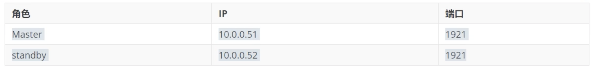
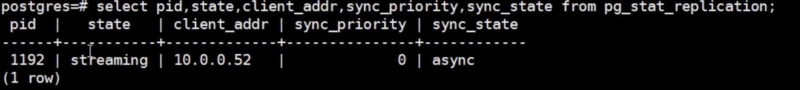
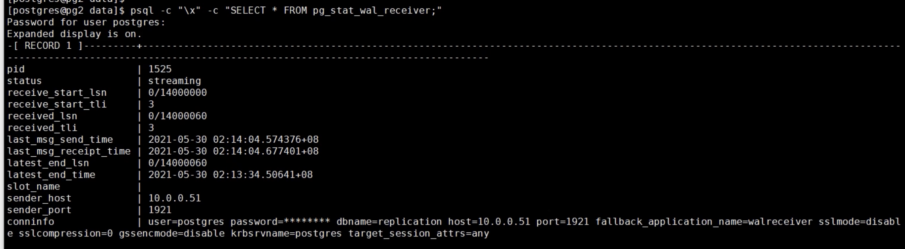

# **6 Master-Slave流复制**

## **6.1 基础环境准备** 

**角色**





### **6.2 设置配置文件** 

**Master节点** 

```
＃创建用户 
create role replica with replication login password '123456'
aleter user replica with password '123456'


＃修改pg_hba.conf 
host replication replica 0.0.0.0/0 md5 


＃修改配置： 
wal_level = replica       #这个是设置主为wal的主机
max_wal_sender = 5        #这个设置了可以最多有几个流复制连接，差不多有几个从，就设置几个 
wal_keep_segments = 128  ＃设置流复制保留的最多的xlog数目 
wal_sender_timeout = 60s ＃设置流复制主机发送数据的超时时间 
max_connections=200      ＃一般查多于写的应用从库的最大连接数要比较大 
hot_standby=on           ＃ 说明这台机器不仅仅是用于数据归档，也用于数据查询 
max_standby_streaming_delay=30s  ＃数据流备份分的最大延迟时间 
wal_receiver_status_interval=10s ＃多久向报告一次从的状态，当然从每次数据复制都会向主报告状态，这里只是设置最长的间隔时间 
hot_stand_feedback = on   ＃如果有错误的数据复制，是否向王进行反馈 
wal_log_hints = on        #also do full page writes of non-critical updates 
```

**standby节点** 

```
＃清空数据和归档 
rm -rf /pgdata/12/data/* 
rm -rf /archive/* 

＃备份主库数据到备库 
pg_basebackup -D /pgdata/pg_back -Ft -Pv -Upostgres -h 192.168.1.44 -p 1921 -R


＃解压数据 
[pg_back] tar xf base.tar -C /pgdata/12/data/
[pg_back] tar xf pg_wal.tar -C /archive/ 

＃修改standby.signal文件： 
standby_mode = 'on' 

＃修改postgresql.conf文件： 
primary_conninfo = 'host=192.168.1.44 port=1921 user=replica password=123456'
recovery_target_timeline = latest  ＃默认 
max_connection = 120  ＃大于等于主节点，正式环境应当重新考虑此值的大小 
hot_standby = on
max_standby_streaming_delay = 30s 
wal_receiver_status_interval = 1Os 
hot_standby_feedback = on 
max_wal_senders = 15 
logging_collector = on
log_directory = 'pg_log' 
log_filename = 'postgresgl-%Y-%m-%d_%H%M%S.log' 
```

```
# 修改 postgresql.auto.conf 
restore_command = 'cp /archive/%f %p' 
primary_conninfo = 'user=postgres password=123456 host=192.168.1.44 port=1921 sslmode=disable sslcompression=0 gssencmode=disable krbsrvname=postgres target_session_attrs=any' 
``` 

### **6.3 监控状态** 

```
# 主库
postgres=# select pid,state,client_addr,sync_priority,sync_state from pg_stat_replication; 


# 从库
psql -c "\x" -c "SELECT * FROM pg_stat_wal_receiver;" 
```



